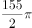
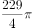
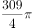
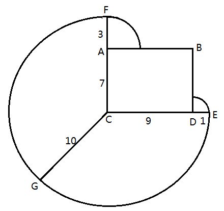
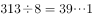
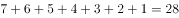
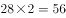
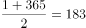
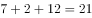

# 2016年上海市公务员录用考试《行测》题（B类）

> 数量关系 · 10 题 · 上海 2016

## 第 1 题　qid 1758842 · 数学运算

把一头羊用10米长的绳拴在一个长方形小屋外的墙角处，小屋长9米宽7米，小屋周围都是草地，羊能吃到草的草地面积为（  ）平方米。

- **A**. 

　✅
- **B**. 

- **C**. 

- **D**. 

**答案**：A

**官方解析**

如图所示，长方形小屋为矩形ABDC，羊被绳栓在C点。则羊所能吃到草的面积包括以C为圆心的圆的与以A和D为圆心的圆的，其他区域的草均不能吃到。则所能吃到草的面积平方米。

故正确答案为A。

---

## 第 2 题　qid 1758844 · 数学运算

甲乙丙三员工共同修剪6060平方米草地，甲的修剪效率为30平方米/分钟，乙的修剪效率为40平方米/分钟，丙的效率为60平方米/分钟。上午，甲7点30分开始修剪，乙7点45分开始，丙8点15分开始，他们同一时间完成工作，乙用了（  ）分钟。

- **A**. 56
- **B**. 57　✅
- **C**. 58
- **D**. 59

**答案**：B

**官方解析**

三人同一时间完成工作，且甲、乙分别先于丙45、30分钟开始工作。设任务完成时丙共工作了分钟，则甲应工作了分钟，乙应工作了分钟。工程总量，解得，则乙工作了分钟。

故正确答案为B。

---

## 第 3 题　qid 1758846 · 数学运算

小王打算购买围巾和手套送给朋友们，预算不超过500元，已知围巾的单价是60元，手套的单价是70元，如果小王至少要买3条围巾和2双手套，那么不同的选购方式有（  ）种。

- **A**. 3
- **B**. 5
- **C**. 7　✅
- **D**. 9

**答案**：C

**官方解析**

在保证必买3条围巾和2双手套的前提下，剩余购买情况不能超过元。设围巾再次购买了条，手套再次购买了双，则，依次分析、的取值情况。

当时，可取0、1、2，共3种方式；

当时，可取0、1，共2种方式；

当时，可取0，共1种方式；

当时，可取0，共1种方式。

即还有种购买方式。

故正确答案为C。

---

## 第 4 题　qid 1758848 · 数学运算

一艘轮船先顺水航行40千米，再逆水航行24千米，共用了8小时。若该船先逆水航行20千米，再顺水航行60千米，也用了8小时。则在静水中这艘船每小时航行（  ）千米。

- **A**. 11
- **B**. 12　✅
- **C**. 13
- **D**. 14

**答案**：B

**官方解析**

设船在静水中的速度为千米/小时，水流的速度为千米/小时，根据题干条件可得方程：。方程化简后得：。将代入原式，解得，。

备注：【秒杀计】两方程联立化简后可得，结合题干数据和选项均为整数，故可猜测应为3的倍数，只有B项满足。

故正确答案为B。

---

## 第 5 题　qid 1758850 · 数学运算

某收藏家有三个古董钟，时针都掉了，只剩下分针，而且都走得较快，每小时分别快2分钟、6分钟及12分钟。如果在中午将这三个钟的分针都调整指向钟面的12点位置，多少小时后这3个钟的分针会指在相同的分钟位置？

- **A**. 24
- **B**. 26
- **C**. 28
- **D**. 30　✅

**答案**：D

**官方解析**

由题意可得：假设每小时快2分钟、快6分钟、快12分钟的古董钟分别为A钟、B钟、C钟，则B钟与A钟速度差为分钟/小时，已知整个钟盘有60分钟，即经过小时，B钟的分针比A钟的分针恰好多走一圈，且此时两钟分针重合，同理，C钟与A钟速度差为分钟/小时，即经过小时，C钟的分针比A钟的分针恰好多走一圈，此时两钟分针重合，取6和15的最小公倍数30，即经过30小时，B钟的分针比A钟的分针恰好多走2圈，C钟的分针比A钟的分针恰好多走5圈，且此时三个分针处于同一个位置。

故正确答案为D。

---

## 第 6 题　qid 1758852 · 数学运算

文化广场上从左到右一共有5面旗子，分别代表中国、德国、美国、英国和韩国。如果将5面旗子从左到右分别记作A、B、C、D、E，那么从中国的旗子开始，按照ABCDEDCBABCDEDCBA......的顺序数，数到第313个字母时，是代表（  ）的旗子。

- **A**. 英国
- **B**. 德国
- **C**. 中国　✅
- **D**. 韩国

**答案**：C

**官方解析**

由数数的顺序可知，每一循环是由“ABCDEDCB”8个字母构成的。故在313个字母中，包含了个循环。即数完第39个循环后，再数一个字母便为第313个字母，再数一个字母为A，代表中国。

故正确答案为C。

---

## 第 7 题　qid 1758854 · 数学运算

某电影公司准备在1-10月中选择两个不同的月份，在其当月的首日分别上映两部电影。为了避免档期冲突影响票房，现决定两部电影中间相隔至少3个月，则有（  ）种不同的排法。

- **A**. 21
- **B**. 28
- **C**. 42
- **D**. 56　✅

**答案**：D

**官方解析**

此题有歧义，存在两种观点，一种以上映日进行间隔，另一种观点是以上映月份进行间隔。

讲法一（以上映日进行间隔）：正向枚举。要求两部电影间隔至少3个月，两个电影不互相影响，那么第一部电影如果1月1日上映，要独自播放三个月，也就是1、2、3月都是单独播放第一部电影，4月1号就可以上第二部了。则满足要求的排法有：

当第一部电影A在1月上映时，第二部电影B只能在4、5、6、7、8、9、10月中选择，共7种排法；

当第一部电影A在2月上映时，第二部电影B只能在5、6、7、8、9、10月中选择，共6种排法；

当第一部电影A在3月上映时，第二部电影B只能在6、7、8、9、10月中选择，共5种排法；

当第一部电影A在4月上映时，第二部电影B只能在7、8、9、10月中选择，共4种排法；

当第一部电影A在5月上映时，第二部电影B只能在8、9、10月中选择，共3种排法；

当第一部电影A在6月上映时，第二部电影B只能在9、10月选择，共2种排法；

当第一部电影A在7月上映时，第二部电影B只能在10月选择，共1种排法；

共有种排法。同时第一部电影可以上映B，第二部电影上映A，故全部的排法数共有种。

故正确答案为D。

讲法二（以上映月进行间隔）：正向枚举。要求两部电影间隔至少3个月，两个电影不互相影响，那么第一部电影如果1月上映，要独自播放四个月，也就是1、2、3、4月都是单独播放第一部电影，5月1号就可以上第二部了。则满足要求的排法有：

当第一部电影A在1月上映时，第二部电影B只能在5、6、7、8、9、10月中选择，共6种排法；

当第一部电影A在2月上映时，第二部电影B只能在6、7、8、9、10月中选择，共5种排法；

当第一部电影A在3月上映时，第二部电影B只能在7、8、9、10月中选择，共4种排法；

当第一部电影A在4月上映时，第二部电影B只能在8、9、10月中选择，共3种排法；

当第一部电影A在5月上映时，第二部电影B只能在9、10月中选择，共2种排法；

当第一部电影A在6月上映时，第二部电影B只能在10月选择，共1种排法；

共有种排法。同时第一部电影可以上映B，第二部电影上映A，故全部的排法数共有种。

小粉笔认为此题应为讲法一。

---

## 第 8 题　qid 1758856 · 数学运算

小张购买艺术品A，在其价格上涨后卖出盈利元，用卖价的一半购买艺术品B，又在其价格上涨后卖出盈利元,发现大于。则X的取值范围是（  ）。

- **A**. 大于100　✅
- **B**. 大于200
- **C**. 小于100
- **D**. 小于200

**答案**：A

**官方解析**

方法一：利润=成本×利润率。根据题干条件可得方程：

；。因，则，将代入不等式方程后，化简可得：，，即。

方法二：因题干未出现任何具体数值，故可赋值解题。设艺术品成本为1，根据得出，代入不等式方程：，可得。

故正确答案为A。

---

## 第 9 题　qid 1758858 · 数学运算

非闰年的一年的中间时刻应该是A月B日C点，则A+B+C=（  ）。

- **A**. 22
- **B**. 21　✅
- **C**. 20
- **D**. 19

**答案**：B

**官方解析**

抓住题眼，非闰年的一年的中间时刻。非闰年共有365天，其中间时刻的天数即1—365连续自然数的中位数，第天中午12点。前6个月的日期加和。则第183天的日期应为7月2日。即非闰年的一年中间时刻应该是7月2日12点，。

故正确答案为B。

---

## 第 10 题　qid 1758860 · 数学运算

右图中间阴影部分为长方形。它的四周是四个正方形，这四个正方形的周长和是320厘米，面积和是1700平方厘米，则阴影部分的面积是（  ）平方厘米。

- **A**. 375　✅
- **B**. 400
- **C**. 425
- **D**. 430

**答案**：A

**官方解析**

设阴影部分长方形的边长分别为x厘米、y厘米。根据题干数据可得：，。化简后得：，。阴影部分面积平方厘米。

故正确答案为A。

---
