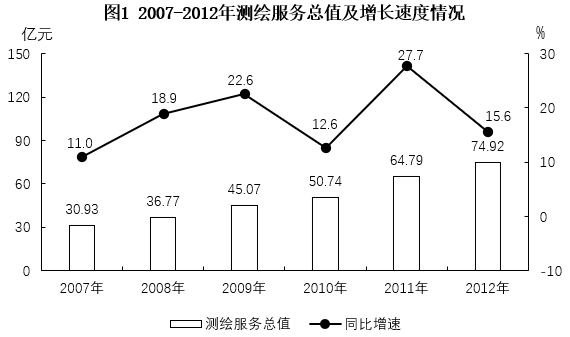
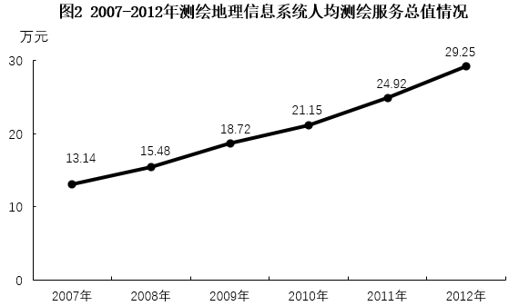
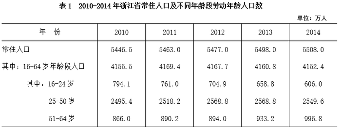
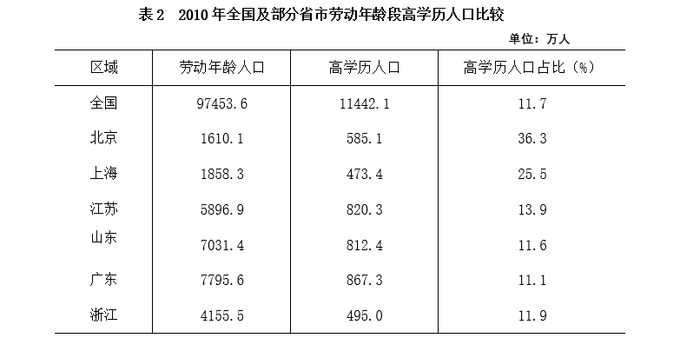
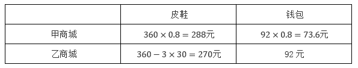
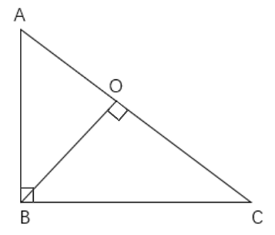
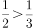
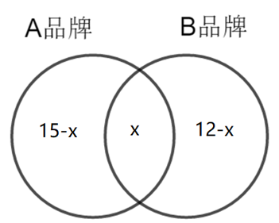

# 2016年上海市行政执法类考试《行测》试题（网友回忆版）

> 数量关系 · 18 题 · 上海 2016

## 材料 1

        2012年，测绘地理信息系统完成测绘服务总值74.92亿元，同比增长15.6%。测绘地理信息系统人均测绘服务总值（人均测绘服务总值）达到292509元，增长17.4%。

### 第 1 题　qid 5703433 · 数学运算

2012年测绘服务总值约是2006年的        倍。

- **A**. 2.2
- **B**. 2.4
- **C**. 2.7　✅
- **D**. 3.3

**答案**：C

**官方解析**

根据题干“2012年······约是2006年的······倍”，可判定本题为现期倍数问题。定位统计图1可得：2012年测绘服务总值为74.92亿元；2007年测绘服务总值为30.93亿元，同比增长11.0%。根据公式：基期量，则2006年测绘服务总值亿元。2012年测绘服务总值是2006年的倍。

故正确答案为C。

---

### 第 2 题　qid 5703437 · 数学运算

2008-2012年间有        年测绘地理信息系统人均测绘服务总值增速超过20%。

- **A**. 1　✅
- **B**. 2
- **C**. 3
- **D**. 4

**答案**：A

**官方解析**

根据题干“2008-2012年间有_____年······增速超过20%”，可判定本题为一般增长率问题。定位统计图2可得2007-2012年测绘地理信息系统人均测绘服务总值。根据公式：增长率，则2008-2012年间其同比增速分别为：

2008年：；

2009年：；

2010年：；

2011年：；

2012年：。

综上，2008-2012年间测绘地理信息系统人均测绘服务总值增速超过20%的年份只有2009年。

故正确答案为A。

---

### 第 3 题　qid 5703441 · 数学运算

2010年测绘地理信息系统约有        万名人员。

- **A**. 2.0
- **B**. 2.2
- **C**. 2.4　✅
- **D**. 2.6

**答案**：C

**官方解析**

根据题干“2010年测绘地理信息系统约有<u>        </u>万名人员”，结合材料给出测绘服务总值和人均测绘服务总值，可判定本题为现期平均数问题。定位统计图1可得：2010年测绘服务总值为50.74亿元。定位统计图2可得：2010年测绘地理信息系统人均测绘服务总值为21.15万元。由于测绘人员数，则2010年测绘地理信息系统有万名人员。

故正确答案为C。

---

### 第 4 题　qid 5703446 · 数学运算

下列关于2007-2012年间测绘地理信息系统测绘服务状况的描述，与资料相符的是        。

- **A**. 2012年测绘地理信息系统人数多于2011年水平
- **B**. 2007-2012年间测绘地理信息系统人均服务总值翻了一番　✅
- **C**. 2007-2012年间有3年的测绘服务总值同比增速低于上年水平
- **D**. 2007-2012年间测绘服务总值和人均服务总值增量最大的年份是同一年

**答案**：B

**官方解析**

A项：定位统计图1可得，2012年测绘服务总值为74.92亿元，2011年为64.79亿元。定位统计图2可得，2012年测绘地理信息系统人均测绘服务总值为29.25万元，2011年为24.92万元。由于人数，2012年测绘地理信息系统人数为万人，2011年为万人，即2012年测绘地理信息系统人数少于2011年，错误；

B项：定位统计图2可得，2012年测绘地理信息系统人均测绘服务总值为29.25万元，2007年为13.14万元。，故2007-2012年间测绘地理信息系统人均服务总值翻了一番，正确；

C项：定位统计图1可得，2007-2012年间，其中仅2010年的同比增速（12.6%）＜2009年的同比增速（22.6%），以及2012年的同比增速（15.6%）＜2011年的同比增速（27.7%）。即2007-2012年间测绘服务总值同比增速低于上年水平的年份只有2010年、2012年，共2个，错误；

D项：定位统计图1可得，2007-2012年间测绘服务总值增量最大的年份是2011年（64.79-50.74=14.05亿元）。定位统计图2可得，2011年人均测绘服务总值的增量为24.92-21.15=3.77万元，小于2012年的增量29.25-24.92=4.33万元，说明2007-2012年间测绘服务总值和人均服务总值增量最大的年份不是同一年，错误。

故正确答案为B。

---

## 材料 2

### 第 5 题　qid 5703485 · 数学运算

2011-2014年间，浙江省常住人口数量增加最多的年份是        。

- **A**. 2011年
- **B**. 2012年
- **C**. 2013年　✅
- **D**. 2014年

**答案**：C

**官方解析**

根据题干“2011-2014年间，······增加最多的年份是”，可判定本题为增长量比较问题。定位统计表1可得：2010-2014年，浙江省常住人口数量。根据公式：增长量=现期量-基期量，可得2011-2014年，浙江省常住人口数量增长量分别为：
2011年：5463.0-5446.5=16.5万人；
2012年：5477.0-5463.0=14万人；
2013年：5498.0-5477.0=21万人；
2014年：5508.0-5498.0=10万人。
则2011-2014年间，浙江省常住人口数量增加最多的年份是2013年。
故正确答案为C。

---

### 第 6 题　qid 5703516 · 数学运算

如2010年浙江省25-50岁年龄段高学历人口的比重与该省劳动年龄段高学历人口比重相当，则当年该省约有        万25-50岁的高学历人口。

- **A**. 136
- **B**. 194
- **C**. 297　✅
- **D**. 495

**答案**：C

**官方解析**

根据题干“如······的比重与······比重相当······”，可判定本题为现期比重问题。定位统计表1可得：2010年，浙江省25-50岁年龄段劳动年龄人口数为2495.4万人。定位统计表2可得：2010年，浙江省劳动年龄段高学历人口比重为11.9%。由于高学历人口比重相当，根据公式：部分=整体×比重，可得：当年该省25-50岁的高学历人口为万，与C项最接近。

故正确答案为C。

---

### 第 7 题　qid 5703521 · 数学运算

表中2010年高学历人口占比最低的省份，其劳动年龄人口约占全国总量的        。

- **A**. 2%以下
- **B**. 2%到5%之间
- **C**. 5%到10%之间　✅
- **D**. 10%以上

**答案**：C

**官方解析**

根据题干“表中······占比最低的省份，其······占······”，可判定本题为现期比重问题。定位统计表2可得，表中2010年高学历人口占比最低的省份为广东（11.1%），其劳动年龄人口为7795.6万人。根据公式：比重，可知表中2010年高学历人口占比最低的省份，其劳动年龄人口约占全国总量97453.6万人的比重为，在C项范围内。

故正确答案为C。

---

### 第 8 题　qid 5703528 · 数学运算

能够从上述资料中推出的是        。

- **A**. 2014年浙江省常住人口中，劳动年龄人口超过总数的七成　✅
- **B**. 2011-2014年，浙江省16-24岁人口减少量逐年增加
- **C**. 2011-2014年，浙江省劳动年龄人口同比上升和下降的年份都是2个
- **D**. 表2中所列省市的2010年高学历人口占全国高学历人口总数的一半以上

**答案**：A

**官方解析**

A项：定位统计表1可得：2014年浙江省常住人口为5508.0万人，劳动年龄人口为4152.4万人。根据公式：比重，可知2014年浙江省常住人口中，劳动年龄人口的比重为，即超过七成，正确；

B项：定位统计表1可得：2010-2014年，浙江省16-24岁人口分别为794.1万人、761.0万人、704.9万人、658.8万人、606.0万人。根据公式：增长量=现期量-基期量，可得：2011年，浙江省16-24岁人口减少量为794.1-761.0=33.1万人；2012年为761.0-704.9=56.1万人；2013年为704.9-658.8=46.1万人，对比可知2013年浙江省16-24岁人口减少量低于2012年，并非逐年增加，错误；

C项：定位统计表1可得：2010-2014年浙江省劳动年龄人口分别为4155.5万人、4169.4万人、4167.7万人、4160.8万人、4152.4万人。可知同比上升的年份有1个（2011年），同比下降的年份有3个（2012年、2013年、2014年），错误；

D项：定位统计表2可得：2010年全国及部分省市高学历人口数据。根据公式：比重，可知表2中所列省市的2010年高学历人口占全国高学历人口总数的比重为，错误。

故正确答案为A。

---

### 第 9 题　qid 5703369 · 数学运算

张先生每天乘坐公共交通上班，有2条路线供他选择。路线1是先坐公交再换乘地铁，路线2是直接乘坐公交，路线2比路线1需要多用5分钟。如果他上班时选择了路线1，回家时选择了路线2，共花费了35分钟，则路线2需要的时间是        分钟。

- **A**. 10
- **B**. 15
- **C**. 20　✅
- **D**. 25

**答案**：C

**官方解析**

设路线1需要x分钟，则路线2需要（x+5）分钟。根据题意可列方程：x+（x+5）=35，解得x=15。因此，路线2需要的时间是15+5=20分钟。
故正确答案为C。

---

### 第 10 题　qid 5703375 · 数学运算

某款皮鞋和某款钱包在两个商城甲和乙的原价均相同，皮鞋的单价是360元，且皮鞋的单价比钱包单价的4倍少8元。假如甲商城以8折优惠进行所有商品促销，而乙商城则是单件商品每满100元可立减30元，则最低能以        元钱购买这两种商品。

- **A**. 361.6
- **B**. 343.6　✅
- **C**. 362
- **D**. 380

**答案**：B

**官方解析**

设钱包的单价为x元。根据“皮鞋的单价比钱包单价的4倍少8元”，可列方程：4x-8=360，解得x=92，即钱包的单价为92元。则促销时这两种商品在两个商城的价格如下表所示：

观察发现，在乙商城购买皮鞋，甲商城购买钱包花费最少。即最低能以270+73.6=343.6元钱购买这两种商品。

故正确答案为B。

---

### 第 11 题　qid 5703382 · 数学运算

某楼盘开盘均价为每平方米28000元，小李准备购买一套面积为91.5平方米的房子。开发商为了进行促销提供了两种选购的方案。一是直接按9.9折的价格购买。二是不打折，但赠送一个可供使用15年的停车位。假设该楼盘停车位费用为每月150元（停车费对小李来说是一项必须开支），则        方案更为优惠。

- **A**. 第一种
- **B**. 第二种　✅
- **C**. 两种一样
- **D**. 无法判断

**答案**：B

**官方解析**

方法一：若按照方案一，前15年的总费用为：28000×91.5×0.99+150×12×15=2563380元；若按照方案二，前15年的总费用为：28000×91.5=2562000元。比较可知，方案二总费用更少，即第二种方案更为优惠。
方法二：方案一和方案二相比较，省了1%的购房费用28000×91.5×0.01=25620元，但需多花费15年的停车费用150×12×15=27000元。即方案一比方案二多花费27000-25620=1380元。因此，第二种方案更为优惠。
故正确答案为B。

---

### 第 12 题　qid 5703384 · 数学运算

在某地主办的足球比赛初赛中，共有10支队伍参加。如果每支队伍都必须和其他各支队伍比赛两次。则一共需要举行        场比赛。

- **A**. 45
- **B**. 60
- **C**. 75
- **D**. 90　✅

**答案**：D

**官方解析**

由于每支队伍都必须和其他各支队伍比赛两次，则一共需要举行场比赛。

故正确答案为D。

---

### 第 13 题　qid 5703389 · 数学运算

某植物园计划开辟一片形状为直角三角形的玫瑰花圃。己知该花圃的两条直角边的长度分别为80米和60米。现考虑将花圃入口设在最长边上的某处，在直角顶点处还设置了一个喷泉，则从花圃入口到达喷泉可能的最短路线为        米。

- **A**. 48　✅
- **B**. 50
- **C**. 56
- **D**. 64

**答案**：A

**官方解析**

直角三角形的玫瑰花圃如下图所示：

B点为直角顶点，根据勾股定理可得：米。若想使从花圃入口到达喷泉的路线最短，则花圃入口和喷泉的连线需垂直于直角三角形的斜边，即作，垂足为O，则O点为花圃入口，OB为从花圃入口到达喷泉的最短路线。根据三角形面积公式：，可得，解得OB=48米。

故正确答案为A。

---

### 第 14 题　qid 5703391 · 数学运算

小李和小张一起参加综艺对抗赛。要轮流从一个装有6个完全一样的球的袋中摸出一个球，这些球上分别标有数字1、2、3、4、5、6。两人各有10次机会。每次摸到球后重新放入袋中，如果小李摸到的是偶数球可以计1分，如果小张摸到的球上数字加1后大于5可以计1分。下列关于小李和小张获胜的概率的说法正确的是        。

- **A**. 小李获胜概率较高　✅
- **B**. 小张获胜概率较高
- **C**. 两者获胜概率一样高
- **D**. 两者获胜概率无法比较

**答案**：A

**官方解析**

由于“每次摸到球后重新放入袋中”，故每次得分的概率不变，获胜的概率和每次得分的概率有关。由于小李摸到的是偶数球可以计1分，则每次小李得分的概率为；由于小张摸到的球上数字加1后大于5可以计1分，即n+1＞5，化简可得：n＞4，故小张摸到的球上数字为5或6时可以计1分，则每次小张得分的概率为。由于，即小李得分的概率较大，故小李获胜概率较高。

故正确答案为A。

---

### 第 15 题　qid 5703392 · 数学运算

某工程原计划安排40人的工程队15天完成。现预报未来几天会有台风，需要提前3天完成，则至少需要增加        名同样工作能力的施工人员。

- **A**. 10　✅
- **B**. 12
- **C**. 15
- **D**. 20

**答案**：A

**官方解析**

赋值工程队每人每天的工作效率为1，则总工程量=1×40×15=600。提前3天完成，即15-3=12天完成。设至少需要增加x名同样工作能力的施工人员，可列方程：，解得x=10，即提前3天完成，则至少需要增加10名同样工作能力的施工人员。

故正确答案为A。

---

### 第 16 题　qid 5703396 · 数学运算

一个磅称只能称大于6公斤的重量。某人想知道一袋苹果一袋香蕉和一袋橘子的重量。所以他把两种水果放在一起称。得出以下结果：香蕉和橘子的重量是7公斤，苹果和香蕉的重量是8公斤，橘子和苹果的重量是9公斤，则苹果的重量是        公斤。

- **A**. 3
- **B**. 4
- **C**. 5　✅
- **D**. 6

**答案**：C

**官方解析**

设苹果、香蕉、橘子的重量分别为x公斤、y公斤、z公斤。根据题意可列方程组：，则。因此，苹果的重量是5公斤。

故正确答案为C。

---

### 第 17 题　qid 5703402 · 数学运算

某单位里的员工中有15人使用A品牌手机，12人使用B品牌手机。如果他们中有13个人，只拥有一部手机，则同时拥有两个品牌手机的员工数为        人。

- **A**. 2
- **B**. 6
- **C**. 7　✅
- **D**. 12

**答案**：C

**官方解析**

如图所示，设同时拥有两个品牌手机的员工有x人，只使用A品牌手机的员工有（15-x）人，只使用B品牌手机的员工有（12-x）人。他们中有13个人，只拥有一部手机，故可列式：（15-x）+（12-x）=13，解得x=7，即同时拥有两个品牌手机的员工数为7人。

故正确答案为C。

---

### 第 18 题　qid 5703407 · 数学运算

3个男子的食量等于5个女子的食量。现有男子10人，女子5人。假设提供这些人食用26天的食物。现专供女子10人食用可支持约        天。

- **A**. 48
- **B**. 51
- **C**. 54
- **D**. 56　✅

**答案**：D

**官方解析**

根据题意，每名男子单日食量：每名女子单日食量=5：3，故赋值每名男子单日食量为5，则每名女子单日食量为3。根据“可为男子10人，女子5人提供26天的食物”，则食物总量为（5×10+3×5）×26=1690，故专供女子10人食用可支持天数为天。

故正确答案为D。

---
