# 2016年北京市公务员录用考试《行测》题

> 数量关系 · 14 题 · 北京 2016

## 第 1 题　qid 1752486 · 数学运算

某蓄水池为长方体，其长是宽的2倍，高为3米。如果用每分钟可抽水1立方米的抽水机抽水，10小时可以将满池水抽空。则该蓄水池的宽是多少米？

- **A**. 10　✅
- **B**. 15
- **C**. 20
- **D**. 25

**答案**：A

**官方解析**

假设长方体的宽为a米，长为2a米，长方体的体积为，已知每分钟抽1，10小时抽水量为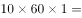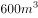，则，解得，该蓄水池的宽为10米。

故正确答案为A。

---

## 第 2 题　qid 1752488 · 数学运算

将1千克浓度为X的酒精，与2千克浓度为20%的酒精混合后，浓度变为0.6X。则X的值为（    ）。

- **A**. 50%　✅
- **B**. 48%
- **C**. 45%
- **D**. 40%

**答案**：A

**官方解析**

根据溶液混合前后溶质的量不变，可得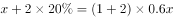，解得，即浓度为50%。

故正确答案为A。

---

## 第 3 题　qid 1752490 · 数学运算

某单位两座办公楼之间有一条长204米的道路，在道路起点的两侧和终点的两侧已各栽种了一棵树。现在要在这条路的两侧栽种更多的树，使每一侧每两棵树之间的间隔不多于12米，如栽种每棵树需要50元人工费，则为完成栽种工作，在人工费这一项至少需要做多少预算？

- **A**. 800元
- **B**. 1600元　✅
- **C**. 1700元
- **D**. 1800元

**答案**：B

**官方解析**

要想人工费尽量地少，则所栽种的树要尽可能地少，则根据题意可确定两棵树之间的间隔取最大值为12米，先考虑道路的一侧，总长204米，每两棵之间间隔为12米，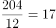，恰好整除且17个间隔需要栽种18棵树，已知道路的起点和终点已经各栽种一棵，则道路的一侧还需要栽种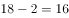棵树，两侧共需要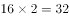棵树，则所需要人工费用为元。

故正确答案为B。

---

## 第 4 题　qid 1752492 · 数学运算

村官小刘负责将村委会购买的一批煤分给村中的困难户，如果给每个困难户分300千克煤，则缺500千克；如果给每个困难户分250千克煤，则剩余250千克。为帮助困难户，村委会购买了多少千克的煤？

- **A**. 5500
- **B**. 5000
- **C**. 4500
- **D**. 4000　✅

**答案**：D

**官方解析**

假设该村有x户困难户，则根据题意可得，解得，则村委会共购买了煤千克。

故正确答案为D。

---

## 第 5 题　qid 1752494 · 数学运算

某单位组织职工参加周末培训，其中英语培训和财务培训均在周六，公文写作培训和法律培训均在周日。同一天举办的两场培训每人只能报名参加一场，但不在同一天的培训可以都参加。则职工小刘有多少种不同的报名方式？（  ）

- **A**. 4
- **B**. 8　✅
- **C**. 9
- **D**. 16

**答案**：B

**官方解析**

根据题意可得，若小刘只报名参加1场培训，则可以参加这4场培训当中的任何一种，共有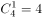种选择；若小刘报名参加了2场培训，则可以参加周六两场当中的任意一场与周日两场当中的任意一场，共有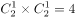种报名方式，则小刘总共有4+4=8种报名方式。

故正确答案为B。

---

## 第 6 题　qid 1752496 · 数学运算

小王近期正在装修新房，他计划将长8米、宽6米的客厅按下图所示分别在各边中点连线形成的四边形内铺设不同花色的瓷砖，则需要为最里侧的四边形铺设多少平方米的瓷砖？（  ）

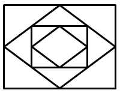

- **A**. 3
- **B**. 6　✅
- **C**. 12
- **D**. 24

**答案**：B

**官方解析**

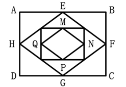

如图所示，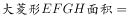平方米，根据中位线定理可知，，根据面积之比等于边长比的平方，可知，则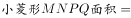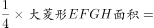平方米。

故正确答案为B。

---

## 第 7 题　qid 1752498 · 数学运算

某企业对销售员的全年考评中，年中考评成绩和年末考评成绩分别占20%和30%，销售业绩占50%。销售员甲和乙的全年销售业绩相同，甲的年中考评成绩比乙高3分，乙的全年考评成绩比甲高3分。则乙的年末考评成绩比甲高多少分？（  ）

- **A**. 6
- **B**. 8
- **C**. 10
- **D**. 12　✅

**答案**：D

**官方解析**

假设乙的年末考评成绩比甲高x分，根据题目条件，甲年中考评成绩比乙高3分，且年中考评占总成绩比重为20%，将年中考评成绩核算成全年考评成绩，此部分甲比乙多分，同理，将乙的年末考评成绩核算成全年成绩，比甲多，销售业绩相同不用考虑，则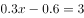，解得。

故正确答案为D。

---

## 第 8 题　qid 1752500 · 数学运算

某工厂与订货商签订合同，约定订货商在订单生产完成和的时候分别支付两笔货款。在派6名工人生产4天后，完成了订单的，如增派9名工人加入生产，则订货商在支付第一笔和第二笔货款间的时间间隔为多少天？（假定所有工人工作效率相同）

- **A**. 6天　✅
- **B**. 10天
- **C**. 12天
- **D**. 15天

**答案**：A

**官方解析**

设每名工人每天的工作量为1，根据6名工人生产4天完成总工程量的8%，可得；解得，总量=300。由题意可得，支付第一笔和第二笔货款中间需完成：，又增派9人可得现在共15人工作，故需要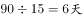。

故正确答案为A。

---

## 第 9 题　qid 1752504 · 数学运算

一项工作，如果小王先单独干6天后，小刘接着单独干9天可完成总任务量的2/5；如果小王单独干9天后，小刘接着单独干6天可完成总任务量的7/20。则小王和小刘一起完成这项工作需要多少天？（  ）

- **A**. 15
- **B**. 20　✅
- **C**. 24
- **D**. 28

**答案**：B

**官方解析**

设工程总量=20，小王效率为x，小刘效率为y。由题意可得：①6x+9y=8，②9x+6y=7，①+②=15x+15y=15，故x+y=1，则小王和小刘一起完成需要20÷1=20天。
故正确答案为B。

---

## 第 10 题　qid 1752506 · 数学运算

小赵骑车去医院看病，父亲在发现小赵忘带医保卡时以60千米/小时的速度开车追上小赵，把医保卡交给他并立即返回。小赵拿着医保卡后又骑了10分钟到达医院，小赵父亲也同时到家。假如小赵从家到医院共用时50分钟，则小赵的速度为多少千米/小时？（假定小赵及其父亲全程都匀速行驶，忽略父子二人交接卡的时间）

- **A**. 10
- **B**. 12
- **C**. 15　✅
- **D**. 20

**答案**：C

**官方解析**

如图所示：

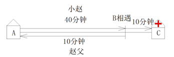

已知小赵从家（A点）到医院（C点）共用50分钟，赵父在B点追上小赵，此后小赵骑车的时间为10分钟，故从A到B小赵共用40分钟；B点之后小赵去医院C，赵父返家，且同时到达，故赵父从B到A也用10分钟。因为AB两地路程相等，小赵和赵父所用时间之比为4:1，所以速度之比为1:4，已知赵父速度为60千米/小时，故小赵速度=60÷4=15千米/小时。

故正确答案为C。

---

## 第 11 题　qid 1752508 · 数学运算

某单位原拥有中级及以上职称的职工占职工总数的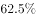。现又有2名职工评上中级职称，之后该单位拥有中级及以上职称的人数占总人数的。则该单位原来有多少名职称在中级以下的职工？

- **A**. 68
- **B**. 66　✅
- **C**. 64
- **D**. 60

**答案**：B

**官方解析**

方法一：由题意可知，无论是否有人评上中级职称，该单位总人数不变，由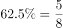可得总人数为8的倍数，由总人数的可得总人数为11的倍数。故设总人数为，则原来该单位中级以上职称人数为，中级以下职称人数为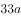。现又有2人评上中级职称，则现在拥有中级及以上职称的人数为，比例应为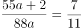，解得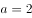，原有中级以下职称人。

方法二：由题意得，原来单位中级及以上职称和中级以下职称人数之比为，故原来职称在中级以下的职工人数应为3的倍数，排除A、C；已知有两人评上中级职称后（即中级以下职称人数减少2人），该单位中级及以上职称和中级以下职称人数之比为，故原来职称在中级以下的职工人数减2应为4的倍数，排除D。

故正确答案为B。

---

## 第 12 题　qid 1752510 · 数学运算

一个正方体的边长为1，一只蚂蚁从其一个角出发，沿着正方体的棱行进，直到经过该正方体的每一条棱为止（经过一个顶点即算作经过该顶点所连接的3条棱）。则其最短的行进距离为：

- **A**. 3
- **B**. 4
- **C**. 5　✅
- **D**. 6

**答案**：C

**官方解析**

要行进距离最短，即每经过一个点，尽量让过这个点的三条棱不与之前的重复，由于是正方体（如图所示）从A点走到下一步任意一点，设为B点最少要有1条棱重复（即AB），则要经过正方体12条棱，至少要从起点A（3条棱），此后每走一步可再经过2条棱，共走5步（3+2+2+2+2+1=12），才能走完。

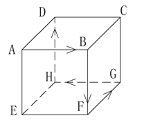

故正确答案为C。

---

## 第 13 题　qid 1752512 · 数学运算

某次专业技能大赛有来自A科室的4名职工和来自B科室的2名职工参加。结果有3人获奖且每人的成绩均不相同。如果获奖者中最多只有1人来自B科室，那么获奖者的名单和名次顺序有多少种不同的可能性？

- **A**. 48
- **B**. 72
- **C**. 96　✅
- **D**. 120

**答案**：C

**官方解析**

若B科室有1人获奖：先在B科室2人中选1人，有种；再在A科室4人中选2人，有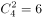种；最后将获奖的3人排序有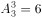种。根据乘法原则，共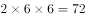种。若B科室没有人获奖：在A科室4人中选出3人获奖，再按成绩排序，则有种。根据加法原则，共

故正确答案为C。

---

## 第 14 题　qid 1752514 · 数学运算

甲、乙、丙三人打羽毛球，甲对乙、乙对丙和甲对丙的胜率分别为60%、50%和70%。比赛第一场甲与乙对阵，往后每场都由上一场的胜者对阵上一场的轮空者。则第三场比赛为甲对丙的概率比第二场：

- **A**. 低40个百分点　✅
- **B**. 低20个百分点
- **C**. 高40个百分点
- **D**. 高20个百分点

**答案**：A

**官方解析**

已知第二场比赛为甲对丙的前提为第一场比赛甲对乙时，甲胜乙负，获胜概率为；第三场比赛为甲对丙的前提是，第二场比赛不能为甲对丙，故第一场比赛甲不能胜，则第一场甲负乙胜，概率为，第二场比赛乙对丙，且乙负丙胜，概率为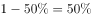，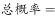。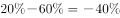，即低40个百分点。

故正确答案为A。

---
