# 2016年吉林省公务员录用考试《行测》题（乙级）

> 数量关系 · 10 题 · 吉林 2016

## 第 1 题　qid 2021776 · 数学运算

已知赵先生的年龄是钱先生年龄的2倍，钱先生比孙先生小7岁，三位先生的年龄之和是小于70的素数，且素数的各位数字之和为13，那么，赵、钱、孙三位先生的年龄分别为：

- **A**. 30岁，15岁，22岁　✅
- **B**. 36岁，18岁，13岁
- **C**. 28岁，14岁，25岁
- **D**. 14岁，7岁，46岁

**答案**：A

**官方解析**

本题为年龄问题，且选项给出三人具体年龄，优先考虑代入排除法。钱先生比孙先生小7岁，则说明。代入选项，只有A项的满足。

故正确答案为A。

---

## 第 2 题　qid 2022240 · 数学运算

万圣节即将到来，哥哥给艾丽一些钱让她去商店买节日小装饰品，艾丽来到商店，南瓜灯18元一个，小怪兽14元一个，如果单买南瓜灯钱正好用完，如果单买小怪兽钱也正好用完，那么，哥哥给艾丽的钱数为：

- **A**. 266元
- **B**. 342元
- **C**. 459元
- **D**. 504元　✅

**答案**：D

**官方解析**

南瓜灯18元一个，单买南瓜灯正好用完钱，所以总钱数是18的倍数；小怪兽14元一个，单买小怪兽也正好用完钱，所以总钱数是14的倍数。所以总钱数是18和14的公倍数，即一定能够被2、7、9整除。观察选项，其中A项不能被9整除，B项不能被7整除，C项不能被2整除，只有D项满足。
故正确答案为D。

---

## 第 3 题　qid 2022242 · 数学运算

用直线切割一个有限平面，后一条直线与此前每条直线都要产生新的交点，第1条直线将平面分成2块，第2条直线将平面分成4块，第3条直线将平面分成7块，按此规律将平面分为46块需要：

- **A**. 7条直线
- **B**. 8条直线
- **C**. 9条直线　✅
- **D**. 10条直线

**答案**：C

**官方解析**

1条直线时，有两个平面，写成（1，2）；

2条直线时，有4个平面，写成（2，4）（其中）；

3条直线时，有7个平面，写成（3，7）（其中）；

寻找规律，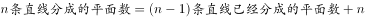，则推理可知（4，11）、（5，16）、（6，22）、（7，29）、（8，37）、（9，46）。9条直线可将平面分为46块。

故正确答案为C。

---

## 第 4 题　qid 2022244 · 数学运算

某公司举办大型年会活动，共35人参加。其中13名女生，每人至少表演一个节目，导演尽可能平均分配节目，共表演了27个节目，则至少有一名女生至少表演多少个节目：

- **A**. 4
- **B**. 3　✅
- **C**. 2
- **D**. 1

**答案**：B

**官方解析**

13名女生共表演了27个节目，尽可能平均分配节目，即，至少有一名女生至少表演了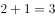个节目。

故正确答案为B。

---

## 第 5 题　qid 2022250 · 数学运算

张红和李健同时从班级出发沿同一条路线去食堂，若张红用一半的时间以速度x行走，另一半时间以速度y行走；李健在前一半路程以速度x行走，后一半路程以速度y行走（），则下列说法正确的是：

- **A**. 张红先到达食堂　✅
- **B**. 李健先到达食堂
- **C**. 张红和李健同时到达食堂
- **D**. 两人谁先到达食堂不能确定

**答案**：A

**官方解析**

根据行程公式可知，张红的平均速度；

根据等距离平均速度公式可知，李健的平均速度。

因为 ()，所以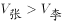。

路程一定时，速度和时间成反比，所以张红平均速度更快，先到达食堂。

故正确答案为A。

---

## 第 6 题　qid 2021800 · 数学运算

，，（   ），，

- **A**. 
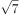

- **B**. 

- **C**. 
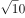

- **D**. 

　✅

**答案**：D

**官方解析**

数列带有根号，考虑多级数列。将数字都还原到根号下面，得到，，（），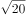，，根号下的数字相邻后一项与前一项作差得到新数列为4，（），（），10。考虑等差数列4，6，8，10，验证之后符合题目数列。故所求项为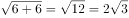。

故正确答案为D。

---

## 第 7 题　qid 2022262 · 数学运算

- **A**. 
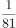

- **B**. 
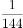

- **C**. 
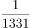

- **D**. 
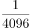
　✅

**答案**：D

**官方解析**

数列由大到小变化幅度较大，且存在明显的幂次数，优先考虑幂次数列。观察题干数列，可转化为：、、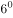、、（）。底数为连续自然数列，指数为公差是-2的等差数列，故下一项应为，其中分母部分尾数为6，D项满足。

故正确答案为D。

---

## 第 8 题　qid 2022266 · 数学运算

216，625，(   )，729，128

- **A**. 4096
- **B**. 2401
- **C**. 1024　✅
- **D**. 750

**答案**：C

**官方解析**

数列起伏较大，且存在明显的幂次数，优先考虑幂次数列。其中，，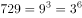，根据底数由大到小的规律，原数列可转化为：、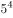、（）、、。可得底数与指数分别为公差是-1和1的等差数列，故所求项应为（）。计算尾数得4，只有C项满足。

故正确答案为C。

---

## 第 9 题　qid 2022270 · 数学运算

1，10，37，（    ），361，1090

- **A**. 105
- **B**. 118　✅
- **C**. 245
- **D**. 294

**答案**：B

**官方解析**

数列变化幅度较大，幂次无规律，考虑作差。相邻两项作差后可得新数列：9、27、（）、（）、729，分别为、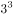、（）、（）、，底数均为3，指数为连续自然数，反推可得，B项满足。

故正确答案为B。

---

## 第 10 题　qid 2023540 · 数学运算

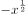，，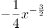，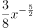，（   ），

- **A**. 
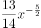

- **B**. 
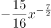
　✅
- **C**. 
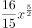

- **D**. 

**答案**：B

**官方解析**

题干数列是较为特殊的幂次数列，可拆分系数与指数单独查找规律。数列各项指数分别为：、、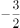、、（    ）、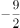，为公差是-1的等差数列，则括号内应为，B、D两项满足，排除A、C两项。观察数列发现，各项系数的符号为正负交替，故所求项系数符号为负号，并且后一项系数的绝对值等于前一项系数与指数乘积的绝对值，则所求项系数的绝对值，综上，所求项为。

故正确答案为B。

---
