# 2016年吉林省公务员录用考试《行测》题（甲级）

> 数量关系 · 9 题 · 吉林 2016

## 第 1 题　qid 2021798 · 数学运算

-1，3，2，6，（    ），（    ），14，18

- **A**. 4，6
- **B**. 9，13
- **C**. 7，11　✅
- **D**. 5，7

**答案**：C

**官方解析**

数列数字较多，考虑多重数列。奇数项为-1，2，（），14，作差之后为3和12，12可拆分为5和7，组成公差为2的等差数列，第五项应为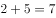；偶数项为3，6，（），18，作差之后也为3和12，和奇数项规律相同，第六项应为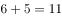。

故正确答案为C。

---

## 第 2 题　qid 2021800 · 数学运算

，，（   ），，

- **A**. 

- **B**. 

- **C**. 

- **D**. 

　✅

**答案**：D

**官方解析**

数列带有根号，考虑多级数列。将数字都还原到根号下面，得到，，（），，，根号下的数字相邻后一项与前一项作差得到新数列为4，（），（），10。考虑等差数列4，6，8，10，验证之后符合题目数列。故所求项为。

故正确答案为D。

---

## 第 3 题　qid 2021786 · 数学运算

小明痴迷网络游戏，父亲严格控制他的上网时间，为电脑设置密码。小明趁父亲不在家，打开电脑试图解开密码。他点击密码出现提示，102308，183416，284532，405664，（    ），该密码是按此规律排列的数列中最后一个数，问密码是：

- **A**. 5467128　✅
- **B**. 547680
- **C**. 506780
- **D**. 5076128

**答案**：A

**官方解析**

规律排列，数字较多，考虑机械划分。10|23|08，18|34|16，28|45|32，40|56|64，前两位数构成的数列是10，18，28，40，作差得到8，10，12，新数列是公差为2的等差数列，下一个数字的前两位应该是；中间两位数构成的数列是23，34，45，56，是公差为11的等差数列，下一个数字的中间两位数应该是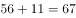；最后两位数构成的数列是08，16，32，64，是公比为2的等比数列，则下一个数字的最后数字应为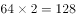。最后一个数应为5467128。

故正确答案为A。

---

## 第 4 题　qid 2021770 · 数学运算

希望中学为三个特困学生发放课外读本。甲发到的读本数与乙发到的读本数的2倍之和比丙发到的读本数多6本；甲发到的读本数与丙发到的读本数的2倍之和比乙发到的读本数多3本，则三个学生发到的读本数的平方和最小值为：

- **A**. 14　✅
- **B**. 28
- **C**. 24
- **D**. 20

**答案**：A

**官方解析**

根据题意可得方程组：

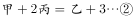

解方程组，得，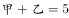。要使三个学生的平方和最小，则需使丙发到的读本数最小，即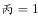，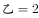，。三个学生发到的读本数的平方和最小值是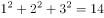。

故正确答案为A。

---

## 第 5 题　qid 2021774 · 数学运算

某驾校甲、乙、丙三位学员在科目二考试中能通过的概率分别为，，，那么，这三位学员中恰好有两位学员通过科目二考试的概率为：

- **A**. 

　✅
- **B**. 

- **C**. 

- **D**. 

**答案**：A

**官方解析**

三位学员中恰好有两位学员通过科目二考试，说明另外一位学员未通过。三位学员通过情况分为以下三种：甲未通过、乙和丙通过，概率为；乙未通过、甲和丙通过，概率为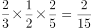；丙未通过、甲和乙通过，概率为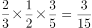。则三位学员中恰好有两位学员通过科目二考试的概率为。

故正确答案为A。

---

## 第 6 题　qid 2021782 · 数学运算

正值毕业季，班长小李组织大家聚餐，费用均摊，结账时，如果每人付300元，则多出100元；如果每人付290元，小李自己要多付80元才刚好，那么，这次活动的人均费用大约是：

- **A**. 293
- **B**. 296
- **C**. 295
- **D**. 294　✅

**答案**：D

**官方解析**

设这次活动人数为人，则可根据活动总费用列方程，解方程得，所以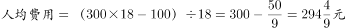，与选项D最接近。

故正确答案为D。

---

## 第 7 题　qid 2021776 · 数学运算

已知赵先生的年龄是钱先生年龄的2倍，钱先生比孙先生小7岁，三位先生的年龄之和是小于70的素数，且素数的各位数字之和为13，那么，赵、钱、孙三位先生的年龄分别为：

- **A**. 30岁，15岁，22岁　✅
- **B**. 36岁，18岁，13岁
- **C**. 28岁，14岁，25岁
- **D**. 14岁，7岁，46岁

**答案**：A

**官方解析**

本题为年龄问题，且选项给出三人具体年龄，优先考虑代入排除法。钱先生比孙先生小7岁，则说明。代入选项，只有A项的满足。

故正确答案为A。

---

## 第 8 题　qid 2021780 · 数学运算

有6种颜色的小球，数量分别为4，6，8，9，11，10，将它们放在一个盒子里，那么，拿到相同颜色的球最多需要的次数为：

- **A**. 6
- **B**. 12
- **C**. 11
- **D**. 7　✅

**答案**：D

**官方解析**

若要拿到相同颜色的球需要次数最多，则最不利情况为已经拿取所有颜色不一样的小球各一个。一共6种颜色，故最多拿取6次后有6种颜色不同小球。此时再拿取一个小球，拿到颜色相同小球。所以拿到相同颜色的球最多需要6+1=7次。
故正确答案为D。

---

## 第 9 题　qid 2021790 · 数学运算

李雷和韩梅梅去昆仑山探险，发现山洞里有一个石门，上面有一个九宫格式的按钮，按钮上有1到9九个数字，在其下方写着“的个位数是什么”。那么帮他们打开宝藏大门的数字是：

- **A**. 1
- **B**. 4
- **C**. 3　✅
- **D**. 2

**答案**：C

**官方解析**

的尾数为9、1、9、1、······，规律为是奇数时尾数为9，偶数时尾数为1，所以尾数应为9，则尾数为7；的尾数为8、4、2、6、8、4、2、6、······，规律为8、4、2、6这4个数字循环，2016是4的整数倍，所以尾数为每个循环中的最后一个数字6，则尾数为4。因此的个位数为7-4=3。

故正确答案为C。

---
