# 2016年四川省公务员录用考试《行测》题（下半年）

> 数量关系 · 10 题 · 四川 2016

## 第 1 题　qid 2029992 · 数学运算

甲、乙、丙、丁四人在超市购买蔬菜，甲购买了5斤土豆、1斤豆角，乙购买了1斤土豆、2斤茄子，丙购买了2斤土豆、2斤豆角，丁购买了2斤茄子。如果甲与乙、丙与丁的费用分别相等，则甲与丙的费用比为：

- **A**. 

- **B**. 

- **C**. 

- **D**. 

　✅

**答案**：D

**官方解析**

方法一：设土豆、豆角、茄子单价分别为、、。因为甲与乙、丙与丁的费用分别相等，则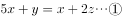

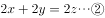

消，得。则甲的总价为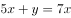，丙的总价为。甲与丙的费用比为。

故正确答案为D。

方法二：由于甲与乙、丙与丁的费用分别相等，则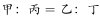。乙比丁多1斤土豆，乙的费用要大于丁，排除B、C。代入A项可得，土豆和茄子的价格相等，但由于丙与丁费用相等，茄子的价格要大于土豆，矛盾。排除A项。

故正确答案为D。

---

## 第 2 题　qid 2030008 · 数学运算

某会议邀请10名专家参加，酒店住宿共安排了6个房间，要求甲专家与乙专家单独住一间（不再安排其他人入住），丙专家、丁专家安排住同一间，戊专家与己专家不安排在同一间。甲、乙、丙、戊、己专家房间均已确定，且每个房间均有两个床位，则此次住宿共有多少种不同的安排方式？

- **A**. 6种
- **B**. 9种
- **C**. 12种　✅
- **D**. 24种

**答案**：C

**官方解析**

甲、乙、丙、戊、己专家房间均已确定，且丙、丁专家安排住同一间，则剩余4人还未安排。选择1人和戊专家住同一间，有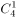种方法；再从剩余3人中选择1人和己专家住同一间，有种方法；剩余2人住同一间。共有种情况。

故正确答案为C。

---

## 第 3 题　qid 2030014 · 数学运算

有两个边长为整数且不相同的矩形，其中一边的长度分别为2016和2017，另一边的长度均不超过2017。已知它们的对角线长度相等，则两个矩形的周长之差为：

- **A**. 37
- **B**. 38
- **C**. 72　✅
- **D**. 76

**答案**：C

**官方解析**

设边长为2017的矩形另一个边长为，边长为2016的矩形另一个边长为。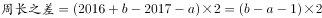，因边长为整数，则周长差为偶数，排除A项。由于对角线长度相等，根据勾股定理有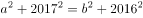，化简得，即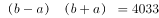。代入选项，B项：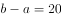， 4033不能被20整除，排除；C项：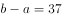，4033能被37整除，符合；D项：，4033不能被39整除，排除。

故正确答案为C。

---

## 第 4 题　qid 2030036 · 数学运算

某商店销售一批尾货服装，在进价基础上溢价销售，销售一定数量后为尽快回收资金，计划将剩余的服装降价销售。商家发现如果以进价的销售的话，总销售收入与进价将相同。如商家希望获得相当于进价的利润，则剩余服装应在进价基础上：

- **A**. 
降价
　✅
- **B**. 
降价

- **C**. 
涨价

- **D**. 
涨价

**答案**：A

**官方解析**

设进价为，降价前销售件服装，降价后销售件服装，剩余服装的利润率为。根据题干可得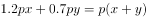，则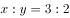。赋值降价前的销量为3件，则降价后的销量为2件。若要获得的利润，则有，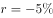，即降价。

故正确答案为A。

---

## 第 5 题　qid 2030052 · 数学运算

小张每天固定时间骑摩托车从家里到乡镇的木材加工厂上班，如果他以的速度行驶，会比上班时间提前10分钟到达加工厂，如果他以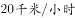的速度行驶，则会迟到12分钟。如果小张某天迟到了6分钟，则他的当天行驶速度是多少？

- **A**. 22　✅
- **B**. 23
- **C**. 24
- **D**. 25

**答案**：A

**官方解析**

设小张每天上班时间前小时从家里出发。根据题目条件，，小时。则小张家到木材厂的距离为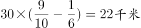。当天迟到6分钟，则行驶时间为。所以行驶速度为。

故正确答案为A。

---

## 第 6 题　qid 2030058 · 数学运算

某运输公司组织甲、乙、丙三种型号的货车共30辆刚好把190吨货物从A地一次运往B地。已知甲货车数量和乙货车数量之和是丙货车数量的两倍，甲、乙、丙货车的载重量分别为5吨、7吨、8吨。车辆返程时需装载100吨货物从B地运到A地，则至少需要装载多少辆货车才能把货物全部运回A地？

- **A**. 13　✅
- **B**. 14
- **C**. 15
- **D**. 16

**答案**：A

**官方解析**

设甲、乙、丙三种型号的货车分别为、、，根据已知条件可得：

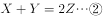

由①代入②可得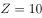，又由①和③可得，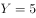。

要使车辆尽可能少，则需使用载重量越大的车，丙车一共10辆，可装，则剩余，3辆乙车可装，因此至少需要辆车才能把100吨货物从B地运到A地。

故正确答案为A。

---

## 第 7 题　qid 2030062 · 数学运算

某工厂有3条无人值守生产线a、b和c。a生产线每生产2天检修1天，b生产线每生产3天检修1天，c生产线每生产4天检修1天。2017年（不是闰年）元旦三条生产线正好都检修，则当年3月有多少天只有1条生产线保持生产状态？

- **A**. 3
- **B**. 4　✅
- **C**. 5
- **D**. 6

**答案**：B

**官方解析**

由题干可知，a生产线3天为周期，则的时候为检修日；b生产线四天为周期，则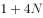的时候为检修日；c生产线五天为周期，则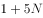的时候为检修日（N为自然数）。2017年1、2月总共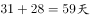，3月1日为第60天，三条生产线3月2日同时检修。a、b同时检修的周期为12天，则3月有2天同时检修；a、c同时检修的周期为15天，则3月有1天同时检修；b、c同时检修的周期为20天，则3月有1天同时检修；a、b、c同时检修的周期为60天，所以3月不存在第二次同时检修，因此有天有两条生产线同时检修，即一条生产线保持生产状态。

故正确答案为B。

---

## 第 8 题　qid 2030078 · 数学运算

货车早上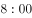出发以的速度匀速驶往40公里外的货场装运货物，装运结束后以去时的速度匀速返回，并于中午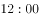到达，则货车装运货物的时间是其在路上行驶时间的多少倍？

- **A**. 1
- **B**. 1.4　✅
- **C**. 1.5
- **D**. 1.8

**答案**：B

**官方解析**

，早上八点出发到货场时间为，回来所需时间为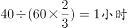，所以路上时间一共为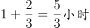，装货时间为，因此。

故正确答案为B。

---

## 第 9 题　qid 2030086 · 数学运算

某学校2015年有的教师发表了核心期刊论文；有的教师承担了科研项目，这些教师中有公开发表了论文，这些论文均发表在核心期刊上。则发表了核心期刊论文但没有承担科研项目的教师是承担了科研项目但没有发表论文的多少倍？

- **A**. 4
- **B**. 7　✅
- **C**. 9
- **D**. 10

**答案**：B

**官方解析**

由“有的教师承担了科研项目，这些教师中有公开发表了论文”可得，有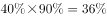的教师发表了核心期刊论文且承担了科研项目；则发表了核心期刊论文但没有承担科研项目的教师有；承担了科研项目但没有发表论文的教师有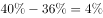，因为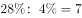，因此发表了核心期刊论文但没有承担科研项目的教师是承担了科研项目但没有发表论文的教师的7倍。

故正确答案为B。

---

## 第 10 题　qid 2030106 · 数学运算

某机构调查居民订阅报纸的情况，发现的家庭订阅了日报，的家庭订阅了早报，的家庭订阅了晚报，的家庭没有订阅任何一种报纸，没有家庭同时订阅早报和晚报，则同时订阅日报和早报的家庭的比例在多少之间？

- **A**. 

- **B**. 
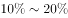

- **C**. 
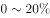
　✅
- **D**. 

**答案**：C

**官方解析**

的家庭没有订阅任何一种报纸，则订阅报纸的家庭为，没有家庭同时订阅早报和晚报，则早报和晚报订阅的家庭为，因此只订阅日报的家庭为，所以同时订阅早报和日报的比例最多为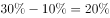，当这全部是同时订阅日报和晚报的时候也满足题意，此时同时订阅日报和早报的家庭为0，因此同时订阅日报和早报的家庭的比例在之间。

故正确答案为C。

---
