# 2016年国家公务员录用考试《行测》题（副省级）

> 数量关系 · 15 题 · 国考 2016

## 第 1 题　qid 1746712 · 数学运算

某单位组建兴趣小组，每人选择一项参加。羽毛球组人数是乒乓球组人数的2倍，足球组人数是篮球组人数的3倍，乒乓球组人数的4倍与其他3个组人数的和相等。则羽毛球组人数等于：

- **A**. 足球组人数与篮球组人数之和　✅
- **B**. 乒乓球组人数与足球组人数之和
- **C**. 足球组人数的1.5倍
- **D**. 篮球组人数的3倍

**答案**：A

**官方解析**

题干给出三组等式：

······①；

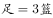······②；

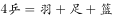······③；

要求出羽毛球组的人数，可先从有羽毛球的①式和③式着手考虑：

与联立可得：，化简后得：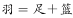。

故正确答案为A。

---

## 第 2 题　qid 1746724 · 数学运算

某新建小区计划在小区主干道两侧种植银杏树和梧桐树绿化环境，一侧每隔3棵银杏树种1棵梧桐树，另一侧每隔4棵梧桐树种1棵银杏树，最终两侧各种植了35棵树，问最多栽种了多少棵银杏树？

- **A**. 33
- **B**. 34　✅
- **C**. 36
- **D**. 37

**答案**：B

**官方解析**

在满足两侧栽种要求的情况下，要使银杏树栽种的最多，应把银杏树尽量栽在前面，其中一侧按照“银、银、银、梧······”循环，周期为4，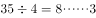，共有棵银杏树。另一侧按照“银、梧、梧、梧、梧······”循环，周期为5，，共有7棵银杏树。因此两侧最多栽种了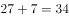棵银杏树。

故正确答案为B。

---

## 第 3 题　qid 1756314 · 数学运算

20人乘飞机从甲市前往乙市，总费用为27000元。每张机票的全价票单价为2000元，除全价票之外，该班飞机还有九折票和五折票两种选择。每位旅客的机票总费用除机票价格之外，还包括170元的税费。则购买九折票的乘客与购买全价票的乘客人数相比为（  ）。

- **A**. 两者一样多　✅
- **B**. 买九折票的多1人
- **C**. 买全价票的多2人
- **D**. 买九折票的多4人

**答案**：A

**官方解析**

假设购买全价票、九折票、五折票的人数分别为、、，根据题意可得：，化简得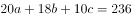。又已知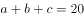，联立方程组可得：，即。

根据奇偶特性，为偶数，又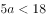，故只有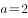，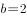满足，所以购买全价票与九折票的人数一样多。

故正确答案为A。

---

## 第 4 题　qid 1746704 · 数学运算

某电器工作功耗为370瓦，待机状态下功耗为37瓦，该电器周一从9：30到17：00处于工作状态，其余时间断电。周二从9：00到24：00处于待机状态，其余时间断电。问其周一的耗电量是周二的多少倍？

- **A**. 10
- **B**. 6
- **C**. 8
- **D**. 5　✅

**答案**：D

**官方解析**

周一耗电量：从9：30到17：00时长是7.5小时，为工作状态，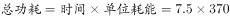瓦；

周二耗电量：从9：00到24：00时长是15小时，为待机状态，瓦；

则周一的耗电量是周二的倍。

故正确答案为D。

---

## 第 5 题　qid 1756312 · 数学运算

某浇水装置可根据天气阴晴调节浇水量，晴天浇水量为阴雨天的2.5倍。灌满该装置的水箱后，在连续晴天的情况下可为植物自动浇水18天。小李6月1日0：00灌满水箱后，7月1日0：00正好用完。问6月有多少个阴雨天？

- **A**. 10
- **B**. 16
- **C**. 18
- **D**. 20　✅

**答案**：D

**官方解析**

由题目所给出的晴天浇水量与阴雨天浇水量之比，可假设晴天浇水量为5，阴雨天浇水量为2，则可得水箱总容量为。已知6月整月共有30天，设阴雨天数为，晴天数为，则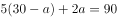，解得天。

故正确答案为D。

---

## 第 6 题　qid 1746716 · 数学运算

某政府机关内甲、乙两部门通过门户网站定期向社会发布消息，甲部门每隔两天、乙部门每隔3天有一个发布日，节假日无休。问甲、乙两部门在一个自然月内最多有几天同时为发布日？

- **A**. 5
- **B**. 2
- **C**. 6
- **D**. 3　✅

**答案**：D

**官方解析**

甲部门每隔2天相当于每3天发布一次，乙部门每隔3天相当于每4天发布一次，3和4的最小公倍数是12，则甲、乙每天就会同时发布一次。一个自然月最多有31天，假设甲、乙两部门1号同时发布一次，该自然月最多还有30天，，还可以同时发布两次。那么一个自然月最多共有3天是同时发布的。

故正确答案为D。

---

## 第 7 题　qid 1746746 · 数学运算

A地到B地的道路是下坡路。小周早上6：00从A地出发匀速骑车前往B地，7：00时到达两地正中间的C地。到达B地后，小周立即匀速骑车返回，在10：00时又途经C地。此后小周的速度在此前速度的基础上增加1米/秒。最后在11：30回到A地。问A、B两地间的距离在以下哪个范围内？

- **A**. 40～50公里　✅
- **B**. 大于50公里
- **C**. 小于30公里
- **D**. 30～40公里

**答案**：A

**官方解析**

设小周下坡速度为，上坡速度为。根据条件分析可列下表：

在上坡阶段，可得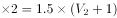，解得，根据，因此。

故正确答案为A。

---

## 第 8 题　qid 1746736 · 数学运算

某集团三个分公司共同举行技能大赛，其中成绩靠前的X人获奖。如获奖人数最多的分公司获奖的人数为Y，问以下哪个图形能反映Y的上、下限分别与X的关系？

- **A**. A
- **B**. B
- **C**. C　✅
- **D**. D

**答案**：C

**官方解析**

获奖人数最多的分公司获奖人数Y的上、下限即Y的最大值、最小值。

三个分公司获奖总人数为X人，如果Y取最大值，其他两个公司获奖人数都为0，此时Y=X，排除A项；如果Y取最小值，考虑极端情况三个分公司获奖人数均相等，此时Y最小，。因Y须为正整数，由此可得，当1X3时，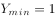，4X6时，，观察发现C项图形最符合Y与X的变化趋势。

故正确答案为C。

---

## 第 9 题　qid 1746744 · 数学运算

为加强机关文化建设，某市直属机关在系统内举办演讲比赛，3个部门分别派出3、2、4名选手参加比赛，要求每个部门的参赛选手比赛顺序必须相连，问不同参赛顺序的种数在以下哪个范围之内？

- **A**. 小于1000
- **B**. 1000～5000　✅
- **C**. 5001～20000
- **D**. 大于20000

**答案**：B

**官方解析**

3个部门分别派出3、2、4名选手参加比赛，要求每个部门的参赛选手比赛顺序必须相连。可先对每个部门内部的选手进行全排列，然后将3个部门的顺序进行全排列。则总共的排列顺序一共有：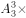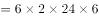种，属于1000-5000的范围。

故正确答案为B。

---

## 第 10 题　qid 1746740 · 数学运算

李主任在早上8点30分上班之后参加了一个会议，会议开始时发现其手表的时针和分针呈120度角，而上午会议结束时发现手表的时针和分针呈180度角。问在该会议举行的过程中，李主任的手表时针与分针呈90度角的情况最多可能出现几次？

- **A**. 4　✅
- **B**. 5
- **C**. 6
- **D**. 7

**答案**：A

**官方解析**

由题意可得，此次开会时间是在8：30到12：00之间（八点半上班且会议时间为上午）。要使得呈的次数尽可能多，则会议时间应尽可能长。会议开始时，时针和分针成，最早时间应为9点5分左右；而会议结束时成，最晚时间则为11点27分左右。根据常识，结合画图确定这期间时针和分针成的次数为：9点5分至10点期间1次，10点至11点期间为2次，11点至11点27分为1次，总次数共为4次。

故正确答案为A。

---

## 第 11 题　qid 1756316 · 数学运算

有一位百岁老人出生于二十世纪，2015年他的年龄各数字之和正好是他在2012年的年龄的各数字之和的三分之一，问该老人出生的年份各数字之和是多少（出生当年算作0岁）？

- **A**. 14　✅
- **B**. 15
- **C**. 16
- **D**. 17

**答案**：A

**官方解析**

方法一：由题意“2015年他的年龄各数字之和正好是他在2012年的年龄的各数字之和的三分之一”，则该老人2012年年龄的各数字之和为3的倍数，根据被3整除的特点“一个数字能被3整除，当且仅当其各位数字之和能被3整除”，则该老人2012年的年龄为3的倍数。又已知老人出生于二十世纪，则老人在2012年年龄最大为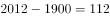岁，不满足3的倍数。

2012年，小于112岁且为3的倍数的最大为111岁，则其2015年年龄为岁，2015年他的年龄各数字之和为，2012年他的年龄各数字之和为，并不满足“2015年他的年龄各数字之和正好是他在2012年的年龄的各数字之和的三分之一”；

继续分析，2012年，小于111岁且为3的倍数的为108岁，则其2015年年龄为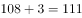岁，2015年他的年龄各数字之和为，2012年他的年龄各数字之和为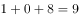，满足“2015年他的年龄各数字之和正好是他在2012年的年龄的各数字之和的三分之一”，正确。

即该老人出生于年，则该老人出生的年份各数字之和为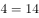。

方法二：本题也可以代入排除来做，假设A选项14为正确答案，因百岁老人出生于二十世纪即19xx年，，后两位相加为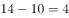，因其是百岁老人，则只有04和13两种可能，假设出生于1904年，则2012年其年龄为岁，各位数字之和为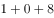；2015年其年龄为岁，各位数字之和为，满足“2015年他的年龄各数字之和正好是他在2012年的年龄的各数字之和的三分之一”，后面选项无需代入。

故正确答案为A。

---

## 第 12 题　qid 1746752 · 数学运算

某集团有A和B两个公司，A公司全年的销售任务是B公司的1.2倍。前三季度B公司的销售业绩是A公司的1.2倍，如果照前三季度的平均销售业绩，B公司到年底正好能完成销售任务。问如果A公司希望完成全年的销售任务，第四季度的销售业绩需要达到前三季度平均销售业绩的多少倍？

- **A**. 1.44
- **B**. 2.4
- **C**. 2.76　✅
- **D**. 3.88

**答案**：C

**官方解析**

观察题干，仅给出A、B两公司销售任务和销售业绩的比例关系，故可进行赋值。赋值A公司前三季度平均销售业绩为1，B公司前三季度平均销售业绩为1.2，如果照前三季度的平均销售业绩，B公司第四季度销售业绩也为1.2，故B公司全年销售业绩=B公司全年销售任务，A公司全年销售任务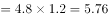， A公司要完成全年销售任务，则A公司第四季度销售业绩为，则题目所求倍。

故正确答案为C。

---

## 第 13 题　qid 1756318 · 数学运算

某出版社新招了10名英文、法文和日文方向的外文编辑，其中既会英文又会日文的小李是唯一掌握一种以上外语的人。在这10人中，会法文的比会英文的多4人，是会日文人数的两倍。问只会英文的有几人？

- **A**. 2
- **B**. 0
- **C**. 3
- **D**. 1　✅

**答案**：D

**官方解析**

由题意可知会法文是会日文人数的2倍，可知会法文的人数是偶数，且会法文比会英文多4人，则会英文的人数为偶数，已知小李是唯一掌握一种以上外语的人且小李会英语，则只会英文的人数为奇数，排除A项与B项。代入C项，若只会英文的有3人，则会英文的人数为人（1人指小李），会法文的有人，会日文的有人，根据三集合标准型公式：人，排除C项。

故正确答案为D。

---

## 第 14 题　qid 1746754 · 数学运算

某单位原有几十名职员，其中有14名女性。当两名女职员调出该单位后，女职员比重下降了3个百分点。现在该单位需要随机选派两名职员参加培训，问选派的两人都是女职员的概率在以下哪个范围内？

- **A**. 
小于

- **B**. 

- **C**. 

　✅
- **D**. 

**答案**：C

**官方解析**

方法一：假设单位原有人，则根据题目条件得到，去分母可得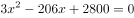，化简得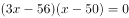，因此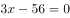或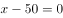，则或。只能为整数，所以，题目所求概率为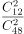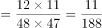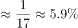。

方法二：假设单位原有人，则根据题目条件得到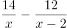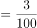，直接求解比较复杂，题干中表述“某单位原有几十名职员”，一般在数学上“几十”的描述为整十的数，又“其中有14名女性”，则单位原有人数至少为20人，代入发现不满足方程；同理排除30和40；代入50时，左边为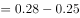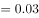，正好等于右边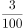，则单位原有人数为50人。题目所求概率为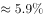。

故正确答案为C。

---

## 第 15 题　qid 1756320 · 数学运算

将一个8厘米×8厘米×1厘米的白色长方体木块的外表面涂上黑色颜料，然后将其切成64个棱长1厘米的小正方体，再用这些小正方体堆成棱长4厘米的大正方体，且使黑色的面向外露的面积要尽量大，问大正方体的表面上有多少平方厘米是黑色的?

- **A**. 84
- **B**. 88　✅
- **C**. 92
- **D**. 96

**答案**：B

**官方解析**

如上图所示，堆成的棱长4厘米的大正方体表面外露的小正方体分为三种情况：①顶点正方体，即位于大正方体顶点位置，每个小正方体表面外露的有三个面，每个顶点各对应一个，一共有8个；②棱正方体，即位于大正方体棱上，每个小正方体表面外露的有两个面，每条棱上2个，12条棱一共有个；③面正方体，即位于大正方体每个面的面上，每个小正方体表面外露的只有一个面，大正方体每个面上有4个面正方体，六个面一共有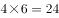个。

如上图所示，原来的长方体木块只有一层，即可以提供的顶点正方体一共有4个；可以提供的棱正方体一共有个；可以提供的面正方体一共有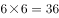个。要使小正方体堆成棱长4厘米的大正方体，且使黑色的面向外露的面积要尽量大，则应该用小正方体的黑色的面尽可能补上大正方体外露的地方。大正方体所需的8个顶点正方体，原来的长方体只能提供4个，欠缺4个；而大正方体外露的24个棱正方体和24个面正方体，原来的长方体均可以提供。则欠缺的顶点正方体需由多余的面正方体进行补充，顶点正方体是3个面外露，而面正方体只有1个面外露，则1个面正方体替换1个顶点正方体，外露的黑色面积会减少2个面即2平方厘米，替换欠缺的4个顶点正方体，黑色面积一共减少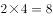平方厘米，而整个大正方体外表面面积为平方厘米，则大正方体的表面外露的黑色面积最多为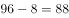平方厘米。

故正确答案为B。

---
