# 2016年天津选调生选拔考试 综合知识试卷（精选）

> 数量关系 · 7 题 · 天津 2016

## 第 1 题　qid 2262647 · 数学运算

-3，-2，1，6，（  ）

- **A**. 8
- **B**. 11
- **C**. 13　✅
- **D**. 15

**答案**：C

**官方解析**

数列无明显特征，优先考虑作差。作差后得到新数列：1、3、5、？，此数列是公差为2的等差数列，？应为，所以所求项为。

故正确答案为C。

---

## 第 2 题　qid 2262650 · 数学运算

65，35，17，（  ），1

- **A**. 9
- **B**. 8
- **C**. 6
- **D**. 3　✅

**答案**：D

**官方解析**

各数据之间差距较大，且周围均有幂次数，考虑幂次数列。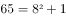；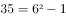；；。底数是公差为2的等差数列；指数均为2；修正项为+1、-1循环交替。所以所求项为。

故正确答案为D。

---

## 第 3 题　qid 2262653 · 数学运算

-1，0，1，2，9，（  ）

- **A**. 11
- **B**. 82
- **C**. 729
- **D**. 730　✅

**答案**：D

**官方解析**

数列整体呈现递增趋势，且部分数同常规的幂次数较为接近，可以考虑题干数列有幂次规律。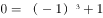；；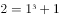；。底数分别为-1、0、1、2、？，指数均为3，修正项均为+1。观察底数，底数构成的数列为原数列，故？处为9。所以所求项应为：。

故正确答案为D。

---

## 第 4 题　qid 2262662 · 数学运算

某市直属机关举行“健身杯”排球比赛，参赛的共九个单位，如果采取循环赛的方法，分别在九个球场进行比赛。请问每个球场平均进行几场比赛？

- **A**. 7场
- **B**. 6场
- **C**. 5场
- **D**. 4场　✅

**答案**：D

**官方解析**

根据循环赛比赛规则每两队均需要比一场，则一共比赛了场，每个球场平均进行了场比赛。

故正确答案为D。

---

## 第 5 题　qid 2262670 · 数学运算

有三条同心圆跑道，里圈跑道长公里，中圈跑道长公里，外圈跑道长公里。甲、乙、丙三人分别在里、中、外圈同一起跑线同时同向跑步。甲每小时跑3.5公里，乙每小时跑4公里，丙每小时跑5公里，问何时后三人同时回到出发点？

- **A**. 8小时
- **B**. 7小时
- **C**. 6小时　✅
- **D**. 5小时

**答案**：C

**官方解析**

根据题意可知：甲每小时跑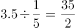圈，乙每小时跑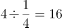圈，丙每小时跑圈，要使三人同时回到出发点，则三人所跑的圈数均为整数，甲、丙每小时分别跑了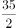圈、圈，要让圈数为整数，则所跑时间是2、3的公倍数，，故6小时后三人同时回到出发点。

故正确答案为C。

---

## 第 6 题　qid 2262674 · 数学运算

假设地球是一个正球形，它的赤道长为4万公里，现在用一根比赤道长10米的绳子绕地球一周，假设在各处绳子离地面的距离都是相同的，请问绳子离地面大约多高？

- **A**. 1.5米
- **B**. 1.6米　✅
- **C**. 1.7米
- **D**. 1.4米

**答案**：B

**官方解析**

，根据题意可设：绳子绕地球一周的半径为，地球的半径为，则绳子绕地球一周的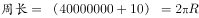，地球的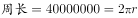，绳子离地面的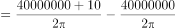。

故正确答案为B。

---

## 第 7 题　qid 2262679 · 数学运算

在一次有关汉语文学的研讨会上，与会人员中有10人是江浙人，有6人是北方人，与会的南方人占了参会总人数的以上，江浙人占了与会的南方人的以上。参会总人数是多少？

- **A**. 22人
- **B**. 21人
- **C**. 19人　✅
- **D**. 18人

**答案**：C

**官方解析**

根据题意可设参会总人数为人，则南方人为人，由“与会的南方人占了参会总人数的以上”可得：，化简得；由“江浙人占了与会的南方人的以上”可得：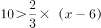，化简得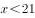，故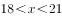，结合选项，只有C项满足。

故正确答案为C。

---
