# 2016年山东省公务员录用考试《行测》题

> 数量关系 · 14 题 · 山东 2016

## 第 1 题　qid 1797336 · 数学运算

三个工程队完成一项工程，每天两队工作、一队轮休，最后耗时13天整完成了这项工程。问如果不轮休，三个工程队一起工作，将在第几天内完成这项工程？

- **A**. 6天
- **B**. 7天
- **C**. 8天
- **D**. 9天　✅

**答案**：D

**官方解析**

本题考查工程问题。设三个工程队的效率均为1，那么工程总量为。若三队不轮休一起工作，则总效率为3，完成工程需要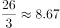天，则将在第9天内完成这项工程。

故正确答案为D。

---

## 第 2 题　qid 1797400 · 数学运算

甲仓库有100吨的货物要运送到乙仓库，装载或者卸载每吨货物需要耗时6分钟，货车到达乙仓库后，需要花15分钟进行称重，而汽车每次往返需要2小时。问使用一辆载重15吨的货车可以比载重12吨的货车少用多少时间？

- **A**. 3小时20分钟
- **B**. 3小时40分钟
- **C**. 4小时
- **D**. 4小时30分钟　✅

**答案**：D

**官方解析**

本题考查工程问题。要将甲仓库100吨的货物运送到乙仓库，使用一辆载重15吨的货车需要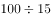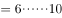，即需要7次；使用载重12吨的货车需要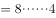，即需要9次。由于货物总量一定，装卸耗费时间相同，则使用一辆载重15吨的货车可以比使用一辆载重12吨的少2次称重及2次往返的时间，即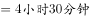。

故正确答案为D。

---

## 第 3 题　qid 1797408 · 数学运算

某个社区老年协会的会员都在象棋、围棋、太极拳、交谊舞和乐器五个兴趣班中报名了至少一项。如果要在老年协会中随机抽取会员进行调查，至少要调查多少个样本才能保证样本中有4名会员报的兴趣班完全相同？

- **A**. 93
- **B**. 94　✅
- **C**. 96
- **D**. 97

**答案**：B

**官方解析**

根据条件，老年协会会员在五个兴趣班中报名至少一项，则每人报名的不同情况共有：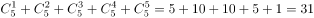种。由问法“至少······保证······”，可判定本题为最不利构造类最值问题，考虑最不利情况。若每种报名情况均有3名会员，在此情况下再调查1人即可保证有一种报名情况达到4名，则至少要调查人。

故正确答案为B。

---

## 第 4 题　qid 1797414 · 数学运算

甲乙丙三个工厂每天共可以生产防水布2万平方米。现有一批救灾物资要生产，如果将防水布生产任务交给甲乙联合或乙丙联合或甲丙联合完成，分别需要24、30和40天。如果三个工厂联合完成生产任务，且每个工厂每天的产能各增加1万平方米，问可以比在不增加产能的情况下提前几天完成？

- **A**. 6
- **B**. 8
- **C**. 10
- **D**. 12　✅

**答案**：D

**官方解析**

本题考查工程问题。甲乙联合，乙丙联合，甲丙联合分别需要24天、30天和40天完成，则甲乙丙联合一天的效率为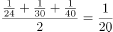，已知甲乙丙每天共生产防水布2万平方米，则工程总量为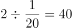万平方米。不增加产能时，共需20天完成；每厂各增加产能1万平方米后，甲乙丙每天共生产防水布5万平方米，则需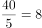天，提前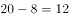天。

故正确答案为D。

---

## 第 5 题　qid 1797418 · 数学运算

今天是本月的1日同时也是星期一，且今年某月的1日又是星期一。问这两个1日之间最多相隔几个月？

- **A**. 6
- **B**. 7
- **C**. 9　✅
- **D**. 11

**答案**：C

**官方解析**

本题考查星期日期问题。考虑本月的1日也是星期一，且今年的某月的1日又是星期一，一周有7天，两者之间的间隔也一定为7的倍数。要求最多间隔月数，考虑每月除以7的余数和也能被7整除即可，各月份除以7的余数分别为3、0（1）、3、2、3、2、3、3、2、3、2、3天，最大间隔为某平年的1月1日到10月1日或者2月1日到11月1日，余数和均为21，之间间隔9个月。
故正确答案为C。

---

## 第 6 题　qid 1797424 · 数学运算

一支车队共有20辆大拖车，每辆车的车身长20米，两辆车之间的距离是10米，行进的速度是54千米/小时。这支车队需要通过长760米的桥梁（从第一辆车头上桥到最后一辆车尾离开桥面计时），以双列队通过与以单列队通过花费的时间比是：

- **A**. 7 : 9　✅
- **B**. 29 ：59
- **C**. 3 : 5
- **D**. 1 : 2

**答案**：A

**官方解析**

当车队以双列队通过桥梁时，每列各10辆拖车，中间共产生9个间隔，则所走的总路程米；当车队以单列队通过桥梁时，20辆拖车会产生19个间隔，则所走的总路程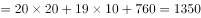米。

因行进速度不变，速度一定，时间和路程成正比。则所需时间之比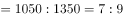。

故正确答案为A。

---

## 第 7 题　qid 1797430 · 数学运算

某企业采购了一批文具和书本赠送给希望小学的学生。如果向每个学生捐赠2件文具和3本书，则剩下的书数量是文具的1.5倍；如果向每个学生再多捐赠1件文具和1本书，则剩下的书数量是文具的2倍。该企业最终决定向每个学生捐赠6件文具和10本书，则其还需要采购的书本数量是文具的多少倍？

- **A**. 1倍
- **B**. 2倍　✅
- **C**. 3倍
- **D**. 4倍

**答案**：B

**官方解析**

本题考查和差倍比问题。方法一：捐赠2件文具和3本书，文具和书捐赠比例是2:3；剩下的书数量是文具的1.5倍，即剩下文具和书的比例是2:3；可以得到原来文具和书的比例也是2:3。假设文具数量为，书的数量为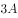，学生数为，如果向每个学生再多捐赠1件文具和1本书，剩余的文具为，剩余的书为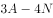，则有，可以得到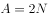。即文具数为，书为。

该企业最终决定向每个学生捐赠6件文具和10本书，则还需采购文具，书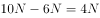。那么，其还需要采购的书本数量是文具的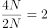倍。

方法二：赋值法。假设学生为1人，则文具总数是4件，书总数是6本即可满足题意。该企业最终决定向每个学生捐赠6件文具和10本书，则还需文具2件，书4本，那么需要采购的书本数量是文具的2倍。

故正确答案为B。

---

## 第 8 题　qid 1797438 · 数学运算

某房间共有6扇门，甲、乙、丙三人分别从任一扇门进去，再从剩下的5扇门中的任一扇出来，问甲未经过1号门，且乙未经过2号门，且丙未经过3号门进出的概率为多少？

- **A**. 
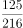

- **B**. 
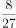
　✅
- **C**. 
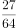

- **D**. 

**答案**：B

**官方解析**

根据题干条件，甲从任一扇门进去，再从剩下的5扇门中的任一扇出来，总情况数，当甲未经过1号门，既不能从1号门进，同时不能从1号门与进入的门出，满足条件的情况数。则满足条件的概率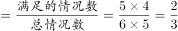。因乙、丙需满足的条件与甲完全相同，则三者同时满足条件的概率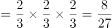。

故正确答案为B。

---

## 第 9 题　qid 1797442 · 数学运算

某公司推出A、B两种新产品，产品A售价为X元，本月售出了Y件；产品B售价为Y元。本月A、B两种产品共售出500件，且产品A的销量为产品B的3倍多，产品A的销售额为1万元。问A、B两种产品本月可能的最高销售总额最接近下列哪个值？

- **A**. 5.5万元
- **B**. 5.7万元　✅
- **C**. 7.2万元
- **D**. 7.5万元

**答案**：B

**官方解析**

本题考查不等式分析问题。由题意列下表：

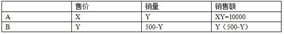

由产品A的销量为产品B的3倍多可得，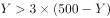，即，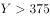。则，要使此式结果最大，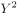要最小，取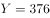，代入可得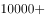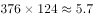万元。

故正确答案为B。

---

## 第 10 题　qid 1797230 · 数学运算

某商品上周一开始销售，售价为100元/件，商家规定：如日销售量超过100件，则第二天每件提价10%销售；如日销售量不超过50件，则第二天每件降价10%销售；其它情况价格不变。最终发现，上周该商品共销售了400件。问上周日该商品的价格最高可能是多少元？

- **A**. 99
- **B**. 100
- **C**. 110　✅
- **D**. 121

**答案**：C

**官方解析**

本题考查最值问题。方法一：要使周日商品的价格最高，在调价机会次数固定的情况下，必然是提价次数要最多，降价次数要最少。若要提价次数最多，在一周总销量固定的情况下，则要求提价前一天的销售量尽量少，价格不变情况的销量也尽量少，可赋值提价前一天的销量为101件，价格不变前一天的销量为51件。且因为周日当天的销量不影响周日的价格，所以可以赋值周日销量为0。设提价次数为，价格不变次数为，可得不等式方程组：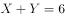，，和均为整数，代入运算可得两组结果：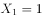，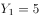；，。要让提价次数最多，则选取第一组结果，则周日商品价格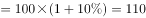元。

方法二：采用代入法，题目问价格最高，则从大到小代入选项。周日的价格受前面6天销量影响，如果周日价格为121元，则前面6天有2次提价，4次不变，6天总销量至少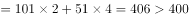件，不满足题意。若周日价格为110元，则前面6天有1次提价，5次不变，6天总销量至少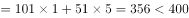，满足题意。

故正确答案为C。

---

## 第 11 题　qid 1797236 · 数学运算

高校的科研经费按来源分为纵向科研经费和横向科研经费，某高校机械学院2015年前4个月的纵向科研经费和横向科研经费的数字从小到大排列为20、26、27、28、31、38、44和50万元。如果前4个月纵向科研经费是前3个月横向科研经费的2倍，则该校机械学院2015年第4个月的横向科研经费是多少万元？

- **A**. 26
- **B**. 27　✅
- **C**. 28
- **D**. 31

**答案**：B

**官方解析**

根据题意可知，该学院前4个月的经费总和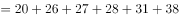万元。第4个月横向经费前4个月经费总和前4个月纵向经费前3个月横向经费前三个月横向经费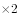前3个月横向经费前3个月横向经费。观察发现，264是3的倍数，减去的也为3的倍数，则结果一定是3的倍数，只有B项27满足。

故正确答案为B。

---

## 第 12 题　qid 1797246 · 数学运算

上午8点，甲、乙两车同时从A站出发开往1000公里外的B站。甲车初始速度为40公里/小时，且在行驶过程中均匀加速，1小时后速度为42公里/小时；乙车初始速度为50公里/小时，且在行驶过程中均匀减速，1小时后速度为48公里/小时。问中午12点前，两车最大距离为多少公里？

- **A**. 8
- **B**. 12.5　✅
- **C**. 16
- **D**. 25

**答案**：B

**官方解析**

本题考查行程问题。甲、乙两车同时同点同向出发，一个做匀减速运动，另一个做匀加速运动，当时，两人之间的距离在扩大，直到时，距离为两车相遇前最大；之后两车距离会缩小，直到，再后来两车距离又会增加。

设小时后两车速度相等，则有，解得，此时两车速度为45公里小时，此时两车距离公里。

同理，再经过2.5小时两车的距离减小为零，即截至到13点之前两车的距离都在缩小，因此只需考虑一种情况。综上所述，中午12点之前，两车最大距离为12.5公里。

故正确答案为B。

---

## 第 13 题　qid 1797258 · 数学运算

团体操表演中，编号为1~100的学生按顺序排成一列纵队，编号为1的学生拿着红、黄、蓝三种颜色的旗帜，以后每隔2个学生有1人拿红旗，每隔3个学生有1人拿蓝旗，每隔6个学生有1人拿黄旗。问所有学生中有多少人拿两种颜色以上的旗帜？

- **A**. 13
- **B**. 14　✅
- **C**. 15
- **D**. 16

**答案**：B

**官方解析**

每隔2个学生相当于每3个学生拿一支红旗，每隔3个学生相当于每4个学生拿一支蓝旗，每隔6个学生相当于每7个学生拿一支黄旗。即每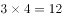个学生同时拿红旗和蓝旗，每个学生同时拿红旗和黄旗，每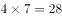个学生同时拿蓝旗和黄旗，每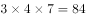个学生同时拿红旗、黄旗和蓝旗。

排除编号为1的学生，在剩下99个学生中，拿红旗和蓝旗的有；拿红旗和黄旗的有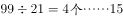；拿蓝旗和黄旗的有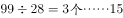。拿红旗、蓝旗和黄旗的有。因拿红旗、黄旗和蓝旗的学生同时属于拿红旗和蓝旗、红旗和黄旗、蓝旗和黄旗，计算时需排除重复情况。故拿两种颜色以上旗帜的学生有人，加上第一个同学，共14人。

故正确答案为B。

---

## 第 14 题　qid 1797320 · 数学运算

一块由两个正三角形拼成的菱形土地ABCD周长为800米，土地周围和中间的道路如下图所示，其中DE、BF分别与AB和CD垂直。如要从该土地上任何一点出发走完每一段道路，问需要行进的距离最少是多少米？

- **A**. 
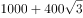

- **B**. 

　✅
- **C**. 

- **D**. 

**答案**：B

**官方解析**

本题考查几何问题。根据图形一笔画的基本规律，当图中奇点个数为0或2的时候可以一笔画完，其他情况需要的至少笔画数奇点个数。观察题目，图中一共有4个奇点，分别是A、E、F、C，则至少需要两笔完成。从任意奇点出发，需要重复走一段路，走到另一个奇点，才能走完所有道路。观察可知，连接两个奇点最短的距离是AE或者CF，为100米，最短路径的走法可以是A→B→C→D→A→C→F→B→D→E，则总路程至少米。

故正确答案为B。

---
