# 2016年山东省选调应届优秀高校毕业生到基层工作考试《行测》试卷（精选）

> 数量关系 · 8 题 · 选调 2016

## 第 1 题　qid 2262757 · 数学运算

级数（  ）。

- **A**. 

- **B**. 

　✅
- **C**. 

- **D**. 
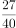

**答案**：B

**官方解析**

原式可以看为n无穷大时，首项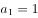，公比为的等比数列求和，根据等比数列求和公式，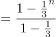。n无穷大时，原式。

故正确答案为B。

---

## 第 2 题　qid 2262769 · 数学运算

（  ）。

- **A**. 

　✅
- **B**. 

- **C**. 

- **D**. 

**答案**：A

**官方解析**

原式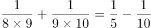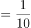。

故正确答案为A。

---

## 第 3 题　qid 2633405 · 数学运算

已知自然数a，b，c，d之和为80，a加3等于b减3等于c乘3等于d除以3，那么d等于：

- **A**. 24
- **B**. 36
- **C**. 39
- **D**. 45　✅

**答案**：D

**官方解析**

方法一：由题干可知，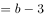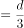，因此，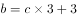，。根据自然数a，b，c，d之和为80，则有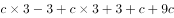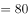，解得，因此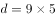。

方法二：由题干可知，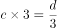，因此，因为c为自然数，所以d是9的倍数，排除A、C两项。因为d的值较大，优先代入数字较大的D项。若，那么，解得，，，则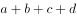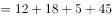，符合。

故正确答案为D。

---

## 第 4 题　qid 2633439 · 数学运算

甲乙两棋手对弈，每局两人获胜的概率相同，规定5局3胜，获胜者得奖金1000元。下了3局后因故停止比赛，其中甲赢了2局，乙赢了1局。那么1000元奖金按照（    ）分配才算合理。

- **A**. 
甲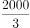元，乙元

- **B**. 
甲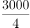元，乙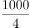元
　✅
- **C**. 
甲元，乙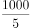元

- **D**. 
甲元，乙元

**答案**：B

**官方解析**

每局两人获胜的概率相同，则甲、乙每局获胜的概率都为。若比赛正常进行，只有赢得3场胜利的选手才能获得奖金，乙已经赢了1局，如果乙要赢得奖金，那么剩下的2局都必须获胜。因此乙赢得奖金的概率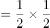，则甲赢得奖金的概率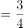。因此1000元奖金需要按照甲、乙赢得奖金的概率来进行分配才算合理，则甲获得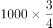元，乙获得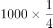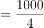元。

故正确答案为B。

---

## 第 5 题　qid 2262783 · 数学运算

某人工作一年的薪酬为6万元和一辆轿车，他干了10个月得到4万元和一辆轿车，那么这辆轿车值（    ）万元。

- **A**. 6　✅
- **B**. 7
- **C**. 8
- **D**. 9

**答案**：A

**官方解析**

设轿车的价格为万元，根据题意，解得。

故正确答案为A。

---

## 第 6 题　qid 2633499 · 数学运算

有一工程50人计划65天完成，开工5天后，工程单位要求提前10天完工，如果每人工作效率不变，则需要增加施工人员（    ）名。

- **A**. 7
- **B**. 8
- **C**. 9
- **D**. 10　✅

**答案**：D

**官方解析**

方法一：赋值每人的工作效率为1，则开工5天后剩余的工程总量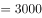，因为要求提前10天完工，所以剩余的工作时间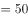天，则每天的工作量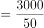，因此需要增加的施工人员名。

方法二：赋值每人的工作效率为1，因为要求提前10天完工，所以增加的人数用来完成50人10天的工作量，剩余的工作时间天，则需要增加的施工人员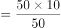名。

故正确答案为D。

---

## 第 7 题　qid 2047800 · 数学运算

单位工会组织拔河比赛，每支参赛队都由3名男职工和3名女职工组成。假设比赛时要求3名男职工的站位不能全部连在一起，则每支队伍有几种不同的站位方式？

- **A**. 432
- **B**. 504
- **C**. 576　✅
- **D**. 720

**答案**：C

**官方解析**

6人排列，考虑顺序，共有种方法；

3名男职工全部连在一起，利用捆绑法有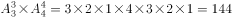种方法；

则3名男职工不能全部连在一起的方法有：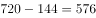种。

故正确答案为C。

---

## 第 8 题　qid 2262790 · 数学运算

一果园共产苹果1000吨，要求全部装箱销售，箱子规格分为大箱（可装苹果20千克）、中箱（可装苹果15千克）、小箱（可装苹果10千克），规定所用大箱不得超过所用箱子总数的一半，中箱不得超过三分之一，那么至少用（    ）个箱子才能恰好把所有苹果装箱。

- **A**. 5000
- **B**. 6000
- **C**. 50000
- **D**. 60000　✅

**答案**：D

**官方解析**

由题意，问最少，采用极端假设法，设大箱子有个，中箱子有个，小箱子有个，则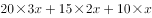吨千克，解得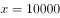，则至少用的箱子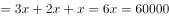个。

故正确答案为D。

---
