# 2016年广东省公务员录用考试《行测》题（乡镇）

> 数量关系 · 15 题 · 广东 2016

## 第 1 题　qid 1796490 · 数学运算

-1   3   -3   5   -5   7   （    ）

- **A**. 7
- **B**. 8
- **C**. -7　✅
- **D**. -8

**答案**：C

**官方解析**

方法一：数列项数较多，优先考虑分组。观察发现数列奇数项分别为：-1、-3、-5、（    ）为连续负的奇数列，下一项应为-7。
方法二：数列变化幅度较小，考虑作差。后减前可得：4，-6，8，-10，12，可以推知下一项为-14，即（    ）-7=-14，可知（    ）=-7。
故正确答案为C。

---

## 第 2 题　qid 1796494 · 数学运算

13  26  39  52  （  ）

- **A**. 55
- **B**. 65　✅
- **C**. 75
- **D**. 85

**答案**：B

**官方解析**

数列变化幅度较小，优先考虑作差。相邻两项作差后均得13，故下一项应为52+13=65。
故正确答案为B。

---

## 第 3 题　qid 1796502 · 数学运算

1  2  3  10  39  （  ）

- **A**. 157
- **B**. 257
- **C**. 390
- **D**. 490　✅

**答案**：D

**官方解析**

数列变化幅度较大，幂次无规律，考虑递推。观察发现，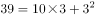，，，即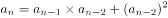，第三项=前两项的乘积+第一项的平方。故所求项=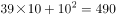。

故正确答案为D。

---

## 第 4 题　qid 1796516 · 数学运算

12.7  20.9  31.1  43.3  （  ）

- **A**. 55.5
- **B**. 57.5　✅
- **C**. 57.7
- **D**. 59.7

**答案**：B

**官方解析**

由题意可判断数列为小数数列，机械划分后无规律可循，但数列整体呈现递增趋势，且变化幅度较小，考虑作差，得到新数列为8.2、10.2、12.2、（    ），为公差是2的等差数列，可判断括号内数值为14.2，则题目所求为43.3+14.2=57.5。
故正确答案为B。

---

## 第 5 题　qid 1796530 · 数学运算

- **A**. 55
- **B**. 103
- **C**. 199
- **D**. 212　✅

**答案**：D

**官方解析**

由题意可判断为九宫格数列，寻找每行或者每列相同的规律，可发现、，即每行中，第一个数的平方减去第三个数的2倍等于第二个数，则题目所求为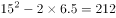。

故正确答案为D。

---

## 第 6 题　qid 1796540 · 数学运算

甲乙丙三人参加一项测试，三人的平均分为80，甲乙两人的平均分为75，乙丙两人的平均分为80，那么甲丙两人的平均分为（  ）。

- **A**. 70
- **B**. 75
- **C**. 80
- **D**. 85　✅

**答案**：D

**官方解析**

方法一：根据已知条件三人的平均分为80，甲、乙平均分为75，乙丙平均分为80可得，甲+乙+丙=80×3=240，由甲+乙=75×2=150，可得丙=90；由乙+丙=80×2=160，可得甲=80；甲+丙=170。所以，甲丙两人的平均分为170÷2=85分。
方法二：甲+丙=2（甲+乙+丙）-（甲+乙）-（乙+丙）=2×80×3-75×2-80×2=170；所以，甲丙两人的平均分为170÷2=85分。
故正确答案为D。

---

## 第 7 题　qid 1796546 · 数学运算

一批零件若交由赵师傅单独加工，需要10天完成；若交由孙师傅单独加工，需要15天完成。两位师傅一起加工这批零件，需要（  ） 天完成。

- **A**. 5
- **B**. 6　✅
- **C**. 7
- **D**. 8

**答案**：B

**官方解析**

已知完成工程的时间，赋值给工作总量。设工程总量为30，则赵师傅的效率为30÷10=3，孙师傅的效率为30÷15=2，因此两位师傅合作需要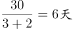。

故正确答案为B。

---

## 第 8 题　qid 1796554 · 数学运算

两辆汽车同时从两地相向开出，甲车每小时行驶60千米，乙车每小时行驶48千米，两车在离两地中点48千米处相遇。则两地相距（  ）千米。

- **A**. 192
- **B**. 224
- **C**. 416
- **D**. 864　✅

**答案**：D

**官方解析**

方法一：两车同时出发到相遇，所走的时间相同，所以路程比等于速度比，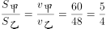。当两车相遇时，距离两地中点48千米，即相遇时，甲比乙多走了千米。因为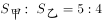，甲走了5份，乙走了4份，全程是9份，甲比乙多走的1份，对应的是96千米，故两地相距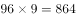千米。

方法二：根据已知条件可知，甲比乙多走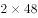千米，设行驶了小时，甲、乙相遇，由此可根据两人的路程差列式：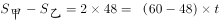，解得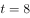小时。两地相距的总路程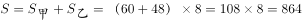千米。

故正确答案为D。

---

## 第 9 题　qid 1796568 · 数学运算

修建一条铁路，如果每4米铺设5根枕木，共需5000根；如果每5米铺设6根枕木，一共要用（   ）根。

- **A**. 3600
- **B**. 4200
- **C**. 4800　✅
- **D**. 7500

**答案**：C

**官方解析**

由题意可得铁路长度为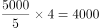米，则若每5米铺设6根则需要枕木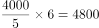根。

故正确答案为C。

---

## 第 10 题　qid 1796574 · 数学运算

某单位2014年年终评比中，良好等级的人数占总人数3/5。2015年年终评比又多了60人被评为良好等级，此时该等级的人数占总人数9/11。如果在这两年间该单位的人员没有变化，则该单位共有（   ）人。

- **A**. 120
- **B**. 275　✅
- **C**. 330
- **D**. 800

**答案**：B

**官方解析**

由题意可设2014年良好等级的人数为3x，则总人数为5x，可得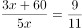，解方程可得x=55，总人数为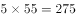人。

故正确答案为B。

秒杀技：由题意可知总人数必然是11和5的倍数，则可排除A、D，将B项代入满足条件，故正确答案为B。

---

## 第 11 题　qid 1796586 · 数学运算

某服装店有一批衬衣共76件，分别卖给了33位顾客，每位顾客最多买了3件。衬衣定价为100元，买1件按原价，买2件总价打九折，买3件总价打八折。最后卖完这批衬衣共收入6460元，则买了3件的顾客有（   ）位。

- **A**. 4
- **B**. 8
- **C**. 14　✅
- **D**. 15

**答案**：C

**官方解析**

由题意可设买了1件、2件、3件衣服的人数分别为x、y、z人，则可得x+y+z=33，x+2y+3z=76，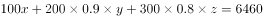，联立求解可得x=4，y=15，z=14。

故正确答案为C。

---

## 第 12 题　qid 1796592 · 数学运算

园林工人用一辆汽车将20棵行道树运往1公里的地方开始种植。在1公里处种第一棵，以后往更远处每隔50米种一棵，该辆汽车每次最多能运三棵树。当园林工人完成任务时，这辆汽车行程最短是（    ）米。

- **A**. 20800
- **B**. 20900
- **C**. 21000　✅
- **D**. 21100

**答案**：C

**官方解析**

由题意可得，要汽车行驶距离最短，需要汽车从最远开始运，每次都运3棵。共20棵树，汽车每次最多运3棵，所以共需往返20÷3=6次余2棵，即往返7次，从第七次最远的第20棵树看，单程需行驶1000+（20-1）×50=1950米，第六次种第17棵树，单程需行驶1000+（17-1）×50=1800米，以后每次种树路程减少150米，构成等差数列，到第一次种2棵树，单程需行驶1000+50=1050米，代入等差数列求和公式计算往返路程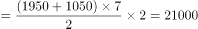米。

故正确答案为C。

---

## 第 13 题　qid 1796598 · 数学运算

小王早上看到挂钟显示8点多，急忙赶往公司上班。但是到了公司却发现时间和自己出门看到的挂钟时间一样，才明白是自己出门前误把挂钟的时针看成分针、分针看成时针。已知小王平时上班路程不超过1.5小时，今天上班他花费了（    ）。

- **A**. 48分钟
- **B**. 55分钟　✅
- **C**. 1小时
- **D**. 1小时3分钟

**答案**：B

**官方解析**

小王出门时分针应指向8-9，故时间为N点40，到单位的时间是8点，路上时间不超过1.5小时，说明出门时只能是6点40或者7点40。如果出门时间6点40，时针分针看反，则到单位时间是8点30，路上时间超过1.5小时，不满足条件；故出门时间应为7点40，时针分针看反，则到单位时间是8点35，故路程时间为55分钟。

故正确答案为B。

---

## 第 14 题　qid 1796600 · 数学运算

某羽毛球赛共有23支队伍报名参赛，赛事安排23支队伍抽签两两争夺下一轮的出线权，没有抽到对手的队伍轮空，直接进入下一轮。那么，本次羽毛球赛一共会出现（    ）次轮空的情况。

- **A**. 2　✅
- **B**. 3
- **C**. 4
- **D**. 5

**答案**：A

**官方解析**

第一轮23支队伍需要轮空1次；第二轮12支队伍，不需要轮空；第三轮6支队伍，不需要轮空；第四轮3支队伍，需要轮空1次；最后是冠军争夺，不需要轮空。
故正确答案为A。
相关知识点：
淘汰赛的思想，只有奇数个队伍的时候，才需要轮空，所以一共两次奇数次队伍，所以为2。

---

## 第 15 题　qid 1796648 · 数学运算

甲乙两人需托运行李。托运收费标准为10kg以下6元/kg，超出10kg部分每公斤收费标准略低一些。已知甲乙两人托运费分别为109.5元、78元，甲的行李比乙重了50%。那么，超出10kg部分每公斤收费标准比10kg以内的低了（    ）元。

- **A**. 1.5　✅
- **B**. 2.5
- **C**. 3.5
- **D**. 4.5

**答案**：A

**官方解析**

解析一：

分段计费问题，设乙的行李超出的重量为x，即乙的行李总重量为10+x，则甲的行李重量为1.5×(10+x)。所以计算超出部分的重量为1.5×(10+x)-10=5+1.5x，超出金额为49.5元，所以按照比例，乙的行李超出了重量x，超出金额为18元，得到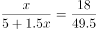，解得x=4，所以超出部分单价为18÷4=4.5元。所以超出10公斤部分每公斤收费标准比10公斤以内的低了6-4.5=1.5元。

解析二：

盈亏思路，由于甲的行李重量比乙的多50%，所以分段看，乙超出部分为18元，所以对应的多50%的重量，应该是27元。则从甲超出的49.5元中扣除27元，还剩22.5元，这个钱数应该对应着10公斤的50%，即5公斤22.5元。所以每公斤超出部分为4.5元，超出10公斤部分每公斤收费标准比10公斤以内的低了6-4.5=1.5元，得解。

故正确答案为A。

速解：

靠常识解决，题目中说“超出10kg部分每公斤收费标准略低一些”，所以选稍微低一点的。

---
