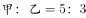
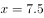
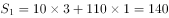
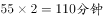
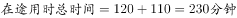
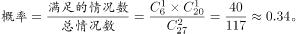
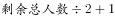
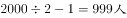
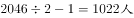

# 2016年广东省公务员录用考试《行测》题（县级以上）

> 数量关系 · 13 题 · 广东 2016

## 第 1 题　qid 1796502 · 数学运算

1  2  3  10  39  （  ）

- **A**. 157
- **B**. 257
- **C**. 390
- **D**. 490　✅

**答案**：D

**官方解析**

数列变化幅度较大，幂次无规律，考虑递推。观察发现，，，，即，第三项=前两项的乘积+第一项的平方。故所求项=。

故正确答案为D。

---

## 第 2 题　qid 1796516 · 数学运算

12.7  20.9  31.1  43.3  （  ）

- **A**. 55.5
- **B**. 57.5　✅
- **C**. 57.7
- **D**. 59.7

**答案**：B

**官方解析**

由题意可判断数列为小数数列，机械划分后无规律可循，但数列整体呈现递增趋势，且变化幅度较小，考虑作差，得到新数列为8.2、10.2、12.2、（    ），为公差是2的等差数列，可判断括号内数值为14.2，则题目所求为43.3+14.2=57.5。
故正确答案为B。

---

## 第 3 题　qid 1796530 · 数学运算

- **A**. 55
- **B**. 103
- **C**. 199
- **D**. 212　✅

**答案**：D

**官方解析**

由题意可判断为九宫格数列，寻找每行或者每列相同的规律，可发现、，即每行中，第一个数的平方减去第三个数的2倍等于第二个数，则题目所求为。

故正确答案为D。

---

## 第 4 题　qid 2031560 · 数学运算

一批零件如果全部都交由甲厂加工，正好在计划时间完成，如果全部交由乙厂加工，要超过计划时间5天才能完成，如果甲乙两厂合作加工3天，再由乙厂单独加工，正好也是在计划时间完成，则加工完这批零件计划时间是（    ）

- **A**. 5
- **B**. 7
- **C**. 7.5　✅
- **D**. 8.5

**答案**：C

**官方解析**

由条件，“乙需要超过计划时间5天完成，两厂合作加工3天后由乙厂加工也可在计划时间完成”，则可推知乙5天完成的工作量等于甲3天完成的工作量，即，。设加工这批零件计划时间是天，根据工程总量相等可得：，解得。

故正确答案为C。    

---

## 第 5 题　qid 1796586 · 数学运算

某服装店有一批衬衣共76件，分别卖给了33位顾客，每位顾客最多买了3件。衬衣定价为100元，买1件按原价，买2件总价打九折，买3件总价打八折。最后卖完这批衬衣共收入6460元，则买了3件的顾客有（   ）位。

- **A**. 4
- **B**. 8
- **C**. 14　✅
- **D**. 15

**答案**：C

**官方解析**

由题意可设买了1件、2件、3件衣服的人数分别为x、y、z人，则可得x+y+z=33，x+2y+3z=76，，联立求解可得x=4，y=15，z=14。

故正确答案为C。

---

## 第 6 题　qid 1796592 · 数学运算

园林工人用一辆汽车将20棵行道树运往1公里的地方开始种植。在1公里处种第一棵，以后往更远处每隔50米种一棵，该辆汽车每次最多能运三棵树。当园林工人完成任务时，这辆汽车行程最短是（    ）米。

- **A**. 20800
- **B**. 20900
- **C**. 21000　✅
- **D**. 21100

**答案**：C

**官方解析**

由题意可得，要汽车行驶距离最短，需要汽车从最远开始运，每次都运3棵。共20棵树，汽车每次最多运3棵，所以共需往返20÷3=6次余2棵，即往返7次，从第七次最远的第20棵树看，单程需行驶1000+（20-1）×50=1950米，第六次种第17棵树，单程需行驶1000+（17-1）×50=1800米，以后每次种树路程减少150米，构成等差数列，到第一次种2棵树，单程需行驶1000+50=1050米，代入等差数列求和公式计算往返路程米。

故正确答案为C。

---

## 第 7 题　qid 2031564 · 数学运算

某单位租赁了两辆同样的大巴车运送员工外出活动，从出发地到目的地的车程是2个小时，两车以相同速度同时出发，但甲车刚出发10分钟即发生故障，只能以原速的1/3匀速较慢行驶，乙车将本车员工送到目的地后，原路返回与甲车相遇，载上甲车员工驶往目的地，当所有员工到达目的地时，在途用时总计为（    ）。（上下车时间不计）

- **A**. 3小时50分钟　✅
- **B**. 4小时
- **C**. 4小时20分钟
- **D**. 4小时40分钟

**答案**：A

**官方解析**

赋值两车出发的速度为3每分钟，全程需2小时，即120分钟，则全程。

①乙车到达目的地时，行驶了120分钟。前10分钟甲车以3的速度行驶，后110分钟以原速的，即1的速度行驶。故当乙车到达目的地时，甲车所走的路程，剩余路程为。

②乙车从返回到与甲车相遇，。即刻返回到达目的地同样需要55分钟，即一共需要。

故，即3个小时50分钟。

故正确答案为A。    

---

## 第 8 题　qid 2031566 · 数学运算

一个木制正方体在表面涂上颜色，将它的每条棱三等分，然后从等分点将正方体展开，得到27个小正方体，将这些小正方体充分混合后，装入一个口袋，从这个口袋中随机取出两个小正方体，其中一个正方体只有一个面涂有颜色，另一个至少有2个面涂有颜色的概率约为（    ）。

- **A**. 0.05
- **B**. 0.17
- **C**. 0.34　✅
- **D**. 0.67

**答案**：C

**官方解析**

按照题干情况分成27个小正方体，其中只有一个面涂色的小正方体每个面有一个，共有6个；有两个面涂色的小正方体每条棱有1个，共有12个；有3个面涂色的小正方体每个顶点有1个，共有8个。则至少有2个面涂色的小正方体一共有20个。根据概率公式：

故正确答案为C。

---

## 第 9 题　qid 2031568 · 数学运算

大型体育竞赛开幕式需要列队，共10排。导演安排演员总数的一半多一个在第一排，安排剩下演员人数的一半多一个在第2排……..依次类推。如果在第10排恰好将演员排完，那么参与排队列的演员共有（    ）名。

- **A**. 2000
- **B**. 2008
- **C**. 2012
- **D**. 2046　✅

**答案**：D

**官方解析**

因每次安排的人数均为“”，则安排完第一排后剩余的人数为偶数。根据特性排除： 

A项：排完第一排剩余：，为奇数，排除；

B项：排完第一排剩余：，为奇数，排除；

C项：排完第一排剩余：，为奇数，排除；

D项：排完第一排剩余：，为偶数，当选。

故正确答案为D。 

---

## 第 10 题　qid 1796598 · 数学运算

小王早上看到挂钟显示8点多，急忙赶往公司上班。但是到了公司却发现时间和自己出门看到的挂钟时间一样，才明白是自己出门前误把挂钟的时针看成分针、分针看成时针。已知小王平时上班路程不超过1.5小时，今天上班他花费了（    ）。

- **A**. 48分钟
- **B**. 55分钟　✅
- **C**. 1小时
- **D**. 1小时3分钟

**答案**：B

**官方解析**

小王出门时分针应指向8-9，故时间为N点40，到单位的时间是8点，路上时间不超过1.5小时，说明出门时只能是6点40或者7点40。如果出门时间6点40，时针分针看反，则到单位时间是8点30，路上时间超过1.5小时，不满足条件；故出门时间应为7点40，时针分针看反，则到单位时间是8点35，故路程时间为55分钟。

故正确答案为B。

---

## 第 11 题　qid 1796600 · 数学运算

某羽毛球赛共有23支队伍报名参赛，赛事安排23支队伍抽签两两争夺下一轮的出线权，没有抽到对手的队伍轮空，直接进入下一轮。那么，本次羽毛球赛一共会出现（    ）次轮空的情况。

- **A**. 2　✅
- **B**. 3
- **C**. 4
- **D**. 5

**答案**：A

**官方解析**

第一轮23支队伍需要轮空1次；第二轮12支队伍，不需要轮空；第三轮6支队伍，不需要轮空；第四轮3支队伍，需要轮空1次；最后是冠军争夺，不需要轮空。
故正确答案为A。
相关知识点：
淘汰赛的思想，只有奇数个队伍的时候，才需要轮空，所以一共两次奇数次队伍，所以为2。

---

## 第 12 题　qid 1796648 · 数学运算

甲乙两人需托运行李。托运收费标准为10kg以下6元/kg，超出10kg部分每公斤收费标准略低一些。已知甲乙两人托运费分别为109.5元、78元，甲的行李比乙重了50%。那么，超出10kg部分每公斤收费标准比10kg以内的低了（    ）元。

- **A**. 1.5　✅
- **B**. 2.5
- **C**. 3.5
- **D**. 4.5

**答案**：A

**官方解析**

解析一：

分段计费问题，设乙的行李超出的重量为x，即乙的行李总重量为10+x，则甲的行李重量为1.5×(10+x)。所以计算超出部分的重量为1.5×(10+x)-10=5+1.5x，超出金额为49.5元，所以按照比例，乙的行李超出了重量x，超出金额为18元，得到，解得x=4，所以超出部分单价为18÷4=4.5元。所以超出10公斤部分每公斤收费标准比10公斤以内的低了6-4.5=1.5元。

解析二：

盈亏思路，由于甲的行李重量比乙的多50%，所以分段看，乙超出部分为18元，所以对应的多50%的重量，应该是27元。则从甲超出的49.5元中扣除27元，还剩22.5元，这个钱数应该对应着10公斤的50%，即5公斤22.5元。所以每公斤超出部分为4.5元，超出10公斤部分每公斤收费标准比10公斤以内的低了6-4.5=1.5元，得解。

故正确答案为A。

速解：

靠常识解决，题目中说“超出10kg部分每公斤收费标准略低一些”，所以选稍微低一点的。

---

## 第 13 题　qid 2031572 · 数学运算

甲乙两地位于不同时区，小张早上10点从甲地乘飞机到乙地，到达的时间为当地时间早上10点，第二天下午4点30分从乙地飞回甲地，到达的时间为当地时间22点30分。如果两次飞行时间相同。那么，当甲地时间为中午12点时，乙地时间为（    ）。

- **A**. 8点30分
- **B**. 9点　✅
- **C**. 9点30分
- **D**. 10点

**答案**：B

**官方解析**

第一次飞行，由甲地到乙地时间变化为0。。说明由甲到乙时差为负，且两地时差等于飞行时间。第二次飞行，由乙地到甲地，方向相反，时差则变成正。时间变化为6个小时。。因飞行时间与时差相等，故两地时差为3小时。当甲地为12点时，乙地为上午9点。

注意：本题需要考生对时差的概念有所了解。属于地理常识和数学运算的融合题型。

故正确答案为B。 

---
