# 2016年广州市公务员录用考试《行测》题

> 数量关系 · 14 题 · 广州市考 2016

## 第 1 题　qid 2062672 · 数学运算

某单位为全体员工进行体检，平均体重是57.5公斤。其中，男员工的平均体重是62.5公斤，女员工的平均体重是55.5 公斤。则该单位的男、女员工人数比为：

- **A**. 

　✅
- **B**. 
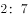

- **C**. 
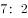

- **D**. 
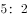

**答案**：A

**官方解析**

方法一：设男员工有人，女员工有人。根据男、女员工的平均体重和全体员工的平均体重，有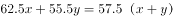，解得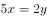，。

方法二：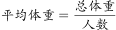，根据线段法，人数比与平均体重差之比成反比，有。

故正确答案为A。

---

## 第 2 题　qid 2062682 · 数学运算

一条生产流水线上有甲、乙两位工人，流水线上有400个零件尚未装配。其中甲每分钟装配9个零件，乙每分钟装配7个零件。而流水线上也在不断地增加新的零件。在第50分钟结束的时候，甲、乙两人刚好把流水线上的零件装配完。则流水线上每分钟增加的零件有（    ）个。

- **A**. 8　✅
- **B**. 10
- **C**. 14
- **D**. 18

**答案**：A

**官方解析**

甲的工作效率是，乙的工作效率是，则甲乙合作的效率是。设流水线上每分钟增加的零件是个，根据牛吃草公式：，解得。

故正确答案为A。

---

## 第 3 题　qid 2062690 · 数学运算

植树节当天，某学校的两个班自发组织了一些人去植树。甲班每人植树3棵，乙班每人植树5棵，两个班共植树115棵。那么，两班植树人数之和最多为（    ）人。

- **A**. 36
- **B**. 37　✅
- **C**. 38
- **D**. 39

**答案**：B

**官方解析**

设甲班人数有人，乙班人数有人。甲班每人植3棵，乙班每人植5棵，共植115棵，则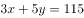。，要使人数之和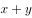最多，则应使尽可能小，尽可能大。根据不定方程倍数特性，为5的倍数，最大为35，此时，。因此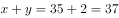。

故正确答案为B。

---

## 第 4 题　qid 2062698 · 数学运算

小黎去水果店买牛油果、火龙果，向老板问了价格后，老板的答复是“2个牛油果、3个新鲜火龙果一共32元；特价火龙果10元3个。”小黎最后买了5个牛油果和8个新鲜火龙果，花了82元，但是回家发现有2个牛油果坏了，她赶回水果店要求老板退换，老板答应了。那么，小黎可以换（    ）。

- **A**. 3个新鲜火龙果、1个牛油果
- **B**. 3个特价火龙果、1个牛油果　✅
- **C**. 2个新鲜火龙果、3个特价火龙果
- **D**. 6个新鲜火龙果

**答案**：B

**官方解析**

设牛油果单价为元，新鲜火龙果单价为元。则2个牛油果、3个新鲜火龙果一共32元；5个牛油果和8个新鲜火龙果，花了82元。列方程：

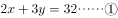

解得，。两个牛油果的价格为，可换得3个特价火龙果和1个牛油果。

故正确答案为B。

---

## 第 5 题　qid 2062704 · 数学运算

一个长方体木块恰好能切割成三个正方体木块，三个正方体木块表面积之和比原来的长方体木块的表面积增加了64平方厘米。则长方体木块的体积为（    ）立方厘米。

- **A**. 128
- **B**. 192　✅
- **C**. 256
- **D**. 512

**答案**：B

**官方解析**

长方体的木块恰好切割成三个正方体，需要切两次，多出4个正方形的面积。表面积增加了64平方厘米，得到正方体一个面的面积为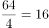平方厘米，则正方体边长为4厘米。。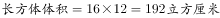。

故正确答案为B。

---

## 第 6 题　qid 2062712 · 数学运算

如图所示，8块同样大小的长方形钢板拼成了一块大的长方形钢板，已知大长方形钢板周长为112厘米，那么大长方形钢板的面积是（    ）平方厘米。

- **A**. 432
- **B**. 588
- **C**. 768　✅
- **D**. 945

**答案**：C

**官方解析**

根据图示，大长方形钢板的周长由4条长，8条宽组成，且中间两条长的长度与3条宽的长度相等，有：

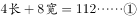

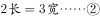

解得，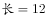厘米，厘米。因此，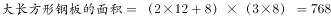平方厘米。

故正确答案为C。

---

## 第 7 题　qid 2062734 · 数学运算

标有、、、、、记号的六盏灯按序排成一行。每盏灯装有开关，现有、两盏灯亮着，其余灯是灭的。某测试人员拉动灯开关，并按序拉动、、、、灯开关，再按此顺序循环拉下去。则当测试人员拉动2023次后，亮着的灯应该是（    ）。

- **A**. 
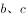

- **B**. 

- **C**. 
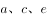

- **D**. 

　✅

**答案**：D

**官方解析**

根据题干信息，开始前是、、、灭，、亮。6盏灯为一个循环周期，一个循环周期之后，、、、亮，、灭。两个循环周期之后，、、、灭，、亮。三个循环周期之后，、、、亮，、灭······依次递推。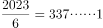，即经过337个周期之后还需拉动一次。337个周期之后为、、、亮，、灭，再拉动一次之后，灯灭。则2023次之后，亮着的灯是、、。

故正确答案为D。

---

## 第 8 题　qid 2062742 · 数学运算

某市举行“新春杯”足球比赛，对16支参赛队伍进行小组赛分组抽签。抽签箱中分别装有红、黄、绿、蓝的小球各四个，抽到相同颜色小球的队伍进入同一小组。则第一支抽签队伍与第二支抽签队伍被分在同一小组的概率为（    ）。

- **A**. 二分之一
- **B**. 三分之一
- **C**. 四分之一
- **D**. 五分之一　✅

**答案**：D

**官方解析**

因为抽签箱中共有4个颜色的球各4个，则箱子中共有16个球。前两支队伍抽签的情况总数为；分在同一小组的情况时，第一支队伍有种选择，第二支队伍只能从第一支队伍选择的颜色所剩余的3个球中选1个，同一组的情况数为。第一支抽签队伍与第二支抽签队伍被分在同一小组的概率为。

故正确答案为D。

---

## 第 9 题　qid 2062750 · 数学运算

某餐厅要用三个炉灶做出9道菜肴，做完各道菜肴需要的时间分别是1、2、3、4、4、5、5、6、7分钟。每个炉灶在同一时间只能做一道菜肴。那么，最少经过（    ）分钟，该餐厅可以做完全部菜肴。

- **A**. 11
- **B**. 12
- **C**. 13　✅
- **D**. 14

**答案**：C

**官方解析**

要使经过的时间最少，则应使每个炉灶都尽可能的不空闲。经过时间如下表所示：

故最少经过13分钟，可做完全部菜肴。

故正确答案为C。

---

## 第 10 题　qid 2062768 · 数学运算

某部门里身高各不相同的8人一起排练合唱节目。合唱要求8人排成两排，前后人员对齐，但要求后排的每个人要比站其前面的那个人高，以不被挡住。则这8人的站位方法有（    ）种。

- **A**. 980
- **B**. 1260
- **C**. 1860
- **D**. 2520　✅

**答案**：D

**官方解析**

后排身高的每个人比其前面那个人高，则将对齐的前后两个人看作一组，共有4组。从8个人里面选择2个人作为第一组，则这两人的前后顺序就能确定，站位方法数为；第二组站位方法数为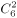；第三组站位方法数为；剩余2人则为最后一组。则这8人的站位方法为种。

故正确答案为D。

---

## 第 11 题　qid 2062772 · 数学运算

办公室有两台相同型号的饮水机，但水桶中剩余的水量不同。打开一个出水阀，第一台8分钟可将水放干，第二台5分钟可将水放干。如果两台饮水机都同时打开两个出水阀，当第一台饮水机剩余的水量是第二台的2倍时，打开出水阀的时间为（    ）分钟。

- **A**. 1　✅
- **B**. 2
- **C**. 3
- **D**. 4

**答案**：A

**官方解析**

设出水阀的出水效率为1，则第一台饮水机的水量为8，第二台饮水机的水量为5。打开两个出水阀，当第一台饮水机剩余的水量是第二台的2倍，有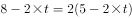，解得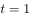分钟。

故正确答案为A。

---

## 第 12 题　qid 2062776 · 数学运算

市总工会举行工会知识竞赛，每位选手作答25题，答对一题得3分，不答得1分，答错扣1分。某单位派出7名选手参赛，由四位记分员分别统计该单位选手的总得分，结果分别为539分、490分、469分、434分。经核查，其中有一位记分员的统计结果正确，则该单位7名选手的平均分为（    ）分。

- **A**. 77
- **B**. 70
- **C**. 67　✅
- **D**. 62

**答案**：C

**官方解析**

设一个选手答对的题量为，不答的题量为，答错的题量为。因为共有25道题，全部答对是75分，则，总分为539错误，排除A项。则有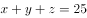。一个选手的得分为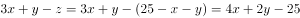。因为为偶数，则一定为奇数。每个选手的成绩为奇数，奇数个奇数相加和也为奇数，则490和434错误，7名选手的总成绩为469，平均成绩为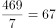。

故正确答案为C。

---

## 第 13 题　qid 2062780 · 数学运算

“天星号”和“沧云号”两艘客船往返于甲、乙两地运送旅客。上午10点，“天星号”和“沧云号”以相同速度分别从甲、乙两地相向开出。“天星号”从甲地出发时有一个救生圈掉进水里，救生圈随水流向乙地飘去。下午14点，“天星号”与救生圈相距80千米。晚上20点，“沧云号”与救生圈首次相遇。则甲、乙两地相距（    ）千米。

- **A**. 200　✅
- **B**. 320
- **C**. 400
- **D**. 800

**答案**：A

**官方解析**

设两艘客船的船速为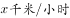，水流速度为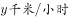。下午14点，“天星号”与救生圈相距80千米，根据追及公式，有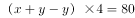，得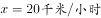。晚上20点，“沧云号”与救生圈首次相遇，根据相遇公式，有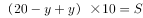，得。

故正确答案为A。

---

## 第 14 题　qid 2062784 · 数学运算

南北向的铁路旁有一条平行的公路，公路经过镇，有一行人与一骑车人早上同时从镇沿公路向南出发。行人的速度为，骑车人的速度为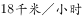。同时，有一列火车从他们背后驶来，9点10分恰好追上行人，而且从行人身边通过用了20秒；9点18分恰好追上骑车人，从骑车人身边通过用了26秒。则二人从A镇出发时，火车离A镇还有（    ）千米。

- **A**. 15.8
- **B**. 18.6
- **C**. 20.8　✅
- **D**. 24.0

**答案**：C

**官方解析**

行人的速度为，骑车人的速度为，则，。火车从行人身边通过用20秒，从骑车人身边通过用26秒。根据追及公式，有

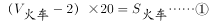

解得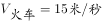。设当行人和骑车人从镇出发时，火车距离镇的距离为，经过秒后追上行人。。有

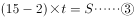

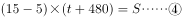

解得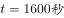，。

故正确答案为C。

---
