# 2016年江苏省公务员录用考试《行测》题（A类）

> 数量关系 · 14 题 · 江苏 2016

## 第 1 题　qid 1788600 · 数学运算

，，1，5，35，(   )

- **A**. 315　✅
- **B**. 215
- **C**. 115
- **D**. 96

**答案**：A

**官方解析**

数列存在明显的倍数关系，优先考虑作商。作商后得到新数列：1，3，5，7，（9），为连续奇数列，下一项为9，则题干所求项为：。

故正确答案为A。

---

## 第 2 题　qid 1788602 · 数学运算

，，，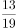，，(   )

- **A**. 
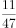

- **B**. 
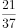 

- **C**. 
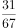
　✅
- **D**. 

**答案**：C

**官方解析**

分数数列前四项规律明显，分母部分作差可得：2，4，8，（16），是公比为2的等比数列，则第五项可转化为。依此，所求项分母应为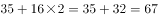。只有C项满足。

验证：将第五项转化为后，分子部分作差可得：2，4，6，8，（10），为连续偶数列，则所求项分子部分为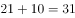，与选项吻合。

故正确答案为C。

---

## 第 3 题　qid 1788604 · 数学运算

4.2，5.2，8.4，17.8，44.22，(   )

- **A**. 125.62　✅
- **B**. 85.26
- **C**. 99.44
- **D**. 125.64

**答案**：A

**官方解析**

题干为小数数列，作差无规律，考虑机械划分。整数部分为：4，5，8，17，44，相邻两项作差得到新数列为1，3，9，27，是公比为3的等比数列，则新数列下一项为81，原数列整数部分为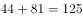，排除B、C两项。小数部分为2，2，4，8，22，相邻两项作差得到新数列①为0，2，4，14，再次作差无规律，考虑对新数列①相邻两项作和，得到新数列②为2，6，18，是公比为3的等比数列，所以新数列②的下一项为54，新数列①的下一项为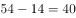，因此小数部分的下一项为，排除D项。

故正确答案为A。

备注：本题也可以小数部分结合整数部分找规律，奇数项中，整数部分为小数部分的2倍，偶数项中整数部分为小数部分的2倍多1，故第六项应满足整数部分为小数部分的2倍多1，只有A项满足。

---

## 第 4 题　qid 1788606 · 数学运算

2，3，4，，，（    ）

- **A**. 
81

- **B**. 

- **C**. 

- **D**. 
9
　✅

**答案**：D

**官方解析**

将数列统一转化为根号形式，则原数列转化为：，，，，，（  ）。根号内数字变化幅度较小且呈递增趋势，优先考虑作差。作差后可得：5，7，11，19，（  ）。二次作差得：2，4，8，（16），判定其是公比为2的等比数列，下一项为16。故所求项为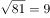。

故正确答案为D。

---

## 第 5 题　qid 1788608 · 数学运算

已知A、B两地相距600千米，甲乙两车同时从A、B两地相向而行，3小时相遇。若甲的速度是乙的1.5倍，则甲的速度是：

- **A**. 60千米/小时
- **B**. 80千米/小时
- **C**. 90千米/小时
- **D**. 120千米/小时　✅

**答案**：D

**官方解析**

方法一：设乙的速度为千米/小时，甲的速度为千米/小时，由题目可列方程：，解得，则甲速度为千米/小时。

方法二：因甲、乙时间相同，且甲速度是乙的1.5倍，则甲的路程∶乙的路程，共5份。已知总路程为600千米，所以一份为120千米，甲的路程为360千米，所以甲的速度为千米/小时。

故正确答案为D。

---

## 第 6 题　qid 1788610 · 数学运算

某班有38名同学，一次数学测验共有两题，答对第一题的有26人，答对第二题的有24人，两题都答对的有17人，则两题都答错的人数是：

- **A**. 3
- **B**. 5　✅
- **C**. 6
- **D**. 7

**答案**：B

**官方解析**

根据两集合容斥原理公式：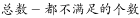 。则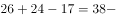，根据尾数法，两题都答错的人数尾数为5。 

故正确答案为B。 

---

## 第 7 题　qid 1788612 · 数学运算

甲、乙、丙三人共同完成一项工程，他们的工作效率之比是5：4：6。先由甲、乙两人合作6天，再由乙单独做9天，完成全部工程的，若剩下的工程由丙单独完成，则丙所需要的天数是：

- **A**. 9
- **B**. 11
- **C**. 10　✅
- **D**. 15

**答案**：C

**官方解析**

根据题目中的效率比，设甲、乙、丙的效率分别为5，4，6，由题干可得工程总量，剩余工作量，故丙所需时间天。 

故正确答案为C。 

---

## 第 8 题　qid 1788614 · 数学运算

有A、B、C三支试管，分别装有10克、20克、30克的水，现将某种盐溶液10克倒入A管均匀混合，并取出10克溶液倒入B管均匀混合，再从B管中取出10克溶液倒入C管。若这时C管中溶液的浓度为2.5%，则原盐溶液的浓度是：

- **A**. 60%　✅
- **B**. 55%
- **C**. 50%
- **D**. 45%

**答案**：A

**官方解析**

假设原盐溶液浓度为，将溶液倒入A试管中，混合之后的浓度为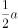，同理经过B、C试管的混合之后溶液浓度为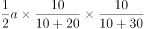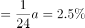，解得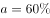。

故正确答案为A。

---

## 第 9 题　qid 1788616 · 数学运算

某志愿服务小组购买一批牛奶到一敬老院慰问老人，如果送给每位老人四盒牛奶，那么还剩28盒，如果送给每位老人5盒，那么最后一位老人又不足4盒，则该敬老院的老人人数至少是：

- **A**. 27
- **B**. 29
- **C**. 30　✅
- **D**. 33

**答案**：C

**官方解析**

假设该敬老院老人人数为 人，每人分配5盒时最后一位老人分得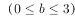盒牛奶，则可得到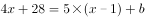，则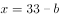，要使得值最小，应取最大值3， 则该敬老院至少有老人30人。 

故正确答案为C。

---

## 第 10 题　qid 1788618 · 数学运算

小王以每股10元的相同价格买入A和B两只股票共1000股，此后A股先跌再涨，B股先涨再跌，若此期间小王没有再买卖过这两只股票，则现在这1000股股票的市值是：

- **A**. 10250元
- **B**. 9975元　✅
- **C**. 10000元
- **D**. 9750元

**答案**：B

**官方解析**

设买入的A股票为股，则买入的B股票为股。A股票的市值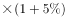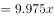元，B股票的市值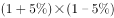元，则两只股票的市值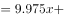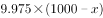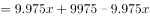元。

故正确答案为B。

---

## 第 11 题　qid 1788620 · 数学运算

小明、小红、小桃三人定期到某棋馆学围棋，小明每隔3天去一次，小红每隔4天去一次，小桃每隔5天去一次，若2016年2月10日三人恰好在棋馆相遇，则下次三人在棋馆相遇的日期是：

- **A**. 2016年4月8日
- **B**. 2016年4月11日
- **C**. 2016年4月9日
- **D**. 2016年4月10日　✅

**答案**：D

**官方解析**

小明每隔3天去一次，小红每隔4天去一次，小桃每隔5天去一次，则分别相当于每4、5、6天去一次，则三个人再过4、5、6的最小公倍数60天再次在棋馆相遇。2016年为闰年，二月份有29天，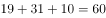，则他们4月10日再次在棋馆相遇。

故正确答案为D。

---

## 第 12 题　qid 1788622 · 数学运算

下图是由三个边长分别为4、6、x的正方形所组成的图形，直线AB将它分成面积相等的两部分，则x的值是：

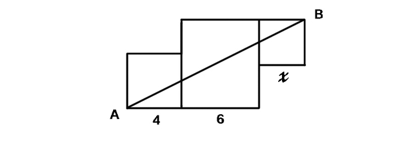

- **A**. 3或5
- **B**. 2或4　✅
- **C**. 1或3
- **D**. 1或6

**答案**：B

**官方解析**

如图所示，将原图补成一个长方形，则，，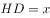，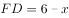。根据题意，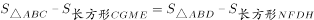，又，则两个补充的长方形面积相等，则有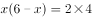，整理得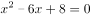，解得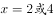。

秒杀技巧：因直线AB将图形分成了面积相等的两个部分，故可将图形视为中心对称图形，此时两边两个小正方形一定全等，则，只有B项满足。

故正确答案为B。

---

## 第 13 题　qid 1788624 · 数学运算

一辆公交车从甲地开往乙地需经过三个红绿灯路口，在这三个路口遇到红灯的概率分别是0.4，0.5，0.6，则该车从甲地开往乙地遇到红灯的概率是：

- **A**. 0.12
- **B**. 0.50
- **C**. 0.88　✅
- **D**. 0.89

**答案**：C

**官方解析**

从甲地开往乙地遇到红灯的概率，即遇到至少一个红灯的概率。正面情况数较多，优先反面思考。遇到至少一个红灯的概率。不遇到红灯的概率，则公交车从甲地开往乙地遇到红灯的概率。

故正确答案为C。

---

## 第 14 题　qid 1788626 · 数学运算

从1开始的自然数在正方形网格内按如图所示规律排列，第1个转弯数是2，第2个转弯数是3，第3个转弯数是5，第4个转弯数是7，第5个转弯数是10，···，则第22个转弯数是：

- **A**. 123
- **B**. 131
- **C**. 132
- **D**. 133　✅

**答案**：D

**官方解析**

根据题干规律，转弯的个数依次对应的转弯数分别为：

分析表格中的“转弯数”可以发现，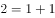，，，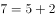，，即第n个转弯数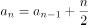（进位取整），则第22个转弯数。

再次分析，奇数项的转弯数又有规律：，，，······。为第11个奇数，则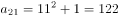。

故第22个转弯数。

故正确答案为D。

---
