# 2016年江苏省公务员录用考试《行测》题（B类）

> 数量关系 · 13 题 · 江苏 2016

## 第 1 题　qid 1791584 · 数学运算

，，，，，（   ）。

- **A**. 

- **B**. 

- **C**. 

　✅
- **D**. 
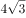

**答案**：C

**官方解析**

数列带有根号，将数字都还原到根号下面，得到根号下的数列为2，4，9，17，28，（    ），无明显规律，两两作差，得到的新数列为2，5，8，11，（    ），构成公差为3的等差数列，则该等差数列第五项为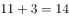，故原数列第六项根号下的数字为。

故正确答案为C。

---

## 第 2 题　qid 1788604 · 数学运算

4.2，5.2，8.4，17.8，44.22，(   )

- **A**. 125.62　✅
- **B**. 85.26
- **C**. 99.44
- **D**. 125.64

**答案**：A

**官方解析**

题干为小数数列，作差无规律，考虑机械划分。整数部分为：4，5，8，17，44，相邻两项作差得到新数列为1，3，9，27，是公比为3的等比数列，则新数列下一项为81，原数列整数部分为，排除B、C两项。小数部分为2，2，4，8，22，相邻两项作差得到新数列①为0，2，4，14，再次作差无规律，考虑对新数列①相邻两项作和，得到新数列②为2，6，18，是公比为3的等比数列，所以新数列②的下一项为54，新数列①的下一项为，因此小数部分的下一项为，排除D项。

故正确答案为A。

备注：本题也可以小数部分结合整数部分找规律，奇数项中，整数部分为小数部分的2倍，偶数项中整数部分为小数部分的2倍多1，故第六项应满足整数部分为小数部分的2倍多1，只有A项满足。

---

## 第 3 题　qid 1791590 · 数学运算

，，，，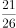，（  ）。

- **A**. 

- **B**. 

- **C**. 

- **D**. 
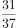
　✅

**答案**：D

**官方解析**

分子数列：1、3、7、13、21、（ ），两两作差得到2、4、6、8、（ ），构成公差为2的等差数列，故第五项为，则原数列第六项的分子为； 

分母数列：2、5、10、17、26、（ ），两两作差得到3、5、7、9、（ ），构成公差为2的等差数列，故第五项为，则原数列第六项的分母为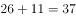；因此原数列第六项为。

故正确答案为D。

---

## 第 4 题　qid 1791592 · 数学运算

有两瓶质量均为100克且浓度相同的盐溶液，在一瓶中加入20克水，在另一瓶中加入50克浓度为的盐溶液后，他们的浓度仍然相等，则这两瓶盐溶液原来的浓度是？

- **A**. 

- **B**. 

- **C**. 

- **D**. 

　✅

**答案**：D

**官方解析**

设两瓶盐溶液原来的浓度为，，根据题意可得，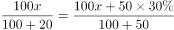，解得。

故正确答案为D。

---

## 第 5 题　qid 1791594 · 数学运算

若买6个订书机、4个计算器和6个文件夹共需504元，买3个订书机、1个计算器和3个文件夹共需207元，则购买订书机、计算器和文件夹各5个所需的费用是？

- **A**. 465元
- **B**. 475元
- **C**. 485元
- **D**. 495元　✅

**答案**：D

**官方解析**

设订书机、计算器、文件夹的单价分别为元、元、元，根据题意可列方程组：

 

得：，则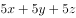。

故正确答案为D。

---

## 第 6 题　qid 1788612 · 数学运算

甲、乙、丙三人共同完成一项工程，他们的工作效率之比是5：4：6。先由甲、乙两人合作6天，再由乙单独做9天，完成全部工程的，若剩下的工程由丙单独完成，则丙所需要的天数是：

- **A**. 9
- **B**. 11
- **C**. 10　✅
- **D**. 15

**答案**：C

**官方解析**

根据题目中的效率比，设甲、乙、丙的效率分别为5，4，6，由题干可得工程总量，剩余工作量，故丙所需时间天。 

故正确答案为C。 

---

## 第 7 题　qid 1788618 · 数学运算

小王以每股10元的相同价格买入A和B两只股票共1000股，此后A股先跌再涨，B股先涨再跌，若此期间小王没有再买卖过这两只股票，则现在这1000股股票的市值是：

- **A**. 10250元
- **B**. 9975元　✅
- **C**. 10000元
- **D**. 9750元

**答案**：B

**官方解析**

设买入的A股票为股，则买入的B股票为股。A股票的市值元，B股票的市值元，则两只股票的市值元。

故正确答案为B。

---

## 第 8 题　qid 1791600 · 数学运算

A、B、C三个厂家生产同一种乒乓球，不合格率分别为、和。现将三个厂家的产品按的比例均匀混合后装入集装箱，从该箱中随机抽出1只乒乓球进行检测，若检测结果为不合格，则该只乒乓球是B厂生产的概率是：

- **A**. 0.3
- **B**. 0.375　✅
- **C**. 0.4
- **D**. 0.425

**答案**：B

**官方解析**

A、B、C三个厂家的产品按的比例均匀混合，设A、B、C三个厂家乒乓球数分别为600、300、100，因三者不合格率分别为、和，则不合格乒乓球总数为，B厂不合格乒乓球数为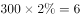，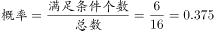。

故正确答案为B。

---

## 第 9 题　qid 1791602 · 数学运算

某学校举办知识竞赛，共设50道选择题，评分标准是：答对1题得3分，答错1题扣1分，不答的题得0分。若王同学最终得95分，则他答错的选择题最多有：

- **A**. 12道
- **B**. 13道　✅
- **C**. 14道
- **D**. 15道

**答案**：B

**官方解析**

根据题意，50道选择题，若全部答对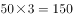分，每答错1题少分，每不答1题少3分，最终得95分，则少了分，要使答错题目最多，则55分应尽可能多分配给答错的题目，，余3分即恰好有1题不答，故最多答错13题。

故正确答案为B。

---

## 第 10 题　qid 1791604 · 数学运算

甲、乙、丙三人定期到某棋馆学围棋，甲每隔3天去一次，乙每隔4天去一次，丙每隔5天去一次。若2016年2月10日三人在棋馆相遇，则下次三人在棋馆相遇的日期是：

- **A**. 2016年4月8日
- **B**. 2016年4月11日
- **C**. 2016年4月9日
- **D**. 2016年4月10日　✅

**答案**：D

**官方解析**

甲、乙、丙分别每隔3、4、5天去一次，即三人的周期分别为4、5、6天，则2016年2月10日相遇后，经历三人周期的最小公倍数即60天，三人再次相遇。2016年为闰年，2月为29天，3月为31天，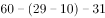，则下次三人相遇日期为2016年4月10日。

故正确答案为D。

---

## 第 11 题　qid 1791606 · 数学运算

将所有由1、2、3、4组成且没有重复数字的四位数，按从小到大的顺序排列，则排在第12位的四位数是：

- **A**. 3124
- **B**. 2341
- **C**. 2431　✅
- **D**. 3142

**答案**：C

**官方解析**

由1、2、3、4组成且没有重复数字的四位数中，千位数为1的四位数有个，千位数为2的四位数有个，则按从小到大的顺序排列，排在第12位的四位数是千位数为2的四位数中最大的数字，即2431。

故正确答案为C。

---

## 第 12 题　qid 1791608 · 数学运算

某单位举办设有A、B、C三个项目的趣味运动会，每位员工三个项目都可以报名参加。经统计，共有72名员工报名，其中参加A、B、C三个项目的人数分别为26、32、38，三个项目都参加的有4人，则仅参加一个项目的员工人数是：

- **A**. 48
- **B**. 40
- **C**. 52　✅
- **D**. 44

**答案**：C

**官方解析**

设仅参加一个项目、参加两个项目的人数分别为、，根据容斥原理三集合非标准公式，可列方程组：

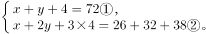

解方程组得：，。

故正确答案为C。

---

## 第 13 题　qid 1791610 · 数学运算

如图，边长为1米的正方形棋盘上有100个大小一样的小方格，点<i>O</i>为棋盘的中心，将一个直径是0.8米的圆形纸片放在该棋盘上，使其中心也位于<i>O</i>点，则该圆形纸片可以完全覆盖的小方格个数是：

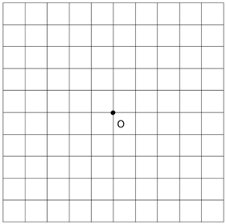

- **A**. 32　✅
- **B**. 50
- **C**. 48
- **D**. 36

**答案**：A

**官方解析**

沿半径画出圆形，如图所示，阴影部分为完全覆盖。每个圆能完全覆盖的小方格为8个，整个圆能完全覆盖的小方格为个。 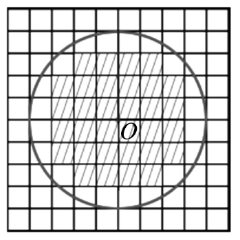

故正确答案为A。

---
