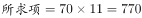
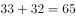
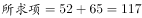
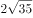
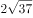
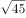
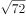
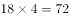
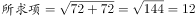

# 2016年江苏省公务员录用考试《行测》题（C类）

> 数量关系 · 8 题 · 江苏 2016

## 第 1 题　qid 1791776 · 数学运算

，，2，10，70，（  ）。

- **A**. 770　✅
- **B**. 723
- **C**. 760
- **D**. 1400

**答案**：A

**官方解析**

数列各项存在明显的倍数关系，优先考虑作商。作商后得到新数列：2、3、5、7、（），为连续质数列，下一项应为11。故。

故正确答案为A。

---

## 第 2 题　qid 1791778 · 数学运算

-12，-7，2，19，52，（  ）。

- **A**. 62
- **B**. 77
- **C**. 97
- **D**. 117　✅

**答案**：D

**官方解析**

数列无明显特征，优先考虑作差。作差后得到新数列：5、9、17、33、（）；再次作差后得：4、8、16、（），为公比是2的等比数列，故下一项为。反推上一级数列括号内应为，。  故正确答案为D。

---

## 第 3 题　qid 1791780 · 数学运算

， 3， 4， 3， 6，（  ）。

- **A**. 
12
　✅
- **B**. 

- **C**. 

- **D**. 
144

**答案**：A

**官方解析**

将各项根号外数字均转化到根号内，可得：、、、、、（）。根号内数字相邻后一项与前一项作差后得：3、3、6、18、（），相邻后一项与前一项两两作商分别为：1、2、3、（4），故上一级下一项应为，。

故正确答案为A。 

---

## 第 4 题　qid 1788608 · 数学运算

已知A、B两地相距600千米，甲乙两车同时从A、B两地相向而行，3小时相遇。若甲的速度是乙的1.5倍，则甲的速度是：

- **A**. 60千米/小时
- **B**. 80千米/小时
- **C**. 90千米/小时
- **D**. 120千米/小时　✅

**答案**：D

**官方解析**

方法一：设乙的速度为千米/小时，甲的速度为千米/小时，由题目可列方程：，解得，则甲速度为千米/小时。

方法二：因甲、乙时间相同，且甲速度是乙的1.5倍，则甲的路程∶乙的路程，共5份。已知总路程为600千米，所以一份为120千米，甲的路程为360千米，所以甲的速度为千米/小时。

故正确答案为D。

---

## 第 5 题　qid 1791784 · 数学运算

某班有40名学生，一次数学测验共有两道题，答对第一题的有27人，答对第二题的有23人，两题都答对的有15人，则两题都答错的人数是（  ）。

- **A**. 3
- **B**. 5　✅
- **C**. 6
- **D**. 7

**答案**：B

**官方解析**

根据两集合容斥原理问题公式：，得：，解得两题都错的人数为5。

故正确答案为B。 

---

## 第 6 题　qid 2032184 · 数学运算

某项工程由工作效率相同的甲、乙两工程队承担。若甲、乙两队合做，工期可提前5天；若两队先合做6天，余下的由甲队独做，恰好也能按工期完成，则该工程的工期是：

- **A**. 14天
- **B**. 15天
- **C**. 16天　✅
- **D**. 18天

**答案**：C

**官方解析**

赋值两个工程队的效率均为1，设该工程的工期为天，根据题意可得：，解得。

故正确答案为C。 

---

## 第 7 题　qid 1788618 · 数学运算

小王以每股10元的相同价格买入A和B两只股票共1000股，此后A股先跌再涨，B股先涨再跌，若此期间小王没有再买卖过这两只股票，则现在这1000股股票的市值是：

- **A**. 10250元
- **B**. 9975元　✅
- **C**. 10000元
- **D**. 9750元

**答案**：B

**官方解析**

设买入的A股票为股，则买入的B股票为股。A股票的市值元，B股票的市值元，则两只股票的市值元。

故正确答案为B。

---

## 第 8 题　qid 1788622 · 数学运算

下图是由三个边长分别为4、6、x的正方形所组成的图形，直线AB将它分成面积相等的两部分，则x的值是：

- **A**. 3或5
- **B**. 2或4　✅
- **C**. 1或3
- **D**. 1或6

**答案**：B

**官方解析**

如图所示，将原图补成一个长方形，则，，，。根据题意，，又，则两个补充的长方形面积相等，则有，整理得，解得。

秒杀技巧：因直线AB将图形分成了面积相等的两个部分，故可将图形视为中心对称图形，此时两边两个小正方形一定全等，则，只有B项满足。

故正确答案为B。

---
