# 2016年江西省法检系统招录考试《行测》题

> 数量关系 · 10 题 · 江西 2016

## 第 1 题　qid 2255699 · 数学运算

某商场搞抽奖活动，只要购物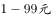就可抽取一个乒乓球，购物就可抽取两个乒乓球，以此类推。若能抽到4对相同颜色的乒乓球就有奖品。有同样大小的涂成7种颜色的乒乓球各20只混装在一个纸箱内，试问至少购物多少元，才能保证有奖品？

- **A**. 800
- **B**. 1300　✅
- **C**. 1400
- **D**. 1500

**答案**：B

**官方解析**

根据最不利原则，为了保证有奖品，则需要在7种颜色乒乓球中抽到3对相同颜色且每个颜色乒乓球各还有1个的基础上再任意抽一个，即总共需要有乒乓球，已知购物就可抽取一个乒乓球，购物就可抽取两个乒乓球，以此类推，则要抽14个乒乓球需要购物满才能保证有奖品。

故正确答案为B。

---

## 第 2 题　qid 2255705 · 数学运算

甲、乙两厂共同生产一批零件，甲、乙生产的次品率分别为，。若从这批产品中任取一件，取得真品的概率是0.94，那么甲、乙生产这批零件的数量比为多少？

- **A**. 
5：3

- **B**. 
4：3

- **C**. 
5：2

- **D**. 
3：2
　✅

**答案**：D

**官方解析**

设甲生产这批零件件，乙生产件，则甲厂的次品件数为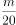件，乙厂的次品件数为，根据“从这批产品中任取一件真品的概率是0.94”可得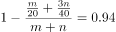，解得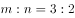。

故正确答案为D。

---

## 第 3 题　qid 2255707 · 数学运算

某单位派出80名职工参加三个项目的比赛：篮球、乒乓球、排球。其中有8个人只能参加乒乓球比赛，有52人能参加篮球比赛，62人能参加排球比赛。那么既能参加篮球比赛又能参加排球比赛的有多少人？

- **A**. 42　✅
- **B**. 28
- **C**. 78
- **D**. 34

**答案**：A

**官方解析**

如图所示，设既能参加篮球比赛又能参加排球比赛的有人，根据容斥原理可得，能参加篮球比赛的52人中有人不能参加排球，能参加排球的62人中有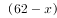人不能参加篮球，可得方程：，解得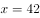人，则既能参加篮球比赛又能参加排球比赛的有42人。

故正确答案为A。

---

## 第 4 题　qid 2255708 · 数学运算

一个正方体块放在桌子上，每一面都有一个数字，贴着桌子这面的数字为素数，位于对面的两个数不相同且和等于10。甲看到顶面和一个侧面的两个数的和为7，乙看到顶面和侧面的两个数的和为5，那么贴着桌子的这一面的数是多少？

- **A**. 7　✅
- **B**. 9
- **C**. 5
- **D**. 2

**答案**：A

**官方解析**

设贴着桌子的这面数字为，则顶面数字为。因为甲看到顶面和一个侧面的两个数和为7，所以甲看到的一个侧面数字为；由此类推乙看到的一个侧面数字为，则为大于3和5的素数，排除B、C和D三项，那么贴着桌子的这一面数字为7。

故正确答案为A。

---

## 第 5 题　qid 2255711 · 数学运算

某出版社把400本教材书分别装入大、中、小三种型号的纸箱中寄出。每个大型箱能装80本，每个中型箱能装60本，每个小型箱能装35本。如果三种型号的箱子都有且每个箱子恰好装满，那么小型箱有多少个？

- **A**. 1
- **B**. 3
- **C**. 4　✅
- **D**. 6

**答案**：C

**官方解析**

设大型箱有个，中型箱有个，小型箱有个，根据题意可得：，且、、都为正整数。将方程化简后得到，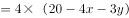，因为箱子个数一定为正整数，即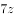一定能被4整除，因此一定是4的整数倍，结合选项只有C项满足。

故正确答案为C。

---

## 第 6 题　qid 2255714 · 数学运算

某班78位同学对参加演讲比赛的甲、乙、丙、丁四位同学进行投票，得票最多者胜出。在计票过程的某时刻，甲得20票，乙得12票，丙得26票，丁得9票，那么丙最少还要得票多少张才能确保胜出？

- **A**. 3　✅
- **B**. 5
- **C**. 6
- **D**. 7

**答案**：A

**官方解析**

方法一：整体考虑，甲对丙威胁最大，除了乙和丁的得票外，甲和丙共可以分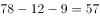张票，甲丙均得到28张时，丙仍然保证不了能胜出，再得到剩下的1张选票即丙得到29张选票时，确保胜出，所以还需要张才能确保胜出。

方法二：在计票过程的某时刻，还剩下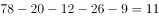张票。丙如果要确保胜出，则考虑最差情况，剩下的11张票乙和丁一张都不得，甲优先得6张共26票与丙持平，剩下的5张票再由甲和丙分配，故丙至少要得3张票才能确保胜出。

故正确答案为A。

---

## 第 7 题　qid 2255716 · 数学运算

某处下面有四个科室，他们的职员数恰好是一个比一个多1，而四个科室的人数的乘积是840，那么职员最多的两个科室总共是多少人？

- **A**. 12
- **B**. 13　✅
- **C**. 15
- **D**. 19

**答案**：B

**官方解析**

将840分解因式可得，因为是四个连续的自然数的乘积，故，则职员最多的两个科室总共是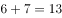人。

故正确答案为B。

---

## 第 8 题　qid 2255718 · 数学运算

在某招聘工作现场，某单位的A、B两岗位共有34个男生、21个女生递交个人材料。若欲竞聘A岗位的男生数与女生数的比为，欲竞聘B岗位的男生数与女生数的比为，那么欲竞聘B岗位的男生是多少个？

- **A**. 4　✅
- **B**. 3
- **C**. 30
- **D**. 31

**答案**：A

**官方解析**

方法一：假设欲竞聘A岗位的男生数与女生数分别为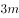、，欲竞聘B岗位的男生数与女生数分别为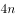、，则根据等量关系可得：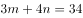，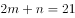，解得，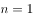，则欲竞聘B岗位的男生个。

方法二：题干已知：欲竞聘B岗位的男生数与女生数的比为，根据倍数特性可知竞聘B岗位的男生人数为4的整数倍，结合选项只有A项满足条件。

故正确答案为A。

---

## 第 9 题　qid 2255719 · 数学运算

某市体育中考满分40分。某班得分后五名同学的平均分是30分，排名倒数第五名的同学得了35分。假如这五位同学的得分是互不相同的整数，那么排名倒数第三名的同学最少得多少分？

- **A**. 27
- **B**. 28　✅
- **C**. 29
- **D**. 30

**答案**：B

**官方解析**

得分后五名同学的总分为分，要使排名倒数第三名的同学得分最少，则其他人得分要尽可能的多且互不相同，排名倒数第五为35分，则倒数第四最多34，设倒数第三得分为，则倒数第二为，倒数第一为。可得：，解得：。

故正确答案为B。

---

## 第 10 题　qid 2255720 · 数学运算

某干洗店承接了一些业务，干洗200块窗帘。干洗好一块可得干洗费30元，但若损坏一块不仅得不到干洗费还要赔偿150元。若清洗完毕共得5280元，则损坏窗帘多少块？

- **A**. 4　✅
- **B**. 6
- **C**. 10
- **D**. 12

**答案**：A

**官方解析**

设干洗好窗帘块，损坏窗帘块，则有，解得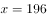块，则损坏窗帘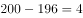块。

故正确答案为A。

---
