# 2016年河南省公务员录用考试《行测》题

> 数量关系 · 15 题 · 河南 2016

## 第 1 题　qid 2033292 · 数学运算

泳池进出水用的机器，往泳池里注水时，每工作30分钟，停3分钟，把泳池里的水抽空时，每工作30分钟，停5分钟，抽水的速度是注水速度的2倍。如果把泳池水抽完用了2小时50分钟，那么把泳池里注满水用的时间是多少？

- **A**. 4小时17分钟
- **B**. 5小时27分钟　✅
- **C**. 5小时36分钟
- **D**. 5小时41分钟

**答案**：B

**官方解析**

设注水的速度每分钟为1，则抽水的速度每分钟为2。

机器抽完泳池的水用分钟，完整的抽水工作周期有分钟，实际工作时间为分钟，则泳池的蓄水量为。

当变成注水时，注满泳池需要工作分钟，需要个注水工作周期，理论上需要时间分钟。但最后一个工作周期，停工时间3分钟不需计算，因此实际注满水用时。

故正确答案为B。 

---

## 第 2 题　qid 2033296 · 数学运算

给贫困学校送一批图书，如果每个学校送80本书，则多出了340本，如果每个学校送90本书，则少60本。问这批书一共有多少本？

- **A**. 3680
- **B**. 3760
- **C**. 3460
- **D**. 3540　✅

**答案**：D

**官方解析**

设共有个贫困学校，根据题意有，解得。所以这批图书共有本。

故正确答案为D。

---

## 第 3 题　qid 2033298 · 数学运算

某家企业行政部和市场部共有80人，后来进行人员调整，将行政部增加了6人，市场部减少了18人，这时两个部门的人数刚好相等。问行政部原来有多少人？

- **A**. 16
- **B**. 18
- **C**. 24
- **D**. 28　✅

**答案**：D

**官方解析**

设行政部原来有人，则市场部原来有人。人员调整后人数相等，则有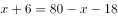，解得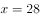。

故正确答案为D。

---

## 第 4 题　qid 2033300 · 数学运算

甲鱼塘养了3000条鱼，将其中的投入乙鱼塘中，同时，将乙鱼塘中的鱼放到甲鱼塘中，这时两个鱼塘中鱼的数量相同，那么乙鱼塘中原来有多少条鱼？

- **A**. 1800
- **B**. 2400　✅
- **C**. 3200
- **D**. 3800

**答案**：B

**官方解析**

设乙鱼塘中原来有条鱼。当甲乙鱼塘互相投放鱼后，两个鱼塘的鱼数量相同，因此有，解得。

故正确答案为B。

---

## 第 5 题　qid 2033302 · 数学运算

某商品的单位利润和进货量的大小相关，进货总额低于5万元时利润率为，低于或等于10万元时，高于5万元的部分利润率在，高于10万元时，高于10万元的部分利润率在，问当进货量在20万元时，一共有多少万元的利润？

- **A**. 1.75
- **B**. 2.25　✅
- **C**. 3.15
- **D**. 4.05

**答案**：B

**官方解析**

由题意可得，。进货总额为20万元时，进货量低于5万元部分的利润为万元，进货量在5万到10万部分的利润为万元，进货量大于10万元部分的利润为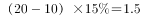万元，则总利润为万元。

故正确答案为B。

---

## 第 6 题　qid 2033290 · 数学运算

某公司组织歌舞比赛，共68人参赛。其中，参加舞蹈比赛的有12人，参加歌唱比赛的有18人，45个人什么比赛都没有参加。问其中参加歌唱比赛但不参加舞蹈比赛的有多少人？

- **A**. 9
- **B**. 11　✅
- **C**. 15
- **D**. 17

**答案**：B

**官方解析**

由容斥原理公式可得，参加舞蹈比赛的人数+参加歌唱比赛的人数-两者都参加的人数=总人数-两者都不参加的人数，代入数字：12+18-两者都参加的人数=68-45，解得两者都参加的人数=7，则参加歌唱比赛但不参加舞蹈比赛的人数=18-7=11。
故正确答案为B。

---

## 第 7 题　qid 2033294 · 数学运算

出租车以固定速度从乙地出发到甲地再回到乙地，往返需要1小时40分。这一天，小明早上8点从甲地出发步行去乙地，出租车在上午9点从乙地出发，小明中途遇到这辆出租车便坐车去乙地，并于早上10点20到达。问出租车的速度是小明步行速度的多少倍？

- **A**. 4
- **B**. 6
- **C**. 8
- **D**. 10　✅

**答案**：D

**官方解析**

方法一：假设出租车速度每分钟为1，出租车往返甲、乙两地需要1小时40分钟（100分钟），则甲乙两地距离为。

出租车9点从乙地出发，10点20分又回到乙地，则出租车实际行驶距离为，故出租车接到小明的地点距离乙地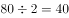，此时离出发，说明出租车接到小明的时间为9点40分。

小明从8点到9点40分走的路程为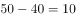，走的时间是100分钟，所以小明速度为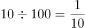，出租车的速度为小明速度的倍。

方法二：车走完全程需要1小时40分钟（100分钟），则从乙到甲需要50分钟。从乙地到相遇地点折回共用了1小时20分钟（80分钟），则从乙地到相遇点需要40分钟，即9点40到达相遇点，因此对应的从相遇点到甲地需要分钟。而小明8点从甲出发，9点40到达相遇点共100分钟，因此小明与车相同距离所用的时间比为，则速度比为，即10倍。

故正确答案为D。

---

## 第 8 题　qid 2033306 · 数学运算

在的队列中，先随机给一个队员戴上红绶带，再给另一个队员戴上蓝绶带，要求戴两种颜色绶带的这两位队员不在同一行也不在同一列。问有多少种戴法？

- **A**. 1048
- **B**. 1374
- **C**. 1764　✅
- **D**. 1858

**答案**：C

**官方解析**

先在队列中随机抽取一位同学给他佩戴红绶带，共有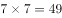种选法。去掉该同学同行同列的同学后，还剩下人，在剩下的人中再随机抽取一人佩戴蓝绶带，共有36种选法。两次选择为分步运算，用乘法，共有种戴法。

故正确答案为C。

---

## 第 9 题　qid 2033314 · 数学运算

某农场原有300人，存储的粮食够吃80天。现调入若干人员，储存的粮食实际上只吃了60天，问实际上调入了多少人？

- **A**. 100　✅
- **B**. 200
- **C**. 300
- **D**. 400

**答案**：A

**官方解析**

方法一：假设农场每人每天消耗粮食量为1，则粮食总量为。而调入若干人员后实际只吃了60天，实际每天消耗，人数为，故调入的人数为。

方法二：粮食总量一定，效率和时间成反比。调入前后，天数之比为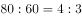，则调入前后人数之比为。调入前人数为300，则按的比例可知调入后为400人，故调入的人数为。

故正确答案为A。

---

## 第 10 题　qid 2033318 · 数学运算

甲、乙、丙三个植树队同时各种400棵树，当甲队把400棵树全部种完时，乙队还有150棵树没种，丙队才种了220棵树。当乙队全部种完时，丙队还有多少棵树没种？

- **A**. 48　✅
- **B**. 52
- **C**. 66
- **D**. 74

**答案**：A

**官方解析**

由题意已知相同时间内，乙、丙两个工程队，完成的工程量之比为，则效率之比为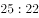。相同时间内，当乙队完成剩余150棵时，丙队完成了棵，则丙队还剩下棵未完成。

故正确答案为A。

---

## 第 11 题　qid 2033326 · 数学运算

某单位举行大型比赛，其中，舞台布置占总费用的，舞台布置所花费用比原来计划的少用，节约了3000元，问总预算是多少元？

- **A**. 25000
- **B**. 30000
- **C**. 40000　✅
- **D**. 45000

**答案**：C

**官方解析**

设总预算（即总费用）为元，则原计划舞台布置费用为元，实际舞台布置费用为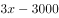元。根据实际舞台布置费用比原计划少可以列出方程：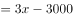，解得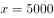，则总预算为。

故正确答案为C。

注：本题表述不严谨，按题目表述更容易理解为“某单位举行大型比赛，其中，（实际）舞台布置占总费用的，（实际）舞台布置所花费用比原来计划的少用，节约了3000元，问总预算是多少元”。此时设总预算为，则实际舞台布置费用为、原计划为，可列出方程：，解得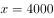元，则总预算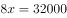元，选项中没有该数据。

因此本题只能理解为“某单位举行大型比赛，其中，（原计划）舞台布置占总费用的，（实际）舞台布置所花费用比原来计划的少用，节约了3000元，问总预算是多少元”。

---

## 第 12 题　qid 2033346 · 数学运算

贾某在停车场停车，每个月前几个小时内收费的基础价格为5元/小时，之后按照基础价格的收费，某月贾某的停车时间为120小时，共交了545元，则按照基础价格停车的时间为多少小时？

- **A**. 8
- **B**. 10　✅
- **C**. 15
- **D**. 20

**答案**：B

**官方解析**

设按照基础价格5元收费的时间为小时，则按照基础价格5元的收费的时间为小时，根据题意可列方程：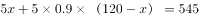，解得。

故正确答案为B。

---

## 第 13 题　qid 2033304 · 数学运算

甲租用乙的地种粮食，今年共收获3000斤粮食，包括大米，玉米和红薯。其中玉米800斤，红薯600斤，如果除租金之外，甲每年须将收获的大米的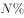给乙作为回报，同时将红薯超过粮食总重的的部分也按照给乙作为回报，甲今年一共给乙210斤粮食，那么为多少？

- **A**. 

- **B**. 

　✅
- **C**. 

- **D**. 

**答案**：B

**官方解析**

由题意可得：大米重量斤，需要给乙斤；红薯重量600斤，其中超过斤的部分，即斤，需要给乙斤。

共计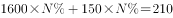斤，解得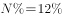。

故正确答案为B。

---

## 第 14 题　qid 2033310 · 数学运算

三个学校的志愿队分别去敬老院照顾老人，A学校志愿队每隔7天去一次，B学校志愿队每隔9天去一次，C学校志愿队每隔14天去一次，三个队伍周三第一次同时去敬老院，问下次同时去敬老院是周几？

- **A**. 周三
- **B**. 周四　✅
- **C**. 周五
- **D**. 周六

**答案**：B

**官方解析**

由题意可得：A、B、C三个学校去敬老院的周期分别为8、10、15天，故下一次同时去敬老院的时间为120天（8、10、15的最小公倍数）后。因为个星期余1天，所以周三之后再过120天为周四。

注意：为周期。

故正确答案为B。

---

## 第 15 题　qid 2033312 · 数学运算

某人走失了一只小狗，于是开车沿路寻找，突然发现小狗沿路边往反方向走，车继续行驶30秒后，他下车去追小狗，如果他的速度比小狗快3倍比车慢，问追上小狗需要多长时间？

- **A**. 165秒
- **B**. 170秒　✅
- **C**. 180秒
- **D**. 195秒

**答案**：B

**官方解析**

由“某人的速度比车速慢”可得某人的速度是车的，“某人的速度比小狗快3倍”可得人的速度是小狗的4倍，则速度比为，故可赋值三者速度分别为、、。由于发现小狗后，车继续前进30秒，即米，小狗反方向前行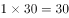米后，某人才调头追小狗，故追及距离为米，追及速度为，则追及时间为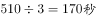。

故正确答案为B。

---
