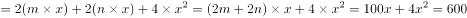
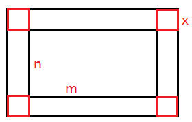
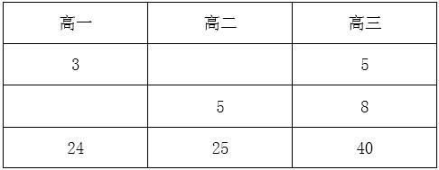
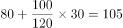
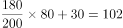
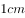

# 2016年深圳市公务员录用考试《行测》题

> 数量关系 · 10 题 · 深圳市考 2016

## 第 1 题　qid 1772332 · 数学运算

有一周长为100米的长方形花园，在花园外围沿花园建一条等宽的环路，路的面积为600平方米，则路的宽度为（  ）米。

- **A**. 3或4
- **B**. 5　✅
- **C**. 8
- **D**. 10或15

**答案**：B

**官方解析**

如图所示，设花园的长为，宽为，路的宽度为。所建环路的面积，解得。

故正确答案为B。 

---

## 第 2 题　qid 1772334 · 数学运算

甲、乙二人同时上山砍柴，甲花6小时砍了一担柴，乙砍了一段时间后觉得刀比较钝，于是下山磨了一次刀，磨刀加上山下山共花了一个小时，磨完后效率提升了，总共也花费了6个小时砍了同样一担柴，如果甲、乙二人磨刀之前的效率是相同的，则乙磨刀之前已经砍了（  ）个小时柴。

- **A**. 1
- **B**. 2
- **C**. 3　✅
- **D**. 4

**答案**：C

**官方解析**

赋值甲的效率为1，则乙磨刀前的效率为1，磨刀后的效率为1.5。设乙磨刀之前已经砍了小时柴，则根据题意可得：，解得。

故正确答案为C。

---

## 第 3 题　qid 1772342 · 数学运算

某中学高一至高三年级的学生参加某项社区服务，如果高三年级与高一年级，高三年级与高二年级参加此项活动的人数之比分别为5：3、8：5。则该中学高一至高三年级最少共有（  ）人参加该项社区服务。

- **A**. 40
- **B**. 55
- **C**. 79
- **D**. 89　✅

**答案**：D

**官方解析**

根据题干可得，三个年级的人数比应如表格所示：

故三个年级的总人数应至少为24+25+40=89人。

故正确答案为D。

备注：比例中，同时扩大或缩小相同的倍数，比例不变。

---

## 第 4 题　qid 1772344 · 数学运算

假设一片牧场的青草都是“匀速”自然生长的，该牧场3月初放养有1000只羊，30天后青草的总量变为3月初的90%，此时牧场又一次性增加了300只羊。12天后青草的总量变为3月初的80%，如果要让青草在接下来4个月内（每月按30天计算）回到3月初的总量，则这4个月间该牧场至多放（  ）只羊。

- **A**. 800
- **B**. 750
- **C**. 700　✅
- **D**. 600

**答案**：C

**官方解析**

设牧场原有草量为y，草生长的速度为x，根据牛吃草公式可得：10%y=（1000-x）×30；10%y=（1300-x）×12，解得x=800，y=60000。若在接下来4个月草量恢复到原始值，则在4月内草的生长速度应大于羊吃草的速度，再次代入牛吃草公式可得：20%×60000=（800-n）×（4×30），解得n=700。
故正确答案为C。

---

## 第 5 题　qid 1772348 · 数学运算

某停车场每天8:00—24:00开放，在9:00—12:00和18:00—20:00时，每分钟有2辆车进入，其余时间每分钟1辆车进入；10:00—16:00每分钟有一辆车离开，16:00—22:00每两分钟有3辆车离开，22:00—24:00每分钟有3辆车离开，其余时间没有车离开，则该停车场需要至少（  ）个停车位。

- **A**. 240
- **B**. 300　✅
- **C**. 360
- **D**. 420

**答案**：B

**官方解析**

停车场至少需要停车位的数量，只需满足停车场一天当中停车数量最多时刻的停车数值即可。由下表中可以观察得出，从20点之后停车量减少值大于增加值，所停车量慢慢减少，则20点时为停车量最大峰值，所停车辆=60+3×60×2+6×60+2×60×2-6×60-4×60×1.5=300。

故正确答案为B。

---

## 第 6 题　qid 1772352 · 数学运算

某商场举行促销活动，规定：一次购物不超过100元的，不给优惠；超过100元而不超过300元的，一律9折优惠；超过300元的，其中300元以内部分仍按9折优惠，超过部分按8折优惠。小王两次购物分别用90.9元和295.6元，现小李决定一次性购买小王两次购买的同样的物品，那么小李应付款（  ）。

- **A**. 368.32元
- **B**. 352.4元
- **C**. 352.4元或368.32元
- **D**. 368.32元或376.4元　✅

**答案**：D

**官方解析**

小王的两次购物分别花费90.9元与295.6元，其中90.9元部分有两种情况。
第一种：所购买的物品实际价格就是90.9元。此时若小李合买，第一次90.9元的物品应打8折，第一次所花费应=90.9×0.8=72.72元。第二次所花费情况保持不变，如此应付款72.72+295.6=368.32元。
第二种：所购买的物品实际价格超过100元，打完9折后为90.9元，则第一次购买的实际价格=90.9÷0.9=101元。此时若小李合买，第一次101元的物品应打8折，则第一次所花费=101×0.8=80.8元。第二次所花费情况保持不变，如此应付款80.8+295.6=376.4元。
故正确答案为D。

---

## 第 7 题　qid 1772192 · 数学运算

甲、乙两辆车分别从P、Q两地同时出发，相向而行。相遇时，甲车比乙车多行驶36千米，乙车所行驶的路程为甲车所行路程的4/7，则P、Q两地相距（  ）千米。

- **A**. 72
- **B**. 96
- **C**. 112
- **D**. 132　✅

**答案**：D

**官方解析**

由题意可知，在相遇时甲、乙所走的路程比=7：4，甲比乙多走3份路程对应36千米。总路程份，则千米。

故正确答案为D。

备注：因甲、乙所走的路程比=7：4，则总路程S为11份，故答案应为11的倍数，只有D项满足。

---

## 第 8 题　qid 1772198 · 数学运算

两箱同样多的蛋黄派分别分发给两队志愿者做早餐，分给甲队每人6块缺8块，分给乙队每人7块剩6块。已知甲队比乙队多6人，则一箱蛋黄派有（  ）块。

- **A**. 120
- **B**. 160　✅
- **C**. 180
- **D**. 240

**答案**：B

**官方解析**

由“分给甲队每人6块缺8块”可知，蛋黄派总量M+8应为6的倍数，由此排除ACD项，只有B项满足。
故正确答案为B。

---

## 第 9 题　qid 1772202 · 数学运算

某研究小组中一部分人在野外采集数据并实时传回实验室由另一部分人进行分析，据经验表明，在A处每人每天平均能采集到20条数据，其中40%为有效数据。在B处每人每天平均能收集到40条数据，其中25%为有效数据，实验室人员必须对每条数据逐个甄别以筛选出有效数据，实验室里的实验人员每人每天可以甄别100条数据，该研究小组共有16人，为使最终筛选出的有效数据最多，应该分别在A处、B处、实验室安排（  ）人。

- **A**. 8，4，4
- **B**. 10，3，3
- **C**. 2，10，4
- **D**. 4，8，4　✅

**答案**：D

**官方解析**

因所求信息在选项汇总均已给出，故可代入排除验证求解。如表格所示，括号内为有效数据，A项为104条；B项实验室最多甄别300条数据，分为两种情况：A处200条B处100条，此时有效数据为条、A处180条B处120条，此时有效数据为条，故B项有效数据为102~105条，最多为105条；C项实验室最多甄别400条数据，分为两种情况：A处40条B处360条，此时有效数据为条、A处0条B处400条，此时有效数据为100条，故C项有效数据为100~106条，最多为106条；D项实验室为112条。

综上可知，D项有效数据最多，为112条。

故正确答案为D。

---

## 第 10 题　qid 1772206 · 数学运算

两根同样长的木炭，燃烧完一根粗的木炭需要2小时，燃烧完一根细的木炭需要1小时。现同时点燃这两根木炭，若干分钟后将两根木炭同时熄灭，发现粗木炭的剩余长度是细木炭的剩余长度的2倍，则燃烧了（  ）分钟。

- **A**. 35
- **B**. 40　✅
- **C**. 45
- **D**. 50

**答案**：B

**官方解析**

赋值木炭的长度为，则粗木炭每分钟燃烧，细木炭每分钟燃烧。设燃烧x分钟后，粗木炭剩余长度是细木炭的2倍，则可得：，解得。

故正确答案为B。

---
