# 2016年重庆市公务员录用考试《行测》题（下半年）

> 数量关系 · 10 题 · 重庆 2016

## 第 1 题　qid 2024110 · 数学运算

一旅行团共有50位游客到某地旅游，去A景点的游客有35位，去B景点的游客有32位，去C景点的游客有27位，去A、B景点的游客有20位，去B、C景点的游客有15位，三个景点都去的游客有8位，有2位游客去完一个景点后先行离团，还有1位游客三个景点都没去。那么，50位游客中有多少位恰好去了两个景点：

- **A**. 29　✅
- **B**. 31
- **C**. 35
- **D**. 37

**答案**：A

**官方解析**

方法一：设去A、C景点的游客有位，根据容斥原理标准公式可得：

，可得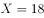位；

因此恰好去了两个景点的有位（可根据尾数法选择）。

方法二：设有位游客恰好去了两个景点，根据容斥原理非标准公式可得：

（可根据尾数法选择），可得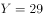位。

故正确答案为A。

---

## 第 2 题　qid 2015444 · 数学运算

小李和小张参加七局四胜的飞镖比赛，两人水平相当，每局赢的概率都是。如果小李已经赢2局，小张已经赢1局，最终小李获胜的概率是？

- **A**. 

- **B**. 

- **C**. 

- **D**. 

　✅

**答案**：D

**官方解析**

根据题干两人每局赢的概率都是，则小李每局赢的概率都是。小李已经赢2局，小张已经赢1局，则还剩4局。小李要获胜，只需在剩余的四局里赢下两局即可。

分三种情况讨论：

①比赛进行5局结束，小李赢下第4、5局，概率；

②比赛进行6局结束，小李在第4、5局中赢1局，概率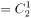；

③比赛进行7局结束，小李在第4、5、6局中赢1局，概率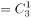。

小李获胜包含以上三种情况，则小李获胜的概率为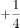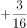。

故正确答案为D。

---

## 第 3 题　qid 2024260 · 数学运算

某市为了解决停车难问题，在如下图所示的一段长55米的路段开辟斜列式停车位，每个车位为长6米，宽2.6米的矩形，矩形的宽与路边成30度角，则在这个路段最多可划出多少个这样的停车位？

- **A**. 16
- **B**. 17　✅
- **C**. 18
- **D**. 19

**答案**：B

**官方解析**

添加辅助线后进行分析，由矩形的宽与路边成角分析可知，、、为角。因为车位宽米，故米，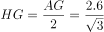米。因为车位长米，故米， 米，所以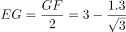 米。所以这个路段最多可以划出的车位数个，即最多17个。

故正确答案为B。

---

## 第 4 题　qid 2015446 · 数学运算

小王夜跑后回家喝水，往300毫升的杯子中倒入200毫升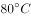热水和100毫升凉水，发现依然太烫无法喝下。于是接下来每次他都将水杯里的水倒去60毫升，加入同等体积的凉水。假设在倒水过程中，水温没有流失，运动后人适宜的饮水温度范围是，那么小王一共加了几次60毫升的凉水？

- **A**. 2
- **B**. 3
- **C**. 4　✅
- **D**. 5

**答案**：C

**官方解析**

方法一：设小王将热水和凉水混合之后的温度是，则，解方程得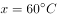。

第一次加入60毫升凉水后：，解得；

第二次加入60毫升凉水后：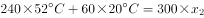，解得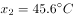；

第三次加入60毫升凉水后：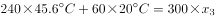，解得；

第四次加入60毫升凉水后：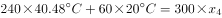，解得；

第四次加入凉水后的温度在适宜范围内，满足题意。

方法二：

设小王将热水和凉水混合之后的温度是，根据线段法，溶液量的比与浓度差成反比，则，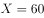。根据题意，混合后的温度达到即可饮用，用a,b分别表示最终杯子中热水的量与凉水的量。根据线段法，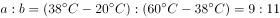，则300毫升中的凉水量为毫升。

因为每次的水都是倒入60毫升后，又倒出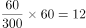毫升，故每次杯子中留下的水为毫升。假设前面倒进又倒出n次，最后又倒一次之后达到了。则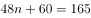，推出，即3次。加上最后一次共需次。

故正确答案为C。

---

## 第 5 题　qid 2015412 · 数学运算

某医院门诊大楼最多容纳1500人，进出大楼有4个门，其中2个大门大小一致，2个小门大小一致，大楼安全员对4个门的通行能力进行测试，同时打开1个大门和2个小门，2分钟内可通过600人；同时打开1个大门和1个小门，3分钟内可通过720人。当紧急情况发生时，出门效率降低。根据安全标准，紧急情况下大楼所有人员需在5分钟内撤离，那么发生紧急情况下时这4个门最多能够通过多少人？

- **A**. 1440
- **B**. 1500　✅
- **C**. 1600
- **D**. 1680

**答案**：B

**官方解析**

题目问四个门在紧急情况时最多通过多少人，题干中给出了大小门通过人数与时间的关系，同时打开1个大门和1个小门，3分钟可通过720人，可表示为：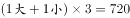，那么，1个大门和1个小门1分钟可通过的人数为。因此，2个大门和2个小门5分钟的通过人数为。由于题目中说，紧急情况发生时，出门效率降低30%，则紧急情况下4个门5分钟的通过人数为。但是由于该医院最多可容纳1500人，，因此最多有1500人能够通过。

故正确答案为B。

---

## 第 6 题　qid 2015372 · 数学运算

游乐场的摩天轮半径为10米，匀速旋转一周需要2分钟。小浩坐在最底部的轿厢（距离地面0.1米），当摩天轮启动旋转40秒时小浩距离地面的高度是多少米？

- **A**. 11
- **B**. 12.1
- **C**. 15
- **D**. 15.1　✅

**答案**：D

**官方解析**

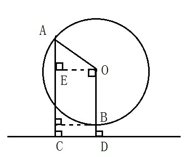

如图所示，摩天轮即为以O为圆心的圆，半径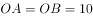米。小浩坐在最底部的轿厢B处，距离地面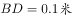。摩天轮匀速旋转一周需要2分钟（即120秒），故40秒时，摩天轮旋转圈，小浩由B处移动至A处，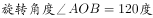。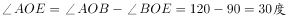，故而。小浩距离地面高度。

故正确答案为D。

---

## 第 7 题　qid 2015386 · 数学运算

某粮油店只有一台不等臂的天平和一个5千克的砝码。顾客要买10千克大米，店员先将砝码放在左盘，大米放在右盘，平衡后称得的大米给顾客；再将砝码放在右盘，大米放在左盘，平衡后又将第二次称得的大米给顾客。请问这种称法对谁更有利？

- **A**. 顾客　✅
- **B**. 店主
- **C**. 都一样
- **D**. 不确定

**答案**：A

**官方解析**

题目没有给出天平的两臂具体比例，可采用赋值法。设天平的两臂比例是2：1，那么当左右重量比为1：2时天平即可保持平衡。则第一次店员称得大米重量为10千克，第二次店员称得大米重量为2.5千克，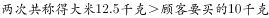，故而这种称法对顾客更有利。

故正确答案为A。

---

## 第 8 题　qid 2015400 · 数学运算

足球比赛的积分规则为：胜一场积3分，平一场积1分，输一场积0分。某球队共进行了8场比赛，积10分。假设该球队最多输2场，则其最多胜：

- **A**. 1场
- **B**. 2场　✅
- **C**. 3场
- **D**. 4场

**答案**：B

**官方解析**

设该足球队胜场，平场，输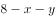场，则该队积分。显然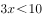，x只可能取值。将代入方程，可得，此时输场，不满足题目最多输场条件，排除；将代入方程，可得，此时输场，满足条件。

故正确答案为B。

---

## 第 9 题　qid 2024128 · 数学运算

小张在路上匀速行走，观测到前方垂直悬挂的一条彩色灯带，其底部和顶部的仰角分别为和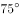。他沿直线继续往前走，5秒后恰好走到灯带的正下方。若小张行走的速度为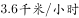，那么这条灯带长：

- **A**. 5米
- **B**. 10米　✅
- **C**. 18米
- **D**. 36米

**答案**：B

**官方解析**

根据题意，作图如下所示，AB的长度即为我们所求的灯带的长度。

；

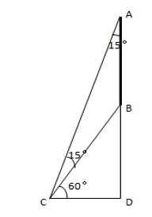

方法一：因为，所以是等腰三角形；

可知，又因为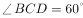，因此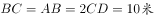。

方法二：因为，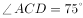；所以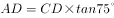，；

。

故正确答案为B。

备注：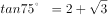，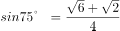，

---

## 第 10 题　qid 2015434 · 数学运算

甲、乙两个圆柱体容器的底面积之比为，容器中的水深分别为10厘米和5厘米。先将甲容器中的水倒一半在乙容器中，则此时两个容器中的水深之比为：

- **A**. 
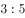
　✅
- **B**. 

- **C**. 

- **D**. 
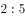

**答案**：A

**官方解析**

圆柱体的体积公式为：。题目问最后甲乙容器水深之比也就是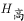之比。给了甲乙容器的底面积之比，对其底面积进行赋值，令甲底面积为2，乙为3。则有：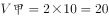，。将甲容器的水倒一半在乙容器，此时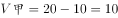，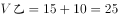，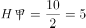，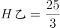，因此水深之比为：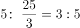。

故正确答案为A。

【技巧】最后求得是高的比例，因此不论面积为何值都会被约去，因此可直接对底面积进行赋值。

---
