# 2016年重庆市选调优秀大学生到基层工作考试《行测》题

> 数量关系 · 13 题 · 选调 2016

## 第 1 题　qid 2262546 · 数学运算

2，3，1，-4，-12，（  ）

- **A**. -14
- **B**. -20
- **C**. -23　✅
- **D**. -26

**答案**：C

**官方解析**

数列无明显特征，优先考虑作差。两两作差，得到新数列1，-2，-5，-8，（-11），为公差是-3的等差数列，则所求项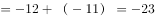。

故正确答案为C。

---

## 第 2 题　qid 2262547 · 数学运算

，，，，（    ）

- **A**. 
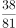

- **B**. 

- **C**. 
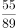
　✅
- **D**. 

**答案**：C

**官方解析**

题干中数字均为分数，优先考虑分数数列。分子规律：前一项的分子与分母的和等于后一项的分子，，，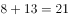，那么下一项分数的分子为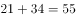。分母规律：前一项分母与后一项分子之和等于后一项分母，，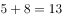，，那么下一项分数的分母为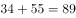。则所求项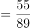。

故正确答案为C。

---

## 第 3 题　qid 2262548 · 数学运算

6，14，18，（    ），28，36

- **A**. 19
- **B**. 22
- **C**. 25
- **D**. 26　✅

**答案**：D

**官方解析**

两两分组，（6，14）、（18，（    ））、（28，36），，，，则所求项。

故正确答案为D。

---

## 第 4 题　qid 2262551 · 数学运算

从21，22，23，24，25，26，27，28，29中任意选出三个数，使他们和为奇数，可以有（  ）种选法。

- **A**. 44
- **B**. 42
- **C**. 40　✅
- **D**. 39

**答案**：C

**官方解析**

从5个奇数和4个偶数中选出任意三个数，保证其和为奇数，分情况讨论：

（1）一个奇数两个偶数：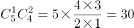种；

（2）三个奇数：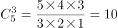种。

分类用加法，共有种选法。

故正确答案为C。

---

## 第 5 题　qid 2262552 · 数学运算

在平面直角坐标系中，如果点P（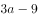，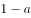）在第三象限内，且横坐标纵坐标都是整数，则点P的坐标是：

- **A**. （-1，-3）
- **B**. （-3，-1）　✅
- **C**. （-3，-2）
- **D**. （-2，-3）

**答案**：B

**官方解析**

第三象限内的点横、纵坐标均为负数，则，，解得。由于横、纵坐标都是整数，那么a必须是整数，因此a只能为2。，，故P点坐标为（-3，-1）。

故正确答案为B。

---

## 第 6 题　qid 2262553 · 数学运算

某人以前走路上班，但是油价下跌后改为开车上班，速度较以前增长，那么其路上花费的时间减少了：

- **A**. 

- **B**. 

　✅
- **C**. 

- **D**. 

**答案**：B

**官方解析**

速度增长前后的速度比为，根据“路程一定，速度和时间成反比”可知，前后时间比为，故其路上花费的时间减少了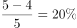。

故正确答案为B。

---

## 第 7 题　qid 2262554 · 数学运算

某公司有200名员工报名参加年会的竞赛活动，其中销售部、生产部、财务部、人力资源部分别有100、70、20、10人，问至少有多少人进入竞赛活动才能保证一定有30名员工工作部门相同？

- **A**. 88
- **B**. 78
- **C**. 90
- **D**. 89　✅

**答案**：D

**官方解析**

题目问“至少······才能保证”，为最值问题中的最不利构造题型。最不利的情况是每个部门最多只有29名员工，则最不利情况数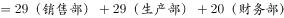，在此基础上再任意多取一人就可以满足30人工作部门相同的情况，即至少要有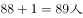参加竞赛活动。

故正确答案为D。

---

## 第 8 题　qid 2262555 · 数学运算

出租车的起步价是2公里7元，往后每增加1公里车费增加2.6元，若不足1公里按1公里计费。某人从甲地到乙地乘坐出租车共支付车费20元，如果从甲地到乙地先步行800米，然后再乘坐出租车也是20元，那么乘出租车从甲、乙两地中点到乙地需要支付车费（  ）元。

- **A**. 9.6
- **B**. 14.8
- **C**. 12.2　✅
- **D**. 7

**答案**：C

**官方解析**

设甲、乙两地距离取整后为公里，则有，解得，说明两地距离满足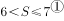。先步行，打车仍然是20元，说明两地距离S满足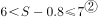。综合①②可得，则，所以从甲、乙中点到乙地的路程应该按4公里计费，则所需车费为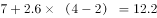元。

故正确答案为C。

---

## 第 9 题　qid 2262556 · 数学运算

一项工程，甲单独完成需要60天，乙单独完成需要30天，丙单独完成需要15天，如果按照甲、乙、丙的顺序交替进行，那么需要多少天才能完成？

- **A**. 25
- **B**. 26
- **C**. 27　✅
- **D**. 28

**答案**：C

**官方解析**

赋值总工程量为60，则甲的效率为，乙的效率为，丙的效率为。甲、乙、丙工作一轮完成的工程量为，先让他们做8轮，剩余，此后甲、乙又各工作一天，完成，还剩，需要丙做天，则所需天数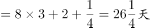，26天无法完成，所以需要27天才能完成。

故正确答案为C。

---

## 第 10 题　qid 2262557 · 数学运算

有老师和甲、乙、丙三个学生，现在老师的年龄刚好是这三个学生的年龄之和；9年后，老师的年龄将是甲、乙两个学生的年龄之和；又5年后，老师的年龄将是甲、丙两个学生的年龄之和；再3年后，老师的年龄将是乙、丙两个学生的年龄之和。那么现在老师的年龄是（  ）岁。

- **A**. 36
- **B**. 40　✅
- **C**. 42
- **D**. 45

**答案**：B

**官方解析**

设目前老师的年龄为岁，甲的年龄为岁，乙的年龄为岁，丙的年龄为岁，根据题意，有以下关系：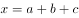······①；，即······②；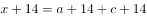，即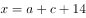······③；，即······④。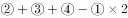，解得。

故正确答案为B。

---

## 第 11 题　qid 2262558 · 数学运算

某作家在一书城举办签售会，已知签售会8:30开始，但是之前已有人提前排队等候，从第一个顾客来到时起，每分钟所到来的人数相同，如果开4个入场口，则在8:37时便不会有人排队，若开5个入场口，则在8:35时便不会有人排队，那么第一个顾客到达的时间是：（秒数四舍五入）

- **A**. 8:18　✅
- **B**. 8:11
- **C**. 8:12
- **D**. 8:16

**答案**：A

**官方解析**

设每个入场口每分钟进1人，每分钟来的顾客为人，在签售会开始之前聚集的人数为，那么，解得，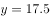。则从第一个顾客到达到签售会开始一共经历了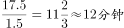，那么第一个人到达的时间为8:18分。

故正确答案为A。

---

## 第 12 题　qid 2262559 · 数学运算

为帮助果农解决销路，某企业年底买了一批水果，平均发给每部门若干筐之后还多了12筐，如果再买进8筐则每个部门可分得10筐，则这批水果共有（  ）筐。

- **A**. 192　✅
- **B**. 198
- **C**. 200
- **D**. 212

**答案**：A

**官方解析**

根据再买进8筐则可每个部门分10筐，可知总数加8后能被10整除，由此可排除B、C两项。将A项代入，若总数为192筐，则部门数为个，可知总数减去12筐后能够实现平分。

故正确答案为A。

---

## 第 13 题　qid 2262560 · 数学运算

某单位在编一本年鉴，其页数需要用6869个数字，那么这本年鉴共有（  ）页。

- **A**. 1994　✅
- **B**. 1968
- **C**. 1942
- **D**. 1886

**答案**：A

**官方解析**

一本年鉴的第1-9页需要9个数字；第10-99页需要个数字；第100-999页需要个数字。则第1-999页共用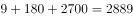个数字。剩下个数字，第1000页及以后都是4位数字，则有页，共页。

故正确答案为A。

---
