# 2016年黑龙江省公务员录用考试《行测》题（公检法卷）

> 数量关系 · 15 题 · 黑龙江 2016

## 第 1 题　qid 1796258 · 数学运算

某地居民用水价格分二级阶梯，户年用水量在0~180（含）吨的水价；180吨以上的水价。户内人口在5人以上的，每多1人，阶梯水量标准增加30吨。老张家5人，老李家6人，去年用水量都是210吨。问老李家的人均水费比老张家少多少元？

- **A**. 12
- **B**. 35
- **C**. 47　✅
- **D**. 60

**答案**：C

**官方解析**

由题意可得：老张家人均水费=元，老李家人均水费=元，则老李家人均水费比老张家少元。

故正确答案为C。

---

## 第 2 题　qid 1796212 · 数学运算

老王围着边长为50米的正六边形的草地跑步，他从某个角点出发，跑了500米之后，与出发点相距有多远？

- **A**. 
米

- **B**. 
米
　✅
- **C**. 
米

- **D**. 
米

**答案**：B

**官方解析**

正六边形的边长为50米，则周长为300米，假设老王从A点顺时针跑，500米后应在B点，此时与出发点的距离为AB，做CD垂直于AB，是一个三个角分别为、、的直角三角形。在直角三角形中，30°角对应的边等于斜边的一半，则，根据勾股定理可计算得BD为米，因此边AB应为米。

故正确答案为B。

---

## 第 3 题　qid 1796222 · 数学运算

如下图，正方形ABCD边长为10厘米，一只小蚂蚁E从A点出发匀速移动，沿边AB，BC，CD前往D点。问哪个图形能反映三角形AED的面积与时间的关系？

AB

CD

- **A**. A　✅
- **B**. B
- **C**. C
- **D**. D

**答案**：A

**官方解析**

小蚂蚁从A点到B点的过程中，三角形AED的底为AD，长度不变，高AE随着小蚂蚁向上爬而增长，故三角形AED的面积随时间增长（如图1所示）；小蚂蚁从B点到C点的过程中，三角形AED的底为AD，长度不变，高为正方形的边长10cm，也不变，故三角形AED的面积不随时间变化，一直相等（如图2所示）；小蚂蚁从C点到D点的过程中，三角形AED的底为AD，长度不变，高DE随着小蚂蚁向下爬而减少，故三角形AED的面积随时间减少（如图3所示）。只有A项符合三角形AED面积随时间先增长，再不变最后减小的趋势。

故正确答案为A。

---

## 第 4 题　qid 2114548 · 数学运算

某企业原有职工110人，其中技术人员是非技术人员的10倍，今年招聘后，两类人员的人数之比未变，且现有职工中技术人员比非技术人员多153人。问今年新招非技术人员多少名？

- **A**. 7　✅
- **B**. 8
- **C**. 9
- **D**. 10

**答案**：A

**官方解析**

原有职工110人，其中技术人员是非技术人员的10倍，可知二者人数之比为，总数共为11份，每份10人，可以得到非技术人员为1份10人，技术人员为10份100人。招聘后，两类人员的人数之比未变，即新招聘的人员中，技术人员是非技术人员的10倍，可以设新招聘的非技术人员为，则技术人员为，则有，解得。

故正确答案为A。

秒杀技：尾数法。人数比是10倍，技术人员总数的尾数为0，两者相差153，则非技术人员尾数为7，原来是10，现在就是17，新招7人。

---

## 第 5 题　qid 1796254 · 数学运算

A、B两辆列车早上8点同时从甲地出发驶向乙地，途中A、B两列车分别停了10分钟和20分钟，最后A车于早上9点50分，B车于早上10点到达目的地。问两车平均速度之比为多少？

- **A**. 1：1　✅
- **B**. 3：4
- **C**. 5：6
- **D**. 9：11

**答案**：A

**官方解析**

A、B两车均为8:00出发，到达的时间分别为9：50和10：00，中途分别停了10分钟和20分钟，因为两车所用的时间均为1小时40分钟，行驶路程也相同，故二者平均速度之比为。

故正确答案为A。

---

## 第 6 题　qid 1797910 · 数学运算

一环形跑道上画了100个标记点，已知相邻任意两个标记点之间的跑道距离相等。某人在环形跑道上跑了半圈，问他最多能经过几个标记点？

- **A**. 49
- **B**. 51　✅
- **C**. 50
- **D**. 100

**答案**：B

**官方解析**

一环形跑道上画了100个标记点，赋值标记点的间隔1米，根据环形植树公式，。某人跑了半圈，即跑了50米，此时要经过的标记点最多，就从一个标记点出发，。

故正确答案为B。

---

## 第 7 题　qid 2392841 · 数学运算

甲、乙两人同时沿环形跑道同向匀速散步，5分钟后他们第一次相遇，20分钟后第二次相遇，问他们多少分钟后第三次相遇？

- **A**. 45
- **B**. 40
- **C**. 35　✅
- **D**. 30

**答案**：C

**官方解析**

出发5分钟后两人第一次相遇，此时两人在同一位置，只有速度快的人多跑一圈两人才能再次相遇。由题意可知再经过分钟第二次相遇，可知每次相遇的追及距离都是1圈，都是经过15分钟，则第三次相遇是在分钟后。

故正确答案为C。

---

## 第 8 题　qid 2392853 · 数学运算

某年级的学生做广播体操时站成一个正方形的实心方阵，结果剩下20人。而如果站成每边多1人的正方形实心方阵，则方阵的最后一排少9人。问如果用该年级所有学生排成长方形的实心方阵，则该方阵最外边的一圈最少有多少人？

- **A**. 56　✅
- **B**. 54
- **C**. 60
- **D**. 58

**答案**：A

**官方解析**

设第一次排队组成的正方形边长为，由题意可列方程：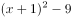，解得，则学生总数为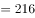人。想让方阵最外边的一圈人数最少，组成的长方形应长与宽尽量接近，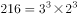，则长、宽取值分别为18、12，最外围一圈人数为人。

故正确答案为A。

---

## 第 9 题　qid 2392855 · 数学运算

张未同学期末考试五门课程的成绩两两相加，得到159、162、164、165、167、169、170、172、175、177分，共10个结果。问张未同学这五门课程的平均成绩是：

- **A**. 86分
- **B**. 85分
- **C**. 84分　✅
- **D**. 83分

**答案**：C

**官方解析**

五门成绩两两相加时，每门成绩的分数需要被分别加和四次，则五门成绩总和为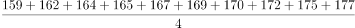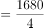分，五门课程平均分为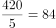分。

故正确答案为C。

---

## 第 10 题　qid 2392860 · 数学运算

两桶完全一样的化学试剂，分别用掉总量的和后，剩下的两桶分别重80千克和48.5千克。问桶的重量为多少千克？

- **A**. 10
- **B**. 12.5　✅
- **C**. 15
- **D**. 17.5

**答案**：B

**官方解析**

方法一：设化学试剂的重量为千克，桶的重量为千克，根据题意可得方程组：

  

  

解得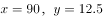，桶的重量为12.5千克。

方法二：由题意可知，两桶用掉的试剂重量差为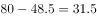千克，占比差为，则桶内原有试剂重量为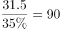千克，可知桶的重量为千克。

故正确答案为B。

---

## 第 11 题　qid 1758854 · 数学运算

某电影公司准备在1-10月中选择两个不同的月份，在其当月的首日分别上映两部电影。为了避免档期冲突影响票房，现决定两部电影中间相隔至少3个月，则有（  ）种不同的排法。

- **A**. 21
- **B**. 28
- **C**. 42
- **D**. 56　✅

**答案**：D

**官方解析**

此题有歧义，存在两种观点，一种以上映日进行间隔，另一种观点是以上映月份进行间隔。

讲法一（以上映日进行间隔）：正向枚举。要求两部电影间隔至少3个月，两个电影不互相影响，那么第一部电影如果1月1日上映，要独自播放三个月，也就是1、2、3月都是单独播放第一部电影，4月1号就可以上第二部了。则满足要求的排法有：

当第一部电影A在1月上映时，第二部电影B只能在4、5、6、7、8、9、10月中选择，共7种排法；

当第一部电影A在2月上映时，第二部电影B只能在5、6、7、8、9、10月中选择，共6种排法；

当第一部电影A在3月上映时，第二部电影B只能在6、7、8、9、10月中选择，共5种排法；

当第一部电影A在4月上映时，第二部电影B只能在7、8、9、10月中选择，共4种排法；

当第一部电影A在5月上映时，第二部电影B只能在8、9、10月中选择，共3种排法；

当第一部电影A在6月上映时，第二部电影B只能在9、10月选择，共2种排法；

当第一部电影A在7月上映时，第二部电影B只能在10月选择，共1种排法；

共有种排法。同时第一部电影可以上映B，第二部电影上映A，故全部的排法数共有种。

故正确答案为D。

讲法二（以上映月进行间隔）：正向枚举。要求两部电影间隔至少3个月，两个电影不互相影响，那么第一部电影如果1月上映，要独自播放四个月，也就是1、2、3、4月都是单独播放第一部电影，5月1号就可以上第二部了。则满足要求的排法有：

当第一部电影A在1月上映时，第二部电影B只能在5、6、7、8、9、10月中选择，共6种排法；

当第一部电影A在2月上映时，第二部电影B只能在6、7、8、9、10月中选择，共5种排法；

当第一部电影A在3月上映时，第二部电影B只能在7、8、9、10月中选择，共4种排法；

当第一部电影A在4月上映时，第二部电影B只能在8、9、10月中选择，共3种排法；

当第一部电影A在5月上映时，第二部电影B只能在9、10月中选择，共2种排法；

当第一部电影A在6月上映时，第二部电影B只能在10月选择，共1种排法；

共有种排法。同时第一部电影可以上映B，第二部电影上映A，故全部的排法数共有种。

小粉笔认为此题应为讲法一。

---

## 第 12 题　qid 1796268 · 数学运算

A工程队的效率是B工程队的2倍，某工程交给两队共同完成需要6天。如果两队的工作效率均提高一倍，且B队中途休息了1天，问要保证工程按原来的时间完成，A队中途最多可以休息几天？

- **A**. 4　✅
- **B**. 3
- **C**. 2
- **D**. 1

**答案**：A

**官方解析**

A工程队的效率是B工程队的2倍，可以赋值A工程队效率为2，B工程队效率为1，此时工程总量为。如果两队的工作效率均提高一倍，A工程队效率即为，B工程队效率为。设A工程队休息t天，则有，解得。

故正确答案为A。

---

## 第 13 题　qid 1788612 · 数学运算

甲、乙、丙三人共同完成一项工程，他们的工作效率之比是5：4：6。先由甲、乙两人合作6天，再由乙单独做9天，完成全部工程的，若剩下的工程由丙单独完成，则丙所需要的天数是：

- **A**. 9
- **B**. 11
- **C**. 10　✅
- **D**. 15

**答案**：C

**官方解析**

根据题目中的效率比，设甲、乙、丙的效率分别为5，4，6，由题干可得工程总量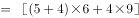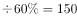，剩余工作量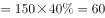，故丙所需时间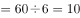天。 

故正确答案为C。 

---

## 第 14 题　qid 1791606 · 数学运算

将所有由1、2、3、4组成且没有重复数字的四位数，按从小到大的顺序排列，则排在第12位的四位数是：

- **A**. 3124
- **B**. 2341
- **C**. 2431　✅
- **D**. 3142

**答案**：C

**官方解析**

由1、2、3、4组成且没有重复数字的四位数中，千位数为1的四位数有个，千位数为2的四位数有个，则按从小到大的顺序排列，排在第12位的四位数是千位数为2的四位数中最大的数字，即2431。

故正确答案为C。

---

## 第 15 题　qid 1772334 · 数学运算

甲、乙二人同时上山砍柴，甲花6小时砍了一担柴，乙砍了一段时间后觉得刀比较钝，于是下山磨了一次刀，磨刀加上山下山共花了一个小时，磨完后效率提升了，总共也花费了6个小时砍了同样一担柴，如果甲、乙二人磨刀之前的效率是相同的，则乙磨刀之前已经砍了（  ）个小时柴。

- **A**. 1
- **B**. 2
- **C**. 3　✅
- **D**. 4

**答案**：C

**官方解析**

赋值甲的效率为1，则乙磨刀前的效率为1，磨刀后的效率为1.5。设乙磨刀之前已经砍了小时柴，则根据题意可得：，解得。

故正确答案为C。

---
