# 2017年422联考《行测》题（云南卷）

> 数量关系 · 10 题 · 云南 2017

## 第 1 题　qid 2049286 · 数学运算

在小李等车期间，有豪华型、舒适型、标准型三种旅游车随机开过。小李不知道豪华型的标准，只能通过前后两辆车进行对比。为此，小李采取的策略是：不乘坐第一辆，如果发现第二辆比第一辆更豪华就乘坐；如果不是，就乘坐最后一辆。那么，他能乘坐豪华型旅游车的概率是：

- **A**. 

　✅
- **B**. 

- **C**. 

- **D**. 

**答案**：A

**官方解析**

设标准型、舒适型、豪华型三种旅游车的代号分别为A、B、C。则三辆车依次通过的顺序有ABC、ACB、BAC、BCA、CAB、CBA六种。按照小李的策略，第一辆车不坐，如果第二辆车比第一辆豪华就坐，则ACB、BCA两种情况可以坐到豪华车；反之坐最后一辆，则BAC一种情况可以坐到豪华车。共有6种情况，其中有3种情况可以坐到豪华车，故可以坐到豪华车的概率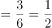。

故正确答案为A。

---

## 第 2 题　qid 2049288 · 数学运算

小王、小张、小李3人进行了多轮比赛，比赛按名次高低计分，得分均为正整数。多轮比赛结束后，小王得22分，小张和小李各得9分且小张在其中一轮比赛中获第一名。那么，三人共进行了多少轮比赛？

- **A**. 2
- **B**. 3
- **C**. 4
- **D**. 5　✅

**答案**：D

**官方解析**

由条件“每一轮的比赛按名次高低计分”，故每一轮的总得分为定值。多轮比赛结束后，三人总得分分。

若进行2轮比赛，小张得了一次第一名，则第一名的得分应该小于9分。小王一共得22分，即平均每轮11分，则必有一场得分超过9分，与第一名得分应该小于9分矛盾，排除A项；

若进行3轮比赛，则总得分应为3的倍数，40不是3的倍数，排除B项；

若进行4轮比赛，则小王平均每轮分，则第一名的得分至少6分。每轮得分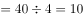分，根据得分各不相同，则一到三名分别6、3、1分。还有另一种情况，若第一名至第三名的得分分别为7、2、1分，则小张至少得10分（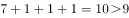），凑不出小王的22分（），排除C项；

若进行了5轮比赛，则每轮的总得分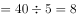分。假设按名次高低每人的得分分别为5、2、1分，三人得分情况可分别为：，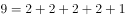，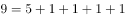，D项满足构造。

故正确答案为D。

---

## 第 3 题　qid 2049290 · 数学运算

在一块四边形水田里，以连接四条边中点的形式划出了矩形区域种植莲藕，由此可知这块水田一定是：

- **A**. 对角线互相垂直的四边形　✅
- **B**. 菱形
- **C**. 对角线相等的四边形
- **D**. 矩形

**答案**：A

**官方解析**

所要求的结果为“连接四条边的中点后形成矩形”，简单画图可得C、D两种图形均无法形成矩形，而A、B两种图形均可以形成矩形。由下列A图可见，水田四边不一定相等，故不一定是菱形，排除B项。

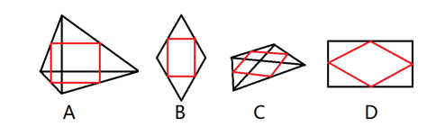

故正确答案为A。

---

## 第 4 题　qid 2049294 · 数学运算

如下图，一个正方体的表面上分别写着连续的6个整数，且每两个相对面上的两个数的和都相等，则这6个整数的和为：

- **A**. 53
- **B**. 52
- **C**. 51　✅
- **D**. 50

**答案**：C

**官方解析**

方法一：由条件“连续6个整数”，结合图形可得，6个整数中应包含“6-10”五个数，五个数的加和为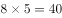。另外一个数应为5或11，所有数之和应为或，若为5则两两加和为15，但此时9和6是相邻面而不是相对面，排除；则C项满足。

方法二：由条件“每两个相对面上的两个数加和相等”，设每组相对面的数字加和为，一共3组相对面，3组相对面的总和应为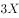，所求值应可被3整除，只有C项满足。

故正确答案为C。

---

## 第 5 题　qid 2049280 · 数学运算

如下图，正方形的迷你轨道边长为1米，1号电子机器人从点A以的速度顺时针绕轨道移动，2号电子机器人从点A以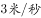的速度逆时针绕轨道移动，则它们的第2017次相遇在：

- **A**. 点A
- **B**. 点C
- **C**. 点B
- **D**. 点D　✅

**答案**：D

**官方解析**

在环形跑道相遇问题当中，相遇一次即共跑一圈。故所求“第2017次相遇”应为两人共跑了2017圈。一圈的路程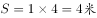。结合相遇问题公式可得：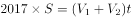，即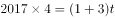，解得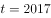。此时，1号机器人共跑了。因顺时针移动，故应出现在D点位置，两人相遇。

故正确答案为D。

---

## 第 6 题　qid 2049282 · 数学运算

某电信公司推出两种手机收费方式：A种方式是月租20元，B种方式是月租0元。一个月的本地网内通话时间（分钟）与电话费（元）的函数关系如图所示，当通话150分钟时，这两种方式的电话费相差：

- **A**. 10元　✅
- **B**. 15元
- **C**. 20元
- **D**. 30元

**答案**：A

**官方解析**

方法一：假设A种方式每分钟电话费为元，B种方式每分钟电话费为元，根据图中100分钟，二者电话费用相等，则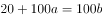，即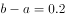元，则150分钟时，二者电话费相差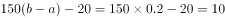元。

方法二：如下图所示：由题意可得，三角形OMN相似于三角形PQN，N点到OM的横轴距离为100，到PQ的横轴距离为50，则，已知，则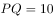，即两种方式的电话费相差10元。

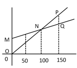

故正确答案为A。

---

## 第 7 题　qid 2049284 · 数学运算

某兴趣组有男女生各5名，他们都准备了表演节目。现在需要选出4名学生各自表演1个节目，这4人中既要有男生、也要有女生，且不能由男生连续表演节目。那么，不同的节目安排有多少种？

- **A**. 3600
- **B**. 3000
- **C**. 2400　✅
- **D**. 1200

**答案**：C

**官方解析**

若有1个男生、3个女生表演节目，情况数为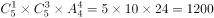种；

若有2个男生、2个女生表演节目，先排女生，然后2个男生在女生的空中间排，情况数为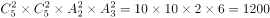种；

若有3个男生、1个女生表演节目，则一定会出现男生连续表演的情况，排除。

故总的情况数为种。

故正确答案为C。

---

## 第 8 题　qid 2049274 · 数学运算

一次长跑比赛在周长为400米的环形跑道上进行。比赛中，最后一名在距离第3圈终点150米处被第1名完成超圈（即比他多跑1圈），50秒后，他又在距离第3圈终点45米处被第2名完成超圈。假定所有选手均是匀速，那么第2名速度约为：

- **A**. 

　✅
- **B**. 
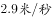

- **C**. 
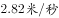

- **D**. 
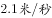

**答案**：A

**官方解析**

由题意可得：最后一名50秒跑了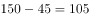米，故最后一名的速度为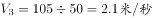。从开始至被第2名超圈，最后一名跑了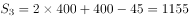米；第2名跑了米，相同时间，路程与速度成正比，即，。

故正确答案为A。

---

## 第 9 题　qid 2049276 · 数学运算

下边是空心圆有规律生成的一个树形图，由此可知，第10行的空心圆的个数是：

- **A**. 34
- **B**. 21　✅
- **C**. 13
- **D**. 8

**答案**：B

**官方解析**

由图中树形图可得，自上而下空心圆的数量分别是1、0、1、1、2、3，观察可知，该数列是一个求和得下一项的数列，故接下来第7-10项分别是5、8、13、21，则第10行的空心圆个数为21。
故正确答案为B。

---

## 第 10 题　qid 2049278 · 数学运算

某单位有职工750人，其中青年职工350人，中年职工250人，老年职工150人。为了解该单位职工的健康情况，计划用等比例分层抽样的方法从中抽取样本。若样本中的青年职工为7人，则会抽取职工总人数为：

- **A**. 7
- **B**. 15　✅
- **C**. 25
- **D**. 35

**答案**：B

**官方解析**

由题意可得采用等比例分层抽样，即抽出的青年样本占青年职工的比例与总的样本占单位职工总数的比例相等，假设抽出职工总人数为，则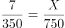，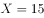。

故正确答案为B。

---
