# 2017年422联考《行测》题（吉林卷乙级）

> 数量关系 · 8 题 · 吉林 2017

## 第 1 题　qid 2050620 · 数学运算

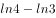，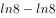，，，（    ），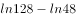

- **A**. 
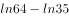
　✅
- **B**. 

- **C**. 
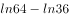

- **D**. 
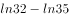

**答案**：A

**官方解析**

题干中各式子计算结果不容易求出，不能比较前后项的数值关系，考虑分别抽出各式子真数组成新的数列。其中减号前面的对数真数组成新数列：4，8，16，32，（    ），128，可判断是公比为2的等比数列，括号中数字应为64。减号后面的对数真数组成新数列：3，8，15，24，（    ），48，作差得到新数列5，7，9，（    ），（    ），是公差为2的等差数列，故括号内应为11，13，继而推出原数列括号内为35。综上所述，题干中括号内应为。

故正确答案为A。

---

## 第 2 题　qid 2050630 · 数学运算

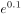，，（），，（）， 

- **A**. 
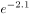，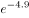

- **B**. 
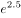，

- **C**. 
，

- **D**. 
，
　✅

**答案**：D

**官方解析**

题干中各式子计算结果不容易求出，不能比较前后项的数值关系。由于底数均为，考虑指数组成的数列：0.1，-1.3，（），-3.7，（），-5.11，因为小数位数不固定，考虑机械划分。

整数部分：0，-1，（），-3，（），-5，括号中可以是（-2），（-4）或者（2），（4）。小数部分1，3，（），7，（），11，括号中应为（5）（9）。综上分析，题干括号内应为，。

故正确答案为D。

---

## 第 3 题　qid 2050642 · 数学运算

123456，61234，4612，（），62，2

- **A**. 326
- **B**. 261
- **C**. 246　✅
- **D**. 512

**答案**：C

**官方解析**

数列位数逐渐减少，且只出现1-6这6个数字，考虑位数的操作。观察可得，每一项将数字最右一位移到最左边，再删去最右一位，即为下一项数字。例如123456将最右边的6移到最左边得到612345，再删去最右一位，得到61234。
故按此规律，括号前的数为4612，其最右一位移到最左边得到2461，再删去最右一位，得到括号内的数为246。
故正确答案为C。

---

## 第 4 题　qid 2050648 · 数学运算

小明的父亲生病要做手术，现在有四家三甲级医院可以选择，小明调查到在2016年，医院甲动手术的总人数为1000人，动手术后康复出院902人；医院乙动手术总人数为2000人，1860人手术后康复出院；医院丙动手术的总人数为3000人，手术后康复出院2730人；医院丁动手术的总人数为1500人，手术后未康复人数111人。通过以上数据手术康复率最高的医院是：

- **A**. 丙
- **B**. 乙　✅
- **C**. 甲
- **D**. 丁

**答案**：B

**官方解析**

各医院手术康复率如下，甲：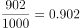；乙：；丙：；丁：，手术康复率最高的医院是乙。

故正确答案为B。

---

## 第 5 题　qid 2050652 · 数学运算

姐弟四人要为妈妈买生日礼物，四个人的钱合在一起是180元，如果老大钱数增加8元，老二钱数减少8元，老三钱数乘以2倍，老四钱数减少到原来的一半，则此时四个人的钱数相同。若其中两人的钱数凑在一起正好买一个价格为68元的音乐盒，则这两个人是：

- **A**. 老二和老三　✅
- **B**. 老大和老三
- **C**. 老大和老二
- **D**. 老二和老四

**答案**：A

**官方解析**

方法一：设四个人相同的钱数为元，则这四人的原有钱数分别为：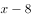、、、，而这四人原来的钱数之和为180元，可得方程如下：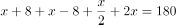，解得。则这四人的原有钱数分别为：32、48、20、80元，那么能恰好凑成68元的是48元和20元，即老二和老三两人。

方法二：已知四个人钱合在一起是180元，设姐弟四人分别有、、、元，则可以得到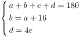，其中两人的钱数凑在一起正好买价格为68元的音乐盒，代入A项：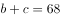，根据上式化简，得到，解得，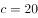，满足。

故正确答案为A。

---

## 第 6 题　qid 2050656 · 数学运算

已知张先生的童年占去了他年龄的，再过了他进入成年，又过了他结婚了，婚后3年他的儿子出生了，儿子7岁时，他们的年龄和为某个素数的平方，则张先生结婚时的年龄是：

- **A**. 38岁
- **B**. 32岁　✅
- **C**. 28岁
- **D**. 42岁

**答案**：B

**官方解析**

假设张先生结婚的年龄为，可得：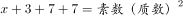。

代入A项：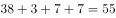，不是平方数，排除A项；

代入B项：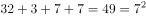，7是素数，满足题意；

代入C项：，不是平方数，排除C项；

代入D项：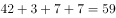，不是平方数，排除D项。

故正确答案为B。

---

## 第 7 题　qid 2050660 · 数学运算

两个人带着宠物狗玩游戏，两人相距200米，并以相同速度相向而行，与此同时，宠物狗以的速度，在两人之间折返跑，当两人相距60米时，那么宠物狗总共跑的距离为：

- **A**. 270米
- **B**. 240米
- **C**. 210米　✅
- **D**. 300米

**答案**：C

**官方解析**

两人相距200米，以相同速度相向而行，相距60米时所用时间为：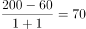秒，则宠物狗总共跑的距离为：米。

故正确答案为C。

---

## 第 8 题　qid 2050664 · 数学运算

悟空与二郎神在离地面1米的空中决斗，两人相距2米，悟空想用分身直接偷袭二郎神，为了不引起对方的警觉，分身必须在地面反弹一次再进行攻击，则分身到达二郎神的位置所走的最短距离为：

- **A**. 
米
　✅
- **B**. 
米

- **C**. 
米

- **D**. 
米

**答案**：A

**官方解析**

要让分身到达二郎神的距离最短，两点之间连线最短，则应使悟空的分身镜像与二郎神之间的距离最短，如图得到分身的镜像，连线二郎神，距离最短为 米。

故正确答案为A。

---
