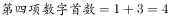
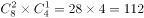
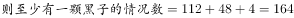
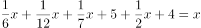
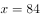
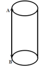
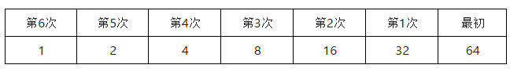

# 2017年422联考《行测》题（吉林卷甲级）

> 数量关系 · 8 题 · 吉林 2017

## 第 1 题　qid 2050620 · 数学运算

，，，，（    ），

- **A**. 

　✅
- **B**. 

- **C**. 

- **D**. 

**答案**：A

**官方解析**

题干中各式子计算结果不容易求出，不能比较前后项的数值关系，考虑分别抽出各式子真数组成新的数列。其中减号前面的对数真数组成新数列：4，8，16，32，（    ），128，可判断是公比为2的等比数列，括号中数字应为64。减号后面的对数真数组成新数列：3，8，15，24，（    ），48，作差得到新数列5，7，9，（    ），（    ），是公差为2的等差数列，故括号内应为11，13，继而推出原数列括号内为35。综上所述，题干中括号内应为。

故正确答案为A。

---

## 第 2 题　qid 2050630 · 数学运算

，，（），，（）， 

- **A**. 
，

- **B**. 
，

- **C**. 
，

- **D**. 
，
　✅

**答案**：D

**官方解析**

题干中各式子计算结果不容易求出，不能比较前后项的数值关系。由于底数均为，考虑指数组成的数列：0.1，-1.3，（），-3.7，（），-5.11，因为小数位数不固定，考虑机械划分。

整数部分：0，-1，（），-3，（），-5，括号中可以是（-2），（-4）或者（2），（4）。小数部分1，3，（），7，（），11，括号中应为（5）（9）。综上分析，题干括号内应为，。

故正确答案为D。

---

## 第 3 题　qid 2051960 · 数学运算

缉毒警察截获某贩毒集团的密电，密电为暗示交易地点的房间号，请根据其他数字，协助警察推导出正确的房间号：12345，6234，1023，（  ），60

- **A**. 102
- **B**. 402　✅
- **C**. 310
- **D**. 231

**答案**：B

**官方解析**

由题意可知，房间号码为一组数列。观察数列，发现数字变化极大且倍数关系不明显，考虑为其他问题。观察前两项：12345，6234，有三个重复的数字234，并且第一项的首数加尾数等于第二项的首数即，观察第二、三项：6234，1023，其中有两个重复的数字23，同样的前一项第一个数加最后一个数等于下一项的开头数字，因此，其他数字02不变，所以为402。

故正确答案为B。

---

## 第 4 题　qid 2051966 · 数学运算

罐中有12颗围棋子，其中8颗白子，4颗黑子。从中任取3颗棋子。则至少有一颗黑子的情况有：

- **A**. 98种
- **B**. 164种　✅
- **C**. 132种
- **D**. 102种

**答案**：B

**官方解析**

方法一：至少有一个黑子的情况包括：有一颗黑子，有两颗黑子，有三颗黑子一共三种情况。分别讨论如下：

有一颗黑子（1黑2白）的情况数： ；

有两颗黑子（2黑1白）的情况数： ；

有三颗黑子（3黑0白）的情况数： ；

 。

方法二：至少有一个黑子的分类情况较多，正面求解较为复杂考虑从反面出发求解。 。

故正确答案为B。

---

## 第 5 题　qid 2051968 · 数学运算

古希腊数学家丢番图（Diophantus）的墓志铭：过路人，这儿埋葬着丢番图，他生命的六分之一是童年；再过了一生的十二分之一后，他开始长胡须，又过了一生的七分之一后他结了婚；婚后五年他有了儿子，但可惜儿子的寿命只有父亲的一半，儿子死后，老人再活了四年就结束了余生。根据这个墓志铭，丢番图的寿命为：

- **A**. 60
- **B**. 84　✅
- **C**. 77
- **D**. 63

**答案**：B

**官方解析**

方法一：假设丢番图的寿命为，则他儿子的寿命为。

由题可得， ， 解得。

方法二：根据“他生命的六分之一是童年”可知，丢番图的年龄是6的倍数，排除C、D两项。根据“又过了一生的七分之一后他结了婚”可知，丢番图的年龄是7的倍数，排除A项。

故正确答案为B。

---

## 第 6 题　qid 2051976 · 数学运算

在猫鼠游戏中，跑道为无顶和底的圆柱形，底或顶的圆周长度为5米。圆柱的高为12米，老鼠只能在顶端圆周逃跑并以0.5米/秒的速度从A点出发，与此同时，猫从B点出发匀速追击老鼠，并可以在圆柱形的表面选择任意路线追击。若猫想在A点恰好追及到跑了一圈的老鼠，则它至少要保持的速度为：

- **A**. 1.1米/秒
- **B**. 1.4米/秒
- **C**. 1.3米/秒
- **D**. 1.2米/秒　✅

**答案**：D

**官方解析**

根据题意可知，如果猫想在老鼠刚好跑一圈时追上老鼠，时间相同，。在时间为定值的前提下，若想速度最小，则需要所走路程最短，因此猫所走的路程为圆柱的高的长度12米，。

故正确答案为D。

---

## 第 7 题　qid 2051978 · 数学运算

股神的骗局。就是所谓的“股神”第一天选定一批人，给其中一半人传递涨的信息，另一半传递跌的信息。第二天，在被传递正确信息的人中，再给其中一半人传递涨的信息，另一半人传递跌的信息。以此类推。若保证有人连续六天都接受到正确的消息，那么“股神”最初至少要选择的人数是：

- **A**. 8
- **B**. 64　✅
- **C**. 32
- **D**. 16

**答案**：B

**官方解析**

根据题意可知，若想最初人数最少，则剩下的人数需要最少为1人。反向推理：

因此，最初为64人。

故正确答案为B。

---

## 第 8 题　qid 2050664 · 数学运算

悟空与二郎神在离地面1米的空中决斗，两人相距2米，悟空想用分身直接偷袭二郎神，为了不引起对方的警觉，分身必须在地面反弹一次再进行攻击，则分身到达二郎神的位置所走的最短距离为：

- **A**. 
米
　✅
- **B**. 
米

- **C**. 
米

- **D**. 
米

**答案**：A

**官方解析**

要让分身到达二郎神的距离最短，两点之间连线最短，则应使悟空的分身镜像与二郎神之间的距离最短，如图得到分身的镜像，连线二郎神，距离最短为 米。

故正确答案为A。

---
