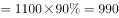
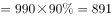
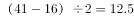
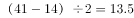
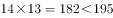
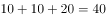
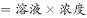
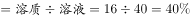

# 2017年422联考《行测》题（四川卷）

> 数量关系 · 10 题 · 四川 2017

## 第 1 题　qid 2051100 · 数学运算

下图为以AC、AD和AF为直径画成的三个圆形，已知AB、BC、CD、DE和EF之间的距离彼此相等，问小圆、弯月以及弯月三部分的面积之比为：

- **A**. 4：5：16　✅
- **B**. 4：5：14
- **C**. 4：7：12
- **D**. 4：3：10

**答案**：A

**官方解析**

假设，由题意得，，即小圆、大圆、大圆的半径分别为1、1.5、2.5。根据圆的面积公式，，，，则。

故正确答案为A。

---

## 第 2 题　qid 2051222 · 数学运算

甲用1000万购买了一件艺术品并卖出，获利为买进价格的，随后甲用艺术品卖出价格的买入一件珠宝，并以珠宝买进价格的九折卖出，若上述交易中的其他费用忽略不计，则甲最终:

- **A**. 盈亏平衡
- **B**. 盈利1万　✅
- **C**. 盈利9万
- **D**. 盈利1.1万

**答案**：B

**官方解析**

由题意得，艺术品卖出的价格万元；珠宝买进价格万元；珠宝卖出价格万元，则甲最终盈利万元。

故正确答案为B。

---

## 第 3 题　qid 2051234 · 数学运算

甲乙两队举行智力抢答比赛，两队平均得分为92分，其中甲队平均得分为88分，乙队平均得分为94分，则甲乙两队人数之和可能是:

- **A**. 20
- **B**. 21　✅
- **C**. 23
- **D**. 25

**答案**：B

**官方解析**

方法一：设甲队有x人，乙队有y人，根据题意可列方程：92（x+y）=88x+94y，化简可得：2x=y。则甲乙两队人数之和=x+y=x+2x=3x，总人数为3的倍数，只有B项符合。

方法二：由题干中“平均分”可知，本题为平均数问题。根据线段法距离与量成反比，甲队和乙队平均得分的距离之比，由于平均得分的距离与人数成反比，则甲队和乙队的人数之比为1:2，总人数为3的倍数，观察选项，只有B选项符合。

故正确答案为B。

---

## 第 4 题　qid 2051326 · 数学运算

农户老张的田里有一堵16米长的围墙。老张想利用现有的围墙作为其中的一边，修建一个长和宽均为整数米的长方形养鸡场。如老张手头的材料最多只能新修41米长的围墙，则他能围出的长方形养鸡场面积最大为多少平方米？

- **A**. 195　✅
- **B**. 204
- **C**. 210
- **D**. 256

**答案**：A

**官方解析**

根据题意可知长方形的边一定不超过16米，假设长为16米，则宽的最大值为米，宽只能取整数12米，此时长方形面积为平方米，无选项对应；假设长为15米，则宽的最大值为米，面积为平方米，对应A选项；假设长为14米，则宽的最大值为米，宽只能取整数13米，此时面积为平方米；若长度继续减少，则会发现长方形面积继续减少。因此长方形面积最大为195平方米。

故正确答案为A。

---

## 第 5 题　qid 2051342 · 数学运算

甲车从A地，乙车从B地同时出发匀速相向行驶，第一次相遇距离A地100千米。两车继续前进到达对方起点后立即以原速度返回，在距离A地80千米的位置第二次相遇。则AB两地相距多少千米?

- **A**. 170
- **B**. 180
- **C**. 190　✅
- **D**. 200

**答案**：C

**官方解析**

方法一：两人第一次相遇共走了一个AB全程，第二次相遇共走了三个AB全程，两次相遇总路程之比为，因为速度和不变，所以两次相遇时间之比为。甲的速度不变，两次时间之比为，则路程之比也为。甲第一次相遇时的路程为100，设AB全程为，则甲第二次相遇时的路程为，则，解方程得千米。

方法二：根据单岸型相遇公式，两地相距的总路程千米。

故正确答案为C。

---

## 第 6 题　qid 2049284 · 数学运算

某兴趣组有男女生各5名，他们都准备了表演节目。现在需要选出4名学生各自表演1个节目，这4人中既要有男生、也要有女生，且不能由男生连续表演节目。那么，不同的节目安排有多少种？

- **A**. 3600
- **B**. 3000
- **C**. 2400　✅
- **D**. 1200

**答案**：C

**官方解析**

若有1个男生、3个女生表演节目，情况数为种；

若有2个男生、2个女生表演节目，先排女生，然后2个男生在女生的空中间排，情况数为种；

若有3个男生、1个女生表演节目，则一定会出现男生连续表演的情况，排除。

故总的情况数为种。

故正确答案为C。

---

## 第 7 题　qid 2049280 · 数学运算

如下图，正方形的迷你轨道边长为1米，1号电子机器人从点A以的速度顺时针绕轨道移动，2号电子机器人从点A以的速度逆时针绕轨道移动，则它们的第2017次相遇在：

- **A**. 点A
- **B**. 点C
- **C**. 点B
- **D**. 点D　✅

**答案**：D

**官方解析**

在环形跑道相遇问题当中，相遇一次即共跑一圈。故所求“第2017次相遇”应为两人共跑了2017圈。一圈的路程。结合相遇问题公式可得：，即，解得。此时，1号机器人共跑了。因顺时针移动，故应出现在D点位置，两人相遇。

故正确答案为D。

---

## 第 8 题　qid 2049282 · 数学运算

某电信公司推出两种手机收费方式：A种方式是月租20元，B种方式是月租0元。一个月的本地网内通话时间（分钟）与电话费（元）的函数关系如图所示，当通话150分钟时，这两种方式的电话费相差：

- **A**. 10元　✅
- **B**. 15元
- **C**. 20元
- **D**. 30元

**答案**：A

**官方解析**

方法一：假设A种方式每分钟电话费为元，B种方式每分钟电话费为元，根据图中100分钟，二者电话费用相等，则，即元，则150分钟时，二者电话费相差元。

方法二：如下图所示：由题意可得，三角形OMN相似于三角形PQN，N点到OM的横轴距离为100，到PQ的横轴距离为50，则，已知，则，即两种方式的电话费相差10元。

故正确答案为A。

---

## 第 9 题　qid 2050740 · 数学运算

某饮料店有纯果汁（即浓度为）10千克，浓度为的浓缩还原果汁20千克。若取纯果汁、浓缩还原果汁各10千克倒入10千克纯净水中，再倒入10千克的浓缩还原果汁，则得到的果汁浓度为：

- **A**. 

　✅
- **B**. 

- **C**. 

- **D**. 

**答案**：A

**官方解析**

方法一：根据题干可得，一共倒入纯果汁（即浓度为）10千克，纯净水10千克，浓度为的浓缩还原果汁20千克。可知最终溶液的量为千克，根据溶质，最终溶液溶质为千克。则最终果汁浓度。

方法二：根据题干可得，一共倒入纯果汁（即浓度为）10千克，纯净水10千克，浓度为的浓缩还原果汁20千克。先考虑纯果汁（即浓度为）10千克，纯净水10千克混合。两个溶液量相同，则混合后溶液浓度为，量为千克。再将20千克的溶液与20千克浓度为的浓缩还原果汁混合。两个溶液量相同，则混合后溶液浓度为。

故正确答案为A。

---

## 第 10 题　qid 2049288 · 数学运算

小王、小张、小李3人进行了多轮比赛，比赛按名次高低计分，得分均为正整数。多轮比赛结束后，小王得22分，小张和小李各得9分且小张在其中一轮比赛中获第一名。那么，三人共进行了多少轮比赛？

- **A**. 2
- **B**. 3
- **C**. 4
- **D**. 5　✅

**答案**：D

**官方解析**

由条件“每一轮的比赛按名次高低计分”，故每一轮的总得分为定值。多轮比赛结束后，三人总得分分。

若进行2轮比赛，小张得了一次第一名，则第一名的得分应该小于9分。小王一共得22分，即平均每轮11分，则必有一场得分超过9分，与第一名得分应该小于9分矛盾，排除A项；

若进行3轮比赛，则总得分应为3的倍数，40不是3的倍数，排除B项；

若进行4轮比赛，则小王平均每轮分，则第一名的得分至少6分。每轮得分分，根据得分各不相同，则一到三名分别6、3、1分。还有另一种情况，若第一名至第三名的得分分别为7、2、1分，则小张至少得10分（），凑不出小王的22分（），排除C项；

若进行了5轮比赛，则每轮的总得分分。假设按名次高低每人的得分分别为5、2、1分，三人得分情况可分别为：，，，D项满足构造。

故正确答案为D。

---
