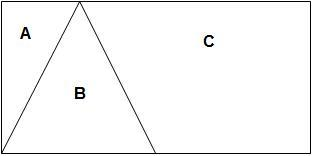
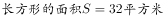
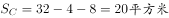
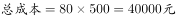
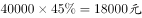
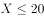

# 2017年422联考《行测》题（宁夏卷）

> 数量关系 · 10 题 · 宁夏 2017

## 第 1 题　qid 2049284 · 数学运算

某兴趣组有男女生各5名，他们都准备了表演节目。现在需要选出4名学生各自表演1个节目，这4人中既要有男生、也要有女生，且不能由男生连续表演节目。那么，不同的节目安排有多少种？

- **A**. 3600
- **B**. 3000
- **C**. 2400　✅
- **D**. 1200

**答案**：C

**官方解析**

若有1个男生、3个女生表演节目，情况数为种；

若有2个男生、2个女生表演节目，先排女生，然后2个男生在女生的空中间排，情况数为种；

若有3个男生、1个女生表演节目，则一定会出现男生连续表演的情况，排除。

故总的情况数为种。

故正确答案为C。

---

## 第 2 题　qid 2050796 · 数学运算

如下图所示，将一个长8米，宽4米的长方形店铺划分为A、B、C三个小店铺，其中店铺B是面积为8平方米的等腰三角形，若店铺装修按每平方米500元计价，那么店铺C装修费为：

- **A**. 16000元
- **B**. 14000元
- **C**. 12000元
- **D**. 10000元　✅

**答案**：D

**官方解析**

根据题意，，，三角形A和三角形B高相等，三角形A的底边是三角形B的一半，所以，。。 

故正确答案为D。 

---

## 第 3 题　qid 2049278 · 数学运算

某单位有职工750人，其中青年职工350人，中年职工250人，老年职工150人。为了解该单位职工的健康情况，计划用等比例分层抽样的方法从中抽取样本。若样本中的青年职工为7人，则会抽取职工总人数为：

- **A**. 7
- **B**. 15　✅
- **C**. 25
- **D**. 35

**答案**：B

**官方解析**

由题意可得采用等比例分层抽样，即抽出的青年样本占青年职工的比例与总的样本占单位职工总数的比例相等，假设抽出职工总人数为，则，。

故正确答案为B。

---

## 第 4 题　qid 2049280 · 数学运算

如下图，正方形的迷你轨道边长为1米，1号电子机器人从点A以的速度顺时针绕轨道移动，2号电子机器人从点A以的速度逆时针绕轨道移动，则它们的第2017次相遇在：

- **A**. 点A
- **B**. 点C
- **C**. 点B
- **D**. 点D　✅

**答案**：D

**官方解析**

在环形跑道相遇问题当中，相遇一次即共跑一圈。故所求“第2017次相遇”应为两人共跑了2017圈。一圈的路程。结合相遇问题公式可得：，即，解得。此时，1号机器人共跑了。因顺时针移动，故应出现在D点位置，两人相遇。

故正确答案为D。

---

## 第 5 题　qid 2051104 · 数学运算

商场以每件80元的价格购进了某品牌衬衫500件，并以每件120元的价格销售了400件，要达到盈利的预期目标，剩下的衬衫最多可以降价：

- **A**. 15元
- **B**. 16元
- **C**. 18元
- **D**. 20元　✅

**答案**：D

**官方解析**

，预期利润至少为。设最多可降价元，根据题意可得：，解得，因此最多为20元。

故正确答案为D。

---

## 第 6 题　qid 2049282 · 数学运算

某电信公司推出两种手机收费方式：A种方式是月租20元，B种方式是月租0元。一个月的本地网内通话时间（分钟）与电话费（元）的函数关系如图所示，当通话150分钟时，这两种方式的电话费相差：

- **A**. 10元　✅
- **B**. 15元
- **C**. 20元
- **D**. 30元

**答案**：A

**官方解析**

方法一：假设A种方式每分钟电话费为元，B种方式每分钟电话费为元，根据图中100分钟，二者电话费用相等，则，即元，则150分钟时，二者电话费相差元。

方法二：如下图所示：由题意可得，三角形OMN相似于三角形PQN，N点到OM的横轴距离为100，到PQ的横轴距离为50，则，已知，则，即两种方式的电话费相差10元。

故正确答案为A。

---

## 第 7 题　qid 2049294 · 数学运算

如下图，一个正方体的表面上分别写着连续的6个整数，且每两个相对面上的两个数的和都相等，则这6个整数的和为：

- **A**. 53
- **B**. 52
- **C**. 51　✅
- **D**. 50

**答案**：C

**官方解析**

方法一：由条件“连续6个整数”，结合图形可得，6个整数中应包含“6-10”五个数，五个数的加和为。另外一个数应为5或11，所有数之和应为或，若为5则两两加和为15，但此时9和6是相邻面而不是相对面，排除；则C项满足。

方法二：由条件“每两个相对面上的两个数加和相等”，设每组相对面的数字加和为，一共3组相对面，3组相对面的总和应为，所求值应可被3整除，只有C项满足。

故正确答案为C。

---

## 第 8 题　qid 2050716 · 数学运算

甲乙两车的出发点相距360千米，如果甲乙在上午8点同时出发，相向行驶，分别在12点和17点到达对方出发点。但两车在到达对方出发点后，分别将行驶速度降低到原来的三分之一和一半，再返回各自出发点，那么在当日18点时，甲乙相距：

- **A**. 120千米
- **B**. 160千米　✅
- **C**. 200千米
- **D**. 240千米

**答案**：B

**官方解析**

由题干得，甲乙两地相距360千米，甲上午8点出发，12点即经过4小时到达乙出发点，则甲车速度；乙车8点出发，17点即经过9小时到达甲出发点，则乙车速度。到达后甲车速度降为原来的三分之一，故，乙车速度降为原来的一半，故。18点时，甲车返回的路程，乙车返回的路程，因此两车共行驶，则两车相距。

故正确答案为B。

---

## 第 9 题　qid 2049286 · 数学运算

在小李等车期间，有豪华型、舒适型、标准型三种旅游车随机开过。小李不知道豪华型的标准，只能通过前后两辆车进行对比。为此，小李采取的策略是：不乘坐第一辆，如果发现第二辆比第一辆更豪华就乘坐；如果不是，就乘坐最后一辆。那么，他能乘坐豪华型旅游车的概率是：

- **A**. 

　✅
- **B**. 

- **C**. 

- **D**. 

**答案**：A

**官方解析**

设标准型、舒适型、豪华型三种旅游车的代号分别为A、B、C。则三辆车依次通过的顺序有ABC、ACB、BAC、BCA、CAB、CBA六种。按照小李的策略，第一辆车不坐，如果第二辆车比第一辆豪华就坐，则ACB、BCA两种情况可以坐到豪华车；反之坐最后一辆，则BAC一种情况可以坐到豪华车。共有6种情况，其中有3种情况可以坐到豪华车，故可以坐到豪华车的概率。

故正确答案为A。

---

## 第 10 题　qid 2049290 · 数学运算

在一块四边形水田里，以连接四条边中点的形式划出了矩形区域种植莲藕，由此可知这块水田一定是：

- **A**. 对角线互相垂直的四边形　✅
- **B**. 菱形
- **C**. 对角线相等的四边形
- **D**. 矩形

**答案**：A

**官方解析**

所要求的结果为“连接四条边的中点后形成矩形”，简单画图可得C、D两种图形均无法形成矩形，而A、B两种图形均可以形成矩形。由下列A图可见，水田四边不一定相等，故不一定是菱形，排除B项。

故正确答案为A。

---
