# 2017年422联考《行测》题（山东卷）

> 数量关系 · 9 题 · 山东 2017

## 第 1 题　qid 2049632 · 数学运算

小张的孩子出生的月份乘以29，出生的日期乘以24，所得的两个乘积加起来刚好等于900。问孩子出生在哪一个季度？

- **A**. 第一季度
- **B**. 第二季度
- **C**. 第三季度
- **D**. 第四季度　✅

**答案**：D

**官方解析**

假设出生的月份为a，出生的日期为b，根据题意可得：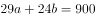，不定方程常采用数字特性分析，24b能被3和4整除，900也能被3和4整除，故29a也能被3和4整除，因29不能被3和4整除，所以a是3和4的倍数即12的倍数，a作为月份数只能为12，故出生于12月，即第四季度。

故正确答案为D。

---

## 第 2 题　qid 2049634 · 数学运算

小王和小刘两人分别从甲镇和乙镇同时出发，匀速相向而行，1小时后他们在甲镇和乙镇之间的丙镇相遇，相遇后两人继续前进，小刘在小王到达乙镇之后27分钟到达甲镇，那么小王和小刘的速度之比为：

- **A**. 5：4　✅
- **B**. 6：5
- **C**. 3：2
- **D**. 4：3

**答案**：A

**官方解析**

假设小王、小刘的速度分别为、，甲地到乙地的距离为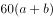，小王从甲到乙所需时间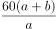，小刘从乙到甲所需时间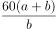，二者相差27分钟，即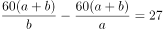，即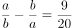。将选项代入验证：若，则，满足题意。

故正确答案为A。

---

## 第 3 题　qid 2049636 · 数学运算

某零件加工厂采用计件工资。已知合格品每件1元，优良品每件2元，瑕疵品不得工资。当生产的优良品达到生产总数的时，可额外获得400元奖励。某工人生产了3000个零件，共获得计件工资4000元，请问该工人生产的零件中，合格品最多为多少个？

- **A**. 2100
- **B**. 2000
- **C**. 1800　✅
- **D**. 1200

**答案**：C

**官方解析**

若优良品个数没有达到生产总数的，则优良品个数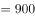。由于零件总数一定，因此当瑕疵品个数为0时，工资可以取得最大值，则工资元，不可能达到4000元。因此优良品个数必然达到了总数的，即最少为个，并额外获得400元奖励。

设优良品的个数为、合格品的个数为，则瑕疵品的个数为，根据工资为4000元可列方程：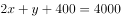，整理得：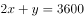。要让的取值最大，则需要让的取值尽可能小，即取900，此时的最大值为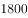个。

故正确答案为C。

---

## 第 4 题　qid 2049640 · 数学运算

某部门从8名员工中选派4人参加培训，其中2人参加计算机培训，1人参加英语培训，1人参加财务培训，问不同的选法有多少种？

- **A**. 256
- **B**. 840　✅
- **C**. 1680
- **D**. 5040

**答案**：B

**官方解析**

从8人中选2人参加计算机培训，方法为，从剩余6人中选1人参加英语培训，方法为，从剩余5人中选1人参加财务培训，方法为，整体分步讨论，总的情况数为。

故正确答案为B。

---

## 第 5 题　qid 2049644 · 数学运算

有A、B两家工厂分别建在河流的上游和下游，甲、乙两船分别从A、B港口出发前往两地中间的C港口。C港与A厂的距离比其与B厂的距离远10公里。乙船出发后经过4小时到达C港，甲船在乙船出发后1小时出发，正好与乙船同时到达。已知两船在静水中的速度都是32公里/小时，问河水流速是多少公里/小时？

- **A**. 4
- **B**. 5
- **C**. 6　✅
- **D**. 7

**答案**：C

**官方解析**

由题意可得，甲船比乙船多行驶10公里，甲船用时小时。设河水流速为，则有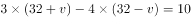，解得公里/小时。

故正确答案为C。

---

## 第 6 题　qid 2049650 · 数学运算

某蔬菜生产基地欲将一批西红柿运往A市销售，有火车和汽车两种运输方式可选。火车运费15元/公里；汽车运费20元/公里。火车的装箱费用比汽车高1500元，选择汽车将比选择火车的总费用高600元，问蔬菜生产基地距A市多少公里？

- **A**. 360
- **B**. 420　✅
- **C**. 480
- **D**. 540

**答案**：B

**官方解析**

设蔬菜生产基地距A市公里，汽车装箱费用为元，则火车装箱费用为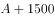元，总费用=运输费用+装箱费用，那么，解得公里。

故正确答案为B。

---

## 第 7 题　qid 2049622 · 数学运算

某统计部门对某地1000户居民的月均收入进行调查，调查结果如表所示。问下列关于被调查居民月均收入的算术平均数，表述正确的是：

- **A**. 可能为1500元
- **B**. 可能为3000元　✅
- **C**. 不可能为5000元
- **D**. 不可能为12000元

**答案**：B

**官方解析**

若每个区间取最小值，

①，，总收入为0元；

②，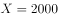，收入元；

③，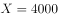，收入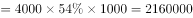元；

④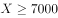，，收入元。

此时，月均收入的算术平均数最小为元，分析各项：

A项：平均数不可能为1500元，错误；

B项：平均数大于等于2730元，有可能为3000元，正确；

C项：平均数大于等于2730元，有可能为5000元，错误；

D项：平均数大于等于2730元，有可能为12000元，错误。

故正确答案为B。

注意：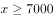的人虽然只占到，但是X的取值上不封顶，所以若这的人的收入近乎无穷大，则平均收入也会上不封顶，故平均数没有固定的最大值。

---

## 第 8 题　qid 2049626 · 数学运算

一副卡牌上面写着1到10的数字，甲和乙从中分别随机抽取三张牌，并比较其中较大的两张牌的牌面之积，数字大的人获胜。甲先抽出三张牌，上面的数字分别是2、6和8，问乙从剩下的牌中抽取三张牌的话，其胜过甲的概率：

- **A**. 
高于

- **B**. 
在之间

- **C**. 
在之间
　✅
- **D**. 
低于

**答案**：C

**官方解析**

。总数为乙从剩下的七张牌中抽取三张牌，。满足条件的数为两张牌的乘积大于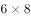，分情况：

①较大两个取10和9，剩下一个从1、3、4、5、7中取，共5种情况；

②较大两个取10和7，剩下一个从1、3、4、5中取，共4种情况；

③较大两个取10和5，剩下一个从1、3、4中取，共3种情况；

④较大两个取9和7，剩下一个从1、3、4、5中取，共4种情况；

则满足条件数共计种。则乙胜过甲的概率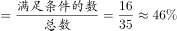

故正确答案为C。

---

## 第 9 题　qid 2049630 · 数学运算

某社区道路如下图所示，社区民警早上9点整从A处的办公室出发，以每分钟50米的速度对社区内每一条道路进行巡查（要求完整走过整个社区内的每一段道路），问他最早什么时候能完成任务返回办公室？

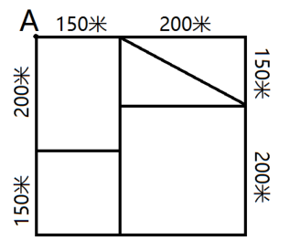

- **A**. 9：54　✅
- **B**. 9：50
- **C**. 9：47
- **D**. 10：00

**答案**：A

**官方解析**

观察题目，图中一共有4个奇点，分别是D、F、G、P。根据最短路径原理，最短总距离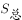为全程距离加上最短的重复距离，最短的重复距离为两组奇点在图中相连的线段长度。

先计算最短重复距离：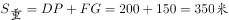。

再计算全程距离：。

米，速度为50米/分钟，分钟，即他最早9:54能完成任务返回办公室。 

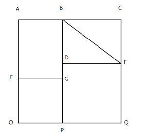

故正确答案为A。

备注：正确的走法有很多，其中一例：ABCEBDEQPOFGDGPOFA。

---
