# 2017年422联考《行测》题（山西卷）

> 数量关系 · 10 题 · 山西 2017

## 第 1 题　qid 2049564 · 数学运算

某件刺绣产品，需要效率相当的三名绣工8天才能完成；绣品完成时，一人有事提前离开，绣品由剩下的两人继续完成；绣品完成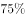时，又有一人离开，绣品由最后剩下的那个人做完。那么，完成该件绣品一共用了：

- **A**. 10天
- **B**. 11天
- **C**. 12天
- **D**. 13天　✅

**答案**：D

**官方解析**

设每名绣工的效率为1，则工程总量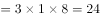。此项工程分成三个阶段。

第一阶段三名绣工做，需要天；

第二阶段两名绣工做，需要天；

第三阶段一名绣工做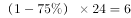，需要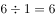天。

完成该件绣品一共用了天。

故正确答案为D。

---

## 第 2 题　qid 2050108 · 数学运算

某公司销售部拟派3名销售主管和6名销售人员前往3座城市进行市场调研，每座城市派销售主管1名，销售人员2名。那么，不同的人员派遣方案有：

- **A**. 540种　✅
- **B**. 1080种
- **C**. 1620种
- **D**. 3240种

**答案**：A

**官方解析**

根据题干可得，先排销售主管，销售主管的排法有：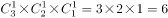种；再排销售人员，销售人员的排法有：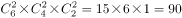种；同时满足销售主管1名，销售人员2名，所以不同的人员派遣方案有：种。

故正确答案为A。

---

## 第 3 题　qid 2049560 · 数学运算

如右图所示，幼儿园老师用边长为的正八边形纸皮，裁去四个同样大小的等腰直角三角形，做成长方体包装盒。如果用该包装盒存放体积为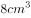的立方体积木（不得凸出包装盒外沿），那么，这个盒子最多可以放入多少块积木？

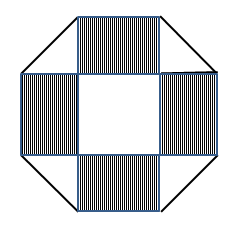

- **A**. 75　✅
- **B**. 80
- **C**. 85
- **D**. 90

**答案**：A

**官方解析**

等腰直角三角形斜边长为，则直角边长为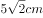，即长方体的高为。立方体积木的体积为，则积木的棱长为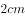。长方体底面积为，则每层可放块，高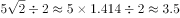层。由于不得凸出包装盒外沿，所以最多放3层，这个盒子最多可以放入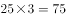块积木。

故正确答案为A。

---

## 第 4 题　qid 2050184 · 数学运算

某商场搞抽奖促销，限每人只能参与一次，活动规则是：一个纸箱里装有5个大小相同的乒乓球，其中3个是白色2个是红色，参与者从中任意抽出2个球，如果两个都是白色可得抵用券100元，一白一红可得抵用券200元，两个都是红色可得抵用券400元。若小李和小林两人分别参加抽奖，那么两人获得抵用券之和不少于600元的概率是多少？

- **A**. 0.12
- **B**. 0.22
- **C**. 0.13　✅
- **D**. 0.30

**答案**：C

**官方解析**

根据求“概率是多少”可知，本题为概率问题。“两人获得抵用券之和不少于600元”，则可能的情况为：一人得400元，一人得200元；两人均为400元。代入概率计算公式：

一人得400元，一人得200元的概率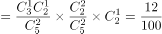；

两人均为400元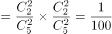。

因此，两人获得抵用券之和不少于600元的概率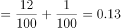。

故正确答案为C。

---

## 第 5 题　qid 2049842 · 数学运算

如右图所示，甲和乙在面积为54π的半圆形游泳池内游泳，他们分别从位置A和B同时出发，沿直线同时游到位置C。若甲的速度为乙的2倍，则原来甲、乙两人相距：

- **A**. 
米

- **B**. 
米

- **C**. 
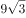米

- **D**. 
米
　✅

**答案**：D

**官方解析**

由题意可得，甲的速度为乙的2倍，相同时间，距离与速度成正比，则，因AC为直径，则，又已知半圆的面积为，假设圆的半径为，则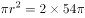，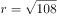，则，，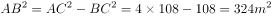，。

故正确答案为D。

---

## 第 6 题　qid 2049852 · 数学运算

妈妈为了给过生日的小东一个惊喜，在一底面半径为20cm、高为60cm的圆锥形生日帽内藏了一个圆柱形礼物盒。为了不让小东事先发现礼物盒，该礼物盒的侧面积最大为多少？

- **A**. 

　✅
- **B**. 

- **C**. 

- **D**. 

**答案**：A

**官方解析**

要想礼物盒侧面积尽可能大，则礼物盒应内接于圆锥形生日帽子，假设圆柱形礼物盒底面半径为，高为，如下图所示：C点在母线AF上，直角三角形ABC相似于直角三角形AOF，则，，。因礼物盒侧面积为，当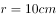时，礼物盒侧面积取得最大值为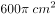。

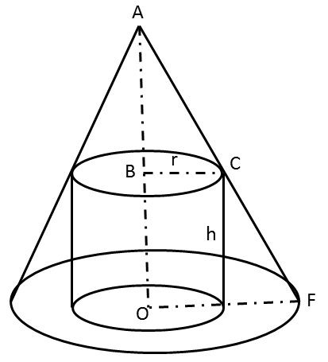

故正确答案为A。

---

## 第 7 题　qid 2049754 · 数学运算

小明负责将某农场的鸡蛋运送到小卖部。按照规定，每送达1枚完整无损的鸡蛋，可得运费0.1元；若有鸡蛋破损，不仅得不到该枚鸡蛋的运费，每破损一枚鸡蛋还要赔偿0.4元。小明10月份共运送鸡蛋25000枚，获得运费2480元。那么，在运送过程中，鸡蛋破损了：

- **A**. 20枚
- **B**. 30枚
- **C**. 40枚　✅
- **D**. 50枚

**答案**：C

**官方解析**

设在运送过程中，鸡蛋破损了枚，则完好的鸡蛋有枚。根据条件可列方程：，解得。

故正确答案为C。

---

## 第 8 题　qid 2049762 · 数学运算

体育彩票22选5中使用的22个彩球除编号不同外，其余完全一样。由于生产过程疏忽，22个彩球中有一个球的重量略重于其它球。现需用天平将该球找出，那么，在最优方案下，最多要使用天平：

- **A**. 3次　✅
- **B**. 4次
- **C**. 5次
- **D**. 6次

**答案**：A

**官方解析**

方法一：将22个彩球分为3堆，每堆分别有7、7、8个。取两堆7个的进行称量（第一次），会分为两种情况： 

①若两堆7个的相等，则特殊彩球应在8个的里面。将8个彩球再次分成三小堆，每小堆分为2、3、3个，取两小堆3个的进行称量（第二次），若不等，取重的一堆两个小球进行称量（第三次），如果这两个小球一样重，则剩余的为特殊小球，如果这两个小球不一样重，则重的为特殊小球；若相等则特殊小球在2个的小堆里面。

②若两堆7个的不等，则特殊彩球应在重的那7个里面。取其中6个，三三进行称量（第二次），若相等，则剩余的一个为特殊小球；若不等，从重的一堆3个小球中取出两个进行称量（第三次），若相等，剩下的一个必为特殊小球，若不等，则重的为特殊小球。 

方法二：类似题目有固定结论：使用n次天平最多可以判定个球。故使用2次天平可以判定最多9个球，使用3次天平可以判定最多27个球，此题球数为22，不超过27个，所以最多3次一定可以找出。

故正确答案为A。

---

## 第 9 题　qid 2049566 · 数学运算

由于连日暴雨，某水库水位急剧上升，逼近警戒水位。假设每天降雨量一致，若打开2个水闸放水，则3天后正好到达警戒水位；若打开3个水闸放水，则4天后正好到达警戒水位。气象台预报，大雨还将持续七天，流入水库的水量将比之前多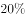。若不考虑水的蒸发、渗透和流失，则至少打开几个水闸，才能保证接下来的七天都不会到达警戒水位？

- **A**. 5
- **B**. 6　✅
- **C**. 7
- **D**. 8

**答案**：B

**官方解析**

设水库原有水量为，警戒水位的水量为，每天降水量为，每个水闸每天放水量为1。则根据水库水量变化过程可得：

；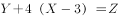

可以解得，。

气象台预报，流入水库的水量增加20%，则每天水库水量增加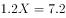，设未来7天至少打开n个水闸可以保证水位低于警戒水位。则可得方程如下：

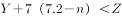，代入数据可得，，故至少打开5.5个水闸，应向上取整为6个水闸。

故正确答案为B。

---

## 第 10 题　qid 2049760 · 数学运算

某地举办铁人三项比赛，全程为51.5千米，游泳、自行车、长跑的路程之比为。小陈在这三个项目花费的时间之比为，比赛中他长跑的平均速度是15千米/小时，且两次换项共耗时4分钟，那么他完成比赛共耗时多少？

- **A**. 2小时14分
- **B**. 2小时24分
- **C**. 2小时34分　✅
- **D**. 2小时44分

**答案**：C

**官方解析**

方法一：由列表可得，小陈在游泳、自行车、长跑三项比赛中的速度之比为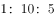，其中长跑的速度为，则自行车的速度应为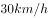，游泳的速度为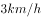，可得三段路程的实际耗时如表所示，共计：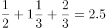小时，加上4分钟的换项时间，一共用时2小时34分。

方法二：由三个项目所花时间之比为，项目总时间是15的倍数，再加上换项耗时4分钟，则比赛总时间应为15的倍数加上4分钟，结合选项只有C项（154分钟）满足。

故正确答案为C。

---
