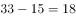
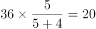
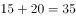
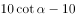
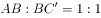
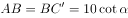
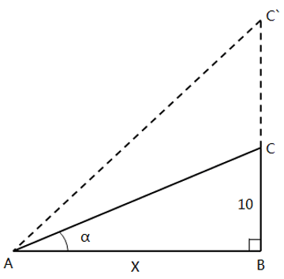

# 2017年422联考《行测》题（新疆卷）

> 数量关系 · 11 题 · 新疆 2017

## 第 1 题　qid 2051398 · 数学运算

2.1，4.5，8.9，16.13，32.17，（）

- **A**. 64.19
- **B**. 64.21　✅
- **C**. 128.19
- **D**. 128.21

**答案**：B

**官方解析**

数列出现小数点，考虑机械划分。整数部分：2、4、8、16、32，整数部分为公比是2的等比数列，故下一项整数部分为64；小数部分：1、5、9、13、17，小数部分为公差是4的等差数列，故下一项小数部分为21。则所求项为：64.21。
故正确答案为B。

---

## 第 2 题　qid 2051412 · 数学运算

甲乙两个班各有30多名学生，甲班男女生比为5:6，乙班男女生比为5:4，问甲、乙两班男生总数比女生总数：

- **A**. 多1人　✅
- **B**. 少1人
- **C**. 多2人
- **D**. 少2人

**答案**：A

**官方解析**

根据题意可得甲班人数为的倍数，满足条件的数字只有33，其中男生人数为人，女生人数为人；乙班人数为的倍数，满足条件的数字只有36，其中男生人数为人，女生人数为人。男生总人数为人，女生总人数为人，男生总数比女生总数多1人。

故正确答案为A。

---

## 第 3 题　qid 2049760 · 数学运算

某地举办铁人三项比赛，全程为51.5千米，游泳、自行车、长跑的路程之比为。小陈在这三个项目花费的时间之比为，比赛中他长跑的平均速度是15千米/小时，且两次换项共耗时4分钟，那么他完成比赛共耗时多少？

- **A**. 2小时14分
- **B**. 2小时24分
- **C**. 2小时34分　✅
- **D**. 2小时44分

**答案**：C

**官方解析**

方法一：由列表可得，小陈在游泳、自行车、长跑三项比赛中的速度之比为，其中长跑的速度为，则自行车的速度应为，游泳的速度为，可得三段路程的实际耗时如表所示，共计：小时，加上4分钟的换项时间，一共用时2小时34分。

方法二：由三个项目所花时间之比为，项目总时间是15的倍数，再加上换项耗时4分钟，则比赛总时间应为15的倍数加上4分钟，结合选项只有C项（154分钟）满足。

故正确答案为C。

---

## 第 4 题　qid 2049788 · 数学运算

某单位准备扩建一矩形花圃，若将矩形花圃的长和宽各增加4米，则新矩形花圃的面积比原来的面积增加了40平方米。那么，原矩形花圃的周长是多少？

- **A**. 12米　✅
- **B**. 24米
- **C**. 32米
- **D**. 40米

**答案**：A

**官方解析**

假设原矩形花圃的长和宽分别为、，根据题意可得：，整理得，则原矩形花圃周长为米。

故正确答案为A。

---

## 第 5 题　qid 2051344 · 数学运算

某水库决定对堤坝进行处理。如下图所示，水库大坝的迎水面的坡角为，坝高为10米。现要加高大坝，使坡度为1：1（坡度坡角的正切值），那么大坝要加高多少米？

- **A**. 

　✅
- **B**. 

- **C**. 

- **D**. 

**答案**：A

**官方解析**

截取大坝侧截面，如图所示为夹角为的直角三角形。设三角形底边为，则有，。现要加高大坝，使两直角边之比为1：1即，则，所需增加高度。 

故正确答案为A。

---

## 第 6 题　qid 2049532 · 数学运算

小王从编号分别为1、2、3、4、5的5本书中随机抽出3本，那么，这3本书的编号恰好为相邻三个整数的概率为：

- **A**. 

- **B**. 

- **C**. 

　✅
- **D**. 

**答案**：C

**官方解析**

。从5本书中随机抽出3本，总数为。这3本书的编号恰好为相邻三个整数即123，234，345三种情况，满足条件的数为3。故概率为：。

故正确答案为C。

---

## 第 7 题　qid 2049842 · 数学运算

如右图所示，甲和乙在面积为54π的半圆形游泳池内游泳，他们分别从位置A和B同时出发，沿直线同时游到位置C。若甲的速度为乙的2倍，则原来甲、乙两人相距：

- **A**. 
米

- **B**. 
米

- **C**. 
米

- **D**. 
米
　✅

**答案**：D

**官方解析**

由题意可得，甲的速度为乙的2倍，相同时间，距离与速度成正比，则，因AC为直径，则，又已知半圆的面积为，假设圆的半径为，则，，则，，，。

故正确答案为D。

---

## 第 8 题　qid 2049796 · 数学运算

某机场一条自动人行道长42m，运行速度0.75。小王在自动人行道的起始点将一件包裹通过自动人行道传递给位于终点位置的小明。小明为了节省时间，在包裹开始传递时，沿自动人行道逆行领取包裹并返回。假定小明的步行速度是1，则小明拿到包裹并回到自动人行道终点共需要的时间是：

- **A**. 24秒
- **B**. 42秒
- **C**. 48秒　✅
- **D**. 56秒

**答案**：C

**官方解析**

包裹开始传递时，速度为，小明逆向领取包裹速度为，小明和包裹相遇需要，此时距离小明起点，小明返回速度为，所需时间，共用时。

故正确答案为C。

---

## 第 9 题　qid 2050108 · 数学运算

某公司销售部拟派3名销售主管和6名销售人员前往3座城市进行市场调研，每座城市派销售主管1名，销售人员2名。那么，不同的人员派遣方案有：

- **A**. 540种　✅
- **B**. 1080种
- **C**. 1620种
- **D**. 3240种

**答案**：A

**官方解析**

根据题干可得，先排销售主管，销售主管的排法有：种；再排销售人员，销售人员的排法有：种；同时满足销售主管1名，销售人员2名，所以不同的人员派遣方案有：种。

故正确答案为A。

---

## 第 10 题　qid 2049754 · 数学运算

小明负责将某农场的鸡蛋运送到小卖部。按照规定，每送达1枚完整无损的鸡蛋，可得运费0.1元；若有鸡蛋破损，不仅得不到该枚鸡蛋的运费，每破损一枚鸡蛋还要赔偿0.4元。小明10月份共运送鸡蛋25000枚，获得运费2480元。那么，在运送过程中，鸡蛋破损了：

- **A**. 20枚
- **B**. 30枚
- **C**. 40枚　✅
- **D**. 50枚

**答案**：C

**官方解析**

设在运送过程中，鸡蛋破损了枚，则完好的鸡蛋有枚。根据条件可列方程：，解得。

故正确答案为C。

---

## 第 11 题　qid 2049564 · 数学运算

某件刺绣产品，需要效率相当的三名绣工8天才能完成；绣品完成时，一人有事提前离开，绣品由剩下的两人继续完成；绣品完成时，又有一人离开，绣品由最后剩下的那个人做完。那么，完成该件绣品一共用了：

- **A**. 10天
- **B**. 11天
- **C**. 12天
- **D**. 13天　✅

**答案**：D

**官方解析**

设每名绣工的效率为1，则工程总量。此项工程分成三个阶段。

第一阶段三名绣工做，需要天；

第二阶段两名绣工做，需要天；

第三阶段一名绣工做，需要天。

完成该件绣品一共用了天。

故正确答案为D。

---
