# 2017年422联考《行测》题（江西卷）

> 数量关系 · 15 题 · 江西 2017

## 第 1 题　qid 2050926 · 数学运算

某公司研发出了一款新产品，当每件新产品的售价为3000元时，恰好能售出15万件。若新产品的售价每增加200元时，就要少售出1万件。如果该公司仅售出12万件新产品，那么该公司新产品的销售总额为：

- **A**. 4.72亿元
- **B**. 4.46亿元
- **C**. 4.64亿元
- **D**. 4.32亿元　✅

**答案**：D

**官方解析**

根据题意可知“新产品的售价每增加200元时，就要少售出1万件”，该公司最后销售12万件，则少售出了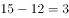万件，售价增加了万元，则最后的售价为万元，因此该公司新产品的销售总额。

故正确答案为D。

---

## 第 2 题　qid 2050938 · 数学运算

某高校今年计划招收各类学生6630人，比去年增长，其中本科生比去年减少，研究生的招生计划数比去年增加。那么，该校今年研究生的招生计划数为：

- **A**. 3052人
- **B**. 3161人
- **C**. 3270人　✅
- **D**. 3379人

**答案**：C

**官方解析**

今年招收6630人，比去年增长，则去年总人数，根据线段法，本科生和研究生增长率的距离之比为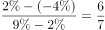，由于增长率的距离和基期量成反比，则去年本科生和研究生人数之比为，因此去年研究生的招生计划数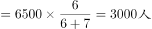，今年研究生的招生计划数。

故正确答案为C。

---

## 第 3 题　qid 2050962 · 数学运算

老张购进一批商品，共20件。销售时，每件合格的商品可以赚50元，不合格的商品一件亏20元。他卖出的这20件商品中有几件是不合格的，那么卖出这批商品可能赚：

- **A**. 690元
- **B**. 720元　✅
- **C**. 780元
- **D**. 850元

**答案**：B

**官方解析**

设不合格的产品有件（一定为正整数），则合格的产品有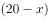件。商品总利润，代入A选项，即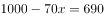，，不是整数，排除；代入B选项，即，解得，满足是正整数的条件，正确。

故正确答案为B。

---

## 第 4 题　qid 2050984 · 数学运算

某乡有32户果农，其中有26户种了柚子树，有24户种了橘子树，还有5户既没有种柚子树也没有种橘子树，那么该乡同时种植柚子树和橘子树的果农有：

- **A**. 23户　✅
- **B**. 22户
- **C**. 21户
- **D**. 24户

**答案**：A

**官方解析**

由容斥原理公式可得，种柚子+种橘子-两种都种=总数-两种都不种，代入数字：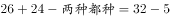，解得：两种都种户。

故正确答案为A。

---

## 第 5 题　qid 2050988 · 数学运算

某地区居民生活用水每月标准用水量的基本价格为每吨3元，若每月用水量超过标准用水量，超出部分按基本价格的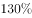收费。某户六月份用水25吨，共交水费83.1元，则该地区每月标准用水量为：

- **A**. 12吨
- **B**. 14吨
- **C**. 15吨
- **D**. 16吨　✅

**答案**：D

**官方解析**

设每月标准用水量为吨，则六月有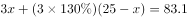，解得。

故正确答案为D。

---

## 第 6 题　qid 2050990 · 数学运算

某人雇用了甲、乙、丙三名工人加工一批零件，其中有87个零件不是甲加工的，有86个零件不是乙加工的，有85个零件不是丙加工的，那么甲加工的零件数是：

- **A**. 42个　✅
- **B**. 43个
- **C**. 44个
- **D**. 45个

**答案**：A

**官方解析**

根据题意可得方程组：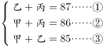，②式+③式-①式=2甲=84，解得甲=42个。因此，甲加工了42个零件。

---

## 第 7 题　qid 2050994 · 数学运算

一辆动车组列车和一辆快速列车相向而行，动车组列车的车长是260米，快速列车的车长是455米。坐在动车组列车上的人看快速列车驶过的时间是7秒，那么坐在快速列车上的人看动车组列车驶过的时间是：

- **A**. 3秒
- **B**. 4秒　✅
- **C**. 5秒
- **D**. 6秒

**答案**：B

**官方解析**

因为两车是相向而行，所以不管坐在动车组列车还是快速列车上，相对另一辆车的速度都一样，就是两车速度和。坐在动车组列车上，7秒可以让快速列车行驶过，则相对速度为。

坐在快速列车上，让动车组行驶过，则需要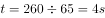。

故正确答案为B。

---

## 第 8 题　qid 2051000 · 数学运算

某超市购进三种不同的糖，每种糖所用的费用相等，已知这三种糖每千克的费用分别为11元、12元、13.2元。如果把这三种糖混在一起成为什锦糖，那么这种什锦糖每千克的成本是：

- **A**. 12.6元
- **B**. 11.8元
- **C**. 12元　✅
- **D**. 11.6元

**答案**：C

**官方解析**

赋值法：根据题意，设三种糖购入的费用均为132元，那么的糖的重量为千克；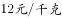的糖的重量为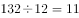千克；的糖的重量为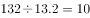千克。三种糖总重量为千克，总费用为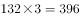元，所以什锦糖每千克的成本是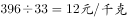。

故正确答案为C。

---

## 第 9 题　qid 2051028 · 数学运算

3年前张三的年龄是他女儿的17倍，3年后张三的年龄是他女儿的5倍，那么张三的女儿现在：

- **A**. 2岁
- **B**. 3岁
- **C**. 4岁
- **D**. 5岁　✅

**答案**：D

**官方解析**

根据题意，设张三的女儿三年前的年龄为岁，则张三和他女儿现在、三年前和三年后的年龄有如下关系：

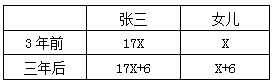

三年后张三的年龄是女儿的5倍则有：

，

解得，因此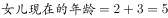岁。

故正确答案为D。

---

## 第 10 题　qid 2051030 · 数学运算

如果从甲船看乙船，乙船在甲船的西偏北65°方向，那么从乙船看甲船，甲船在乙船的：

- **A**. 东偏南75°方向
- **B**. 东偏南65°方向　✅
- **C**. 西偏南75°方向
- **D**. 北偏东25°方向

**答案**：B

**官方解析**

根据题意，乙在甲的西边，则甲在乙的东边，乙在甲的北边，甲在乙的南边，排除CD项，因题干中只有一个角度65°，只有B项满足。如下图所示：

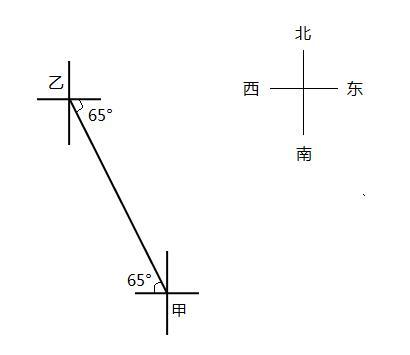

故正确答案为B。

---

## 第 11 题　qid 2051032 · 数学运算

某市出租车的计费方式如下：路程在2公里以内（含2公里）为8元；达到2公里后，每增加1公里收费1.9元；达到8公里以后，每增加1公里收费2.1元，增加不足1公里时按四舍五入计算。某乘客乘坐这种出租车交了44.6元车费，则该乘客乘坐此出租车行驶的路程为：

- **A**. 18公里
- **B**. 19公里
- **C**. 20公里　✅
- **D**. 21公里

**答案**：C

**官方解析**

根据选项可得，路程超过8公里且为整数，假设路程为，根据题意可列方程：，解得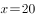公里。

故正确答案为C。

---

## 第 12 题　qid 2051036 · 数学运算

从两双完全相同的鞋中，随机抽取一双鞋的概率是：

- **A**. 

　✅
- **B**. 

- **C**. 

- **D**. 
1

**答案**：A

**官方解析**

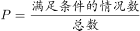,两双相同的鞋子一共四只，则从四只里选出两只，总数为,满足条件的一双鞋则是左脚一只，右脚一只。左脚一共两只，选其中一只是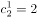种情况，同理右脚也是两种情况，分步用乘法，种。所以。

故正确答案为A。

---

## 第 13 题　qid 2051044 · 数学运算

有A、B两瓶混合液，A瓶中水、油、醋的比例为，B瓶中水、油、醋的比例为，将A、B两瓶混合液倒在一起后，得到的混合液中水、油、醋的比例可能为：

- **A**. 

- **B**. 

- **C**. 

　✅
- **D**. 
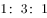

**答案**：C

**官方解析**

混合前，水、油的比例A为，即油是水的3倍不到，B为，即油是水的2倍，则混合后，油和水的倍数在2倍到3倍之间，排除A、B、D项。故只有C项满足。 

故正确答案为C。

---

## 第 14 题　qid 2051046 · 数学运算

有一个20世纪80年代出生的人，如果他能活到80岁，那么有一年他的年龄的平方数正好等于那一年的年份。此人生于：

- **A**. 1985年
- **B**. 1984年
- **C**. 1983年
- **D**. 1980年　✅

**答案**：D

**官方解析**

假设出生的年份为，80岁时对应年份为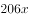，故年份对应的平方数取值范围为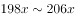，取值验证：

若当他50岁时，年龄的平方数与那一年年份相同，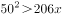，与题意不符，排除；

若当他40岁时，年龄的平方数与那一年年份相同，，与题意不符，排除；

若当他45岁时，年龄的平方数与那一年年份相同，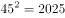，且，满足题意，故此人出生于1980年。

故正确答案为D。

---

## 第 15 题　qid 2051048 · 数学运算

将一批葡萄平均分装在36个箱子中，发现箱子没有装满，如果每箱多装，则只需要使用箱子：

- **A**. 31个
- **B**. 32个　✅
- **C**. 33个
- **D**. 34个

**答案**：B

**官方解析**

假设原来每箱装的葡萄量为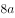，葡萄总量为，多装，现在每箱装葡萄的量为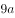，需要箱子：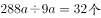。

故正确答案为B。

---
