# 2017年422联考《行测》题（浙江B卷）

> 数量关系 · 18 题 · 浙江 2017

## 第 1 题　qid 2050250 · 数学运算

1，，，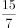，，（  ）

- **A**. 

- **B**. 
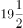

- **C**. 
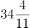

- **D**. 

　✅

**答案**：D

**官方解析**

原数列可转化为：，，，，，（  ），观察可得分母是公差为2的等差数列，前后项分子存在明显倍数关系，倍数依次是1，3，5，7，倍数为公差为2的等差数列。则所求项分子为：，分母为：，即。

故正确答案为D。

---

## 第 2 题　qid 2050256 · 数学运算

4，-2，1，3，2，6，11，（  ）

- **A**. 16
- **B**. 19　✅
- **C**. 22
- **D**. 25

**答案**：B

**官方解析**

数列起伏不定，作差没有规律，考虑递推。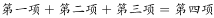，则所求项：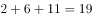。

故正确答案为B。

---

## 第 3 题　qid 2050258 · 数学运算

-1，1，3，10，19，（  ），55

- **A**. 27
- **B**. 35　✅
- **C**. 43
- **D**. 56

**答案**：B

**官方解析**

数列单调递增，作差之后无明显规律，考虑作和。作和之后可得新数列：0，4，13，29，对新数列作差可得：4，9，16，为平方数数列，故下一项差应为25，即新数列下一项应为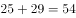，则原数列所求项为。

故正确答案为B。

---

## 第 4 题　qid 2049760 · 数学运算

某地举办铁人三项比赛，全程为51.5千米，游泳、自行车、长跑的路程之比为。小陈在这三个项目花费的时间之比为，比赛中他长跑的平均速度是15千米/小时，且两次换项共耗时4分钟，那么他完成比赛共耗时多少？

- **A**. 2小时14分
- **B**. 2小时24分
- **C**. 2小时34分　✅
- **D**. 2小时44分

**答案**：C

**官方解析**

方法一：由列表可得，小陈在游泳、自行车、长跑三项比赛中的速度之比为，其中长跑的速度为，则自行车的速度应为，游泳的速度为，可得三段路程的实际耗时如表所示，共计：小时，加上4分钟的换项时间，一共用时2小时34分。

方法二：由三个项目所花时间之比为，项目总时间是15的倍数，再加上换项耗时4分钟，则比赛总时间应为15的倍数加上4分钟，结合选项只有C项（154分钟）满足。

故正确答案为C。

---

## 第 5 题　qid 2049532 · 数学运算

小王从编号分别为1、2、3、4、5的5本书中随机抽出3本，那么，这3本书的编号恰好为相邻三个整数的概率为：

- **A**. 

- **B**. 

- **C**. 

　✅
- **D**. 

**答案**：C

**官方解析**

。从5本书中随机抽出3本，总数为。这3本书的编号恰好为相邻三个整数即123，234，345三种情况，满足条件的数为3。故概率为：。

故正确答案为C。

---

## 第 6 题　qid 2049852 · 数学运算

妈妈为了给过生日的小东一个惊喜，在一底面半径为20cm、高为60cm的圆锥形生日帽内藏了一个圆柱形礼物盒。为了不让小东事先发现礼物盒，该礼物盒的侧面积最大为多少？

- **A**. 

　✅
- **B**. 

- **C**. 

- **D**. 

**答案**：A

**官方解析**

要想礼物盒侧面积尽可能大，则礼物盒应内接于圆锥形生日帽子，假设圆柱形礼物盒底面半径为，高为，如下图所示：C点在母线AF上，直角三角形ABC相似于直角三角形AOF，则，，。因礼物盒侧面积为，当时，礼物盒侧面积取得最大值为。

故正确答案为A。

---

## 第 7 题　qid 2050108 · 数学运算

某公司销售部拟派3名销售主管和6名销售人员前往3座城市进行市场调研，每座城市派销售主管1名，销售人员2名。那么，不同的人员派遣方案有：

- **A**. 540种　✅
- **B**. 1080种
- **C**. 1620种
- **D**. 3240种

**答案**：A

**官方解析**

根据题干可得，先排销售主管，销售主管的排法有：种；再排销售人员，销售人员的排法有：种；同时满足销售主管1名，销售人员2名，所以不同的人员派遣方案有：种。

故正确答案为A。

---

## 第 8 题　qid 2049768 · 数学运算

小张家距离工厂15千米，乘坐班车20分钟可到工厂。一天，他错过班车，改乘出租车上班。出租车出发时间比班车晚4分钟，送小张到工厂后出租车马上原路返回，在距离工厂1.875千米处与班车相遇。如果班车和出租车都是匀速运动且不计上下车时间，那么小张比班车早多少分钟到达工厂？

- **A**. 3
- **B**. 4　✅
- **C**. 5
- **D**. 6

**答案**：B

**官方解析**

小张家距离工厂的路程为15千米，班车20分钟可以到达。则班车的速度千米分钟。出租车出发时间比班车晚4分钟，则出租车出发时，班车已走了千米，距离终点还剩千米。从此时开始到相遇，班车所走路程为千米，出租车所走路程为千米，根据时间相等，路程和速度成正比，可得：，解得千米分钟。从家到工厂，出租车行驶分钟，加上晚出发的4分钟，共16分钟，比原来（即班车）提前4分钟到达。

故正确答案为B。

---

## 第 9 题　qid 2049566 · 数学运算

由于连日暴雨，某水库水位急剧上升，逼近警戒水位。假设每天降雨量一致，若打开2个水闸放水，则3天后正好到达警戒水位；若打开3个水闸放水，则4天后正好到达警戒水位。气象台预报，大雨还将持续七天，流入水库的水量将比之前多。若不考虑水的蒸发、渗透和流失，则至少打开几个水闸，才能保证接下来的七天都不会到达警戒水位？

- **A**. 5
- **B**. 6　✅
- **C**. 7
- **D**. 8

**答案**：B

**官方解析**

设水库原有水量为，警戒水位的水量为，每天降水量为，每个水闸每天放水量为1。则根据水库水量变化过程可得：

；

可以解得，。

气象台预报，流入水库的水量增加20%，则每天水库水量增加，设未来7天至少打开n个水闸可以保证水位低于警戒水位。则可得方程如下：

，代入数据可得，，故至少打开5.5个水闸，应向上取整为6个水闸。

故正确答案为B。

---

## 第 10 题　qid 2049796 · 数学运算

某机场一条自动人行道长42m，运行速度0.75。小王在自动人行道的起始点将一件包裹通过自动人行道传递给位于终点位置的小明。小明为了节省时间，在包裹开始传递时，沿自动人行道逆行领取包裹并返回。假定小明的步行速度是1，则小明拿到包裹并回到自动人行道终点共需要的时间是：

- **A**. 24秒
- **B**. 42秒
- **C**. 48秒　✅
- **D**. 56秒

**答案**：C

**官方解析**

包裹开始传递时，速度为，小明逆向领取包裹速度为，小明和包裹相遇需要，此时距离小明起点，小明返回速度为，所需时间，共用时。

故正确答案为C。

---

## 第 11 题　qid 2049842 · 数学运算

如右图所示，甲和乙在面积为54π的半圆形游泳池内游泳，他们分别从位置A和B同时出发，沿直线同时游到位置C。若甲的速度为乙的2倍，则原来甲、乙两人相距：

- **A**. 
米

- **B**. 
米

- **C**. 
米

- **D**. 
米
　✅

**答案**：D

**官方解析**

由题意可得，甲的速度为乙的2倍，相同时间，距离与速度成正比，则，因AC为直径，则，又已知半圆的面积为，假设圆的半径为，则，，则，，，。

故正确答案为D。

---

## 第 12 题　qid 2050280 · 数学运算

如下图所示，某条河流一侧有A、B两家工厂，与河岸的距离分别为4km和5km，且A与B的直线距离为11km。为了处理这两家工厂的污水，需要在距离河岸1km处建造一个污水处理厂，分别铺设排污管道连接A、B两家工厂。假定河岸是一条直线，则排污管道总长最短是：

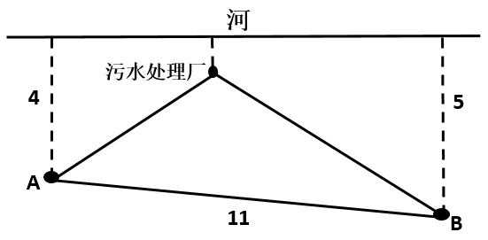

- **A**. 12km
- **B**. 13km　✅
- **C**. 14km
- **D**. 15km

**答案**：B

**官方解析**

如下图所示，过污水处理厂做河岸的平行线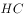，为关于的对称点，则最短距离为，由题污水厂离河1km可得点距离到为，点距离等于，则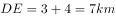。，所以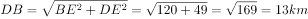。

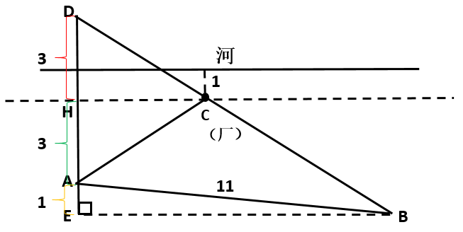

故正确答案为B。

---

## 第 13 题　qid 2049776 · 数学运算

某商店促销，购物满足一定金额可进行摸球抽奖，中奖率。规则如下：抽奖箱中有大小相同的若干个红球和白球，从中摸出两个球，如果都是红球，获一等奖；如果都是白球，获二等奖；如果是一红一白，获三等奖。假定一、二、三等奖的概率分别为0.1、0.3、0.6，那么抽奖箱中球的个数为：

- **A**. 5　✅
- **B**. 6
- **C**. 7
- **D**. 8

**答案**：A

**官方解析**

方法一：根据条件，设箱内一共有小球个，其中红球个。若从中摸出两个都是红球，则获一等奖，其概率为0.1。，化简后得：。代入选项：

A项：当时，解得，当选；B项：当时，解得不为整数，排除；

C项：当时，解得不为整数，排除；D项:当时，解得不为整数，排除。

满足条件的只有A项。

方法二：一等奖的概率为0.1即，说明总情况数（即摸出2个球的情况数）一定是10的倍数。设球的个数为n，则总情况数是10的倍数，代入选项，只有当n＝5时满足。

故正确答案为A。

---

## 第 14 题　qid 2049754 · 数学运算

小明负责将某农场的鸡蛋运送到小卖部。按照规定，每送达1枚完整无损的鸡蛋，可得运费0.1元；若有鸡蛋破损，不仅得不到该枚鸡蛋的运费，每破损一枚鸡蛋还要赔偿0.4元。小明10月份共运送鸡蛋25000枚，获得运费2480元。那么，在运送过程中，鸡蛋破损了：

- **A**. 20枚
- **B**. 30枚
- **C**. 40枚　✅
- **D**. 50枚

**答案**：C

**官方解析**

设在运送过程中，鸡蛋破损了枚，则完好的鸡蛋有枚。根据条件可列方程：，解得。

故正确答案为C。

---

## 第 15 题　qid 2050118 · 数学运算

某大学考场在8个时间段内共安排了10场考试，除了中间某个时间段（非头尾时间段）不安排考试外，其他每个时间段安排1场或2场考试。那么，考场有多少种考试安排方式（不考虑考试科目的不同）？

- **A**. 210　✅
- **B**. 270
- **C**. 280
- **D**. 300

**答案**：A

**官方解析**

由题干“中间某个时间段（非头尾时间段）不安排考试”，因此第一步可以先计算不安排考试的时段，有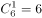种情况；第二步计算有7个时段安排考试，又“每个时间段安排1场或2场考试”，因此7个时段中有3个时段要安排两场考试，有种情况。所以该考场的考试安排方式有：种。

故正确答案为A。

---

## 第 16 题　qid 2049560 · 数学运算

如右图所示，幼儿园老师用边长为的正八边形纸皮，裁去四个同样大小的等腰直角三角形，做成长方体包装盒。如果用该包装盒存放体积为的立方体积木（不得凸出包装盒外沿），那么，这个盒子最多可以放入多少块积木？

- **A**. 75　✅
- **B**. 80
- **C**. 85
- **D**. 90

**答案**：A

**官方解析**

等腰直角三角形斜边长为，则直角边长为，即长方体的高为。立方体积木的体积为，则积木的棱长为。长方体底面积为，则每层可放块，高层。由于不得凸出包装盒外沿，所以最多放3层，这个盒子最多可以放入块积木。

故正确答案为A。

---

## 第 17 题　qid 2049564 · 数学运算

某件刺绣产品，需要效率相当的三名绣工8天才能完成；绣品完成时，一人有事提前离开，绣品由剩下的两人继续完成；绣品完成时，又有一人离开，绣品由最后剩下的那个人做完。那么，完成该件绣品一共用了：

- **A**. 10天
- **B**. 11天
- **C**. 12天
- **D**. 13天　✅

**答案**：D

**官方解析**

设每名绣工的效率为1，则工程总量。此项工程分成三个阶段。

第一阶段三名绣工做，需要天；

第二阶段两名绣工做，需要天；

第三阶段一名绣工做，需要天。

完成该件绣品一共用了天。

故正确答案为D。

---

## 第 18 题　qid 2049538 · 数学运算

为规范和平衡进口行业，国家对跨境电商进口施行新的税收政策，因此海外代购成本大幅上涨，代购商也相应提高了零售价。若某种代购商品国内零售价格上涨的额度是其海外采购成本上涨额度的2倍，这样消费者花6000元所能购买到的这种商品数量比之前减少了20件，代购商的利润率则从原先的上升到三分之一，那么税改后该代购商出售此种商品每件的利润是多少？

- **A**. 30元
- **B**. 25元
- **C**. 20元
- **D**. 15元　✅

**答案**：D

**官方解析**

设原来利润为a，税改后利润为b，则可得下表数据：

根据“国内零售价格上涨的额度是其海外采购成本上涨额度的2倍”，可得，，解得。再根据6000元可购买商品数量减少20件可得，解得。

故正确答案为D。

---
