# 2017年422联考《行测》题（陕西卷）

> 数量关系 · 10 题 · 陕西 2017

## 第 1 题　qid 2051476 · 数学运算

某市有n个服装厂，第i个服装厂派出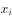名员工到剧院观看行业协会组织的节目演出（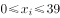，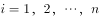），总人数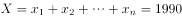。剧院的每一横排有199个座位，要求每一服装厂的员工必须坐在同一横排，则剧院至少要安排多少横排座位才能保证全部员工都按要求入座？

- **A**. 17
- **B**. 16
- **C**. 15
- **D**. 14
- **E**. 13
- **F**. 12　✅
- **G**. 11
- **H**. 10

**答案**：F

**官方解析**

题目问“至少······才能保证”，因此本题为最值问题中的最不利构造。

要满足“至少要安排多少横排座位才能保证全部员工都按要求入座”，最坏情况为总排数最多，要想总排数最多，则每排就座的人数要最少，每排的空位要最多。每排空位最多，也就是“每排座位数”除以“每个服装厂人数”，余数最大。每排座位数为199个，199每个服装厂人数商······余数，要让余数尽可能大，则每个服装厂人数尽可能大，且余数和每个服装厂人数尽可能接近。

因为每个服装厂人数，最多为39人，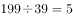······4，但4和39差距较大，不满足条件。尝试38、37······，经过依次验算之后，可得······29，此时29和34差距就比较小了。但此时也并非为最优解，因为每个服装厂人数不一定都是34人，可以进行调整，使得更加符合题目条件。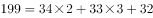，即每一排中有两个服装厂人数为34人，三个服装厂人数为33人，这样余数为32，此时32与33之间仅差1，最能满足题目条件。每一排的人数为人，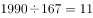排······153人，剩余的153人需要再安排1排，所以至少需要排。

故正确答案为F。

---

## 第 2 题　qid 2051514 · 数学运算

要使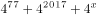成为完全平方数的最大整数为多少？

- **A**. 2188
- **B**. 2576
- **C**. 3956　✅
- **D**. 4041
- **E**. 5545
- **F**. 5982
- **G**. 6578
- **H**. 7056

**答案**：C

**官方解析**

原式提公因子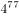得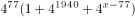，由于是一个完全平方数，要想原式为完全平方数，因此必须为完全平方数。

，对应完全平方和公式，对应的，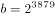,因此，所以，解得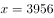。

故正确答案为C。

---

## 第 3 题　qid 2054188 · 数学运算

一条过圆心的铁丝把一个圆形铁环分成两个半圆周，在每个分点标上质数；第二次用铁丝把两个半圆周的每一个分成两个相等的圆周，在新产生的分点标上相邻两数和的；第三次用铁丝把四个圆周的每一个分成两个相等的圆周，在新产生的分点标上相邻两数和的······如此进行了n次之后，铁环上的所有数字之和为6188，则m和n的值分别为（  ）。

- **A**. 2和80
- **B**. 3和70
- **C**. 5和60
- **D**. 7和50　✅
- **E**. 11和40
- **F**. 13和30
- **G**. 17和20
- **H**. 19和10

**答案**：D

**官方解析**

根据题意可知，第一次两个分点标的数字为质数，第一次所有数字之和为；

第二次新产生的2个分点为，第二次所有数字之和为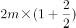；

第三次新产生的4个分点为，第三次所有数字之和为；

第四次新产生的8个分点为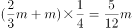，第四次所有数字之和为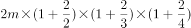；

以此类推，第n次所有数字之和为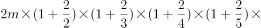⋯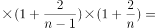⋯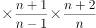，错位约分可得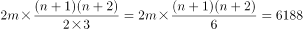，则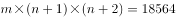。

代入A选项，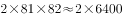远远小于18564，排除；

代入B选项，尾数为6，排除；

代入C选项，与5相乘尾数为0或5，排除；

代入D选项，，当选。

故正确答案为D。

---

## 第 4 题　qid 2054190 · 数学运算

设n为正整数，如果存在一个完全平方数（比如，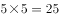，25就是一个完全平方数），使得在十进制表示下此完全平方数的各数字之和为n，那么n被称作好数（比如，7是一个好数，因为25的各数字之和为7）。那么，在1，2，3，……，2017中共有（  ）个好数。

- **A**. 895
- **B**. 896
- **C**. 897　✅
- **D**. 898
- **E**. 899
- **F**. 900
- **G**. 901
- **H**. 902

**答案**：C

**官方解析**

通过枚举平方数并求和：1,4,9,16,25,36,49,64,81,100，121,144,169,196,225,256,289,324,361,400,441,484,529,576……，

会发现这些平方数各位数字之和为1,4,7,9,10,13,16,18,19等，进一步研究会发现这些数由两部分构成：9，18；1，4，7，10，13，16，19，前者是9的倍数，后者是3的倍数加1，所以找出2017内9的倍数以及除以3余1的数，相加即为所求，则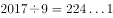，，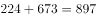。

故正确答案为C。

---

## 第 5 题　qid 2054192 · 数学运算

一家自来水厂给6个村庄供水，这6个村庄恰好位于一条直线上，从自来水厂到这6个村庄的距离分别为10千米、12千米、15千米、20千米、22千米和25千米。现需要安装连接自来水厂和各个村庄的水管，有粗细两种水管可供选择。粗管可供所有村庄用水，每千米要花费6000元；细管只能供一个村庄用水，每千米要花费2000元。粗管和细管可以互相连接，相互搭配。要安装满足这6个村庄用水需求的管道系统，则最少需要花费（  ）元。

- **A**. 208000
- **B**. 150000
- **C**. 148000
- **D**. 140000
- **E**. 134000　✅
- **F**. 130000
- **G**. 126000
- **H**. 120000

**答案**：E

**官方解析**

题目要求花费最少，那就让自来水厂和六个村庄都在同一条线上，此时可以尽量让多个村庄用一条大水管。尝试用枚举法解答：

情况一：假设自来水厂到距离20km的村庄用一条大水管，需要花费元，则20km的到22km的村庄以及20km到25km的村庄分别用一条小水管，需要花费元，则一共花费元。

情况二：自来水厂到距离15km的村庄用一条大水管，需要花费元，则15km到20km、15km到22km、15km到25km分别需要一条细水管，需要花费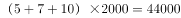元，则一共花费元。

枚举多种情况会发现，最少花费均为134000元。

故正确答案为E。

---

## 第 6 题　qid 2054194 · 数学运算

从1，2，3，4，5，6，7，8，9中选择两个数，使它们的和为质数，则共有（  ）种不同的选择方式。

- **A**. 19
- **B**. 18
- **C**. 17
- **D**. 16
- **E**. 15
- **F**. 14　✅
- **G**. 13
- **H**. 12

**答案**：F

**官方解析**

根据题干条件“两数之和为质数”，则1到9两数之和构成的数最小为3，最大为17，3到17之间的质数有3，5，7，11，13，17这6个数。，1种；，2种；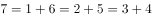，3种；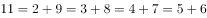，4种；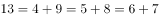，3种；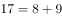，1种。共计选择方式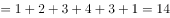种。

故正确答案为F。

---

## 第 7 题　qid 2054196 · 数学运算

在一项课题研究中，数据搜集方式有问卷调研、当面访谈与电话访谈三种。参加问卷调研的有27人，参加电话访谈的有21人。参加了三种数据搜集方式的有5人，既参加问卷调研又参加当面访谈的有9人，既参加问卷调研又参加电话访谈的有12人，既参加当面访谈又参加电话访谈的有7人。已知只参加当面访谈的人数占数据搜集人员总数的，则数据搜集人员共有（  ）人。

- **A**. 45　✅
- **B**. 50
- **C**. 55
- **D**. 60
- **E**. 65
- **F**. 70
- **G**. 75
- **H**. 80

**答案**：A

**官方解析**

根据“问卷调研、当面访谈与电话访谈”判定是三集合容斥问题。设只参加当面访谈的人数为，则数据搜集人数总数为，因为参加三者的有5人，既参加问卷调研又参加当面访谈的有9人，所以只参加问卷调研和当面访谈的有人；因为既参加当面访谈又参加电话访谈的有7人，所以只参加当面访谈和参加电话访谈的有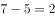人。因此参加当面访谈的有人。根据三集合容斥标准公式得，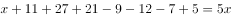，解得人。所以数据收集总人数为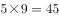人。

故正确答案为A。

---

## 第 8 题　qid 2054198 · 数学运算

在“烟头不落地，西安更美丽”的倡导下，四个志愿者小组上街捡烟头。已知某天甲组捡了320个烟头，乙组比丙组少捡32个烟头，丙组捡到的烟头数是甲乙两组之和的，丁组捡到的烟头数是甲乙丙三组之和的，那么丁组捡了（  ）个烟头。

- **A**. 160
- **B**. 196
- **C**. 224　✅
- **D**. 256
- **E**. 280
- **F**. 316
- **G**. 324
- **H**. 356

**答案**：C

**官方解析**

根据题干条件“甲组捡了320个烟头，乙组比丙组少捡32个烟头，丙组捡到的烟头数是甲乙两组之和的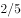，丁组捡到的烟头数是甲乙丙三组之和的”得出：

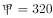······①

······②

······③

······④

根据上述方程得出：，，，。

故正确答案为C。

---

## 第 9 题　qid 2054200 · 数学运算

甲车从A地开往B地，乙车从B地开往A地。上午八点整，两车同时出发，相向而行，相遇后继续向前。甲车又行驶了2小时到达B地，乙车又行驶了4.5小时到达A地。甲乙两车到达目的地后都立即返回，则在返程途中两车再次相遇时，时间为（  ）。

- **A**. 14点整
- **B**. 14点半
- **C**. 15点整
- **D**. 15点半
- **E**. 16点整
- **F**. 16点半
- **G**. 17点整　✅
- **H**. 17点半

**答案**：G

**官方解析**

设甲、乙两车从开始到第一次相遇所用时间为小时。甲在第一次相遇前走的路程即是乙4.5小时所走的路程，则有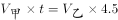，得到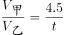；乙第一次相遇前所走的路程即是甲2小时所走的路程，有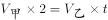，得到。则 ，解得。两车再次相遇时即两车共走了3倍的AB全长，时间也是原来的3倍。故两车从开始到第二次相遇所用时间为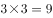小时，时间为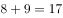点整。

故正确答案为G。

---

## 第 10 题　qid 2054202 · 数学运算

今年是鸡年，公历年数为2017。小王发现，在未来十年内的某一年，他年龄的平方数正好是那年的公历年数，则小王的属相为（ ）

- **A**. 牛
- **B**. 虎
- **C**. 兔
- **D**. 龙
- **E**. 蛇
- **F**. 马
- **G**. 羊
- **H**. 猴　✅

**答案**：H

**官方解析**

根据小王的年龄“在未来十年内的某一年，他年龄的平方数正好是那年的公历年数”，则年龄的平方数范围为2018～2027。因为，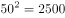，居中代入，，符合题干条件，所以小王在2025年时45岁，则2028年小王48岁，2028年为小王的本命年。根据2017年是鸡年，则2029年为鸡年，推得2028年为猴年，小王的属相为猴。

故正确答案为H。

---
