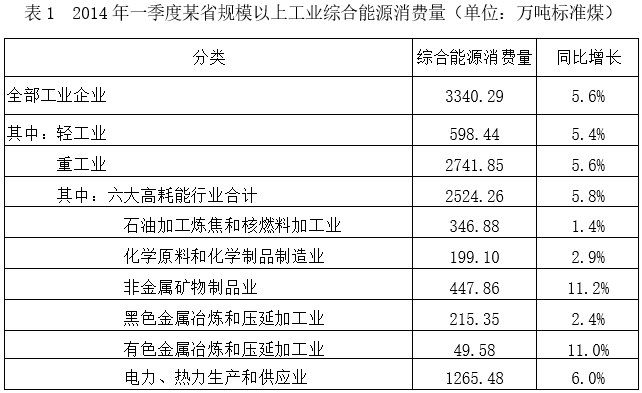
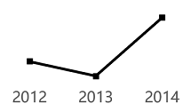
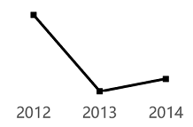
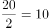

# 2017年上海市行政执法类考试《行测》试题（网友回忆版）

> 数量关系 · 18 题 · 上海 2017

## 材料 1

        有关研究表明，2013年j国普通家庭平均收入为77381元，平均税费支出32369元，家庭在衣、食、住方面的花销占总收入的36.1%。50年前，j国普通家庭的平均收入约5000元，其中56.5%用在衣、食、住上面，而税费支出只占收入的33.5%。50年来，j国普通家庭在住房上的支出共增加了1375%，衣服和食物的支出分别增加了620%和546%。这些年来，j国的消费者价格指数增长了682%。

### 第 1 题　qid 5692301 · 数学运算

关于2013年j国普通家庭的税费支出，错误的说法是        。

- **A**. 平均税费支出为32369元
- **B**. 家庭税费支出占收入的百分比为43.8%　✅
- **C**. 家庭税费支出占收入的比重大于在衣、食、住方面的花销占收入的比重
- **D**. 家庭税费支出比家庭在衣、食、住方面的花销多4400元左右

**答案**：B

**官方解析**

A项：定位材料可得：2013年j国普通家庭平均税费支出32369元，正确；

B项：定位材料可得：2013年j国普通家庭平均收入为77381元，平均税费支出32369元。根据公式：比重，则家庭税费支出占收入的比重，并非43.8%，错误；

C项：定位材料可得：2013年j国普通家庭在衣、食、住方面的花销占总收入的36.1%；根据B项可知家庭税费支出占收入的比重约为41.8%。则家庭税费支出占收入的比重大于在衣、食、住方面的花销占收入的比重，正确；

D项：定位材料可得：2013年j国普通家庭平均收入为77381元，平均税费支出32369元，家庭在衣、食、住方面的花销占总收入的36.1%。根据公式：部分=整体×比重，则2013年j国普通家庭在衣、食、住方面的花销元，则家庭税费支出比家庭在衣、食、住方面的花销多32369-28000=4369元，即4400元左右，正确。

本题为选非题，故正确答案为B。

---

### 第 2 题　qid 5692302 · 数学运算

50年前，j国普通家庭用在衣、食、住上面的花销为        元。

- **A**. 2825　✅
- **B**. 5000
- **C**. 1675
- **D**. 2793

**答案**：A

**官方解析**

根据题干“50年前······花销为        元”，结合材料给出50年前家庭的平均收入及衣、食、住的占比，可判定本题为现期比重问题。定位材料可得：50年前，j国普通家庭的平均收入约5000元，其中56.5%用在衣、食、住上面。根据公式：部分=整体×比重，则所求=5000×56.5%=2825元。
故正确答案为A。

---

### 第 3 题　qid 5692303 · 数学运算

50年来，j国普通家庭的税费支出变化，正确的说法是        。

- **A**. 2013年是50年前的1832%
- **B**. 2013年是50年前的1732%
- **C**. 2013年比50年前增加了1832%　✅
- **D**. 2013年比50年前增加了1732%

**答案**：C

**官方解析**

根据题干“50年来，j国普通家庭的税费支出变化”，结合选项给出2013年与50年前相比的倍数和增速，可判定本题为一般增长率问题。定位材料可得：2013年j国普通家庭平均税费支出32369元；50年前，j国普通家庭的平均收入约5000元，税费支出只占收入的33.5%。则50年前j国普通家庭的税费支出=5000×33.5%=1675元，则2013年的税费支出是50年前的倍，即增加了19-1=18=1800%，与C项最接近。

故正确答案为C。

---

### 第 4 题　qid 12118309 · 数学运算

50年来，j国普通家庭的收入与支出变化，错误的说法是        。

- **A**. 收入的增长幅度高于消费者价格指数的增长幅度
- **B**. 衣服和食物的支出增长幅度均低于消费者价格指数的增长幅度
- **C**. 税费的支出增长幅度低于消费者价格指数的增长幅度　✅
- **D**. 住房上的支出增长幅度高于消费者价格指数的增长幅度

**答案**：C

**官方解析**

A项：定位文字材料可知，2013年j国普通家庭平均收入为77381元，50年前，j国普通家庭的平均收入约5000元；这些年来，j国的消费者价格指数增长了682%。根据公式：增长率，则50年来，j国普通家庭的收入增长率为，由于1448%&gt;682%，故50年来，j国普通家庭收入的增长幅度高于消费者价格指数的增长幅度，正确；

B项：定位文字材料可知，50年来，j国普通家庭在衣服和食物的支出分别增加了620%和546%；这些年来，j国的消费者价格指数增长了682%。由于620%&lt;682%、546%&lt;682%，故50年来，j国普通家庭在衣服和食物的支出增长幅度均低于消费者价格指数的增长幅度，正确；

C项：定位文字材料可知，2013年j国普通家庭平均税费支出32369元，50年前，j国普通家庭的平均收入约5000元，其中税费支出只占收入的33.5%；这些年来，j国的消费者价格指数增长了682%。根据公式：部分=整体×比重，则50年前，j国普通家庭的税费支出为5000×33.5%=1675元。根据公式：增长率，则50年来，j国普通家庭的税费支出增长率为，由于1806%&gt;682%，故50年来，j国普通家庭税费的支出增长幅度高于消费者价格指数的增长幅度，错误；

D项：定位文字材料可知，50年来，j国普通家庭在住房上的支出共增加了1375%；这些年来，j国的消费者价格指数增长了682%。由于1375%&gt;682%，故50年来，j国普通家庭在住房上的支出增长幅度高于消费者价格指数的增长幅度，正确。

本题为选非题，故正确答案为C。

---

### 第 5 题　qid 5692305 · 数学运算

以下说法中正确的是        。

- **A**. 2013年j国普通家庭在税费上的支出高于在衣、食、住上的支出，且相比50年前，此情况有所加剧
- **B**. 相比税费支出的大幅増加和消费者价格指数的增长，j国普通家庭的可支配收入在总收入中的占比呈上升趋势
- **C**. 相比50年前，2013年j国普通家庭在税费上的支出增长幅度高于在住房上的支出增长幅度　✅
- **D**. 可以推测，相比50年前，2013年j国普通家庭用于教育和养老储蓄及休闲等项目的支出占收入的百分比应有所上升

**答案**：C

**官方解析**

A项：定位材料可得：2013年j国普通家庭平均收入为77381元，平均税费支出32369元，家庭在衣、食、住方面的花销占总收入的36.1%。根据公式：部分=整体×比重，则2013年j国普通家庭在衣、食、住方面的花销元，故家庭税费支出比家庭在衣、食、住方面的花销高；定位材料可得：50年前，j国普通家庭的平均收入约5000元，其中56.5%用在衣、食、住上面，而税费支出只占收入的33.5%，即50年前j国普通家庭在衣、食、住方面的花销高于税费，并没有加剧，错误；

B项：定位材料可得：2013年j国普通家庭平均收入为77381元，平均税费支出32369元，50年前，j国普通家庭的税费支出只占收入的33.5%。则2013年j国普通家庭的税费支出占比，又因可支配收入=总收入-税费支出，则2013年可支配收入占比=1-41.8%=58.2%，50年前占比=1-33.5%=66.5%，即j国普通家庭的可支配收入在总收入中的占比呈下降趋势，错误；

C项：定位材料可得：2013年j国普通家庭平均税费支出32369元；50年前，j国普通家庭的平均收入约5000 元，税费支出只占收入的33.5%。50年来，j国普通家庭在住房上的支出共增加了1375%。则50年前j国普通家庭的税费支出=5000×33.5%=1675元。根据公式：增长率，则2013年j国普通家庭在税费上的支出增长幅度，1800%&gt;1375%，即相比50年前，2013年j国普通家庭在税费上的支出增长幅度高于在住房上的支出增长幅度，正确；

D项：材料未提及教育和养老储蓄及休闲等项目的支出，故无法推测，错误。

故正确答案为C。

---

## 材料 2

        2014年一季度，某省规模以上工业综合能源消费量3340.29万吨标准煤，同比增长5.6%，增幅较上年同期高7.4个百分点，较2013年全年的增速高2.3个百分点，回升幅度较大。39个大类行业中有32个行业综合能源消费量上升，比上年同期增加4个行业。

        2014年一季度，轻工业综合能源消费量增长5.4%，增幅同比上升3.6个百分点；重工业能源消费量同比增长5.6%，增幅同比上升8.1个百分点。

        2014年一季度，六大高耗能行业综合能源消费量为2524.26万吨标准煤，增长5.8%，增幅同比上升8.8个百分点，尤其是纳入国家监管的万家重点耗能企业综合能源消费量增长4.4%，增幅同比提升了10.4个百分点。

### 第 6 题　qid 5692309 · 数学运算

以下第        项折线图正确的表示了2012-2014年三年第一季度六大高耗能行业综合能源消费量占该省规模以上工业综合能源消费量比重的变化趋势。

- **A**. 

- **B**. 

　✅
- **C**. 

- **D**. 

**答案**：B

**官方解析**

根据题干“······2012-2014年三年第一季度······占······比重的变化趋势”，可判定本题为两期比重问题。定位文字材料第一段可得：2014年一季度，某省规模以上工业综合能源消费量同比增长5.6%（），增幅较上年同期高7.4个百分点；定位文字材料第三段可得：2014年一季度，六大高耗能行业综合能源消费量增长5.8%（），增幅同比上升8.8个百分点。则2013年一季度，某省规模以上工业综合能源消费量同比增长5.6%-7.4%=-1.8%（），六大高耗能行业综合能源消费量同比增长5.8%-8.8%=-3.0%（）。根据公式：，则2014年一季度比2012年一季度，某省规模以上工业综合能源消费量增长（），六大高耗能行业综合能源消费量增长（）。根据两期比重比较结论“若部分增长率大于整体增长率，则比重上升，反之则下降”，比较可知：2014年一季度比2013年一季度，（5.8%）（5.6%），比重上升；2013年一季度比2012年一季度，（-3.0%）（-1.8%），比重下降；2014年一季度比2012年一季度，（2.8%）（3.8%），比重下降，只有B项符合。

故正确答案为B。

---

### 第 7 题　qid 5692310 · 数学运算

六大高耗能行业中，2014年第一季度综合能源消费量占能源消费量10%以上的有        个。

- **A**. 2
- **B**. 3　✅
- **C**. 4
- **D**. 5

**答案**：B

**官方解析**

根据题干“······2014年第一季度······占······10%以上的有······个”，可判定本题为现期比重问题。定位表1可得2014年一季度，全部工业企业综合能源消费量以及六大高耗能行业中各个行业的综合能源消费量。则2014年全部工业企业综合能源消费量的10%为万吨标准煤，因此六大高耗能行业中，2014年第一季度综合能源消费量占能源消费量10%以上的有石油加工炼焦和核燃料加工业（346.88万吨标准煤），非金属矿物制品业（447.86万吨标准煤）以及电力、热力生产和供应业（1265.48万吨标准煤），共3个。

故正确答案为B。

---

### 第 8 题　qid 5692312 · 数学运算

关于2014年一季度该省规模以上工业综合能源消费量的描述，能够从资料中推出的是        。

- **A**. 上年同期有36个大类行业综合能源消费量上升
- **B**. 上年全年规模以上工业综合能源消费量増速高于5%
- **C**. 电力、热力生产和供应业能耗占六大高耗能行业合计能耗比重超过40%　✅
- **D**. 纳入国家监管的万家重点耗能企业综合能源消费量占规模以上工业比重高于上年

**答案**：C

**官方解析**

A项：定位文字材料第一段可得：2014年一季度，39个大类行业中有32个行业综合能源消费量上升，比上年同期增加4个行业。则上年同期有32-4=28个大类行业综合能源消费量上升，错误；

B项：定位文字材料第一段可得：2014年一季度，某省规模以上工业综合能源消费量同比增长5.6%，较2013年全年的增速高2.3个百分点。则上年全年规模以上工业综合能源消费量増速为5.6%-2.3%=3.3%，未高于5%，错误；

C项：定位表1可得：2014年一季度，电力、热力生产和供应业综合能源消费量为1265.48万吨标准煤，六大高耗能行业合计综合能源消费量为2524.26万吨标准煤。根据公式：比重，则所求比重为，超过40%，正确；

D项：定位文字材料第一段可得：2014年一季度，某省规模以上工业综合能源消费量同比增长5.6%（b）；定位文字材料第三段可得：2014年一季度，纳入国家监管的万家重点耗能企业综合能源消费量增长4.4%（a）。根据两期比重比较结论“若部分增长率大于整体增长率，则比重上升，反之则下降”，比较可知：a（4.4%）&lt;b（5.6%），故纳入国家监管的万家重点耗能企业综合能源消费量占规模以上工业比重低于上年，错误。

故正确答案为C。

---

### 第 9 题　qid 5692289 · 数学运算

一处水池有一大一小两根管子，池里装满水后只开大管6分钟就可以把水放完，如果同时打开，则4分钟就可以放完，如果只开小管，需要        分钟放完。

- **A**. 8
- **B**. 10
- **C**. 12　✅
- **D**. 15

**答案**：C

**官方解析**

赋值水池装满水的水量为12，则大管每分钟放水的效率为12÷6=2，大管和小管每分钟放水的效率和为12÷4=3，可得小管每分钟放水的效率为3-2=1。所以只开小管将水放完需要的时间为12÷1=12分钟。
故正确答案为C。

---

### 第 10 题　qid 5692291 · 数学运算

一颗钻戒在商场中的标价为X元，“双11”促销阶段可以享受8.5折的优惠，商场员工可以在折后价格的基础上再享受10%的折扣，如果一名商场员工购买了这枚戒指，他需要支付的价格为        元。

- **A**. 0.75X
- **B**. 0.76X
- **C**. 0.765X　✅
- **D**. 0.775X

**答案**：C

**官方解析**

根据题意，享受8.5折优惠后，钻戒的价格为0.85X元，在折后价格的基础上再享受10%的折扣，最终价格为元。

故正确答案为C。

---

### 第 11 题　qid 5692292 · 数学运算

甲乙丙丁四名足球运动员踢进球的概率分别为、、、，则四名足球运动员中踢进点球的可能性最大的是<u>        </u>。

- **A**. 甲
- **B**. 乙　✅
- **C**. 丙
- **D**. 丁

**答案**：B

**官方解析**

根据题意可得，四名足球运动员的进球概率分别为：， ， ，，四个分数中最大的是，即乙进球概率最大，则四名足球运动员中踢进点球的可能性最大的是乙。

故正确答案为B。

---

### 第 12 题　qid 5692293 · 数学运算

一家火锅店共有19张桌子，一共可以坐84个客人，其中有的桌子可以坐5个人，有的可以坐4个人。则可以坐5个人的桌子可能有        张。

- **A**. 7
- **B**. 8　✅
- **C**. 9
- **D**. 10

**答案**：B

**官方解析**

设可以坐5个人的桌子有x张，可以坐4个人的桌子有（19-x）张。根据题意可得：，解得x=8，则可以坐5个人的桌子有8张。

故正确答案为B。

---

### 第 13 题　qid 5692294 · 数学运算

在一组数列里，后一个数总是大于前一个数，紧挨着的两个数的差总是一样的数。第二和第六个数是17和77，那么第八个数是        。

- **A**. 92
- **B**. 97
- **C**. 107　✅
- **D**. 122

**答案**：C

**官方解析**

根据题意可知，这一组数列为等差数列，公差，根据等差数列通项公式：，可得：，则第八个数是107。

故正确答案为C。

---

### 第 14 题　qid 5692295 · 数学运算

浓度为50%同一溶液，倒出，用浓度20%的同一溶液补满，重复3次后得到的溶液浓度约为<u>        </u>。

- **A**. 32.7%　✅
- **B**. 30.3%
- **C**. 27.0%
- **D**. 29.4%

**答案**：A

**官方解析**

赋值原溶液的质量为40，则第一次倒出补满后的溶质质量为：；第二次倒出补满后的溶质质量为：；第三次倒出补满后的溶质质量为：。故重复3次后得到的溶液浓度为。

故正确答案为A。

---

### 第 15 题　qid 5692296 · 数学运算

小明买了一辆价值5万元的车的价值每年会下降20%，则这辆车在买了        年后会只值32000元。

- **A**. 1
- **B**. 2　✅
- **C**. 2.5
- **D**. 3

**答案**：B

**官方解析**

设这辆车在买了n年后会只值32000元，根据题意可列式：，解得n=2，即这辆车在买了2年后会只值32000元。

故正确答案为B。

---

### 第 16 题　qid 4635 · 数学运算

小李买了一套房子，向银行借得个人住房贷款本金15万元，还款期限20年，采用等额本金还款法，截止上个还款期已经归还5万元本金，本月需归还本金和利息共1300元，则当前的月利率是：

- **A**. 6.45‰
- **B**. 6.75‰　✅
- **C**. 7.08‰
- **D**. 7.35‰

**答案**：B

**官方解析**

设当前月利率为，根据等额本金还款法计算，小李每月应还，小李截止上个月已归还本金5万元，还剩下本金10万元，，解得。

故正确答案为B。

---

### 第 17 题　qid 5692299 · 数学运算

冰箱里共有50个苹果，红苹果和绿苹果各占一半，小明第一次拿走了3个红苹果和4个绿苹果，第二次又拿走了13个苹果，如果要确保他拿走的红苹果比绿苹果多的话，小明第二次最少应该拿走        个红苹果。

- **A**. 7
- **B**. 8　✅
- **C**. 9
- **D**. 10

**答案**：B

**官方解析**

根据题干条件可知，小明第一次拿走了3+4=7个苹果，第二次拿走了13个苹果，两次共拿走了7+13=20个苹果。若要求最终拿走的红苹果比绿苹果多，则拿走的红苹果数量应大于个，即最少应该拿走11个红苹果。因第一次拿走了3个红苹果，则第二次最少应该拿走11-3=8个红苹果。

故正确答案为B。

---

### 第 18 题　qid 5692300 · 数学运算

某车间组织了400名以内的工人参加生产，如果以5人、7人或11人编一组，则有2人无法分到组，若每组不少于5人，那么应该以        人为一组才能将所有人都分入组内。

- **A**. 6
- **B**. 8
- **C**. 9　✅
- **D**. 12

**答案**：C

**官方解析**

根据题干条件，如果以5人、7人或11人编一组，则有2人无法分到组，则（总人数-2）能够被5、7、11整除，即（总人数-2）能够被385（5、7、11的最小公倍数）整除，在400以内的只有387满足。387=3×3×43=9×43，若每组不少于5人，则应该以9人为一组才能将所有人都分入组内。
故正确答案为C。

---
