# 2017年北京市公务员录用考试《行测》题

> 数量关系 · 15 题 · 北京 2017

## 第 1 题　qid 2031054 · 数学运算

- **A**. 8064
- **B**. 10077　✅
- **C**. 4070302
- **D**. 8130527

**答案**：B

**官方解析**

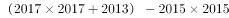

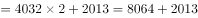

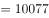

故正确答案为B。

备注：平方差公式：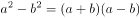

---

## 第 2 题　qid 2031060 · 数学运算

小王近期正在减肥，某天他匀速健步走20分钟后，计步器显示他走了3800步，2.5千米，消耗热量150千卡。则为了达到通过健步走消耗600千卡热量的目标，他还得继续走多少步？（假设小王每走一步，消耗的热量保持不变）

- **A**. 3800
- **B**. 7600
- **C**. 11400　✅
- **D**. 15200

**答案**：C

**官方解析**

要消耗600千卡热量，已消耗150千卡，则还需消耗450千卡。已知每走一步，消耗热量不变且消耗150千卡需走3800步，所以消耗450千卡需走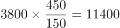步。

故正确答案为C。

---

## 第 3 题　qid 2031072 · 数学运算

若将一个长为8厘米、宽为6厘米的长方形盖在一个圆上，两个图形重叠部分的面积占圆的三分之二，占长方形面积的一半。则这个圆的面积为多少平方厘米？

- **A**. 64
- **B**. 24
- **C**. 48
- **D**. 36　✅

**答案**：D

**官方解析**

设重叠部分的面积为2A，则，。已知长方形长为8，宽为6，则，。故。

故正确答案为D。

---

## 第 4 题　qid 2031078 · 数学运算

小张将带领三位专家到当地B单位调研，距离B单位1.44千米处设有地铁站出口。调研工作于上午9点开始，他们需提前10分钟到达B单位，则小张应通知专家最晚几点一起从地铁站出口出发，步行前往B单位？（假设小张和专家的步行速度均为）

- **A**. 8点26分
- **B**. 8点30分　✅
- **C**. 8点36分
- **D**. 8点40分

**答案**：B

**官方解析**

调研工作9点开始，需提前10分钟到达即8点50分要到达B单位。已知路程为1.44千米即1440米，速度为，所以从地铁口到B单位所需时间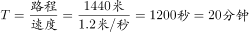，所以最晚出发时间为8点30分。

故正确答案为B。

---

## 第 5 题　qid 2031086 · 数学运算

一台全自动咖啡机打八折销售，利润为进价的，如打七折出售，利润为50元。则这台咖啡机的原价是多少元？

- **A**. 250　✅
- **B**. 240
- **C**. 210
- **D**. 200

**答案**：A

**官方解析**

赋值咖啡机进价为1。根据条件“打八折销售利润为进价的”，即打八折后的售价为：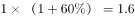。则原价为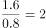。若打七折销售，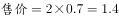，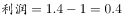。而实际利润为50元，根据等比放缩，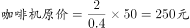。

故正确答案为A。

---

## 第 6 题　qid 2031090 · 数学运算

甲、乙和丙共同投资一个项目并约定按投资额分配收益。甲初期投资额占初期总投资额的，乙的初期投资额是丙的2倍。最终甲获得的收益比丙多2万元。则乙应得的收益为多少万元？

- **A**. 6
- **B**. 7
- **C**. 8　✅
- **D**. 9

**答案**：C

**官方解析**

设丙的投资额为，则乙的投资额为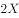，甲占总投资额的，故乙加丙占总投资额的，则，解得甲的投资额为。按照投资额分配收益，甲的投资额比丙多，收益多2万元，乙的投资额为，所以收益为万元。

故正确答案为C。

---

## 第 7 题　qid 2031100 · 数学运算

张先生比李先生大8岁，张先生的年龄是小王年龄的3倍，9年前李先生的年龄是小王年龄的4倍。则几年后张先生的年龄是小王年龄的2倍？

- **A**. 10
- **B**. 13
- **C**. 16
- **D**. 19　✅

**答案**：D

**官方解析**

根据题意，设李先生今年的年龄为，则张、李、王三人今年以及九年前的年龄可得如下：

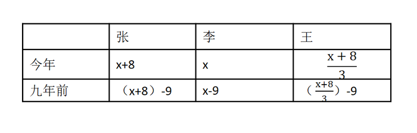

由“9年前李先生的年龄是小王年龄的4倍”可得，，解得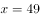。则张今年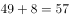岁，王今年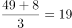岁。当张先生的年龄是小王年龄的2倍时，张先生与小王的年龄差就应该等于小王的年龄，即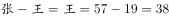。即小王38岁时，张先生的年龄是小王年龄的2倍。小王今年19岁，38岁时为19年后。

故正确答案为D。

---

## 第 8 题　qid 2031110 · 数学运算

某工厂生产甲和乙两种产品，甲产品的日产量是乙产品的1.5倍。现工厂改进了乙产品的生产技术，在保证产量不变的前提下，其单件产品生产能耗降低了，而每日工厂生产甲和乙两种产品的总能耗降低了。则在改进后，甲、乙两种产品的单件生产能耗之比为？

- **A**. 
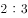

- **B**. 
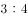

- **C**. 

- **D**. 
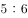
　✅

**答案**：D

**官方解析**

赋值乙日产量为2，则甲的日产量为3，改进后乙单件产品能耗为4，则改进前的能耗为5，设甲单件产品生产能耗为。根据且总能耗降低可得：，解得，故改进后甲、乙单件能耗之比为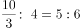。

故正确答案为D。

---

## 第 9 题　qid 2031116 · 数学运算

小刘早上8点整出发匀速开车从A地前往B地，预计10点整到达。但出发不到1小时后汽车就发生了故障，小刘骑折叠自行车以汽车行驶速度的前往A、B两地中点位置的维修站借来工具，并用30分钟修好了汽车，抵达B地时间为11点50分。则小刘汽车发生故障的时间是早上：

- **A**. 8点40分
- **B**. 8点45分
- **C**. 8点50分　✅
- **D**. 8点55分

**答案**：C

**官方解析**

假设小刘开车速度为4，那么从A到B共需2个小时，则AB之间路程为8。并且原定时间为2个小时，实际共用了3小时50分钟，多出来的1小时50分钟则为小刘骑车借工具并修车的时间。其中修车30分钟，因此小刘骑车从故障地点到达AB两地中间位置的时间为分钟即小时。由于骑车速度为开车速度的，则骑车速度为1，故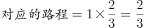，因此故障前实际行驶，则，故发生故障的时间是8点50分。

故正确答案为C。

---

## 第 10 题　qid 2031118 · 数学运算

某单位从10名员工中随机选出2人参加培训，选出的2人全为女性的概率正好为。则如果选出3人参加培训，全为女性的概率在以下哪个范围内？

- **A**. 
低于

- **B**. 
到之间
　✅
- **C**. 
到之间

- **D**. 
高于

**答案**：B

**官方解析**

由于10人中随机选取两名均为女性的概率为，因此设女性共有人，则有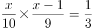，解得，于是10人中有6名女性，那么选出3人全为女性的概率为。

故正确答案为B。

---

## 第 11 题　qid 2031120 · 数学运算

某企业共有职工100多人，其中，生产人员与非生产人员的人数之比为，而研发与非研发人员的人数之比为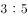，已知生产人员不能同时担任研发人员，则该企业不在生产和研发两类岗位上的职工有多少人？

- **A**. 20
- **B**. 30
- **C**. 24
- **D**. 26　✅

**答案**：D

**官方解析**

由于生产人员与非生产人员的人数之比为，因此总人数为9的倍数，研发与非研发人员的人数之比为，因此总人数也为8的倍数。因此总人数是8和9的公倍数，因此为72的倍数。又因为总人数在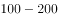之间，因此总人数为144人。那么生产人员为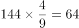人，研发人员为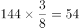人。生产人员不能同时担任研发人员，因此非生产与非研发人员数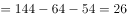。

故正确答案为D。

---

## 第 12 题　qid 2031128 · 数学运算

某种鸡尾酒的酒精浓度为，由种酒、种酒和酒精浓度（）的种酒按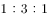的比例（重量比）调制成。已知种酒的酒精浓度是种酒的一半，则种酒的酒精浓度是：

- **A**. 

　✅
- **B**. 

- **C**. 

- **D**. 

**答案**：A

**官方解析**

假设鸡尾酒的溶液重量为100，则溶质的量即为20，并且、、三种酒的质量分别为20、60、20。设种酒的酒精浓度为，则为，混合后溶质的量不变，则有，解得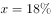，于是种酒的酒精浓度为。

故正确答案为A。

---

## 第 13 题　qid 2031132 · 数学运算

某检修工作由李和王二人负责，两人如一同工作4天，剩下工作量李需要6天，或王需要3天完成。现李和王共同工作了5天，则剩下的工作李单独检修还需几天完成？

- **A**. 2
- **B**. 3　✅
- **C**. 4
- **D**. 5

**答案**：B

**官方解析**

由于剩下的工程李和王的时间比为即为，因此效率比为。那么设李的效率为1，王的效率为2。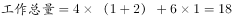。现在二人合作5天后工作量还剩余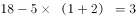，因此李单独做需要天。

故正确答案为B。

---

## 第 14 题　qid 2031140 · 数学运算

用的方砖铺一个房间的长方形地面，在不破坏方砖的情况下，正好需要用60块方砖。假设该长方形地面的周长的最小值为米，那么X的值在以下哪个范围内？

- **A**. 
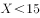

- **B**. 

　✅
- **C**. 
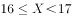

- **D**. 
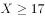

**答案**：B

**官方解析**

面积一定，两边长度最接近时，长方形周长最小。按照下图排列为正方形。即一边为2个60厘米、另一边为3个40厘米，一共六块组成一个边长为120厘米的正方形，如图1；九个相同的正方形按三行三列排放组成一个边长为360厘米的正方形，如图2；最终沿着边长将剩余6个，如图3排列组成一个长为400厘米、宽为360厘米的长方形。故最短周长为：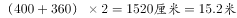。

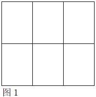

故正确答案为B。

---

## 第 15 题　qid 2031146 · 数学运算

从甲地到乙地含首尾两站共有15个公交站，在这些公交站上共有4条公交线路运行。其中，A公交车线路为第1站到第6站，B公交车线路为第3站到第10站，C公交车线路为第7站到第12站，D公交车线路为第10站到第15站。小张要从甲地到乙地，要在这些公交线路中换乘，不在两站之间步行也不往反方向乘坐，每条公交线路只坐一次，则共有多少种不同的换乘方式？

- **A**. 72
- **B**. 64
- **C**. 52
- **D**. 48　✅

**答案**：D

**官方解析**

 

由上图可以看出在第10站时、、三条公交有相同的站点-第十站，故路线可以分为从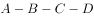和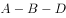这两类情况。

：第一步从，可以在第三、四、五、六换乘，有4种；第二步从，可以在第七、八、九换乘和第十站换乘这两类。第一类在第七、八、九换乘有3种，从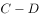可以在第十、十一、十二换乘，有3种；第二类在第十站换乘，从可以在第十一、十二换乘，有2种。故共有种。

：第一步从，可以在第三、四、五、六换乘，有4种；第二步从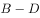，只能在第十站换乘，只有1种情况。故共有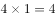种，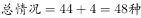。

故正确答案为D。

---
