# 2017年四川省公务员考试《行测》题（定向乡镇）

> 数量关系 · 8 题 · 四川 2017

## 第 1 题　qid 4769869 · 数学运算

某单位决定减少该季度一次性纸杯的供应量，同时将减少部分的更换为玻璃杯，该季度较上季度减少的纸杯数量是该季度纸杯数量的，两季度的纸杯供应量共计2210个，每个纸杯0.2元，每个玻璃杯1.8元，那么该季度比上季度多花了多少元钱？

- **A**. 156　✅
- **B**. 182
- **C**. 208
- **D**. 234

**答案**：A

**官方解析**

根据“该季度较上季度减少的纸杯数量是该季度纸杯数量的”，设该季度纸杯数量为7x个，则该季度较上季度减少的纸杯数量为3x个，则上季度纸杯数量为3x+7x=10x个。根据“两季度的纸杯供应量共计2210个”，可得：10x+7x=2210，解得x=130，即上季度的纸杯数量为10×130=1300个，共花费1300×0.2=260元；该季度的纸杯数量为7×130=910个，玻璃杯数量为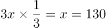个，共花费910×0.2+130×1.8=416元。因此，该季度比上季度多花了416-260=156元钱。

故正确答案为A。

---

## 第 2 题　qid 4769877 · 数学运算

某实验室模拟酸雨，现有浓度为30%和10%的两种盐酸溶液，实验需要将二者混合配置出浓度为16%的盐酸700克备用，那么30%的盐酸需要多少克？

- **A**. 180
- **B**. 190
- **C**. 200
- **D**. 210　✅

**答案**：D

**官方解析**

方法一：设30%的盐酸需要x克，则10%的盐酸溶液需要（700-x）克，根据题意可得：30%x+10%×（700-x）=700×16%，解得x=210，即30%的盐酸需要210克。

方法二：根据线段法，混合溶液的浓度之差与溶液质量成反比，则：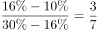，因此，30%的盐酸需要克。

故正确答案为D。

---

## 第 3 题　qid 4769866 · 数学运算

年终总结大会上，选出了甲、乙、丙等共5名优秀代表发言，会前5人抽签决定演讲顺序，那么3人按“甲-乙-丙”的顺序依次发言的概率是多少？

- **A**. 

- **B**. 

- **C**. 

- **D**. 

　✅

**答案**：D

**官方解析**

总情况数为甲、乙、丙等5人全排列，有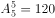种情况。满足条件的情况为3人按“甲-乙-丙”的顺序依次发言，可先将甲、乙、丙3人捆绑，再将捆绑的整体与剩余的2人排列，相当于3个元素的全排列，即满足条件的情况数有种。故所求概率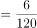。

故正确答案为D。

---

## 第 4 题　qid 4769859 · 数学运算

甲乙两人投资理财产品，两人原始资金共计100万元，甲又追加了自己原始投资资金的，同时乙减少自己原始投资资金的，现二人投资的钱一样多，那么甲的原始投资资金是多少万元？

- **A**. 28
- **B**. 36　✅
- **C**. 50
- **D**. 64

**答案**：B

**官方解析**

方法一：设甲原始投资资金为x万元，则乙原始投资资金为（100-x）万元。根据“甲又追加了自己原始投资资金的，同时乙减少自己原始投资资金的，现二人投资的钱一样多”，可列方程：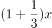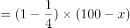，解得x=36。

方法二：利用倍数特性解题，根据“甲又追加了自己原始投资资金的”可知，甲的原始投资资金是3的倍数，据此可排除A、C、D三项，B项当选。

故正确答案为B。

---

## 第 5 题　qid 4769855 · 数学运算

处于某河流上的A、B两地相距600米，B为上游，水流速度为2.5米/分钟，乙由A到B和甲由B到A都需要40分钟，现让甲由A向B，乙由B向A，两人相向而行，到达指定的某一点后返回，则该点选在距离A大约多少米处，两人分别返回到起点时的时间大致相同？

- **A**. 240
- **B**. 247　✅
- **C**. 254
- **D**. 260

**答案**：B

**官方解析**

由题意可知，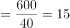米/分钟，则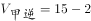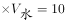米/分钟，米/分钟。设两人到达C点后返回，则甲由ACA的过程中，顺水和逆水的距离相等，根据等距离平均速度公式，甲往返的平均速度米/分钟；同理，乙往返的平均速度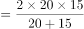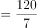米/分钟。根据两人所用时间相同，路程与速度成正比，可得：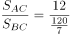，则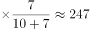米。因此，该点选在距离A大约247米处，两人分别返回到起点时的时间大致相同。

故正确答案为B。

---

## 第 6 题　qid 4769867 · 数学运算

某工厂周一至周六实行每天三班制（早班、中班、晚班），且每周日全体工作人员公休，每班仅需要一名操作员工作，现有五名操作员按固定顺序轮流上班，已知甲操作员2016年的国庆节（周六）当天是中班，那么下一年的元旦，甲是什么班？

- **A**. 早班
- **B**. 中班
- **C**. 晚班
- **D**. 公休　✅

**答案**：D

**官方解析**

2016年的国庆节是周六，到下一年（2017年）的元旦，还需经过10月份剩下的30天、11月份30天、12月份31天、1月份1天，共30+30+31+1=92天。一周为7天，以7天为一个周期，则，即经过了13周余1天。故下一年的元旦是周六往后推一天，即周日，此时全体工作人员公休。因此，下一年的元旦，甲公休。

故正确答案为D。

---

## 第 7 题　qid 4769860 · 数学运算

某眼镜店推出一款墨镜，该墨镜的利润为进价的25%，在“世界护眼日”当月，又推出了一款近视镜，该近视镜的利润为进价的15%，墨镜比近视镜的卖价贵142元，近视镜的进价是墨镜进价的84%，那么墨镜进价为多少元？

- **A**. 375
- **B**. 460
- **C**. 500　✅
- **D**. 625

**答案**：C

**官方解析**

方法一：设墨镜的进价为100x元，则近视镜的进价为84x元。根据公式：售价=进价×（1+利润率），则墨镜的售价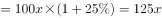，近视镜的售价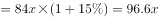。根据“墨镜比近视镜的卖价贵142元”，可得：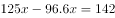，解得x=5，则墨镜的进价为5×100=500元。

方法二：根据题干及选项可猜测，墨镜和近视镜的进价及售价应均为整数。因“墨镜的利润为进价的25%”，即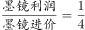，则墨镜进价应为4的倍数；再因“近视镜的进价是墨镜进价的84%”，即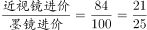，则墨镜进价应为25的倍数。因此墨镜进价同时为4与25的倍数，结合选项，只有C项满足。

故正确答案为C。

---

## 第 8 题　qid 4769863 · 数学运算

工程师设计某种新能源纯电动汽车，其单位距离理论行驶电耗和车辆自重成正比，车辆搭载的电池组重量和电池容量成正比。这种电动汽车除电池组以外的重量为1.5吨，搭载重100公斤的电池组时，满电状态可续航80千米，问这种电动汽车满电状态理论行驶距离要达到500千米的话，全车含电池组的重量在以下哪个范围内？

- **A**. 2.3吨以内
- **B**. 2.3—2.4吨之间
- **C**. 2.4—2.5吨之间　✅
- **D**. 2.5吨以上

**答案**：C

**官方解析**

当搭载重100公斤的电池组时，电动汽车的全车总重=1.5吨（1500公斤）+100公斤=1600公斤。赋值汽车单位距离单位重量的电耗为1，根据“单位距离理论行驶电耗和车辆自重成正比”，则1600公斤的汽车行驶80千米所需的电池容量=汽车总重×行驶距离×1=1600×80；根据“车辆搭载的电池组重量和电池容量成正比”，则单位重量电池的容量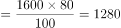。设汽车满电状态续航500千米时所需的电池重量为x公斤，则电池总容量为1280x，此时全车总重=（1500+x）公斤，即续航500千米所需的电池容量=（1500+x）×500=1280x，解得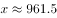，则全车总重=1500+961.5=2461.5公斤=2.4615吨，对应C项。

故正确答案为C。

---
