# 2017年国家公务员录用考试《行测》题（副省级）

> 数量关系 · 15 题 · 国考 2017

## 第 1 题　qid 2028382 · 数学运算

面包房购买一包售价为的白糖，取其中的一部分加水溶解形成浓度为的糖水12千克，然后将剩余的白糖全部加入后溶解，糖水浓度变为，问购买白糖花了多少元钱？

- **A**. 45
- **B**. 48　✅
- **C**. 36
- **D**. 42

**答案**：B

**官方解析**

方法一：设剩余的白糖为千克，根据浓度公式，解得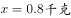，原来溶解的白糖有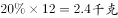，则购买白糖花了。

方法二：由题意可知，最后的糖水总量大于12千克，故含糖总量大于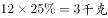，买糖花费大于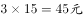，结合选项，只有B满足。

故正确答案为B。

---

## 第 2 题　qid 2028388 · 数学运算

某人出生于20世纪70年代，某年他发现从当年起连续10年自己的年龄均与当年年份数字之和相等（出生当年算0岁）。问他在以下哪一年时，年龄为9的整数倍？

- **A**. 2006年
- **B**. 2007年　✅
- **C**. 2008年
- **D**. 2009年

**答案**：B

**官方解析**

方法一：设出生年份为年。若当年为年，根据连续10年自己的年龄均与当年年份数字之和相等，可得：，解得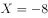，不满足条件；若当年为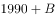年，可得：，解得，即出生于1971年，依次代入选项：2006年为35岁，不符合9的整数倍，排除A项；2007年为36岁，是9的整数倍，B项符合题意。

故正确答案为B。

方法二：若1980年，数字之和为1+9+8+0=18，若满足年龄等于当年年份数字之和，则出生年份=1980-18=1962，不满足出生于20世纪70年代；若1990年，数字之和为岁，若满足年龄等于当年年份数字之和，则出生年份，满足出生于20世纪70年代，且从1990年开始连续十年都满足要求。所以出生年份为1971年，依次代入选项2006年为35岁，不符合9的整数倍，排除A项；2007年为36岁，是9的整数倍，B项符合题意。

故正确答案为B。

---

## 第 3 题　qid 2028394 · 数学运算

为维护办公环境，某办公室四人在工作日每天轮流打扫卫生，每周一打扫卫生的人给植物浇水。7月5日周五轮到小玲打扫卫生，下一次小玲给植物浇水是哪天？

- **A**. 7月15日
- **B**. 7月22日
- **C**. 7月29日　✅
- **D**. 8月5日

**答案**：C

**官方解析**

       下一次小玲给植物浇水即为周一打扫卫生。办公室四人在工作日每天轮流打扫卫生，7月5日周五小玲打扫卫生，列表可得（打√号表示为小玲打扫卫生）：

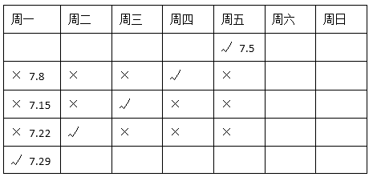

由图表左下角可知，小玲下次在周一打扫卫生并给植物浇水是7月29日。

故正确答案为C。 

---

## 第 4 题　qid 2028400 · 数学运算

某超市购入每瓶200毫升和500毫升两种规格的沐浴露各若干箱，200毫升沐浴露每箱20瓶，500毫升沐浴露每箱12瓶。定价分别为和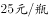。货品卖完后，发现两种规格沐浴露的销售收入相同，那么这批沐浴露中，200毫升的最少有几箱？

- **A**. 3
- **B**. 8
- **C**. 10
- **D**. 15　✅

**答案**：D

**官方解析**

      方法一：200毫升沐浴露一箱定价为元，500毫升沐浴露一箱定价为元。货品卖完后，两种规格沐浴露的销售收入相同且要箱数最少，则销售收入为每箱单价的最小公倍数，即每种销售收入为280和300的最小公倍数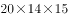元。此时，200毫升的箱数最少，为箱。

故正确答案为D。

       方法二：设每种销售收入均为Y，200毫升的有a箱，500毫升的有b箱，a、b为整数。则有Y=280a=300b，根据数字特性，a必是3的倍数，排除B、C两项；求a的最小值，代入a=3，发现b不是整数，排除A项，正确答案一定是D项。

---

## 第 5 题　qid 2028408 · 数学运算

某次知识竞赛试卷包括3道每题10分的甲类题，2道每题20分的乙类题以及1道30分的丙类题。参赛者赵某随机选择其中的部分试题作答并全部答对，其最终得分为70分。问赵某未选择丙类题的概率为多少？

- **A**. 

- **B**. 

- **C**. 

- **D**. 

　✅

**答案**：D

**官方解析**

最终得分为70分，有以下三类情况：

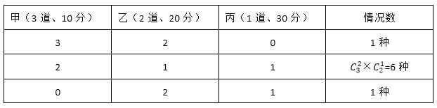

由上表可知，总情况数是：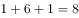种，未选择丙类题的情况数是1种，故赵某未选择丙类题的概率为。

故正确答案为D。

---

## 第 6 题　qid 2028420 · 数学运算

某人租下一店面准备卖服装，房租每月1万元，重新装修花费10万元。从租下店面到开始营业花费3个月时间。开始营业后第一个月，扣除所有费用后的纯利润为3万元。如每月纯利润都比上月增加2000元而成本不变，问该店在租下店面后第几个月内收回投资？

- **A**. 7　✅
- **B**. 8
- **C**. 9
- **D**. 10

**答案**：A

**官方解析**

由题意可得租下店面前3个月成本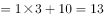万元，租下店面第4个月开始营业，每个月获得纯利润情况构成首项为3万元，公差为0.2万元的等差数列：3、3.2、3.4、3.6······可得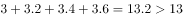，即收回投资，此时共经历了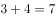个月。

故正确答案为A。

---

## 第 7 题　qid 2028426 · 数学运算

某抗洪指挥部的所有人员中，有的人在前线指挥抢险。由于汛情紧急，又增派6人前往，此时在前线指挥抢险的人数占总人数的。如果该抗洪指挥部需要保留至少的人员在应急指挥中心，那么最多还能再增派多少人去前线？

- **A**. 8
- **B**. 9
- **C**. 10　✅
- **D**. 11

**答案**：C

**官方解析**

方法一：设总人数为人，则最初前线人员人，增派6人去前线后前线人员占总人数的75%，可得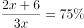，解得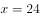人，总人数为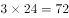人，前线人数为人。至少保留的人在应急指挥中心，则至少需保留人数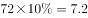人，即人，则最多还能再增派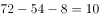人。

故正确答案为C。

方法二：最初前线人员占总人数的比例为，增加6人后，前线人员占比为75%，即，则总数人为人。前线人数为。至少保留10%的人在应急指挥中心，需要保留人数为，即8人。因此还能增派人。

故正确答案为C。

---

## 第 8 题　qid 2028432 · 数学运算

小张需要在5个长度分别为15秒、53秒、22秒、47秒和23秒的视频片段中选取若干个，合成为一个长度在80～90秒之间的宣传视频。如果每个片段均需完整使用且最多使用一次，并且片段间没有空闲时段，问他按照要求可能做出多少个不同的视频？

- **A**. 12　✅
- **B**. 6
- **C**. 24
- **D**. 18

**答案**：A

**官方解析**

需拼成时间为80～90秒之间的视频，则总时间为 ，则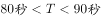。分类讨论可知：

取一、二、四、五个视频时，均不满足时间要求；

只取三个视频时，47秒、23秒、15秒可以拼出85秒的视频，情况数；

47秒、22秒、15秒可以拼出84秒的视频，情况数，合计有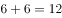种。

故正确答案为A。

注意：本题80～90秒之间的具体范围有争议，如果不包括90秒则答案是12种；如果包括90秒则还需加上53秒、22秒、15秒拼成的总时间为90秒的情况，最终合计情况数是18。粉笔倾向答案为12种。 

---

## 第 9 题　qid 2028446 · 数学运算

一块种植花卉的矩形土地如图所示，AD边长是AB的2倍，E是CD的中点，甲、乙、丙、丁、戊区域分别种植白花、红花、黄花、紫花、白花。则种植白花的面积占矩形土地面积的：

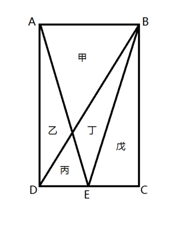

- **A**. 

- **B**. 

- **C**. 

　✅
- **D**. 

**答案**：C

**官方解析**

       方法一：设，。由题意可得，三角形戊的面积；由AB和DE平行可知三角形甲和丙为相似三角形，已知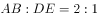，所以三角形甲和丙的高之比也为，已知，故三角形甲的高为，三角形甲的面积；因为甲和戊种植白花，所以种植白花的面积共，占矩形土地面积的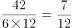。

       方法二：设丙的面积为1份，则根据和平行可知三角形甲和丙为相似三角形且，可知甲和丙的面积之比为，甲的面积为4份。分析比例关系可得乙+丙=丁+丙，故，乙和丁的面积相等，且均为丙的2倍，即面积为2份。再根据丁与丙构成的三角形与戊面积相等，可知戊的面积为。故白花面积为甲、戊面积之和，即，总面积为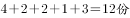，所以白花面积占比为。

故正确答案为C。

---

## 第 10 题　qid 2028452 · 数学运算

某集团企业5个分公司分别派出1人去集团总部参加培训，培训后再将5人随机分配到这5个分公司，每个分公司只分配1人。问5个参加培训的人中，有且仅有1人在培训后返回原分公司的概率：

- **A**. 
低于

- **B**. 
在之间

- **C**. 
在之间

- **D**. 
大于
　✅

**答案**：D

**官方解析**

       5个人任意分配到5个分公司的总情况为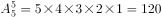；满足只有1人培训后返回原公司的情况数为：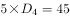（先在5人中任选1人返回原公司，共有种选择；再将剩下4人错位排列）；则所求。

故正确答案为D。

---

## 第 11 题　qid 2028454 · 数学运算

某商铺甲、乙两组员工利用包装礼品的边角料制作一批花朵装饰门店。甲组单独制作需要10小时，乙组单独制作需要15小时，现两组一起做，期间乙组休息了1小时40分，完成时甲组比乙组多做300朵。问这批花有多少朵？

- **A**. 600
- **B**. 900　✅
- **C**. 1350
- **D**. 1500

**答案**：B

**官方解析**

       赋值花的总量为份，则甲的效率为每小时份，乙的效率为每小时份。乙组休息1小时40分钟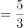小时，相当于甲先单独干了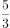小时，完成的工程量为，剩余工程量甲、乙合作需要小时，共同工作期间甲的工作量为，则甲总共完成的工程量为，乙完成的工程量为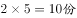，甲实际比乙多做，可得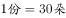，则这批花总共有。

故正确答案为B。

---

## 第 12 题　qid 2028456 · 数学运算

工厂有5条效率不同的生产线。某个生产项目如果任选3条生产线一起加工，最快需要6天整，最慢需要12天整；5条生产线一起加工，则需要5天整。问如果所有生产线的产能都扩大一倍，任选2条生产线一起加工最多需要多少天完成？

- **A**. 11
- **B**. 13
- **C**. 15　✅
- **D**. 30

**答案**：C

**官方解析**

 假设这五条生产线按效率从高到低排序为：甲、乙、丙、丁、戊，题中给出了三个完工时间，6天、12天和5天，给该项目总量赋值为、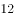、的最小公倍数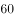，根据题意可得效率关系为：

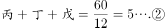

若使加工天数最多，则让效率最低的丁戊合作。

可得：。产能都扩大一倍，则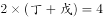。

则所需时间为。

故正确答案为C。

---

## 第 13 题　qid 2028458 · 数学运算

一正三角形小路如右图所示，甲、乙两人从点同时出发，朝不同方向沿小路散步，已知甲的速度是乙的2倍。问以下哪个坐标图能准确描述两人之间的直线距离与时间的关系（横轴为时间，纵轴为直线距离）？

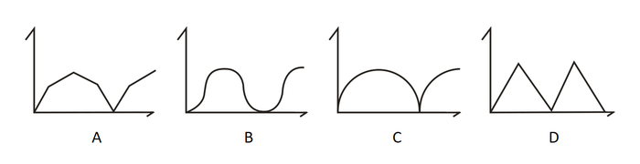

- **A**. A
- **B**. B
- **C**. C
- **D**. D　✅

**答案**：D

**官方解析**

如图所示，当甲在AB段运动时，甲行驶的路程是乙的两倍，又因题目中三角形小路是正三角形，则，恰好满足甲、乙所在位置与A点构成直角三角形，因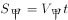，甲乙之间距离为。

分析距离的算式可知：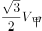为定值，不随时间而变化，故甲、乙之间距离与时间呈现线性关系，则当甲在AB段行驶时，甲、乙之间距离线性增加，直至最远；同理，当甲在BC段行驶时，甲乙距离线性减少，直至为0。因此，图形应从0开始直线上升，再直线下降至0。

故正确答案为D。

---

## 第 14 题　qid 2028460 · 数学运算

将一个棱长为整数的正方体零件切掉一个角，截面是面积为的三角形，问其棱长最小为多少？

- **A**. 15　✅
- **B**. 10
- **C**. 8
- **D**. 6

**答案**：A

**官方解析**

       如图所示，在截面面积固定不变的情况下，要让棱长尽量小，则截面应尽量大。正方体中满足切掉一个角的最大的截面如虚线所示，其面积是。由于三条虚线都是正方体的面对角线，彼此相等，所以是正三角形。

      假设该正三角形边长为，则正三角形面积为：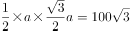，解得，则正方体其中一个面的对角线长度为20，正方体边长为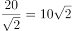，已知棱长为整数，则其最小值为15。

注意：有的截面积更大的切法，不满足切下来的必须是一个角的要求，故错误。

故正确答案为A。

---

## 第 15 题　qid 2028462 · 数学运算

某次军事演习中，一架无人机停在空中对三个地面目标点进行侦察。已知三个目标点在地面上的连线为直角三角形，两个点之间的最远距离为600米。问无人机与三个点同时保持500米距离时，其飞行高度为多少米？

- **A**. 500
- **B**. 600
- **C**. 300
- **D**. 400　✅

**答案**：D

**官方解析**

因飞机到三个目标点构成的平面的距离为定值，又因飞机与三个点保持相同距离，则飞机在该平面的投影点与三个目标点的距离相等，如图所示，飞机在该平面的投影为O点，A、B、C分别表示三个目标点，则以O点为圆心，AB（即相距最远的点）为直径画圆，其中C点在圆弧上。因为，所以，而飞机到B点的距离为500米，故根据勾股定理，飞机与地面相距的距离为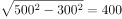米。

故正确答案为D。

---
