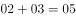
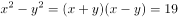
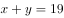
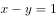
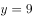
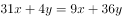
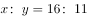

# 2017年天津市选调生选拔考试 综合知识试卷（精选）

> 数量关系 · 6 题 · 天津 2017

## 第 1 题　qid 2261619 · 数学运算

3.02，4.03，6.05，9.08，（    ）

- **A**. 12.11
- **B**. 13.14
- **C**. 14.13　✅
- **D**. 15.14

**答案**：C

**官方解析**

观察数列，发现数列为小数数列，可将整数与小数部分分别找规律。发现小数部分，，即，则所求项小数部分，只有C项符合题意。

故正确答案为C。

---

## 第 2 题　qid 2261623 · 数学运算

若两个数的平方差为19，之和为19，那么这两个数的积是多少？

- **A**. 86
- **B**. 90　✅
- **C**. 100
- **D**. 120

**答案**：B

**官方解析**

设这两个数为、，由题意可知，，则，解得，，则。

故正确答案为B。

---

## 第 3 题　qid 2261624 · 数学运算

有一个分数，分子加1，分母减1，就变成；以分母、分子的差做分子，以分母、分子的和做分母，所得分数为，问原分数值是多少？

- **A**. 

- **B**. 

- **C**. 

　✅
- **D**. 

**答案**：C

**官方解析**

本题选项为分数，相当于是由分子和分母组成的一组数，优先考虑代入排除。代入A项，，不符合题意，排除；代入B项，，不符合题意，排除；代入C项，，且，符合题意，当选；代入D项，，不符合题意，排除。

故正确答案为C。

---

## 第 4 题　qid 2261625 · 数学运算

一个五位数，左边三位数是右边两位数的5倍，如果把右边两位数移到前面，所得到的新的五位数要比原来的五位数的2倍还多75，原来五位数的值是多少？

- **A**. 22545
- **B**. 17535
- **C**. 12525　✅
- **D**. 11575

**答案**：C

**官方解析**

根据题意使用代入排除法，依次代入四个选项。代入C项：原五位数为12525，新五位数为25125，，符合题意，当选。

故正确答案为C。

---

## 第 5 题　qid 2261626 · 数学运算

有甲、乙两个工程队，乙队任务临时加重时，从甲队抽调了四分之一的队员支援乙队。此后甲队任务也有所加重，于是又从乙队现有人员中调回了十分之一的人员，此时甲乙两队人数相等。由此可以得出结论：

- **A**. 甲队原有16人，乙队原有11人
- **B**. 甲乙两队原有人数比为16：11　✅
- **C**. 甲队原有11人，乙队原有16人
- **D**. 甲乙两队原有人数比为11：16

**答案**：B

**官方解析**

由题意设甲工程队人数为，乙工程队人数为，则

根据题意可知，，化简得。

故正确答案为B。

---

## 第 6 题　qid 4742999 · 数学运算

某生物项目工作组有12名外国人，其中6人会说英语，5人会说法语，5人会说西班牙语；有3人既会说英语又会说法语，有2人既会说法语又会说西班牙语，有2人既会说西班牙语又会说英语；有1人这三种语言都会说。则只会说一种语言的人比一种语言都不会说的人多（    ）。

- **A**. 1人
- **B**. 2人
- **C**. 3人　✅
- **D**. 5人

**答案**：C

**官方解析**

如图所示，有3人既会说英语又会说法语，其中有1人这三种语言都会说，则有3-1=2人只会说英语和法语；同理，只会说英语和西班牙语的有2-1=1人，只会说法语和西班牙语的有2-1=1人。故只会说英语的有6-2-1-1=2人，只会说法语的有5-2-1-1=1人，只会说西班牙语的有5-1-1-1=2人，则只会说一种语言的有2+1+2=5人。工作组共有12名外国人，则一种语言都不会说的有12-6-1-1-2=2人，故所求为5-2=3人。

故正确答案为C。

---
