# 2017年天津滨海新区公务员考试《行测》题（网友回忆版）

> 数量关系 · 10 题 · 天津 2017

## 第 1 题　qid 2139418 · 数学运算

三个连续自然数的乘积是210，则其中两个自然数为：

- **A**. 4、5
- **B**. 7、8
- **C**. 8、9
- **D**. 6、7　✅

**答案**：D

**官方解析**

方法一：把210分解为质数相乘的形式，可得，因为是三个连续的自然数的乘积，故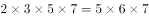，所以可知这三个连续的自然数是5、6、7。

方法二：选项中给出了两个自然数，选项信息充分，考虑代入排除。

A选项，，另一个数字是3或6，20与3或6的乘积不可能是210，排除；

B选项，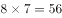，另一个数字是6或9，56与6和9的乘积也不可能是210，排除；

C选项，，另一个数字是7或10，72与7或10的乘积不可能是210，排除；

D选项，，另一个数字为5或8，有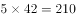，满足。

故正确答案为D。

---

## 第 2 题　qid 2139420 · 数学运算

有一个长方形的对角线为17cm，长比宽多3cm，那么这个长方形的面积为：

- **A**. 
140
　✅
- **B**. 
136

- **C**. 
132

- **D**. 
128

**答案**：A

**官方解析**

题中给出了长和宽的关系，设宽为，则长为，已知对角线为17cm，根据勾股定理可得，化简得：，即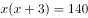，因此长方形的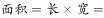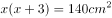

故正确答案为A。

---

## 第 3 题　qid 2139430 · 数学运算

一份溶液，加入一定量的水后，浓度降到，再加入同样多的水后，浓度降为，该溶液未加水时浓度是：

- **A**. 

　✅
- **B**. 

- **C**. 

- **D**. 

**答案**：A

**官方解析**

题中给出的数据都是百分数，求的也是百分数，且溶质不变，故考虑赋值，赋值溶质为6。

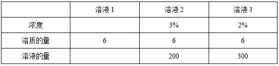

由上表可以看出，每次加入的水量为，则未加水时的溶液（溶液1）的量为，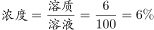。

故正确答案为A。

---

## 第 4 题　qid 2139432 · 数学运算

有4个不同的信箱，有5封不同的信件欲投其中，则不同的投法有：

- **A**. 5种
- **B**. 1024种　✅
- **C**. 40种
- **D**. 625种

**答案**：B

**官方解析**

因为有4个不同的信箱，所以每封信件的投递方式有4种，所以5封信不同的投法有种。

故正确答案为B。

---

## 第 5 题　qid 2139434 · 数学运算

单独修筑某条乡村公路，甲工程队需18天，乙工程队需24天，丙工程队需30天。现甲、乙、丙按如下顺序轮流施工：甲、乙、丙、乙、丙、甲、丙、甲、乙……每个工程队工作一天换班，直到工程完成。当工程完成时，乙工程队干了多少天？

- **A**. 8天　✅
- **B**. 11天
- **C**. 9天
- **D**. 7天

**答案**：A

**官方解析**

工程问题只给出了完工时间，故赋值时间的最小公倍数作为工作总量，即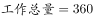，则三个工程队的效率分别为：，，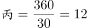，则三天的工作量是。根据题意可知一个完整周期是9天：甲、乙、丙、乙、丙、甲、丙、甲、乙，即3个工程队轮流开工，则，在工作2个周期后还余下工作量78，接下来甲、乙、丙工作完成工作量47，还剩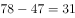，乙工作15，丙工作12，甲工作4就可以完成工程。因此乙共工作了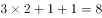天。

故正确答案为A。

备注：本题对于工作周期是几天还有另外一种理解，根据甲乙这个开头出现了两次推断周期是7，即周期是：甲、乙、丙、乙、丙、甲、丙，但是考虑到题干中没有给出两个确定的7天周期，且该规律不如按照甲乙丙循环开工9天一周期的规律明显，故粉笔按照周期是9给出解析。

---

## 第 6 题　qid 2139458 · 数学运算

某纸箱中原来有5个乒乓球，从纸箱中取出1个乒乓球，再放入5个乒乓球；又取出1个乒乓球，放入5个乒乓球；不断重复上述过程，到某一时刻停止，纸箱中乒乓球的总数可为：

- **A**. 2015
- **B**. 2019
- **C**. 2017　✅
- **D**. 2022

**答案**：C

**官方解析**

最初有5个乒乓球，接下来每一个过程都包含两步，即取出1个乒乓球，再放入5个乒乓球，此时乒乓球的个数可能个或者个，接下来再取出1个乒乓球，再放入5个乒乓球，此时乒乓球的个数可能为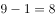个或者个，依次类推，乒乓球的个数可能为4，9，8，13，12，17……，即奇数项为4的整数倍，偶数项减5为4的整数倍，观察选项四个选项都不是4的整数倍，只有可能是偶数项减5是4的倍数，满足条件的只有C项。

故正确答案为C。

---

## 第 7 题　qid 2139466 · 数学运算

受市场影响，某种品牌同种价位的自行车在三个商场都进行了两次提价（第二次提价的百分比是以第一次提价后的价格为基础的），A商场第一次提价，第二次提价；B商场第一次提价，第二次提价；C商场第一次提价，第二次提价；则提价最多的商场为：

- **A**. C商场
- **B**. A商场
- **C**. B商场　✅
- **D**. 无法确定

**答案**：C

**官方解析**

设在三个商场自行车提价前的价格都是，根据题意有：

A商场两次提价后的价格为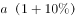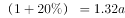，提价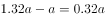元；

B商场两次提价后的价格为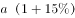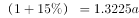，提价元；

C商场两次提价后的价格为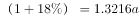，提价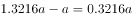元；

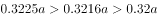，则提价最多的是B商场。

故正确答案为C。

---

## 第 8 题　qid 2139470 · 数学运算

有四种颜色的文件夹若干，每人可任取1～2个，如果要保证有3人取到完全一样的文件夹，则至少应该有      人去取。

- **A**. 18
- **B**. 20
- **C**. 11
- **D**. 21　✅

**答案**：D

**官方解析**

根据题意，每人可任取1-2个，若每人取一个，则有种情况；若每人取2个，则有种情况。所以一共有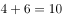种方式。考虑最不利情况，先让每种情况有2人选择，共有人，这时再安排1人去取，就能保证有3人取到完全一样的文件夹，故题目所求为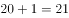人。

故正确答案为D。

备注：根据题意，每人可任取1-2个，若每人取一个，则有种情况；若每人4种颜色选2个，得分类讨论颜色相同和不同。这样情况数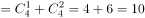种情况。总的情况数种。每种情况有2人选择，共有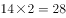人，再安排1人去取，就能保证有3人取到完全一样的文件夹，故题目所求为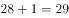人。这样就没有正确选项了。

---

## 第 9 题　qid 2139472 · 数学运算

某商店出售A商品，若每天卖100件，则每件可获利6元。根据经验，若A商品每件涨1元钱，每天就少卖10件。为使每天获利最大化，A商品应提价：

- **A**. 6元
- **B**. 4元
- **C**. 2元　✅
- **D**. 10元

**答案**：C

**官方解析**

根据题意，假设提价元，则每件获利为元，同时每天会少卖件，则销量为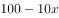。因此每天获利为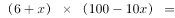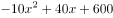，当，即提价2元时，每天获得的利润最大。

故正确答案为C。

---

## 第 10 题　qid 2139474 · 数学运算

在一条400米的圆形跑道上，甲乙两人同时从起点同向出发，甲速度为100米/分钟，乙速度为80米/分钟，则甲乙二人的连线第一次通过该圆形跑道的中心时，甲跑的是：

- **A**. 第10圈
- **B**. 第20圈
- **C**. 第3圈　✅
- **D**. 第5圈

**答案**：C

**官方解析**

根据题意，甲、乙连线第一次通过圆形跑道中心即甲、乙连线为圆形跑道的直径，并且甲比乙恰好多跑半圈。则米，解得分钟，此时米。，因此甲跑的是第3圈。

故正确答案为C。

---
