# 2017年山东省选调应届优秀高校毕业生到基层工作考试《行测》试卷（精选）

> 数量关系 · 8 题 · 选调 2017

## 第 1 题　qid 2261755 · 数学运算

在高架桥上用绳子测量高架桥的高度，把绳子对折垂到地面时尚余10米，把绳子三折垂到地面时尚余2米，则高架桥高度和绳长分别是：

- **A**. 13米和46米
- **B**. 14米和48米　✅
- **C**. 15米和50米
- **D**. 16米和52米

**答案**：B

**官方解析**

方法一：设绳长为，则根据题意可列方程：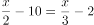，解得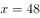，此时高架桥高度为。

方法二：根据题意，选项都为整数，可知绳子既可被2整除，也可被3整除，根据倍数特性，只有B选项符合条件。

故正确答案为B。

---

## 第 2 题　qid 2261756 · 数学运算

某农户家庭一年的总收入中，种植收入占四分之一，养殖收入占六分之一，已知其种植收入和养殖收入共计12000元，这个家庭一年的总收入是：

- **A**. 25500元
- **B**. 26600元
- **C**. 27700元
- **D**. 28800元　✅

**答案**：D

**官方解析**

设这个家庭一年的总收入为，则根据题意可得：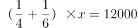，解得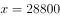。

故正确答案为D。

---

## 第 3 题　qid 2261757 · 数学运算

一投资者用部分资金购买了股票和基金，一年后股票下跌了，基金升值了，此时他将全部股票和基金卖出获利，则他购买股票和基金所投入的资金比为：

- **A**. 1:4
- **B**. 1:5　✅
- **C**. 1:6
- **D**. 1:7

**答案**：B

**官方解析**

方法一：设投资者购买了元的股票，元的基金。则根据题目条件有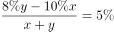，解得。

方法二：，根据线段法，成本之比与利润率差之比成反比，有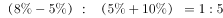。

故正确答案为B。

---

## 第 4 题　qid 2261758 · 数学运算

某大型跨国连锁零售企业在世界8个城市共有76家超市，每个城市的超市数量都不相同。如果超市数量排名第四的城市有10家超市，那么超市数量排名最后的城市最多有几家超市？

- **A**. 3
- **B**. 4
- **C**. 5
- **D**. 6　✅

**答案**：D

**官方解析**

在世界共有76家超市，要使排名最后的城市超市数量最多，则应使其他城市的超市数量最少。设排名最后的城市最多有家超市， 如表所示，

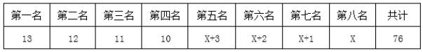

则有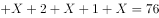，解得。因排名最后的城市最多有6家超市。

故正确答案为D。

---

## 第 5 题　qid 2261759 · 数学运算

今有水平相当的棋手甲和棋手乙参加某项大奖赛，奖金总额12000元。比赛规定下满五局获胜多者将赢得全部12000元奖金，已比赛三局，其中棋手甲两胜一负，现因故无法进行下面的比赛，试问如何分配奖金才算合理？

- **A**. 棋手甲7000元，棋手乙5000元
- **B**. 棋手甲8000元，棋手乙4000元
- **C**. 棋手甲9000元，棋手乙3000元　✅
- **D**. 棋手甲10000元，棋手乙2000元

**答案**：C

**官方解析**

根据题意，现已经比赛三局且需下满五局，甲已两胜一负，则只有当乙剩余两场全胜利时乙才能赢得比赛。因为二人水平相当，则乙赢得比赛的概率为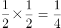，甲赢得比赛的概率，故甲应分得奖金元，乙应分得奖金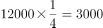元。

故正确答案为C。

---

## 第 6 题　qid 2261760 · 数学运算

某基地A年产水果7000吨，要运到400千米外的城市B，现基地A具有大型运输车和小型运输车各一辆，大型运输车的速度为80千米/小时，载重1000吨，小型运输车的速度为100千米/小时，载重500吨，那么，这批水果运到城市B的最短时间是：

- **A**. 47小时
- **B**. 48小时
- **C**. 44小时　✅
- **D**. 45小时

**答案**：C

**官方解析**

大型运输车的速度为80千米/小时，载重1000吨，则大型车运输到B地需要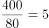小时，则运送一次往返需要10小时，运送1000吨。小型运输车的速度为100千米/小时，载重500吨，则小型车运输到B地需要小时，往返运送一次需要8小时，运送500吨。因此40小时后，大型车运送吨，小型车运送吨。此时还剩吨，且大小型车都在A地，只需小型车再运送一次就可以了。因此时间为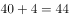小时。

故正确答案为C。

---

## 第 7 题　qid 2261761 · 数学运算

4名学生和2名教师排成一排照相，2名教师不在两端且要相邻的排法共有多少种？

- **A**. 72
- **B**. 108
- **C**. 144　✅
- **D**. 288

**答案**：C

**官方解析**

2名老师要相邻，则考虑先捆绑，为 种情况；剩余4名学生和捆绑的老师进行排列，老师不在两头，则考虑插空法，为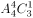种情况。则共有排法种排法。

故正确答案为C。

---

## 第 8 题　qid 2261762 · 数学运算

某养鸡场出售每千克鸡蛋毛利0.8元时，每日能卖出1620千克，每千克毛利1.2元时，每日能卖出1000千克。如果两种情况的销售收入比为3：2，则每千克鸡蛋的成本是多少？

- **A**. 4.2元　✅
- **B**. 4.4元
- **C**. 4.6元
- **D**. 4.8元

**答案**：A

**官方解析**

设每千克鸡蛋的成本为，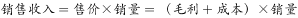，则根据题意，可得：，解得。

故正确答案为A。

---
