# 2017年广东省公务员录用考试《行测》题（县级、乡镇统一卷）

> 数量关系 · 15 题 · 广东 2017

## 第 1 题　qid 2047704 · 数学运算

7    14    28    56    （  ）

- **A**. 110
- **B**. 112　✅
- **C**. 114
- **D**. 119

**答案**：B

**官方解析**

数列间存在明显的倍数关系，后一项为前一项的2倍，则所求项应为。

故正确答案为B。

---

## 第 2 题　qid 2047714 · 数学运算

1    7    17    31    49    （  ）

- **A**. 65
- **B**. 67
- **C**. 69
- **D**. 71　✅

**答案**：D

**官方解析**

数列无明显特征且起伏较小，优先考虑作差。作差后得到新数列为：6、10、14、18，为公差是4的等差数列，故新数列下一项为：，则所求项应为：。

故正确答案为D。

---

## 第 3 题　qid 2047726 · 数学运算

4    9    16    25    （  ）

- **A**. 36　✅
- **B**. 49
- **C**. 64
- **D**. 76

**答案**：A

**官方解析**

题干中各数为典型的平方数，可将原数列化为： 、 、、，则所求项应为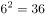。

故正确答案为A。

---

## 第 4 题　qid 2047740 · 数学运算

1    2    6    16    44    120    （  ）

- **A**. 164
- **B**. 176
- **C**. 240
- **D**. 328　✅

**答案**：D

**官方解析**

数列变化明显，作差无关系，考虑递推。，则所求项应为：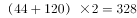。

故正确答案为D。

---

## 第 5 题　qid 2047756 · 数学运算

325    118    721    604    （  ）

- **A**. 911
- **B**. 541　✅
- **C**. 431
- **D**. 242

**答案**：B

**官方解析**

题干各项不存在明显关系，考虑数位之间的机械划分。拆分之后原数列每一项各位数字之和均为10，故所求项各位数字之和应为10，满足条件的仅有B项。
故正确答案为B。

---

## 第 6 题　qid 2047770 · 数学运算

如图所示，公园有一块四边形的草坪，由四块三角形的小草坪组成。已知四边形草坪的面积为480平方米，其中两个小三角形草坪的面积分别为70平方米和90平方米，则四块三角形小草坪中最大的一块面积为多少平方米？

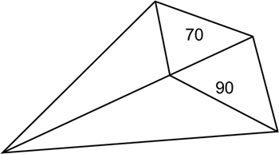

- **A**. 120
- **B**. 150
- **C**. 180　✅
- **D**. 210

**答案**：C

**官方解析**

如上图所示，与有公共边，两个三角形面积之比为。底边相同，高与面积成正比，故高之比即；同理与有公共边，高分别为与，底边相同，面积与高成正比，故。

又已知平方米，则面积最大，为平方米。

故正确答案为C。

---

## 第 7 题　qid 2047780 · 数学运算

小王到某单位办事，只有一个窗口在办理业务，小王排在第6位，第一位客户开始办理业务的时间为9:02。假如每单业务的办理时间为6分钟，而且排在小王前面的人不会提前离开。那么小王在什么时候可以开始办理业务？

- **A**. 9:32　✅
- **B**. 9:38
- **C**. 9:45
- **D**. 9:52

**答案**：A

**官方解析**

每单业务办理时间均为6分钟，判定题目中六位客户开始办理业务的时间为等差数列，公差分钟，小王排在第6位，与第1位相差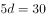分钟，故小王在9:32可以开始办理业务。

故正确答案为A。

---

## 第 8 题　qid 2047784 · 数学运算

现有一批零件，甲师傅单独加工需要4小时，乙师傅单独加工需要6小时。两人一起加工这批零件的需要多少个小时？

- **A**. 0.6
- **B**. 1
- **C**. 1.2　✅
- **D**. 1.5

**答案**：C

**官方解析**

赋值工程总量为4和6的最小公倍数12，甲的效率为：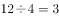，乙的效率为：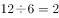，一起合作加工零件的需要的时间为：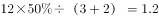小时。

故正确答案为C。

---

## 第 9 题　qid 2047786 · 数学运算

老林和小陈绕着周长为720米的小花园匀速散步，小陈比老林速度快。若两人同时从某一起点同向出发，则每隔18分钟相遇一次；若两人同时从某一起点相反方向出发，则每隔6分钟相遇一次。由此可知，小陈绕小花园散步一圈需要多少分钟？

- **A**. 6
- **B**. 9　✅
- **C**. 15
- **D**. 18

**答案**：B

**官方解析**

两人同时从同一地点同向出发，每相遇一次（从背后追及，可以理解成一种特殊的相遇，计算时使用追及公式，速度差追及时间追及路程），小陈比老林多跑一圈；两人同时从同一地点反向出发，每相遇一次，两人合走一圈。由此可得方程组：

解得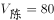米/分钟，故小陈散步一圈需要分钟。

故正确答案为B。

---

## 第 10 题　qid 2047788 · 数学运算

在公司年会表演中，有甲、乙、丙、丁四个部门的员工参演。已知甲、乙两部门共有16名员工参演，乙、丙两部门共有20名员工参演，丙、丁两部门共有34名员工参演。且各部门参演人数从少到多的顺序为：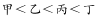。由此可知，丁部门有多少人参演？

- **A**. 16
- **B**. 20
- **C**. 23　✅
- **D**. 25

**答案**：C

**官方解析**

丙、丁两部门共有34名，且丁部门人数多于丙部门，则丁的人数大于17人，排除A项，剩余选项采用代入排除法：

若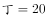人，则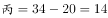人，人，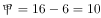人，，与题意不符，排除；

若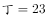人，则人，人，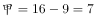人，，满足题意。

故正确答案为C。

---

## 第 11 题　qid 2047792 · 数学运算

现有浓度为和的盐水若干，如要配出600克浓度为的盐水，则分别需要浓度和的盐水多少克？

- **A**. 100、300
- **B**. 200、400　✅
- **C**. 300、600
- **D**. 400、800

**答案**：B

**官方解析**

方法一：混合浓度问题，采用线段法解决。

距离之比：，距离与量成反比，由此可以判断出所需浓度为和的两种溶液量之比为，因混合后的溶液为600克，则需浓度为的溶液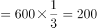克，需浓度为的溶液克，正确答案为B。

方法二：混合后的溶液为600克，所以选项中两种溶液量加和应为600克，正确答案为B。

故正确答案为B。

---

## 第 12 题　qid 2047796 · 数学运算

某单位有107名职工为灾区捐献了物资，其中78人捐献衣物，77人捐献食品。该单位既捐献衣物，又捐献食品的职工有多少人？

- **A**. 48　✅
- **B**. 50
- **C**. 52
- **D**. 54

**答案**：A

**官方解析**

根据两集合容斥原理问题的公式：，可以得到。，尾数为8，只有A项符合。

故正确答案为A。

---

## 第 13 题　qid 2047798 · 数学运算

有两支蜡烛，粗细不同，长度相等，粗蜡烛燃尽需要2小时，细蜡烛燃尽需要1小时。一天晚上停电，同时点燃了这两支蜡烛，若干分钟后来电了，将两支蜡烛同时熄灭，此时，粗蜡烛的长度是细蜡烛的2倍。假如蜡油的燃烧速度（单位时间的蜡油燃量）恒定，则停电时长为多少分钟？

- **A**. 30
- **B**. 35
- **C**. 40　✅
- **D**. 45

**答案**：C

**官方解析**

蜡烛长度相等，对蜡烛长度赋值，假设蜡烛长度均为2。由题意知粗蜡烛燃尽需2小时，细蜡烛燃尽需1小时，则粗蜡烛的燃烧速度为1，细蜡烛的燃烧速度为2，假设停电时间是小时：

同时点燃，同时熄灭时，发现粗蜡烛的长度是细蜡烛的2倍，则

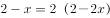，。

故正确答案为C。 

---

## 第 14 题　qid 2047800 · 数学运算

单位工会组织拔河比赛，每支参赛队都由3名男职工和3名女职工组成。假设比赛时要求3名男职工的站位不能全部连在一起，则每支队伍有几种不同的站位方式？

- **A**. 432
- **B**. 504
- **C**. 576　✅
- **D**. 720

**答案**：C

**官方解析**

6人排列，考虑顺序，共有种方法；

3名男职工全部连在一起，利用捆绑法有种方法；

则3名男职工不能全部连在一起的方法有：种。

故正确答案为C。

---

## 第 15 题　qid 2047802 · 数学运算

施工队给一个周长为40米的圆形花坛安装护栏。刚开始，每隔1米挖一个洞用于埋栏杆。后来发现洞的间隔太远，决定改为每隔0.8米挖一个洞。那么，至少需要再挖几个洞？

- **A**. 39
- **B**. 40　✅
- **C**. 41
- **D**. 42

**答案**：B

**官方解析**

“周长为40米的圆形花坛安装护栏”，环形植树问题，根据公式，。将间隔改为0.8米后，需要挖个洞，两次挖洞的间距1与0.8的最小公倍数为4，因此每隔4米会有一个洞重合，则共有个洞重合。因此改为每隔0.8米挖一个洞后，至少需要再挖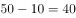个洞。

故正确答案为B。

---
