# 2017年广州市公务员录用考试《行测》题（单考区卷）

> 数量关系 · 13 题 · 广州市考 2017

## 第 1 题　qid 2045652 · 数学运算

2，1，，，，，（  ）

- **A**. 

　✅
- **B**. 

- **C**. 

- **D**. 
1

**答案**：A

**官方解析**

观察数列趋势，原数列可以反约分转化为： 、  、 、  、  、 ，新数列分子都是2，分母为自然数列，故所求项分子为2，分母为7，即：。

故正确答案为A。

---

## 第 2 题　qid 2045658 · 数学运算

0，-1，1，4，9，（  ）

- **A**. 9
- **B**. 16
- **C**. 25　✅
- **D**. 32

**答案**：C

**官方解析**

数列无明显特征，考虑作差。将原数列两两作差后得到新数列-1、2、3、5，本身无规律。对这个新数列取平方得到1、4、9、25，正好与原数列的后三项1、4、9吻合，故所求项为：。

具体变化规律：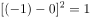,, , 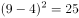。

故正确答案为C。

---

## 第 3 题　qid 2045686 · 数学运算

观察表中数字的变化规律，依次填入空格、中的数字是：

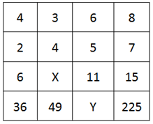

- **A**. 5，81
- **B**. 5，121
- **C**. 7，81
- **D**. 7，121　✅

**答案**：D

**官方解析**

通过观察，第一列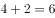，第三列，第四列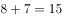。故，故所求：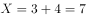。观察第四行依次为:36、49、225恰好是6、7、15的平方，即。故所求：。

故正确答案为D。

---

## 第 4 题　qid 2045706 · 数学运算

30个小朋友围成一圈玩传球游戏，每次球传给下一个小朋友需要1秒。当老师喊“转向”时，要改变传球方向。如果从小华开始传球，老师在游戏开始后的第16、31、49秒喊“转向”，那么在第多少秒时，球会重新回到小华手上？

- **A**. 68　✅
- **B**. 69
- **C**. 70
- **D**. 71

**答案**：A

**官方解析**

设顺时针方向为正方向，小华的位置为0号位置，顺时针依次为0号、1号、2号······29号，且开始时为正方向传球。根据题意有，在游戏开始后的第16秒，球传到16号位置，传球方向从正方向改为负方向。在第31秒，球传到号位置，传球方向从负方向转为正方向。在第49秒，球传到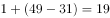号位置，传球方向从正方向转为负方向。若要球重新回到小华手上（0号位置），则还需要19秒，故总时间为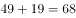秒。

故正确答案为A。

---

## 第 5 题　qid 2045710 · 数学运算

某班共有46人参加了一次数学测验，其中35人做对了第一题，28人做对了第二题，有3人都做错了这两道题，那么该班有（  ）人只做对了第二题。

- **A**. 8　✅
- **B**. 11
- **C**. 15
- **D**. 18

**答案**：A

**官方解析**

根据两集合容斥原理公式：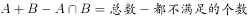，则有，，所以。

故正确答案为A。

---

## 第 6 题　qid 2045714 · 数学运算

某车间安排了若干工人加工甲、乙两种零件，每个工人每天可加工甲零件15个，或者加工乙零件10个。某种仪器每套需配有甲零件2个和乙零件3个。已知只安排8个工人加工甲零件。要使每天加工的零件恰好配套，则该车间安排了（  ）个工人加工甲、乙两种零件。

- **A**. 18
- **B**. 21
- **C**. 23
- **D**. 26　✅

**答案**：D

**官方解析**

已知只安排8个工人加工甲零件，则每天一共可生产个甲零件。由条件可知，仪器配套需要甲零件2个和乙零件3个，则120个甲零件配套的乙零件应有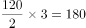个，则需要安排个工人加工乙零件。因此该车间共安排了个工人加工甲、乙两种零件。

故正确答案为D。

---

## 第 7 题　qid 2045716 · 数学运算

几个朋友相约游泳，男士统一戴白色泳帽，女士统一戴红色泳帽。每位男士看到的白色泳帽数量与红色泳帽数量一样多，每位女士看到的白色泳帽数量都是红色泳帽数量的倍数。女士最少有（  ）人。

- **A**. 1
- **B**. 2　✅
- **C**. 3
- **D**. 4

**答案**：B

**官方解析**

设男士有人，女士有人，倍数为。由条件“每位男士看到的白色泳帽数量与红色泳帽数量一样多”，且每位男士看到的白色泳帽数比男士人数少1，则有；由条件“每位女士看到的白色泳帽数量都是红色泳帽数量的倍数”，且每位女士看到的红色泳帽都比女士人数少1，则有。题目问最少，从最小的开始代入，若即女士只有一人，则此时女士看不到红色帽子，不符合条件，排除A项；当时，，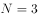，满足题意。

故正确答案为B。

---

## 第 8 题　qid 2045720 · 数学运算

钟老师与四名老师一起参加学校举办的教师技能大赛。这四名老师的成绩分别是78分、81分、82分、79分，而钟老师的成绩比五人的平均成绩多6分。那么，在五人中，第二名成绩比第四名多（  ）分。

- **A**. 2
- **B**. 3　✅
- **C**. 4
- **D**. 5

**答案**：B

**官方解析**

由条件“钟老师的成绩比五人的平均成绩多6分”可得，五个人最低分为78分，则平均分大于78，因此，钟老师的成绩大于分，排名第一。故82分为第二名，79分为第四名，分差为：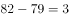分。

故正确答案为B。

---

## 第 9 题　qid 2045726 · 数学运算

某工业园拟为园内一个长100米、宽8米的花坛设置若干定点智能洒水装置，洒水范围是半径为5米的圆形。要保证花坛各个区域都可被灌溉，最少需要（  ）个洒水装置。

- **A**. 17　✅
- **B**. 18
- **C**. 19
- **D**. 20

**答案**：A

**官方解析**

         

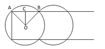

如上图所示，第一个洒水装置安放在O点，其洒水范围正好覆盖长方形花坛顶点A，依据题意可得：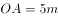，，，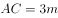，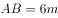，则一个洒水装置能够完全覆盖一个长为6m的长方形，花坛总长100m，，至少需要17个洒水装置。

故正确答案为A。

---

## 第 10 题　qid 2045728 · 数学运算

小陶要用小推车运送120本书到图书馆。已知大箱、中箱、小箱一次分别能装10、8、6本书，大箱、中箱、小箱各有3、4、13个。小推车一次能运送的箱数如下表。如果箱子不重复利用，小陶最少要运（  ）次，才能把所有书运送到图书馆。

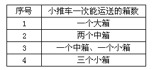

- **A**. 6
- **B**. 7
- **C**. 8　✅
- **D**. 9

**答案**：C

**官方解析**

由表中条件可得每次小推车分别运送的书本量为：10本、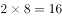本、本、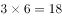本，如下表所示：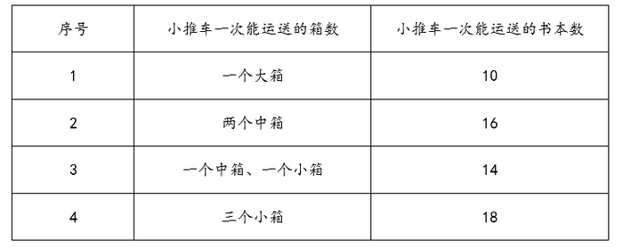

优先选择“序号4”运送方式，小箱共有13个，可用小推车运送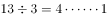，即4次，共运送书本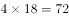本；再用“序号2”运送方式，中箱共有4个，可用小推车运送次，共运书本本；剩余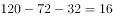本，再用“序号1”运送2次即可。则至少运了次。

故正确答案为C。

---

## 第 11 题　qid 2045730 · 数学运算

某批发市场有大、小两种规格的盒装鸡蛋，每个大盒里装有23个鸡蛋，每个小盒里装有16个鸡蛋。餐厅采购员小王去该市场买了500个鸡蛋，则大盒装一共比小盒装（  ）。

- **A**. 多2盒
- **B**. 少1盒
- **C**. 少46个鸡蛋
- **D**. 多52个鸡蛋　✅

**答案**：D

**官方解析**

假设大盒装、小盒装分别有、个，根据题意可得：

，已知16、500均为4的整数倍，则能被4整除。若，为非整数，排除；若，为非整数，排除；若，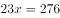，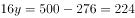，满足，则大盒装比小盒装多个鸡蛋。

故正确答案为D。

---

## 第 12 题　qid 2045732 · 数学运算

某班级共有学生52人，从小琳、小宇、小菲、小筠、小铭五人中选出班长，全班每人限投票一张，不能弃权。结果是：小琳得票最多；小宇得票第二，比小琳少3票；小菲和小筠得票相同且并列第三；小铭只有5票，得票最少。那么，小琳当选班长的票数可能是（  ）票。

- **A**. 12
- **B**. 13
- **C**. 14
- **D**. 15　✅

**答案**：D

**官方解析**

假设小琳得票数为，小菲得票数为，则5人得票从高到低为：、、、、，则，即。因，则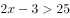，，D项满足。

故正确答案为D。

---

## 第 13 题　qid 2045748 · 数学运算

有100根水管需要堆放在仓库。水管只能堆放为下图这种上少下多的形式，且堆叠层高不超过8层。在占地面积尽可能少的前提下，如果100根水管全部都堆成一堆，占地面积会比将100根水管分成每20根一堆的占地面积节省（  ）。

- **A**. 

- **B**. 

- **C**. 

- **D**. 

　✅

**答案**：D

**官方解析**

根据题干水管从上到下是公差为1的等差数列。水管直径和长度相同，则占地面积值之比为最底部水管根数之比。

当每20根一堆时，堆放从上到下为2根、3根、4根、5根、6根，共5堆，最底部水管根数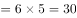根；

当100根一堆时，只能八层，根据等差数列求和公式：，求得中位数12.5，即堆放从上到下为9根、10根、11根、12根、13根、14根、15根、16根，则最下层为16根。占地面积节省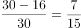。

故正确答案为D。

---
