# 2017年新疆兵团公务员录用考试《行测》题（网友回忆版）

> 数量关系 · 10 题 · 新疆 2017

## 第 1 题　qid 2144670 · 数学运算

甲乙两家公司生产同样的传感器，从2月开始甲公司每月产量不变，乙公司每月增加1倍。已知1月份两家公司共生产传感器7200件，2月份两家公司共生产传感器8600件，乙公司第一次产量超过甲公司是在（  ）月份。

- **A**. 4　✅
- **B**. 5
- **C**. 6
- **D**. 7

**答案**：A

**官方解析**

方法一：由题意设甲1月份生产的传感器为件，乙生产的是件，根据题意可知，乙公司产量每月增加1倍，即变为原来的2倍，则乙公司的产量是公比为2的等比数列，因此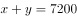，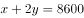，解得，。设第n个月乙公司超过甲公司，即，化简得，n最小为4即可满足，则乙公司第一次产量超过甲公司是在4月份。

方法二：由题意设甲1月份生产的传感器为件，乙生产的是件，根据题意可知，，，解得，。

列表可知:

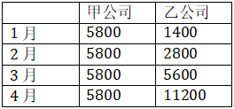

则乙公司第一次产量超过甲公司是在4月份。

故正确答案为A。

---

## 第 2 题　qid 2144674 · 数学运算

已知一形状为正六边形的跑道，边长为150米，甲乙两人分别从两个相对的顶点同时出发，沿跑道相向匀速前进。两人第一次相遇时乙比甲多跑了50米，则甲乙两人跑步的速度之比是（  ）。

- **A**. 3:5
- **B**. 4:5　✅
- **C**. 5:3
- **D**. 5:4

**答案**：B

**官方解析**

由题意知正六边形相对的顶点之间有三条边，总长为米，由于两人第一次相遇时乙比甲多跑了50米，因此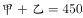，，解得甲跑了200米，乙跑了250米，当时间一定时，速度和距离成正比，可知。

故正确答案为B。

---

## 第 3 题　qid 2144680 · 数学运算

一个圆形的面积是54平方厘米，如果将该圆的半径变为原来的两倍，则该圆的面积变为（  ）平方厘米。

- **A**. 81
- **B**. 108
- **C**. 162
- **D**. 216　✅

**答案**：D

**官方解析**

设原来圆的半径为，则原来圆的面积，当半径变为原来的2倍即2时，现在圆的面积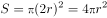，是原来面积的4倍，因此该圆的面积为平方厘米。

故正确答案为D。

---

## 第 4 题　qid 2144686 · 数学运算

某服装店进了一批短袖T恤，每件进价40元，以80元出售。但由于极端天气影响，这批T恤大批量积压。现老板打算将这批T恤打折处理，但要求利润率不低于，则最多能打（  ）折出售。

- **A**. 4
- **B**. 5
- **C**. 5.5　✅
- **D**. 6.5

**答案**：C

**官方解析**

根据，由题意利润率不低于，则售价最低为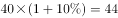元，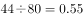，即打了5.5折。

故正确答案为C。

---

## 第 5 题　qid 2144689 · 数学运算

甲、乙、丙三人，其中每两个人的年龄之和分别是55岁，58岁，63岁，那么这三个人中年龄最小的是（    ）岁。

- **A**. 25　✅
- **B**. 26
- **C**. 30
- **D**. 33

**答案**：A

**官方解析**

由题意可知三人年龄之和为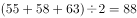岁，两个年龄大的人的年龄之和为63岁，则三人中年龄最小的是岁。

故正确答案为A。

---

## 第 6 题　qid 2144668 · 数学运算

有两个烧杯各装有一些盐酸溶液，其中乙烧杯中的盐酸浓度是甲烧杯的3倍，甲烧杯中盐酸溶液的质量是乙烧杯的3倍，那么将甲、乙两烧杯溶液混合后的盐酸溶液的浓度可能为（  ）。

- **A**. 

- **B**. 

　✅
- **C**. 

- **D**. 

**答案**：B

**官方解析**

注：根据题目已知条件，最终的混合溶液浓度是一个范围值，并不能解出唯一的答案。结合考点，推测本题考查倍数特性，故本题从倍数特性的角度给出一个较为合理解析。

方法一：由甲烧杯中盐酸溶液的质量是乙烧杯的3倍，可赋值甲杯溶液质量为300，乙杯为100。又由乙烧杯中的盐酸浓度是甲烧杯的3倍，可设甲烧杯浓度为，则乙烧杯浓度为。根据浓度公式，甲、乙两烧杯溶液混合后的盐酸溶液的，结果是3的倍数，只有B项满足。

方法二：设混合后溶液浓度为y，甲烧杯溶液浓度为x，则乙烧杯溶液浓度为3x。可画图如下：

根据线段法口诀：距离与量成反比，可得，整理得，应为3的倍数，只有B项满足。

故正确答案为B。

---

## 第 7 题　qid 2144671 · 数学运算

甲企业有两台新旧程度不同的设备A和B，两台设备同时运作10小时可生产出920件零件，已知新设备A生产速度是旧设备B生产速度的1.3倍，A设备每小时能生产出（    ）件零件。

- **A**. 52　✅
- **B**. 40
- **C**. 30
- **D**. 35

**答案**：A

**官方解析**

根据“两台设备同时运作10小时可生产出920件零件”，可计算出两台设备的效率和为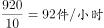。又因为新设备A生产速度是旧设备B生产速度的1.3倍，可设旧设备B生产速度为，则新设备A生产速度是，那么，解得，因此A设备每小时能生产出件零件。

故正确答案为A。

秒杀技：新设备A生产速度是旧设备B生产速度的1.3倍，结果是1.3的倍数，只有A项符合。

---

## 第 8 题　qid 2144676 · 数学运算

某个品牌的罐装饼干中，有不同动物形状的饼干共100个，其中狮子形状的有30个，小猪形状的有40个，兔子形状的有30个。小明从罐中任意取出一把饼干，发现狮子形状的有10个，小猪形状的也有10个。此时，小明接着取出一个兔子形状饼干的概率是（  ）。

- **A**. 

- **B**. 

- **C**. 

　✅
- **D**. 

**答案**：C

**官方解析**

罐装饼干共100个，任意取出一把饼干，发现狮子形状的有10个，小猪形状的也有10个，剩下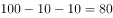个。而兔子形状的有30个，此时，小明接着取出一个兔子形状饼干的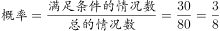。

故正确答案为C。

---

## 第 9 题　qid 2144682 · 数学运算

李明国庆节假期要做若干道英语试题，第一天做了这些试题的一半多一道，第二天做了剩下的一半多一道，第三天又做了剩下的一半多一道后，还剩一道试题。那么李明国庆节假期总共要做（  ）道英语试题。

- **A**. 12
- **B**. 16
- **C**. 22　✅
- **D**. 24

**答案**：C

**官方解析**

根据条件，见下表。

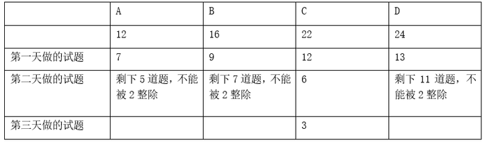

C项22的一半是11，第一天做了12道，剩下10道，第二天做了剩下的一半多一道，即，剩下4道，第三天又做了剩下的一半多一道，即，最后还剩一道试题。满足条件，正确。

故正确答案为C。

---

## 第 10 题　qid 2144687 · 数学运算

小明参加某趣味问答竞赛，一共50题，满分是100分，60分及格。答对一题得2分，答错一题扣2分。结果小明答完所有题目但是没有及格。小明最后发现，如果自己多答对2题就刚好及格。那么小明一共答错了（  ）题。

- **A**. 12　✅
- **B**. 20
- **C**. 34
- **D**. 38

**答案**：A

**官方解析**

由一共50题，可设小明答错了题，又多答对2题就刚好及格，此时答错的题为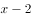，答对的为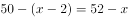。由“答对一题得2分，答错一题扣2分，多答对2题就刚好及格。”可得，，解得。因此小明一共答错了12题。

故正确答案为A。

---
