# 2017年江苏省公务员录用考试《行测》题(A类)

> 数量关系 · 14 题 · 江苏 2017

## 第 1 题　qid 2042412 · 数学运算

-1，3，-3，-3，-9，（  ）

- **A**. -9
- **B**. -4
- **C**. -14
- **D**. -45　✅

**答案**：D

**官方解析**

题干倍数关系明显，考虑作商。后项除以前项得到新数列：3，1，1， 3，新数列为公差是 2 的等差数列，故新数列的下一项应为5，所求项为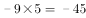。 

故正确答案为D。

---

## 第 2 题　qid 2042418 · 数学运算

4.1，4.3，12.1，12.11，132.1，（  ）

- **A**. 120.8
- **B**. 124.12
- **C**. 132.131　✅
- **D**. 132.12

**答案**：C

**官方解析**

题干出现小数，考虑机械划分。机械划分后，内部之间无规律，考虑外部规律。前一项整数部分与小数部分之积为下一项整数部分，前一项整数部分与小数部分之差为下一项小数部分。故所求项整数部分为，小数部分为，故所求项为132.131。

故正确答案为C。

---

## 第 3 题　qid 2042422 · 数学运算

，，，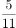，，（  ）

- **A**. 
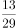
　✅
- **B**. 

- **C**. 

- **D**. 

**答案**：A

**官方解析**

题干为分数数列、且变化趋势不单调，先考虑反约分，得到新数列：、、、、，然后单独看分母和分子。分母成新数列3、4、7、11、18，由，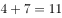，可知前两项之和等于第三项，故下一项分母为。分子成新数列1、2、3、5、8，由，可知前两项之和等于第三项，故下一项分子为。故所求项为。

故正确答案为A。

---

## 第 4 题　qid 2042444 · 数学运算

1，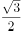，1，，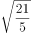，（  ）

- **A**. 

　✅
- **B**. 
3

- **C**. 

- **D**. 
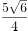

**答案**：A

**官方解析**

题干为分数数列，且出现整数，先考虑反约分可得新数列、、、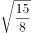 、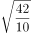，然后单独看分母和分子。新数列根号里分母依次为2、4、6、8、10，故下一项根号里分母为12。单独看根号内分子部分为2、3、6、15、42，作差可得1、3、9、27为公比是3的等比数列，则下一项81，故下一项分子为。故原数列下一项为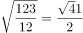。

故正确答案为A。

---

## 第 5 题　qid 2042438 · 数学运算

甲、乙两人用相同工作时间共生产了484个零件，已知生产1个零件甲需5分钟、乙需6分钟，则甲比乙多生产的零件数是：

- **A**. 40个
- **B**. 44个　✅
- **C**. 45个
- **D**. 46个

**答案**：B

**官方解析**

方法一：已知“生产1个零件甲需5分钟、乙需6分钟”，设乙生产了个零件，则甲生产了个零件，总共生产了个零件，甲比乙多生产的零件为个，因为，则个（可根据尾数法判断尾数为4）。

方法二：已知“生产1个零件甲需5分钟、乙需6分钟”，甲乙时间之比为，效率之比即为，即甲每生产6个的同时乙生产5个，因此每合计生产11个，甲就要多生产1个，则，因此甲比乙多生产44个。

故正确答案为B。

---

## 第 6 题　qid 2042440 · 数学运算

玻璃厂委托运输公司运送400箱玻璃。双方约定：每箱运费30元，如箱中玻璃有破损，那么该箱的运费不支付且运输公司需赔偿损失60元。最终玻璃厂向运输公司共支付9750元，则此次运输中玻璃破损的箱子有：

- **A**. 25箱　✅
- **B**. 28箱
- **C**. 27箱
- **D**. 32箱

**答案**：A

**官方解析**

方法一：设此次运输中玻璃破损的箱子有x箱，则未破损的箱子有箱，根据题意可得：，可得。

方法二：没有玻璃破损的箱子则需要付元，每有一箱有玻璃破损则需要少付元，设此次运输中玻璃破损的箱子有箱，可得，可得。

故正确答案为A。

---

## 第 7 题　qid 2042450 · 数学运算

A、B两个容器装有质量相同的酒精溶液，若从A、B中各取一半溶液，混合后浓度为；若从A中取、B中取溶液，混合后浓度为。若从A中取、B中取溶液，则混合后溶液的浓度是：

- **A**. 

- **B**. 

- **C**. 

　✅
- **D**. 

**答案**：C

**官方解析**

方法一：设A、B酒精溶液的质量均为100克，A的纯酒精为a克，B的纯酒精为b克，则根据已知条件可得：

···①

···②

由①、②可得，，则。

方法二：根据线段法设A溶液浓度为a，B溶液浓度为b，可得：

···①

···②

由①、②可得，，因此若从A中取、B中取溶液，可得。

故正确答案为C。

---

## 第 8 题　qid 2042454 · 数学运算

某单位组织志愿者参加公益活动，有8名员工报名，其中2名超过50岁。现将他们分成3组，人数分别为3、3、2，要求2名超过50岁的员工不在同组，则不同分组的方案共有:

- **A**. 120种
- **B**. 150种
- **C**. 160种
- **D**. 210种　✅

**答案**：D

**官方解析**

2名超过50岁的员工不在同组，则2名50岁员工要么分在2个3人组，要么分在1个2人组1个3人组。

2名超过50岁的人分在2个3人组，有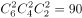种情况；

2名超过50岁的人分在1个2人组1个3人组，有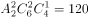种情况；

所以不同分组的方案共有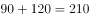种。

故正确答案为D。

---

## 第 9 题　qid 2042456 · 数学运算

李教授受某单位邀请作一次学术报告，得劳务费1760元。按规定，一次性劳务费超过800元的部分需扣缴的税，则李教授的税前劳务费是:

- **A**. 2200元
- **B**. 2000元　✅
- **C**. 1950元
- **D**. 1900元

**答案**：B

**官方解析**

设李教授的税前劳务费是元，根据题意可得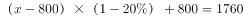，

解得元，所以李教授的税前劳务费是2000元。

故正确答案为B。

---

## 第 10 题　qid 2042420 · 数学运算

玩具厂原来每日生产某玩具560件，用A、B两种型号的纸箱装箱，正好装满24只A型纸箱和25只B型纸箱。扩大生产规模后该玩具的日产量翻了一番，仍然用A、B两种型号的纸箱装箱，则每日需要纸箱的总数至少是：

- **A**. 70只
- **B**. 75只　✅
- **C**. 77只
- **D**. 98只

**答案**：B

**官方解析**

假设A、B型纸箱各能装下a件、b件玩具，根据题意可得：

，24a与560均能被8整除，则b能被8整除，当，，满足；当，a为非整数，排除；当，，排除，故可确定，。

要想日产量翻番后，纸箱总数少，则A型箱应尽可能多用，假设A、B型纸箱各用了、个，根据题意可得：，要使A型尽量多，则令B型为0个，则，即A型纸箱至少为75只。

故正确答案为B。

---

## 第 11 题　qid 2042428 · 数学运算

某地遭受重大自然灾害后，A公司立即组织捐款救灾。已知该公司有100名员工捐款，捐款额有300元、500元和2000元三种，捐款总额为36000元，则捐款500元的员工数是：

- **A**. 11人
- **B**. 12人
- **C**. 13人　✅
- **D**. 14人

**答案**：C

**官方解析**

设捐款300元、500元、2000元的人数分别为x、y、z，根据题意，

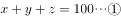

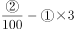，化简得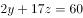，根据奇偶特性，z只能是偶数且大于0，若，解得；若，则，排除。

故正确答案为C。

---

## 第 12 题　qid 2042432 · 数学运算

在一次竞标中，评标小组对参加竞标的公司进行评分，满分120分。按得分排名，前5名的平均分为115分，且得分是互不相同的整数，则第三名得分至少是：

- **A**. 112分
- **B**. 113分　✅
- **C**. 115分
- **D**. 116分

**答案**：B

**官方解析**

设第三名得分为x分，要使x最少，则其他人得分应尽量多，根据题意，第一、二名得分至多为120、119，第四、五名得分至多为、，则，，解得。

故正确答案为B。

---

## 第 13 题　qid 2042434 · 数学运算

某市规划建设的4个小区，分别位于直角梯形ABCD的4个顶点处（如图），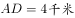，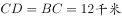。欲在CD上选一点S建幼儿园，使其与4个小区的直线距离之和为最小，则S与C的距离是：

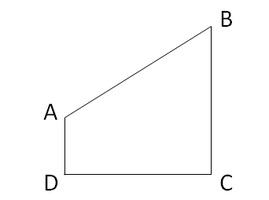

- **A**. 3千米
- **B**. 4千米
- **C**. 6千米
- **D**. 9千米　✅

**答案**：D

**官方解析**

幼儿园S与4个小区的直线距离之和为，，要使距离之和最小,只需最小，对应CD作A的镜像点A’，连接BA’， BA’与CD的交点即S点，此时最小，，则，, 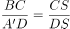，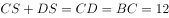，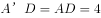，解得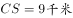。

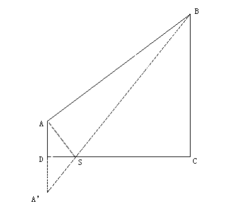

故正确答案为D。

---

## 第 14 题　qid 2042436 · 数学运算

甲、乙两人从湖边某处同时出发，反向而行，甲每走50分钟休息10分钟，乙每走1小时休息5分钟。已知绕湖一周是21千米，甲、乙的行走速度分别为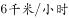和，则两人从出发到第一次相遇所用的时间是:

- **A**. 2小时10分钟
- **B**. 2小时22分钟　✅
- **C**. 2小时16分钟
- **D**. 2小时28分钟

**答案**：B

**官方解析**

从同一起点绕湖反向而行，第一次相遇时甲、乙行走总路程为一周即21千米，结合选项，出发2小时10分钟时，甲休息20分钟、走110分钟， 路程为千米，乙休息10分钟、走120分钟， 路程为千米，千米，此后甲、乙继续行进，至相遇还需，则总用时为2小时22分钟。

故正确答案为B。

---
