# 2017年江苏省公务员录用考试《行测》题(B类)

> 数量关系 · 13 题 · 江苏 2017

## 第 1 题　qid 2042052 · 数学运算

1，1.2，1.8，3.6，9，（  ）

- **A**. 12
- **B**. 16.2
- **C**. 25.2　✅
- **D**. 27

**答案**：C

**官方解析**

数列无明显特征，优先考虑作差。后项减前项得到新数列：0.2，0.6，1.8，5.4，（    ），是公比为3的等比数列，则。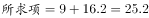。

故正确答案为C。

---

## 第 2 题　qid 2042074 · 数学运算

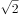，，2，3，，（  ）

- **A**. 
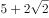

- **B**. 

- **C**. 
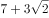
　✅
- **D**. 

**答案**：C

**官方解析**

数列无明显特征，优先考虑作差。作差后得到新数列：，，，，（）。作差后为公比为的等比数列，故新数列的下一项为，由此可得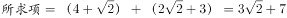。

故正确答案为C。

---

## 第 3 题　qid 2042082 · 数学运算

，，，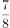，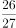，（  ）

- **A**. 
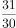
　✅
- **B**. 

- **C**. 
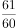

- **D**. 
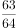

**答案**：A

**官方解析**

数列分子、分母呈递增趋势，优先反约分，将数列转化为单调递增。原数列可转化为：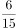，，，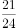，，（），分母为公差是3的等差数列，分子为公差是5的等差数列，则。

故正确答案为A。

---

## 第 4 题　qid 2042064 · 数学运算

某公司将一款自行车3次折价销售，第二次在首次打折的基础上打相同的折扣，第三次在第二次打折的基础上降价三分之一。已知该款自行车3次打折后的价格是原价的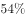，则首次的折扣是：

- **A**. 7.5折
- **B**. 8折
- **C**. 8.4折
- **D**. 9折　✅

**答案**：D

**官方解析**

设原价为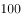，首次打折的折扣为，则首次打折售价为，第二次打折时售价为，第三次打折时售价为：，解得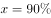即打9折。

故正确答案为D。

---

## 第 5 题　qid 2042076 · 数学运算

若将一项工程的、、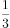和依次分配给甲、乙、丙、丁四家工程队，分别需要15天、15天、30天和9天完成，则他们合作完成该项工程需要的时间是：

- **A**. 12天
- **B**. 15天　✅
- **C**. 18天
- **D**. 20天

**答案**：B

**官方解析**

赋值工程总量为180，则工作效率分别为：、、、。则四个工程队合作完成该项工程，需要时间：天。

故正确答案为B。

---

## 第 6 题　qid 2042046 · 数学运算

一个圆盘上按顺时针方向依次排列着编号为1到7的七盏彩灯，通电后每个时刻只有三盏亮着，每盏亮6秒后熄灭，同时其顺时针方向的下一盏开始亮，如此反复。若通电时编号为1，3，5的三盏先亮，则200秒后亮着的三盏彩灯的编号是：

- **A**. 1，3，6　✅
- **B**. 1，4，6
- **C**. 2，4，7
- **D**. 2，5，7

**答案**：A

**官方解析**

编号为1，3，5的三盏彩灯先亮，每盏亮6秒后熄灭，顺时针方向下一盏开始亮，下一次是2，4，6，······，则200秒一共转换了次秒，即33次。圆盘上一共7盏彩灯，故转换7次为一个循环，200秒一共转换了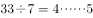次，即转完4个循环后，再从1，3，5顺时针转换5次，所以1号灯：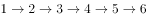，最后6号灯亮着；3号灯：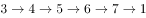，最后1号灯亮着；5号灯：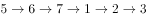，最后3号灯亮着。

故正确答案为A。

---

## 第 7 题　qid 2042050 · 数学运算

某公司管理人员、技术人员和后勤服务人员一月份的平均收入分别为6450元、8430元和4350元，收入总额分别为5.16万元、33.72万元和5.22万元。则该公司这三类人员一月份的人均收入是：

- **A**. 6410元
- **B**. 7000元
- **C**. 7350元　✅
- **D**. 7500元

**答案**：C

**官方解析**

公司管理人员数量：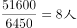，技术人员数量：，后勤服务人员数量：。则这三类人员的人均收入为：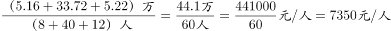。

故正确答案为C。

---

## 第 8 题　qid 2042054 · 数学运算

某一楼一户住宅楼共17层，电梯费按季交纳，分摊规则为：第一层的住户不交纳；第三层及以上的住户，每层比下一层多交纳10元。若每一季度该住宅楼某单元的电梯费共计1904元，则该单元第7层住户一季度应交纳的电梯费是：

- **A**. 72元
- **B**. 82元
- **C**. 84元
- **D**. 94元　✅

**答案**：D

**官方解析**

方法一：设第二层一季度电梯费为，则第三层电梯费为，以此类推第17层电梯费为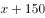。则一季度该栋住宅楼电梯费总和为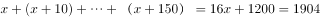，解得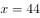，所以第7层电梯费为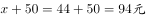。

方法二：第三层及以上，每层比下一层多10元，即“从第2层起，每层多10元”，满足等差数列定义。因为第一层住户不交纳，所以1904是第2层到第17层这个等差数列的和，一共有16层，则中间项（）的值为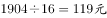，而公差为10元，所以第9层为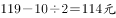，所以第7层为。

故正确答案为D。

---

## 第 9 题　qid 2042066 · 数学运算

甲、乙、丙三个单位各派2名志愿者参加公益活动，现将这6人随机分成3组，每组2人，则每组成员均来自不同单位的概率是：

- **A**. 

- **B**. 

- **C**. 

- **D**. 
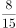
　✅

**答案**：D

**官方解析**

6个人随机分成3组，总数为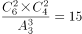种情况。每组成员来自不同的单位，正向考虑情况数较多，故反向考虑，即考虑有的成员来自相同的单位。

第一类情况：只有一组来自同一单位。先在3个单位中任选1个单位的2名成员同组，有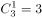种情况；设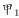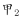同一单位，则剩下的两组可能有两种情况：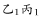和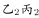；和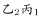。满足的情况数为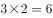种。

第二类情况：有两组来自同一单位，而剩下一组也一定来自同一单位，即三组均来自同一单位，共1种情况。

则满足有的成员来自相同单位的概率，所求每组成员均来自不同单位的概率。

故正确答案为D。

---

## 第 10 题　qid 2042070 · 数学运算

一艘游轮在海上匀速航行，航向保持不变。上午8时在游轮的正东方30海里处有一灯塔。上午10时30分该灯塔位于游轮的正南方40海里处，则在该时段内，游轮与灯塔距离最短的时刻是：

- **A**. 8时45分
- **B**. 8时54分　✅
- **C**. 9时15分
- **D**. 9时18分

**答案**：B

**官方解析**

如下图所示，灯塔在A点，游轮从O点出发至B点，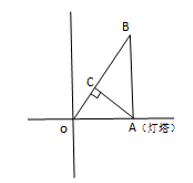

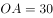海里，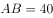海里，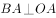，则

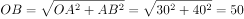海里，游轮速度为，从A点引垂线垂直OB于C点，游轮在C点位置与灯塔距离最短。

相似于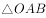，则，即海里，游轮从O点行至C点所需时间为小时，即54分钟，故与灯塔距离最短时刻为8时54分。

故正确答案为B。

---

## 第 11 题　qid 2042414 · 数学运算

小王去超市购物，带现金245元，其中1元6张、2元2张、5元3张、10元2张、50元2张、100元1张，选购的物品总计167元，若用现金结账且不需要找零，则不同的面值组合方式有：

- **A**. 6种
- **B**. 7种
- **C**. 8种　✅
- **D**. 9种

**答案**：C

**官方解析**

凑钱数且情况数较少，采用枚举法。总共245元，需要花费167元，因50以下的面额钱数之和为元，故100元和50元面额至少需要提供元，因此必须存在100元和50元各一张。此时只需从50以下面额中枚举出17元的所有组合。情况如下：

总共8种情况。

故正确答案为C。

---

## 第 12 题　qid 2042420 · 数学运算

玩具厂原来每日生产某玩具560件，用A、B两种型号的纸箱装箱，正好装满24只A型纸箱和25只B型纸箱。扩大生产规模后该玩具的日产量翻了一番，仍然用A、B两种型号的纸箱装箱，则每日需要纸箱的总数至少是：

- **A**. 70只
- **B**. 75只　✅
- **C**. 77只
- **D**. 98只

**答案**：B

**官方解析**

假设A、B型纸箱各能装下a件、b件玩具，根据题意可得：

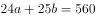，24a与560均能被8整除，则b能被8整除，当，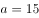，满足；当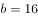，a为非整数，排除；当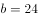，，排除，故可确定，。

要想日产量翻番后，纸箱总数少，则A型箱应尽可能多用，假设A、B型纸箱各用了、个，根据题意可得：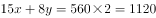，要使A型尽量多，则令B型为0个，则，即A型纸箱至少为75只。

故正确答案为B。

---

## 第 13 题　qid 2042442 · 数学运算

如图，在梯形ABCD中，,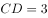，AC交BD于O点，过O作AB的平行线交BC于E点，连结DE交AC于F点，过F作AB的平行线交BC于G点，连结DG交AC于M点，过M作AB的平行线交BC于N点，则线段MN的长为：

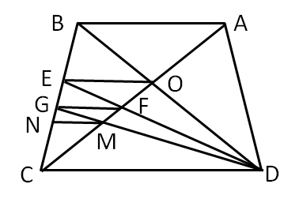

- **A**. 

　✅
- **B**. 

- **C**. 

- **D**. 

**答案**：A

**官方解析**

由题意可得：AB平行CD，则，则，；OE平行CD，则，则；

同理，在梯形EODC中，，，，GF平行CD，则，则；

在梯形GFDC中，，，，MN平行CD，则，则。

故正确答案为A。

---
