# 2017年江苏省公务员录用考试《行测》题（C类）

> 数量关系 · 13 题 · 江苏 2017

## 第 1 题　qid 2042458 · 数学运算

23，1，-5，5，31，（  ）

- **A**. -11
- **B**. 47
- **C**. 73　✅
- **D**. 83

**答案**：C

**官方解析**

数列无明显特征，优先考虑作差。作差后得到新数列：-22，-6，10，26，（），为公差是16的等差数列，则新数列的下一项。所求项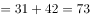。

故正确答案为C。

---

## 第 2 题　qid 2042418 · 数学运算

4.1，4.3，12.1，12.11，132.1，（  ）

- **A**. 120.8
- **B**. 124.12
- **C**. 132.131　✅
- **D**. 132.12

**答案**：C

**官方解析**

题干出现小数，考虑机械划分。机械划分后，内部之间无规律，考虑外部规律。前一项整数部分与小数部分之积为下一项整数部分，前一项整数部分与小数部分之差为下一项小数部分。故所求项整数部分为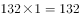，小数部分为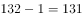，故所求项为132.131。

故正确答案为C。

---

## 第 3 题　qid 2042478 · 数学运算

，-1，，，，（  ）

- **A**. 
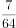

- **B**. 

- **C**. 

　✅
- **D**. 

**答案**：C

**官方解析**

题干为分数数列，且出现整数，先考虑反约分可得新数列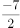，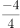，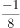，，，然后单独看分子和分母。新数列分母依次为2，4，8，16，32，是公比为2的等比数列，故下一项的分母为64，再看分子-7，-4，-1，2，5是公差为3的等差数列，故下一项的分子为8，因此下一项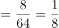

故正确答案为C。

---

## 第 4 题　qid 2042438 · 数学运算

甲、乙两人用相同工作时间共生产了484个零件，已知生产1个零件甲需5分钟、乙需6分钟，则甲比乙多生产的零件数是：

- **A**. 40个
- **B**. 44个　✅
- **C**. 45个
- **D**. 46个

**答案**：B

**官方解析**

方法一：已知“生产1个零件甲需5分钟、乙需6分钟”，设乙生产了个零件，则甲生产了个零件，总共生产了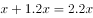个零件，甲比乙多生产的零件为个，因为，则个（可根据尾数法判断尾数为4）。

方法二：已知“生产1个零件甲需5分钟、乙需6分钟”，甲乙时间之比为，效率之比即为，即甲每生产6个的同时乙生产5个，因此每合计生产11个，甲就要多生产1个，则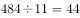，因此甲比乙多生产44个。

故正确答案为B。

---

## 第 5 题　qid 2042500 · 数学运算

设正整数，，，满足，且，则的值是：

- **A**. 4
- **B**. 5
- **C**. 6　✅
- **D**. 9

**答案**：C

**官方解析**

方法一：观察，等式两边同除以，化简整理可得。不妨令最小的数，代入方程，此时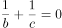，、无解，排除；若，则，此时最小为3，代入解得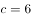。

方法二：观察，等式两边同除以，化简整理可得。代入选项A，可得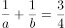，，此时、无正整数解；代入选项B，可得，，此时、仍然无正整数解；代入选项C，可得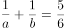，，此时有正整数解，，满足题意。

故正确答案为C。

---

## 第 6 题　qid 2042440 · 数学运算

玻璃厂委托运输公司运送400箱玻璃。双方约定：每箱运费30元，如箱中玻璃有破损，那么该箱的运费不支付且运输公司需赔偿损失60元。最终玻璃厂向运输公司共支付9750元，则此次运输中玻璃破损的箱子有：

- **A**. 25箱　✅
- **B**. 28箱
- **C**. 27箱
- **D**. 32箱

**答案**：A

**官方解析**

方法一：设此次运输中玻璃破损的箱子有x箱，则未破损的箱子有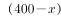箱，根据题意可得：，可得。

方法二：没有玻璃破损的箱子则需要付元，每有一箱有玻璃破损则需要少付元，设此次运输中玻璃破损的箱子有箱，可得，可得。

故正确答案为A。

---

## 第 7 题　qid 2042510 · 数学运算

两公司为召开联欢晚会，分别编排了3个和2个节目，要求同一公司的节目不能连续出场，则安排节目出场顺序的方案共有：

- **A**. 12种　✅
- **B**. 18种
- **C**. 24种
- **D**. 30种

**答案**：A

**官方解析**

题目要求同一公司节目不能连续出场，则同一公司节目之间必然插入另一个公司节目，第一个公司3个节目之间刚好有2个空隙插入第二个公司的2个节目。先排第一个公司，3个节目出场顺序有种情况；再将第二个公司的节目排入空隙，出场顺序有种情况；所以节目出场顺序共有方案数为情况。总共12种情况。

故正确答案为A。

---

## 第 8 题　qid 2042050 · 数学运算

某公司管理人员、技术人员和后勤服务人员一月份的平均收入分别为6450元、8430元和4350元，收入总额分别为5.16万元、33.72万元和5.22万元。则该公司这三类人员一月份的人均收入是：

- **A**. 6410元
- **B**. 7000元
- **C**. 7350元　✅
- **D**. 7500元

**答案**：C

**官方解析**

公司管理人员数量：，技术人员数量：，后勤服务人员数量：。则这三类人员的人均收入为：。

故正确答案为C。

---

## 第 9 题　qid 2043664 · 数学运算

小王打靶共用了10发子弹，全部命中，都在10环、8环和5环上，总成绩为75环，则命中10环的子弹数是：

- **A**. 1发
- **B**. 2发　✅
- **C**. 3发
- **D**. 4发

**答案**：B

**官方解析**

设命中10环、8环、5环的子弹数分别为正整数、、。由子弹总数为10发，总环数为75环，可列不定方程组：

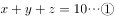；

；

求命中10环子弹数，由可得不定方程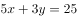。、25均为5的倍数，也必然为5的倍数，只能为5，此时。

故正确答案为B。

---

## 第 10 题　qid 2042054 · 数学运算

某一楼一户住宅楼共17层，电梯费按季交纳，分摊规则为：第一层的住户不交纳；第三层及以上的住户，每层比下一层多交纳10元。若每一季度该住宅楼某单元的电梯费共计1904元，则该单元第7层住户一季度应交纳的电梯费是：

- **A**. 72元
- **B**. 82元
- **C**. 84元
- **D**. 94元　✅

**答案**：D

**官方解析**

方法一：设第二层一季度电梯费为，则第三层电梯费为，以此类推第17层电梯费为。则一季度该栋住宅楼电梯费总和为，解得，所以第7层电梯费为。

方法二：第三层及以上，每层比下一层多10元，即“从第2层起，每层多10元”，满足等差数列定义。因为第一层住户不交纳，所以1904是第2层到第17层这个等差数列的和，一共有16层，则中间项（）的值为，而公差为10元，所以第9层为，所以第7层为。

故正确答案为D。

---

## 第 11 题　qid 2042450 · 数学运算

A、B两个容器装有质量相同的酒精溶液，若从A、B中各取一半溶液，混合后浓度为；若从A中取、B中取溶液，混合后浓度为。若从A中取、B中取溶液，则混合后溶液的浓度是：

- **A**. 

- **B**. 

- **C**. 

　✅
- **D**. 

**答案**：C

**官方解析**

方法一：设A、B酒精溶液的质量均为100克，A的纯酒精为a克，B的纯酒精为b克，则根据已知条件可得：

···①

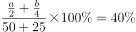···②

由①、②可得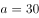，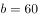，则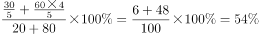。

方法二：根据线段法设A溶液浓度为a，B溶液浓度为b，可得：

···①

···②

由①、②可得，，因此若从A中取、B中取溶液，可得。

故正确答案为C。

---

## 第 12 题　qid 2043668 · 数学运算

某单位有72名职工，为丰富业余生活，拟举办书法、乒乓球和围棋培训班，要求每个职工至少参加一个班。已知三个班报名人数分别为36、20、28，则同时报名三个班的职工数至多是：

- **A**. 6人　✅
- **B**. 12人
- **C**. 16人
- **D**. 20人

**答案**：A

**官方解析**

题中给出总数和三个班分别报名人数，根据三集合非标准公式：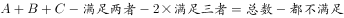进行列式。“每个职工至少参加一个班”，则都不满足数为0。代入数据：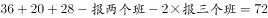，要想使报名三个班的职工数最多，则报名两个班的职工数最少为0。解得报名三个班的职工数为6人。

故正确答案为A。

---

## 第 13 题　qid 2043670 · 数学运算

小车和客车从甲地开往乙地，货车从乙地开往甲地，他们同时出发，货车与小车相遇20分钟后又遇客车。已知小车、货车和客车的速度分别为75千米/小时、60千米/小时和50千米/小时，则甲、乙两地的距离是：

- **A**. 205千米
- **B**. 203千米
- **C**. 201千米
- **D**. 198千米　✅

**答案**：D

**官方解析**

根据“他们同时出发，货车与小车相遇20分钟后又遇客车”判定本题有两个相遇过程，对于每个过程两车从两端同时出发相遇，则两车所走路程和均为总路程。设货车与小车相遇时间为，根据两次路程和相同列式：，解得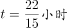，则。

故正确答案为D。

---
