# 2017年河南省公务员录用考试《行测》题（网友回忆版）

> 数量关系 · 15 题 · 河南 2017

## 第 1 题　qid 2136454 · 数学运算

某篮球比赛有12支球队报名参加，比赛的第一阶段中，12支球队平均分成2个组进行单循环比赛，每组前4名进入第二阶段；第二阶段采用单场淘汰赛，直至决出冠军。问亚军参加的场次占整个赛事总场次的比重为：

- **A**. 
以下

- **B**. 

- **C**. 

- **D**. 
以上
　✅

**答案**：D

**官方解析**

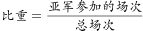。

总的场次：单循环阶段分两组，共有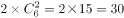场；单场淘汰阶段共有8队，需要淘汰7队，每淘汰1队需要进行1场比赛，共进行7场比赛。两个阶段共37场比赛。

亚军参加的场次：单循环阶段，每组6队，亚军需要跟另外5个球队各比一场，共5场；单场淘汰阶段共有8队，需要进行3轮（8—4—2—1），亚军每轮均要参与，共参与3场。两次共参与场比赛。

则亚军参加的场次占整个赛事总场次的，在以上。

故正确答案为D。

备注：本题主要是理解单循环比赛和淘汰赛的场次计算方法。

N支队伍进行单循环赛（任意两支队伍比赛一场）：一共比赛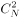场；

M支队伍进行决出冠、亚军的淘汰赛：一共比赛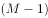场。

---

## 第 2 题　qid 2136456 · 数学运算

140支社区足球队参加全市社区足球淘汰赛，每一轮都要在未失败过的球队中抽签决定比赛对手，如上一轮未失败过的球队是奇数，则有一队不用比赛直接进入下一轮。问夺冠的球队至少要参加几场比赛？

- **A**. 3
- **B**. 4　✅
- **C**. 5
- **D**. 6

**答案**：B

**官方解析**

根据题意，每次参加比赛的球队数为140、70、35、18、9、5、3、2，共8场比赛。
冠军要想参加的比赛最少，则让其每逢球队数为奇数时就直接进入下一轮，即只参加球队数为偶数的比赛。
偶数有140、70、18、2这四个，共4场。
故正确答案为B。

---

## 第 3 题　qid 2136458 · 数学运算

老王和老李沿着小公园的环形小路散步，两人同时出发，当老王走到一半路程时，老李走了100米；当老王回到起点时，老李走了的路程。问环形小路总长多少米？

- **A**. 200
- **B**. 240　✅
- **C**. 250
- **D**. 300

**答案**：B

**官方解析**

依据题意，两人同时出发，在每个过程中时间一定，则速度比等于路程比。而两人速度比始终不变，则在两个运动过程中两人的路程比相同。

设环形小路全程为，则有：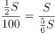，解得米。

故正确答案为B。

---

## 第 4 题　qid 2136460 · 数学运算

甲与乙一起骑自行车从A地去B地，自行车的速度为每小时15千米。走了的路程后，乙因故骑自行车返回A地而甲下车继续步行前行。乙在到达A地后立刻原路折返，在距离B地还有的路程处追上甲。问甲步行的速度为每小时多少千米？

- **A**. 3
- **B**. 4
- **C**. 5　✅
- **D**. 6

**答案**：C

**官方解析**

方法一：设二人从出发到骑行至的路程时所花时间为，则乙返回原点所用时间也为。又由乙追上甲时距离B地还有的路程可知，从乙开始返程的地点到乙追上甲的地点，距离也是全程的，由于乙的速度不变，所以所用时间也为。

设甲步行的速度为千米/小时，从出发点到追上点的距离分别用甲、乙的速度与时间表示，可得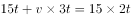，解得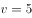。

方法二：甲、乙二人在全程处分开，甲步行至距离B点的路程处被乙追上，即甲步行了全程的；乙先骑行回到A处再原路折返追上甲，此时共行驶了个全程，即乙独自骑行了一个全程的路程。自两人分开后到甲被追上，两人时间相同，则路程之比等于速度之比，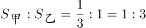，则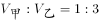，而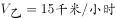，则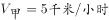。

故正确答案为C。

---

## 第 5 题　qid 2136464 · 数学运算

某公司将销售部门拆分为线上和线下两个团队，拆分后线上团队的人数为线下团队的2倍，线下团队男女员工人数相同，线上团队的男员工人数占两个团队男员工总数的。则拆分前，销售部门男女员工人数之比为：

- **A**. 1:2
- **B**. 2:3
- **C**. 3:5
- **D**. 5:7　✅

**答案**：D

**官方解析**

因为线上团队的人数为线下团队的2倍，设线下团队为人，线上团队为人。由于线下团队男女员工人数相同，所以线下团队男女员工均为人。设线上团队男员工为人，由于线上团队的男员工人数占两个团队男员工总数的，可得关系式，解得。

列表如下：

故所求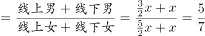，即男女总人数之比为5:7。

故正确答案为D。

---

## 第 6 题　qid 2136450 · 数学运算

某早餐店试营业主打套餐每份成本8元，售价26元。当天卖不完的主打套餐不再出售，在过去两天时间里，餐厅每天都会准备200份主打套餐，第一天剩余20份主打套餐，第二天全部卖光。问这两天该早餐店主打套餐共盈余多少元？

- **A**. 6680　✅
- **B**. 6840
- **C**. 7000
- **D**. 7160

**答案**：A

**官方解析**

每份套餐成本为8元，售价26元，则每份套餐的盈余为元；第一天售出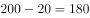份可以获得盈余，但剩余的20份会亏损8元，则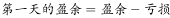元；

第二天200份套餐全部出售，全部可获得盈余为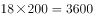元，则两天的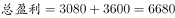元。

故正确答案为A。

---

## 第 7 题　qid 2136452 · 数学运算

公司销售部门共有甲、乙、丙、丁四个销售小组，本年度甲组销售金额是该部门销售金额总数的，乙组销售金额是另外三个小组总额的，丙组销售金额比丁组销售金额多200万元，比甲组少200万元。问销售部门销售总金额是多少万元？

- **A**. 1800
- **B**. 2400
- **C**. 3000　✅
- **D**. 3600

**答案**：C

**官方解析**

方法一：根据题干条件可得，丁的销售额最少，设丁的销售额为，则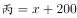，，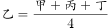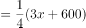。因甲的销售额是销售总额的，则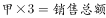，即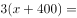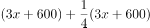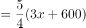，解得，则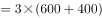万元。

方法二：因乙占另外三个小组总额的，则乙占总量的。

设销售总额为，则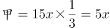，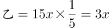，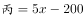，。

因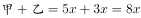，则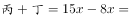，解得。万元。

注：若某人占其他人总和的，可以设其他人总和为份，某人为1份，则所有人总和为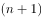份，可推得：某人占总量的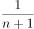，此为固定结论。

故正确答案为C。

---

## 第 8 题　qid 2136462 · 数学运算

某单位男女员工的人数之比是15:13。按人数之比5:7:8，分为甲、乙、丙三个科室，其中甲科室男女员工的人数之比为4:3，乙科室为5:2。则丙科室男女员工人数之比为：

- **A**. 1:2
- **B**. 2:3
- **C**. 5:9　✅
- **D**. 5:8

**答案**：C

**官方解析**

此单位按男女分，分成了28份；按科室分，分成了20份。赋值本单位的人数为二者的最小公倍数140人，则男性员工为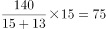人，女性员工为人。

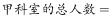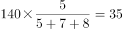人，人，人。

则甲科室的男员工有人，女员工有人；

乙科室的男员工有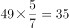人，女员工有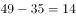人；

丙科室的男员工应有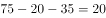人，女员工有人。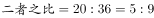。

故正确答案为C。

---

## 第 9 题　qid 2136466 · 数学运算

租车公司的商务车数量比小客车少16辆，某日租出商务车、小客车各16辆后，剩下的小客车数量正好是商务车的3倍。问该公司商务车和小客车数量之比为多少？

- **A**. 2:5
- **B**. 3:5　✅
- **C**. 4:7
- **D**. 5:7

**答案**：B

**官方解析**

根据题干条件，设商务车的数量为辆，则小客车的数量为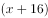辆。在各租出16辆后，剩余的小客车是商务车的3倍，则可得：，解得。即商务车有24辆，小客车有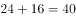辆，。

故正确答案为B。

---

## 第 10 题　qid 2136468 · 数学运算

小张每周一到周五都要去健身房锻炼。某年小张每个季度去健身房锻炼的天数相同，问当年的国庆节是星期几？

- **A**. 星期一
- **B**. 星期五
- **C**. 星期六
- **D**. 星期日　✅

**答案**：D

**官方解析**

小张每个季度去健身房锻炼的天数相同，每个季度的总天数见表中。在这四个季度中，第二季度是完整的13周，期间小张去健身房的天数一定为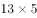天。所以第四季度小张去健身房的天数也应该是天，则第四季度比第二季度多出的一天一定为周六或周日，即第四季度的第一天国庆节为周六或周日。若10月1号是星期六，则9月30号是星期五，此时第三季度小张去健身房的天数是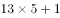，与第二季度去健身房天数不同；假设10月1号是星期日，则9月30号是周六，此时第三季度小张去健身房的天数是，满足题意。故国庆节当天只能是星期日。

故正确答案为D。

---

## 第 11 题　qid 2136470 · 数学运算

甲、乙、丙和丁四辆载重不同的卡车运输一批货物。其中甲的载重是乙的2倍、是丙的3倍、是丁的1.5倍。如果甲和丁一起运货，各跑10次正好能运完所有货物。如果乙和丙一起运货，且乙每小时运一趟、丙每半小时运一趟，问需要多少小时才能运完所有货物？

- **A**. 14
- **B**. 14.5　✅
- **C**. 15
- **D**. 15.5

**答案**：B

**官方解析**

题目中给出甲、乙、丙、丁工作效率间的比例关系，故可对效率进行赋值。赋值，则，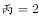，。由题意“甲和丁一起运货，各跑10次正好能运完所有货物”可得。乙每小时运一趟，即每小时可运3，丙每半小时运一趟，即每小时可运，所以乙、丙合运每小时可运的,则共需时间为，即一起运送14小时还剩下的货物量为2，剩余的2让丙运半小时即可运完所有货物，所以共14.5小时。

故正确答案为B。

---

## 第 12 题　qid 2136472 · 数学运算

一本书的正文页码数字中总计出现了87次2，问出现3的次数比6多多少次？

- **A**. 3　✅
- **B**. 4
- **C**. 6
- **D**. 10

**答案**：A

**官方解析**

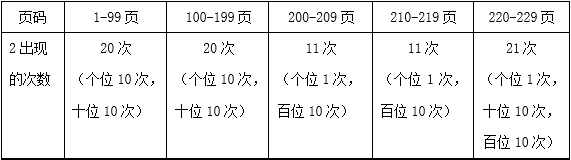

从表格中可计算出2出现的次数为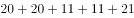次，题干为87次，还需要出现4个2，接下来230页、231页、232页共有4个2。前229页出现3的次数和6的次数同样多，故只有在最后三页（230、231、232）中3的个数比6多，共多出现了3次。

故正确答案为A。

---

## 第 13 题　qid 2136474 · 数学运算

张老师家四代同堂，且从父亲、张老师、儿子到孙子，每两代人的年龄差相同。5年前张老师父亲的年龄是儿子的3倍，8年后张老师的年龄是孙子的5倍。问今年四个人的年龄之和为：

- **A**. 168岁
- **B**. 172岁
- **C**. 176岁　✅
- **D**. 180岁

**答案**：C

**官方解析**

方法一：根据题意可假设今年父亲、张老师、儿子、孙子四人的年龄分别为：、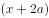、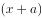、，可得方程组：

联立①②，解得，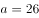。今年四人年龄之和为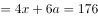岁。

方法二：假设5年前张老师儿子的年龄为，则张老师父亲年龄为，根据每两代人年龄差相同，则5年前张老师的年龄为，孙子为0岁，四人的年龄和为，由于年龄都是整数，所以是6的倍数。今年四人的年龄和应为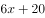，代入验证只有C项减去20后是6的倍数。

故正确答案为C。

---

## 第 14 题　qid 2136476 · 数学运算

某单位有80名职工参加了义务劳动、希望工程捐款和探望敬老院三项公益活动中的至少一项。只参加一项的人数与参加超过一项的人数相同，参加所有三项公益活动的与只捐款的人数均为12人，且只探望敬老院的人比只参加义务劳动的人多16人。问探望敬老院的人最多比参加义务劳动的人多多少人？

- **A**. 28
- **B**. 32
- **C**. 36
- **D**. 44　✅

**答案**：D

**官方解析**

由题意可得：只参加一项的人数与参加超过一项（两项和三项）的人数相同，即二者各占总数的一半，不止参加一项活动的人数为人，同时已知参加三项活动的有12人，所以参加两项活动的有人。假设只参加探望敬老院与捐款这两项活动的人数为，只参加捐款与义务劳动这两项活动的人数为，只参加探望敬老院与义务劳动这两项活动的人数为，则。又已知只探望敬老院的人比只参加义务劳动的人多16人，则题目所求为，而，所以当，时，取得最大值为28，则探望敬老院的人最多比参加义务劳动的人多人。

故正确答案为D。

---

## 第 15 题　qid 2136490 · 数学运算

一块三角形农田ABC（如下图所示）被DE、EF两条道路分成三块。已知，，，则三角形ADE、三角形CEF和四边形BDEF的面积之比为：

- **A**. 1:3:3
- **B**. 1:3:4
- **C**. 1:4:4　✅
- **D**. 1:4:5

**答案**：C

**官方解析**

由题意可知，D点、E点分别为AB、AC的三等分点，，，两个三角形对应边长之比为，相似三角形面积之比为边长之比的平方，则，而，代入选项验证，C项满足。

故正确答案为C。

---
