# 2017年深圳市公务员录用考试《行测》题

> 数量关系 · 11 题 · 深圳市考 2017

## 第 1 题　qid 2060542 · 数学运算

1，-3，4，1，25，（  ）

- **A**. 15
- **B**. 100
- **C**. 325
- **D**. 676　✅

**答案**：D

**官方解析**

数列变化幅度较小且变化趋势不明显，观察数列，发现4为2的平方，25为5的平方，从多次方角度入手找规律，发现：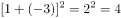，，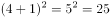，数列规律为，故。

故正确答案为D。

---

## 第 2 题　qid 2060502 · 数学运算

甲习惯在每月的1日去星光剧院观看话剧，而乙习惯在每周三到星光剧院观看话剧。甲、乙上一次同日在该剧院观看话剧是在4月1日，则在甲、乙保持原有看话剧的习惯不变的情况下，两人下一次同日在星光剧院观看话剧的日期为：

- **A**. 7月1日　✅
- **B**. 8月1日
- **C**. 9月1日
- **D**. 10月1日

**答案**：A

**官方解析**

本题要求下一次两人同天看话剧，由于选项中都为1日，则甲肯定去看话剧，问题转化为乙是否去看。判断乙是否去，只需判断间隔的时间是否能被7整除。代入A选项（因为问下一次，则应从最近日期开始代入）：间隔天数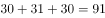可以被7整除，满足条件。

故正确答案为A。

---

## 第 3 题　qid 2060518 · 数学运算

甲、乙、丙三个桶内都有油，如果把甲桶内的油倒入乙桶，再把乙桶内的油倒入丙桶，最后再把丙桶内的油倒入甲桶，这时各桶内的油都是12升，则甲桶内原有（  ）升油。

- **A**. 9
- **B**. 10
- **C**. 12
- **D**. 15　✅

**答案**：D

**官方解析**

本题要求甲桶原有油多少，则可直接从甲桶入手。甲桶倒出去，还剩下，又从将丙桶内的油倒入甲桶之后，甲乙两桶都为12升。则可设甲桶原有油为升，乙桶倒入丙桶后丙桶的油量为升，则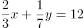 ①，  ②，联立求解可得，。 

故正确答案为D。

---

## 第 4 题　qid 2060528 · 数学运算

甲、乙两个蔬菜基地，分别向M、P、Q三个超市提供同品种蔬菜、按约共向M超市提供蔬菜45吨，向P超市提供蔬菜75吨，向Q超市提供蔬菜40吨。其中，甲基地可供60吨，乙基地可供100吨。甲、乙两基地与三个超市的距离如下表，运费为1元/千米·吨，则总运费最少将花费（  ）元。

- **A**. 910
- **B**. 925
- **C**. 940
- **D**. 960　✅

**答案**：D

**官方解析**

甲乙基地供给PQ超市，甲基地都较近，但对P超市，甲近了，对Q超市近了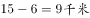，显然，甲应优先供给Q超市，其次供给P超市。即甲供给Q超市40吨，供给P超市，则甲运费为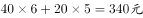；乙供给P超市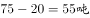，供给M超市45吨，则乙运费为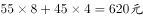。总运费最少花费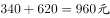。

故正确答案为D。

---

## 第 5 题　qid 2145028 · 数学运算

有甲、乙两家网店销售照片墙，甲销售的相框由原木制作，定价是每套元，利润为，乙销售的相框由人造板材制作，虽然定价是每套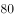元，但每套却能盈利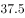元，两家销售量持平。为了增加销售量，甲推出了好评返现元的活动，结果活动期间销售量是原来的倍，好评率是，而乙的销售量却因受竞争而减少了，整个活动期间两家所获利润相同，则活动期间乙的销售量与原来相比减少了：

- **A**. 

- **B**. 

- **C**. 

　✅
- **D**. 

**答案**：C

**官方解析**

由于本题求的是乙销售量下降的比率，并且已知的也是甲活动前后销售量的比率关系，故可对销售量进行赋值。假设活动前甲乙的销售量都为2套，则活动期间甲销售，乙销售套。

活动期间，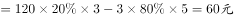，，由甲乙利润相同可得，解得。

活动前乙卖2套，活动期间乙卖1.6套，则乙销量减少了。

故正确答案为C。

（备注：本题题干中甲的“利润为”，指的是定价的，而如果用成本的计算则没有答案）

---

## 第 6 题　qid 2060548 · 数学运算

每天下午4点半小李放学时，妈妈总是从家开车准时到达学校接他回家，某天学校提前1个小时放学，小李自己步行回家，途中遇到开车接他的妈妈，结果比平时提前30分钟到家，若妈妈开车的速度一直保持不变，则小李步行（  ）分钟后与妈妈相遇。

- **A**. 40
- **B**. 45　✅
- **C**. 50
- **D**. 53

**答案**：B

**官方解析**

由题干中“比平时提前30分钟到家”，则可推出妈妈比往常早分钟接到小李（因为妈妈在路程中间接到小李，妈妈少走了小李所走路程的一来一回，故应除以2），妈妈平常接小李是4点半，提前15分钟接到，即为4点15分，而小李提前一小时放学，即3点30放学，中间小李共走了45分钟。

故正确答案为B。

---

## 第 7 题　qid 2060568 · 数学运算

在某届篮球赛中，小明共打了10场球，他在第6、7、8、9场比赛中，分别得23分、14分、11分和20分，他的前9场比赛的平均得分比前5场比赛的平均得分高，若他所打的10场比赛的平均得分超过18分，则他在第10场比赛中最少要得（  ）分。

- **A**. 26
- **B**. 27
- **C**. 28
- **D**. 29　✅

**答案**：D

**官方解析**

本题要使得小明第10场比赛得分最少，则应使小明前9场比赛得分越多且10场平均分尽可能小。由题意，后4场比赛小明的平均分为，由于小明前9场比赛的平均得分比前5场比赛的平均得分高，则小明前5场平均分应小于17分，即前5场总分应小于，则其最高为84分。假设小明10场得分平均分为18分，则小明第10场得分为，但是由于要求平均分超过18分，则小明第10场得分应大于28分，则最少为29分。

故正确答案为D。

---

## 第 8 题　qid 2060566 · 数学运算

若在某年连续的三个月中共有24天是周末，则该年的第一个周日是（  ）。

- **A**. 1月1日
- **B**. 1月2日
- **C**. 1月3日　✅
- **D**. 1月4日

**答案**：C

**官方解析**

连续三个月有24天周末，即连续三个月只能有12个完整的星期，即，最多再加上某一周的周一至周五共5天，即总天数最多为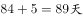。而连续三个月为89天的只能为2月（平年），3月，4月（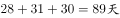，其他任意三个月的天数和都要大于89天）。因此要使得三个月中只有24个周末，则多出来的5天必然得是周一至周五，即2月1日应为星期一，1月1日与2月1日相差31天，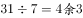，星期一往前推三天为星期五，因此第一个周日为1月3日。

故正确答案为C。

---

## 第 9 题　qid 2060588 · 数学运算

某地有耕地20万亩，其中用于种植粮食，其余用于种植经济作物。当地居民生活需要消耗10万亩的粮食，其余用于出售，粮食每亩年收入1000元，经济作物每亩年收入5000元。当地政府正在积极推进退耕还林政策，每亩退耕还林的耕地可享受500元年的财政补贴。不考虑其他因素，为使居民收入实现每年以上增长，且保证粮食种植面积不低于12万亩，2年内至多可以有（  ）亩耕地进行退耕还林。

- **A**. 10000
- **B**. 12666　✅
- **C**. 13333
- **D**. 15000

**答案**：B

**官方解析**

本题要求至多退耕还林多少，则应使得居民收入增长最低并且应在保证粮食种植面积的基础上最大限量的种植经济作物（经济作物年收入更多）。假设居民收入每年增长，则两年后收入为现在的倍。则假设退耕还林万亩，则粮食每万亩价格为1000万元，经济作物每万亩价格为5000万元，每万亩退耕还林享受500万元/年的财政补贴。两年后收入为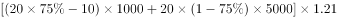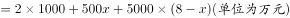，计算得到万。由于居民收入每年增长要超过，则退耕还林至多为12666亩。

故正确答案为B。

---

## 第 10 题　qid 2060608 · 数学运算

公用电话亭中有两部电话，六个人排队打电话，打完即走，他们的通话时间分别为3分钟、5分钟、4分钟、13分钟、7分钟、8分钟，则大家在此公用电话亭逗留的总时间最少为（  ）分钟。

- **A**. 60
- **B**. 66　✅
- **C**. 72
- **D**. 78

**答案**：B

**官方解析**

本题要求总逗留时间，而总逗留时间=总打电话时间+总等待时间，总打电话时间为固定不变的，即为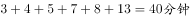。要使得总逗留时间最短，则应让总等待时间最短，即让通话时间最短的排在最前面。则两部电话顺序可以分别为3，5，8分钟和4，7，13分钟。总等待时间为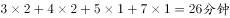。则总逗留时间最短为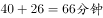。

故正确答案为B。

---

## 第 11 题　qid 2145029 · 数学运算

某著名歌唱选秀节目半决赛中，每位歌手的成绩由两部分构成，第一部分为27位大众媒体评审投票得分，以其所得支持票数占比乘以本部分总分50分得出；第二部分为360位观众投票得分，以其所得支持票数占比乘以本部分总分50分得出。得分排名前六位的歌手进入决赛。最后一位歌手甲演唱完毕，大众媒体中的19位投了支持票，而此时排在第六位的歌手乙的得分是81.8分，则甲至少要获得（  ）位观众的支持，才能战胜乙，进入决赛。

- **A**. 330
- **B**. 332
- **C**. 334
- **D**. 336　✅

**答案**：D

**官方解析**

要使得甲战胜乙，则应使甲的总得分超过乙（81.8分）。假设甲获得票即可战胜乙，即，计算可得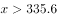，至少为336。

故正确答案为D。

---
