# 2017年湖北省选调生行测题（精选）

> 数量关系 · 6 题 · 湖北 2017

## 第 1 题　qid 2261859 · 数学运算

已知边长为a的正方形内切4个面积相等且相切的小圆，则以该正方形的对角线的交点为圆心，对角线为直径的大圆的面积是每个小圆面积的多少倍？

- **A**. 2
- **B**. 4
- **C**. 8　✅
- **D**. 16

**答案**：C

**官方解析**

根据题意可画图，如图可知正方形每个内切小圆的半径为，正方形对角线的长度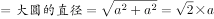，则大圆的半径为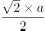，根据圆面积之比等于半径之比的平方可知： 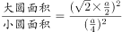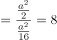。

故正确答案为C。

---

## 第 2 题　qid 2261860 · 数学运算

某高校安排3名职工分别去了3所不同的中学进行招生宣传，其中甲不去A中学，乙不去B中学，则有多少种不同的安排方案？

- **A**. 2
- **B**. 3　✅
- **C**. 4
- **D**. 5

**答案**：B

**官方解析**

方法一：采用枚举法，根据题干条件，满足情况的安排方案共有：（1）甲去B中学，乙去A中学，丙去C中学；（2）甲去B中学，乙去C中学，丙去A中学；（3）甲去C中学，乙去A中学，丙去B中学。共3种情况。

方法二：分情况讨论，（1）甲去B中学，乙、丙没有限制，则有种情况。（2）甲去C中学，乙只能去A中学，只有1种情况。故总情况数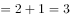种。

故正确答案为B。

---

## 第 3 题　qid 2261861 · 数学运算

某单位需要对一块长90m，宽10m的长方形地块进行绿化，要求每隔1m交替种A、B两种树，如果从该块地的任意角开始种植A种树，则该块地可种植B种树多少棵？（  ）

- **A**. 450
- **B**. 480
- **C**. 500　✅
- **D**. 520

**答案**：C

**官方解析**

根据题意可知：地块长为90m，每隔1m种一行树，则共需要种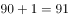行；宽为10m，每隔1m种一列树，则共需要种列，因此长方形地块共种树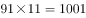棵。由于交替种A、B两种树，故前1000棵树中两种树刚好各500棵，由于先种的是A，所以最后一棵也为A，即B树种植了500棵。

故正确答案为C。

---

## 第 4 题　qid 2261862 · 数学运算

某公司准备将一批重量为81吨的货物运到某市，现有载重量为8吨和5吨的货车各一辆。假定运输一趟的耗油量分别为16升和10升，问在耗油量最少的情况下，两种货车运输的趟次相差多少？（  ）

- **A**. 1
- **B**. 2　✅
- **C**. 3
- **D**. 4

**答案**：B

**官方解析**

根据题意可知两种货车每吨的耗油量都为2升，则货车每趟都满载的情况下运完81吨的货物时，耗油量最少。设载重量为8吨和5吨的货车运输趟次分别为x、y，则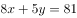，得到的整数解只有、与、两组。第一种情况运输趟次相差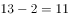，无选项；第二种情况运输趟次相差，对应B项。

故正确答案为B。

---

## 第 5 题　qid 2261863 · 数学运算

假定甲地比乙地时区晚3个小时，一架飞机晚上7时从甲地起飞，于次日上午8时到达乙地，若两地往返飞行时间相等，问飞机上午9时从乙地起飞抵达甲地是什么时间？（题中时间均为当地时间）

- **A**. 上午3时
- **B**. 下午4时　✅
- **C**. 上午5时
- **D**. 下午6时

**答案**：B

**官方解析**

一架飞机晚上7时从甲地起飞，于次日上午8时到达乙地。由“甲地比乙地时区晚3个小时”，则当乙地上午8点时，甲地还需要3小时才能到8点，即飞机到达时为甲地上午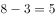点。则飞机于甲地晚上7时起飞，次日上午5时到达，即飞行时间为10个小时。由于往返飞行时间相等，因此按照甲地时间计算，飞机返程起飞时间为上午点，到达时间应为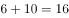点，即下午4时。

故正确答案为B。

---

## 第 6 题　qid 2261864 · 数学运算

某市物价部门规定，每周用水不超过50吨，每吨收5角，如果超过50吨，超过的部分按1元收费。某月A用户比B用户多交了8元水费，问本月A用户比B用户可能多用多少吨水？（  ）

- **A**. 4吨或6吨
- **B**. 6吨或8吨
- **C**. 6吨或10吨
- **D**. 8吨或10吨　✅

**答案**：D

**官方解析**

根据题意可知水费最贵为1元/吨，A用户比B用户多交了8元水费，说明A用户比B用户至少多用了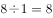吨水，只有D项满足条件。

故正确答案为D。

---
