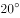
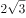
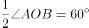
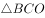
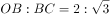
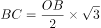
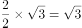
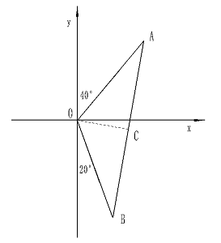
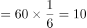
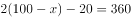

# 2017年福建省选调生考试《行政职业能力测验》

> 数量关系 · 9 题 · 福建 2017

## 第 1 题　qid 4737631 · 数学运算

有一列数字，其中第一项是2，第二项是6，从第二项开始后的每一项是其前后两项的和再减去4，请问此数列的第2017项是多少？

- **A**. 0
- **B**. 2　✅
- **C**. 6
- **D**. 8

**答案**：B

**官方解析**

根据题意，此数列从第一项开始依次为2、6、8、6、2、0、2、6······，观察发现，该列数字为周期数列，每一个循环是“2、6、8、6、2、0”这6个数字。2017÷6=336······1，即第2017项是经过了336个循环后的第1个数字，每一个周期的第一个数字是2。
故正确答案为B。

---

## 第 2 题　qid 4737627 · 数学运算

A、B两地离小东的直线距离均为2米，A在小东的北偏东，B在小东的南偏东，请问AB两地之间的直线距离是多少米？

- **A**. 
1

- **B**. 
2

- **C**. 

- **D**. 

　✅

**答案**：D

**官方解析**

如图所示，小东在O点，OA=OB=2米，为等腰三角形，OA与y轴正方向的夹角为，OB与y轴负方向的夹角为，则。由O点向AB作垂线交AB于C点，则AC=BC=AB，。为直角三角形，，则，米，米。

故正确答案为D。

---

## 第 3 题　qid 4737617 · 数学运算

一个班级一共有50人，其中参加A项目的有45人，参加B项目的有35人，参加C项目的有40人，请问这个班级中至少有多少人三个项目都参加？

- **A**. 10
- **B**. 20　✅
- **C**. 30
- **D**. 35

**答案**：B

**官方解析**

根据“至少······都”可判定本题为多集合反向构造问题。
第一步反向：没有参加A项目、B项目、C项目的人数分别为：50-45=5人、50-35=15人、50-40=10人。
第二步作和：没有参加A项目、B项目、C项目的人数最多为：5+15+10=30人。
第三步作差：A项目、B项目、C项目都参加的人数至少有50-30=20人。
故正确答案为B。

---

## 第 4 题　qid 4737654 · 数学运算

一件商品原成本是100元，售价为300元，但是因为原材料价格的上调，使成本提高了10%，商家为了多销售商品，做出了八折的活动，问此时商家每件商品的利润比原来少了多少元？

- **A**. 60
- **B**. 70　✅
- **C**. 80
- **D**. 90

**答案**：B

**官方解析**

商品原来每件利润=300-100=200元，成本提高且打折后每件利润=300×0.8-100×（1+10%）=240-110=130元。200-130=70元，故此时商家每件商品的利润比原来少了70元。
故正确答案为B。

---

## 第 5 题　qid 4737626 · 数学运算

某次心理测试一共有20题，其中每答对一题得2分，每答错一题扣1分，不答不给分也不扣分。小明同学做完这次测试共得22分，并知道自己不答的题目小于5题，请问，小明这次测试一共答错几道题目？

- **A**. 3
- **B**. 4　✅
- **C**. 6
- **D**. 13

**答案**：B

**官方解析**

设小明答对x题，答错y题，则不答（20-x-y）题。根据题意可列方程：2x-y=22······①，因“不答的题目小于5题”，则20-x-y&lt;5······②。因2和22均为2的倍数，故y为2的倍数，排除A、D两项。代入B项：y=4，则x=13，此时20-x-y=20-13-4=3&lt;5，符合题意。
故正确答案为B。
备注：代入C项：y=6，则x=14，此时不答的题目数量为20-x-y=20-14-6=0，虽然符合小于5的条件，但结合题意和B项，默认不答的题目数量不为0，故B项更优。

---

## 第 6 题　qid 4737637 · 数学运算

小王和小张一共需要搬28本书。小王看小张搬太多，主动要求帮小张拿一半；然后小张不好意思，就要回了小王手里的一半书；最后公平起见，小王又向小张要了四本书，这样两人的书就一样多了。请问，小王最初手里有多少本书？

- **A**. 20
- **B**. 12　✅
- **C**. 8
- **D**. 16

**答案**：B

**官方解析**

方法一：小王和小张最终每人本，根据题意，倒推如下表：

方法二：设小王、小张最初手里分别有x本、（28-x）本，由小王最终有本，根据题意可列方程：，解得x=12。

故正确答案为B。

---

## 第 7 题　qid 4737638 · 数学运算

一个班级共有60名学生，其中少数民族人数占全班总人数的，男生和女生的比例是3：2。现从班级里面随机抽取一个人去参如数学知识竞赛．请问此人是非少数民族女生的概率至多是多少？

- **A**. 

- **B**. 

　✅
- **C**. 

- **D**. 

**答案**：B

**官方解析**

根据题意，可得少数民族人，非少数民族=60−10=50人；男生人，女生=60−36=24人。此人是非少数民族女生的概率至多的情况就是女生全部都是非少数民族，故所求为。

故正确答案为B。

---

## 第 8 题　qid 4737644 · 数学运算

某人花费了360元购买了乒乓球和网球共100个。己知网球每个5元并且得到九折优惠；而乒乓球每个2元，最后还减免20元。问：此人一共买了多少个网球？

- **A**. 28
- **B**. 40
- **C**. 60
- **D**. 72　✅

**答案**：D

**官方解析**

设一共买了x个网球，则买了（100-x）个乒乓球，根据题意可列方程：，解得x=72。

故正确答案为D。

---

## 第 9 题　qid 4737665 · 数学运算

一个圆形花圃外围周长一共有108米，并且其边上等间隔共插有12根彩旗。现需要增加6根彩旗，但仍要求所有彩旗等间隔分布。问：原来的12根彩旗中最多能有几根不需要移动位置？

- **A**. 6　✅
- **B**. 7
- **C**. 8
- **D**. 9

**答案**：A

**官方解析**

根据题意，可知当圆形花圃边上等间隔共插有12根彩旗时，间隔为108÷12=9米；现需要增加6根彩旗，变成12+6=18根彩旗，则间隔为108÷18=6米。不需要移动的彩旗一定是9和6的公倍数（公倍数最小为18），则原来的12根彩旗中最多能有108÷18=6根彩旗不需移动。
故正确答案为A。

---
